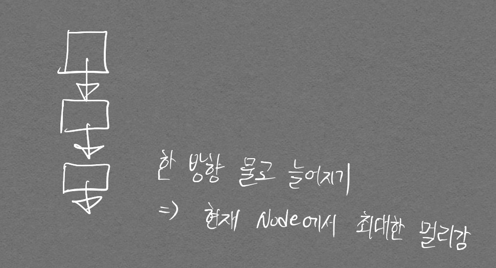

두 기법 모두 **호출하자마자**, 해당 노드를 방문처리 한다는 것을 명심!
{:.info}

# DFS

## 개념

가장 깊숙이 위치하는 노드에 닿을 때까지 탐색한다. 다른 말로 최대한 멀리 있는 노드를 우선으로 탐색하는 방식이라고도 한다.

- 구현을 위한 기능 명시
<p align="center">  </p>

아래 구현 코드를 보면 stack이 보이지 않지만, 재귀적 함수 호출 자체가 스택을 활용하는 것으로 생각할 수 있기에 DFS는 스택을 활용한다고 볼 수 있다.

- 설명을 위한 그래프 그림
<p align="center">  </p>


## 코드

```python
# DFS 메서드 정의
def dfs(graph, v, visited):
    # 현재 노드를 방문 처리
    visited[v] = True
    print(v, end=' ')
    # 현재 노드와 연결된 다른 노드 재귀적 방문
    # graph의 각 리스트에 접근하는 인덱스가 곧 노드 번호여서 인덱스 = 노드 번호로 바로 맵핑 가능
    # 코딩 테스트에선 대부분 낮은 값의 노드를 우선 방문하는 것으로 되어있음
    for i in graph[v]:
        if not visited[i]:
            dfs(graph, i, visited)

visited = [False] * 9

# 값이 낮은 노드가 먼저 for문에서 선택되기 위해 값 순서대로 정렬화된 모습 확인
# 빈 리스트가 있는 이유는, DFS 함수를 설계할 때 1번 노드부터 최초 실행되는 것으로 설계하였기에
# graph도 인덱스 1부터 의미있는 정보를 담게하기 위해 빈 리스트가 필요하다.
graph = [
    [],
    [2, 3, 8],
    [1, 7],
    [1, 4, 5],
    [3, 5],
    [3, 4],
    [7],
    [2, 6, 8],
    [1, 7],
]

dfs(graph, 1, visited)
```
```
1 2 7 6 8 3 4 5 
```

# BFS

## 개념

너비 우선 탐색을 말하며, 가까운 노드부터 탐색하는 알고리즘이다.

- 구현을 위한 기능 명시

<p align="center">  </p>

DFS와 달리 Queue 자료구조를 사용한다는 점에 주목하자.  
Queue는 선입선출 구조이며, 현재 노드에서의 인접한 점을 모두 방문하기 위해 인접한 노드들을 한번에 Queue에 넣는다. (DFS는 하나씩 스택에 넣음)


## 코드

```python
from collections import deque

# BFS 정의
def bfs(graph, start, visited):
    # Queue 구현을 위한 deque 라이브러리 사용
    queue = deque([start])      # 맨 처음 함수를 호출할 때 queue에 노드를 삽입하는 것

    # 현재 노드를 방문 처리
    visited[start] = True

    # 큐가 빌 때까지 반복
    # 이렇게 while에 바로 엮을 수 있다는것에 주목
    # 이런식으로 안하고 break 문 등으로 해결하려고 하면 index error 나면서 출력결과가 안맞아서 오답 될 테니
    # 꼭 염두할 것!
    while queue:
        # 큐에서 하나의 원소를 뽑아 출력
        v = queue.popleft()
        print(v, end=' ')

        # 해당 원소와 연결된, 아직 방문하지 않은 원소들을 큐에 삽입
        for i in graph[v]:
            if not visited[i]:
                queue.append(i)
                visited[i] = True
    

graph = [
    [],
    [2, 3, 8],
    [1, 7],
    [1, 4, 5],
    [3, 5],
    [3, 4],
    [7],
    [2, 6, 8],
    [1, 7],
]

visited = [False] * 9

bfs(graph, 1, visited)
```

```
1 2 3 8 7 4 5 6
```

||DFS|BFS|
|---|---|---|
|동작원리| 스택 | 큐 |
|구현방법| 재귀 함수| 큐 자료구조 이용|

DFS가 스택 자료구조를 사용한다고 말하지 않는 이유는 단지 재귀함수를 통해 스택 같은 효과를 낸 것이기 때문이다.  
반면 BFS는 실제로 Queue 자료구조를 사용하여 구현한다.

# 문제

## p.149 음료수 얼려 먹기

- 해답 코드


```python
n, m = map(int, input().split())
graph = []

for _ in range(n):
  graph.append(list(map(int, input())))

def dfs(y, x):

  # 주어진 범위를 벗어나는 경우 즉시 종료
  # 이건 재귀함수의 종료 조건이라기 보다는 예외처리
  if y <= -1 or y >= n or x<= -1 or x >= m:
    return False

  # 현재 노드를 아직 방문 안했다면
  if graph[y][x] == 0:
    # 해당 노드 방문 처리
    graph[y][x] = 1

    #상, 하, 좌, 우 위치에 대해 모두 재귀적으로 호출
    dfs(y-1, x)
    dfs(y+1, x)
    dfs(y, x+1)
    dfs(y, x-1)

    return True
  return False

count = 0

for row in range(n):
  for col in range(m):
    if dfs(row, col) == True:
      count += 1

print(count)
```

잘못 생각했던 부분이 2가지 있었다.  
- BFS로만 풀 수 있다고 생각했다. (인접한 부분 방문만 생각이 들었기 때문)
  - DFS로 풀 수 있는 문제이며 이게 왜 DFS인지 의문이 들어 조금 고민해보았다.
  - 해답을 보고 DFS로만 풀 수 있는것이겠구나 생각을 했지만, BFS로도 풀 수 있을 것 같아 직접 구현해보았다. (아래 코드 참고)
<p align="center">  </p>

- 인접 리스트 방식으로 graph를 변경해야 한다고 생각했다.
  - 위 코드 구현을 보면 그런 부수작업이 필요 없다는 것을 알 수 있다.

- BFS로 내가 직접 풀은 코드 (보람차다..!)

```python
n, m = map(int, input().split())

graph = []

from collections import deque

for _ in range(n):
  graph.append(list(map(int, input())))

def bfs(y, x):
  # if y <= -1 or y >= n or x <= -1 or x >= m:
  #   return False
  queue = deque([(y, x)])
  
  # 방문 처리
  graph[y][x] = 1

  while queue:
    coor = queue.popleft()
    dy, dx = coor[0], coor[1]

    if dy-1 >= 0 and graph[dy-1][dx] == 0:
      queue.append((dy-1, dx))
      graph[dy-1][dx] = 1
    if dy+1 < n and graph[dy+1][dx] == 0:
      queue.append((dy+1, dx))
      graph[dy+1][dx] = 1
    if dx-1 >= 0 and graph[dy][dx-1] == 0:
      queue.append((dy, dx-1))
      graph[dy][dx-1] = 1
    if dx+1 < m and graph[dy][dx+1] == 0:
      queue.append((dy, dx+1))
      graph[dy][dx+1] = 1

  return True

  

  
  

count = 0

for row in range(n):
  for col in range(m):
    if graph[row][col] == 0:
      count += 1
      bfs(row, col)
    
    # if (row, col) == True:    # 이걸 호출하는게 아니지.. 이러면 그냥 bfs 20번 호출한거니 20이 나오지..
      # count += 1

print(count)
```

```
15 14
00000111100000
11111101111110
11011101101110
11011101100000
11011111111111
11011111111100
11000000011111
01111111111111
00000000011111
01111111111000
00011111111000
00000001111000
11111111110011
11100011111111
11100011111111
8
```

- 위 코드 핵심 부분을 최적화하면 아래와 같다

```python      
    # if dy-1 >= 0 and graph[dy-1][dx] == 0:
    #   queue.append((dy-1, dx))
    #   graph[dy-1][dx] = 1
    # if dy+1 < n and graph[dy+1][dx] == 0:
    #   queue.append((dy+1, dx))
    #   graph[dy+1][dx] = 1
    # if dx-1 >= 0 and graph[dy][dx-1] == 0:
    #   queue.append((dy, dx-1))
    #   graph[dy][dx-1] = 1
    # if dx+1 < m and graph[dy][dx+1] == 0:
    #   queue.append((dy, dx+1))
    #   graph[dy][dx+1] = 1

    # 위 주석한 부분 대체
    if (0 <= ny and ny < n) and (0 <= nx and nx < m) and graph[ny][nx] == 0:
        queue.append((ny, nx))
        graph[ny][nx] = 1
```