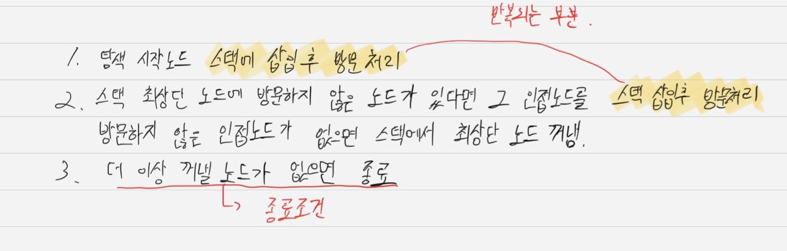
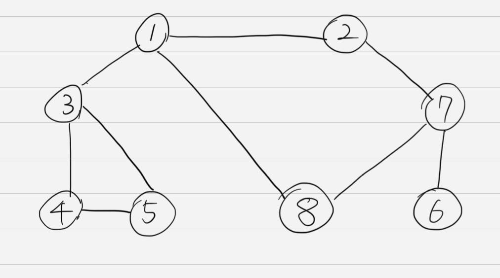
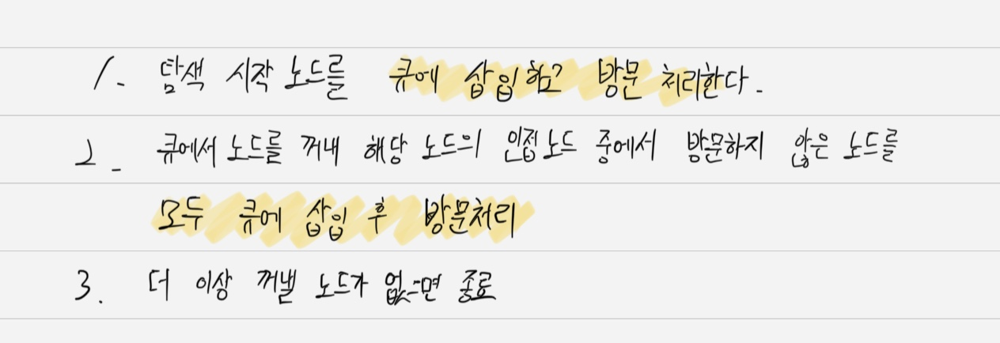

# DFS

## 개념

가장 깊숙이 위치하는 노드에 닿을 때까지 탐색한다. 다른 말로 최대한 멀리 있는 노드를 우선으로 탐색하는 방식이라고도 한다.

- 구현을 위한 기능 명시
<p align="center">  </p>

- 설명을 위한 그래프 그림
<p align="center">  </p>


## 코드

```python
# DFS 메서드 정의
def dfs(graph, v, visited):
    # 현재 노드를 방문 처리
    visited[v] = True
    print(v, end=' ')
    # 현재 노드와 연결된 다른 노드 재귀적 방문
    # graph의 각 리스트에 접근하는 인덱스가 곧 노드 번호여서 인덱스 = 노드 번호로 바로 맵핑 가능
    # 코딩 테스트에선 대부분 낮은 값의 노드를 우선 방문하는 것으로 되어있음
    for i in graph[v]:
        if not visited[i]:
            dfs(graph, i, visited)

visited = [False] * 9

# 값이 낮은 노드가 먼저 for문에서 선택되기 위해 값 순서대로 정렬화된 모습 확인
graph = [
    [],
    [2, 3, 8],
    [1, 7],
    [1, 4, 5],
    [3, 5],
    [3, 4],
    [7],
    [2, 6, 8],
    [1, 7],
]

dfs(graph, 1, visited)
```
```
1 2 7 6 8 3 4 5 
```

# BFS

## 개념

너비 우선 탐색을 말하며, 가까운 노드부터 탐색하는 알고리즘이다.

- 구현을 위한 기능 명시

<p align="center">  </p>

DFS와 달리 Queue 자료구조를 사용한다는 점에 주목하자.  
Queue는 선입선출 구조이며, 현재 노드에서의 인접한 점을 모두 방문하기 위해 인접한 노드들을 한번에 Queue에 넣는다. (DFS는 하나씩 스택에 넣음)

```python
from collections import deque

# BFS 정의
def bfs(graph, start, visited):
    # Queue 구현을 위한 deque 라이브러리 사용
    queue = deque([start])      # 맨 처음 함수를 호출할 때 queue에 노드를 삽입하는 것

    # 현재 노드를 방문 처리
    visited[start] = True

    # 큐가 빌 때까지 반복
    while queue:
        # 큐에서 하나의 원소를 뽑아 출력
        v = queue.popleft()
        print(v, end=' ')

        # 해당 원소와 연결된, 아직 방문하지 않은 원소들을 큐에 삽입
        for i in graph[v]:
            if not visited[i]:
                queue.append(i)
                visited[i] = True
    

graph = [
    [],
    [2, 3, 8],
    [1, 7],
    [1, 4, 5],
    [3, 5],
    [3, 4],
    [7],
    [2, 6, 8],
    [1, 7],
]

visited = [False] * 9

bfs(graph, 1, visited)
```

```
1 2 3 8 7 4 5 6
```

||BFS|DFS|
|---|---|---|
|동작원리| 스택 | 큐 |
|구현방법| 재귀 함수| 큐 자료구조 이용|