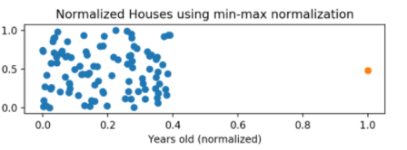
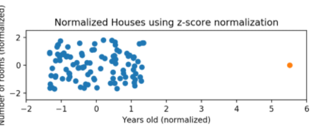

# 최대 최소 정규화
1. 최소-최대 정규화(Min-Max Normalization)

$$ {(Array - min) \over (Max-Min)} $$

분모가 `최대값 - 최소값` 이므로 값의 범위가 0 ~ 1이 된다.

장점: 간단함  
단점: 이상치에 큰 영향을 받는다.

- 코드구현

    ```python
    def min_max_normalize(lst):
        normalized = []
        
        for value in lst:
            normalized_num = (value - min(lst)) / (max(lst) - min(lst))
            normalized.append(normalized_num)
        
        return normalized
    ```
<p align="center">

</p>
모든 y값은 0~1에 분포하지만, 이상치를 제외한 x값은 0~0.4에 분포함

# Z-점수 정규화 (정규분포화)

정규분포 개념 복습은 [여기](/정규분포(가우시안 분포))

$$ {(Array - Mean) \over (Standard deviation)} $$

(2)의 Array 값이 평균과 일치하는게 많으면 대부분 0으로 이루어질 것임.  
평균보다 크면 대부분 양수이고, 평균보다 작으면 대부분 음수일 것임.  
데이터의 표준편차가 크면(값이 넓게 퍼져있으면) 0에 가까워지게 데이터가 변환되어 이상치에 상대적으로 둔감함.

- 코드구현
    ```python
    def z_score_normalize(lst):
        normalized = []
        for value in lst:
            normalized_num = (value - np.mean(lst)) / np.std(lst)
            normalized.append(normalized_num)
        return normalized
    ```

<p align="center">

</p>
이상치를 제외한 y값, x값이 `동일하게` -2 ~ 2에 분포함