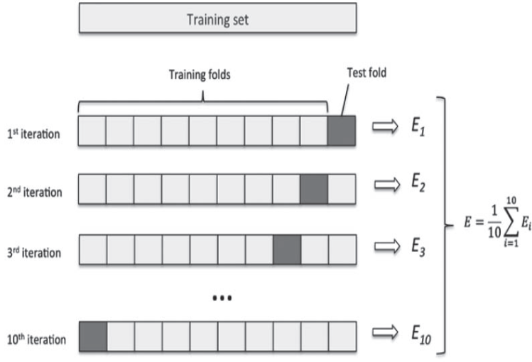

# Norm

- Vector space를 실수(R)로 보내는 함수이며 3가지 성질을 가짐
  1. Absolutely homogeneous: $$ \lVert \lambda x \rVert\ = \vert\lambda \lVert x \rVert $$
     - **실수의 Norm 은 그저 절대값만 취해주면 됨**
       - why? 실수의 Norm은 1차원으로 굉장히 자주 쓰여서 \|를 하나씩만 두는것으로 일종의 약속을 함

  2. Triangle inequality: $$ \lVert x + y \rVert \leq \lVert x \rVert + \lVert y \rVert$$
  3. Positive definite: $$ \lVert x \rVert \geq 0 and \lVert x \rVert = 0 \Leftrightarrow x = 0 $$

- General formula

  $$\vert\vert W \vert\vert_p = (\sum_{i=1}^n \vert W_i \vert ^p)^{1 \over p}$$

  - i는 $$ W $$를 이루는 element **개수**
  - p는 사용자가 지정할 수 있는 Hyper parameter

- $L_2$ norm  예시  

$$\vert \vert W \vert\vert_2 = \sqrt{W_1^2 + W_2^2} = \sqrt{W^TW}$$

# Loss

> L1 Norm, L1 Loss는 수식이 비슷하지만 L2 Norm, L2 Loss는 제곱근이 붙지 않는다..!

Norm 과의 차이점을 생각할 때 Norm은 순순히 두 벡터간의 distance를 구하는 것이라면, Loss는 실제 정답 벡터와 과 모델 예측값 벡터의 distance를 구하는 것이라고 생각하자

$$ L1 \ loss \ function = \sum^n_{i=1} \lvert y_{true} - y_{predicted} \rvert $$  

L1 loss는 L2 loss에 비해 outlier의 영향력이 크지 않아 robust 하다고 할 수 있다.

$$ L2 \ loss \ function = \sum^n_{i=1} (y_{true} - y_{predicted} )^2 $$  

outlier가 있을 때 적용하기 힘든 Loss(제곱으로 인해 큰 영향을 받음)

# 교차검증 (Cross-Validation)

- 장점
  - 특정 데이터셋에 대한 과적합을 방지
  - 보다 General한 모델 생성 가능 (Structure가 같은 모델을 여러개 활용해서 하나의 task를 진행하는것이여서)
  - 데이터셋 규모가 적을 시 Underfitting 방지 (**모든 데이터**를 학습에 활용함)

- 단점
  - 모델 훈련 및 평가 소요시간 증가

교차검증의 종류에는 `Hold-out Cross-Validation`, `K-Fold Cross-Validation`, `Leave-p-Out Cross- Validation` 등 여러가지가 존재하지만 대표적으로 많이 쓰이는 `K-Fold Cross-Validation`에 대해 알아보고자 한다.

## K-Fold Cross-Validation

데이터를 K개의 분할(K개의 fold)로 나누고 K개의 모델을 만들어 K-1개를 `학습데이터`, 남은 1개를 `검증데이터`로 활용하여 평가하는 방식이다.
모델의 검증 점수는 K개의 검증 점수의 **평균이다.**

  

## Stratified cross-validation