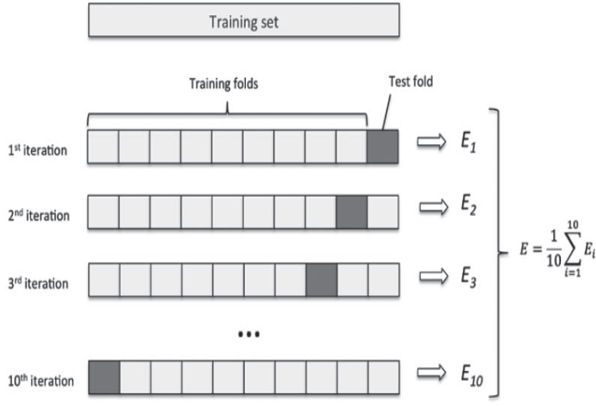
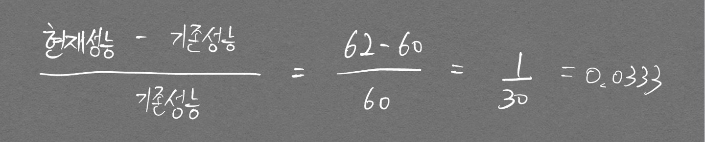

# L1 Distance, L2 Distance

L1 Norm, L2 Norm[^1] 의 개념을 알고 있어야 한다.

[^1]: **한** 벡터의 크기를 나타낸 **값**. [Norm 추가설명 링크](/EvaluationMethod/#norm)

헷갈리지 말아야 할 점으로 $ L1 Norm != L1 Distance, L2 Norm != L2 Distance $ 라는 점이다.

Norm은 한 벡터의 크기 개념이고, Distance는 두 벡터의 **거리** 개념이다.

L1 Distace, L2 Distance의 수식은 다음과 같다.

$$ L1 \ loss \ function = \sum^n_{i=1} \lvert y_{true} - y_{predicted} \rvert $$  

L1 loss는 L2 loss에 비해 outlier의 영향력이 크지 않아 robust 하다고 할 수 있다.

$$ L2 \ loss \ function = \sum^n_{i=1} (y_{true} - y_{predicted} )^2 $$  

outlier가 있을 때 적용하기 힘든 Loss(제곱으로 인해 큰 영향을 받음)이다. 주목할 점으로 $ \sqrt{ } $가 사용되지 않는점이 있는데, 컴퓨터의 연산량을 줄이기 위한 관습이라고 한다. 위 L2 loss를 norm의 표현식으로 나타내면 $$ {\lVert \theta \rVert}^2_2 $$ 로 나타낼 수 있다.

# 교차검증 (Cross-Validation)

- 장점
  - 특정 데이터셋에 대한 과적합을 방지
  - 보다 General한 모델 생성 가능 (Structure가 같은 모델을 여러개 활용해서 하나의 task를 진행하는것이여서)
  - 데이터셋 규모가 적을 시 Underfitting 방지 (**모든 데이터**를 학습에 활용함)

- 단점
  - 모델 훈련 및 평가 소요시간 증가

교차검증의 종류에는 `Hold-out Cross-Validation`, `K-Fold Cross-Validation`, `Leave-p-Out Cross- Validation` 등 여러가지가 존재하지만 대표적으로 많이 쓰이는 `K-Fold Cross-Validation`에 대해 알아보고자 한다.

## K-Fold Cross-Validation

데이터를 K개의 분할(K개의 fold)로 나누고 K개의 모델을 만들어 K-1개를 `학습데이터`, 남은 1개를 `검증데이터`로 활용하여 평가하는 방식이다.
모델의 검증 점수는 K개의 검증 점수의 **평균이다.**

  

## Stratified cross-validation

# PR-Curve

> 본 내용은 [여기 블로그](https://hwi-doc.tistory.com/entry/%EB%AA%A8%EB%8D%B8-%ED%8F%89%EA%B0%80%ED%95%98%EA%B8%B0-%EC%A0%95%ED%99%95%EB%8F%84%EB%A7%8C-%EB%86%92%EC%9C%BC%EB%A9%B4-%EC%A2%8B%EC%9D%80-%EB%AA%A8%EB%8D%B8)를 참고 했습니다.

Precision, Recall 결과를 합쳐서 성능을 하나의 숫자로 나타내기 위함임.  
추후 F1-Score와 

# 단순 향상률, 증감률 계산

시간 개념이 들어가면 공식이 약간 달라지기 때문에 은근히 헷갈린다. 예시로 기억하자.  

기존 성능 60%에서 62%로 향상시켰을 때 성능 향상률은?

  
