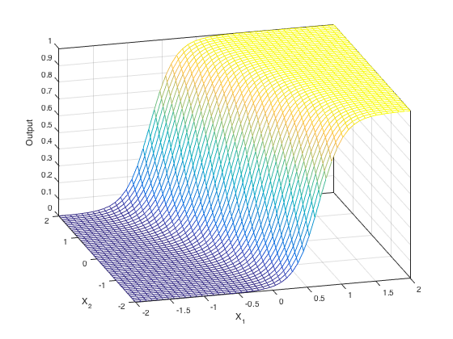
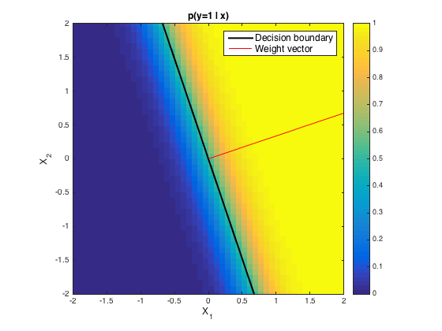

> 나를 7년동안 괴롭혔던 선형(Linear)라는 단어를 이 포스트를 통해 처단하고자 한다...

# 선형대수학을 배우는 이유

- 어떤 대상 사이의 상호작용을 해석하는 능력을 기르기 위함

<iframe width="560" height="315" src="https://www.youtube.com/embed/ArgTeYVuJUo" title="YouTube video player" frameborder="0" allow="accelerometer; autoplay; clipboard-write; encrypted-media; gyroscope; picture-in-picture" allowfullscreen></iframe>  
&nbsp;

#  (중요) 행렬과 벡터, 그리고 선형변환을 어떻게 바라보면 되겠는가?

$$ AX = b $$

위 식에서 행렬
$$ A $$
의 **열벡터**는 다음을 반드시 명심해야 한다.

- 하나의 열벡터는 공간상에서 하나의 화살표를 의미한다. (시각화가 불가능한 고차원에서도 똑같이 적용되는 것임)

$$ X $$
는 다음을 반드시 명심해야 한다.

- X 벡터(열벡터 하나이므로 벡터라고 명해도 된다)는 이미 완성되어 있는 화살표들의 길이를 스케일링 해주는 역할을 한다  
  

    
  

  - 위와 같이 스케일링이 끝난 화살표들이 합쳐진것이 $$ b $$ 이다.

그리고 선형변환은 **공간을 이동시키는 방법**이다.
- 공간을 이루는 기저 벡터[^1]를 변형시켜도
  1. 그 공간을 구성하는 수많은 격자선들은 여전히 모두 평행하며 균등간격을 유지한다.
  2. 원점은 그대로다.

[^1]: 기저 벡터란 데이터가 있을 때 스케일링 해줄 수 있는 벡터들을 말한다. 2차원 평면에서의 기저벡터는 i-hat, j-hat이 되거나 $$\begin{bmatrix} 3 & 5 \\ 0 & 2\end{bmatrix}$$ 등 굉장히 많은 기저벡터들이 존재할 수 있다. 존재가능한 모든 기저벡터들을 이용해 생성한 벡터 집합을 span 이라고 한다. 기저 벡터가 $$\begin{bmatrix} 1 & 3 \\ 0 & 0 $$과 같이 한 직선 위에 있을 경우엔 span 된 벡터 집합이 직선이다.

# 선형(Linear)이란

아래 식은 선형대수학을 공부한 사람이라면 상당히 자주 봤을 수식이다.

$$ f(x_1 + x_2) + f(x_2) = f(x_1) + f(x_2)$$  

$$ f(kx) = kf(x) $$

위 수식을 만족하는 함수 f(x)를 **선형(Linear)**라고 한다. 내가 계속 궁금했던 것은 그 똑똑한 과거의 수학자들이 많고 많은 식 중 왜 저러한 성질을 가지는 것을 선형이라고 칭했냐는 것이다.  
계속 공부해봐야 겠지만 스스로한테 여태까지 가장 납득이 되는 설명을 찾았으며 이는 선형결합을 알아야 한다.

## 선형결합(Linear combination)

집합 A의 원소 $$ x_1, x_2, ... , x_n $$과 상수 $$ a_1, a_2, ... , a_n $$을 곱하여 더한  $$a_1x_1 + a_2x_2 + ... + a_nx_n $$ 결과값(즉, 스칼라)을 **선형결합**이라고 하며 이 선형결합 값이 `집합 A에 속하는 경우` 이를 선형이라고 한다.  

이를 더 이해하기 쉽게 식으로 예를 들어 설명해보면

$$ f(x) = 2x + 3 $$
이라는 함수가 있을 때 이 함수는 선형이 아니다. 왜냐하면 
$$ f(x_1+x_2) \neq f(x_1) + f(x_2) $$ 
이고 이것을 그림으로 표현해보면 아래와 같기 때문이다.

    

위 그림이 시사하는 바는 다음과 같다.

- $$ f(x_1 + x_2) $$ 
의 값은 
$$ f(x) $$ 
위에 존재한다. 즉 위 선형결합 부분에서 언급한 `집합 A에 속하는 경우`라는 말을 여기에 대응시켜 볼 수 있다. 선형 시스템이 예측 가능하다고 여러 글에서 본 적이 있는데 예측 가능한 이유가 바로 이러한 점 때문으로 보인다.
  - 위 그림을 보고 
  $$ f(x_1) + f(x_2) = f(x_1 + x_2) + 3 $$ 
  이라는 관계식을 세우면 역시나 예측 가능해지는 것이지 않은가라는 생각이 들기는 하지만 `집합 A에 속하지 않는다`는 점이 수학세계에서 상당히 강력한 역할을 하기에 이런 선형이라는 개념이 생기지 않았나 싶다.

- $$ f(x) = 2x + 3 $$
은 원점을 지나지 않기 때문에 선형이 아니다.

### 선형 방정식(Linear Equation)

일차 방정식 이라고도 한다. (일차 방정식은 되게 쉬운 느낌인데 선형 방정식이라고 하니까 거부감이 드는건 기분탓..?)

$$ a_1x_1 + a_2x_2 + ... + a_nx_n = b$$

위 식과 같은 꼴이면 선형 방정식이라고 부르며 방정식 개념이 모호하다면 [방정식 포스트](/방정식, 함수, 다변수 함수 개념잡기)를 확인하자

## 선형 시스템(Linear System)

선형 방정식이 여러개로 이루어져 있다면 그것이 곧 선형 시스템이다.  
일반적으로 선형시스템은 n개의 변수를 가진 m개의 선형방정식으로 이루어지며 형태는 아래 식과 같다.

$$ a_{11}x_1 + a_{12}x_2 + ... + a_{1n}x_n = b_1 \\ a_{21}x_1 + a_{22}x_2 + ... + a_{2n}x_n = b_2 \\ \vdots \\ a_{m1}x_1 + a_{m2}x_2 + ... + a_{mn}x_n = b_m $$

$$ b_1 = b_2 = ... = b_m = 0$$ 일 경우 위 식을 **homogeneous system** 이라고 한다.  

> 여기서 homogeneous(동차)의 단어 의미?
> 동차함수 예를 통해 그 의미를 어느정도 이해해 볼 수 있다.  
> $$f(ax) = a^kf(x)$$  
> 위 방정식은 동차함수로, 독립변수를 a배 증가시켰을 때 함수값이 $$a^k$$배 증가하는 함수를 말한다. 즉 a의 거듭제곱 배 만큼 증가하는 함수를 말한다.
> k는 어느값도 될 수 있으며 위 함수를 k차 동차함수 라고 한다.

homogeneous system 에서 $$ x_1 = x_2 = ... = x_n = 0 $$ 은 항상 해가 되며 이를 **trivial solution** 이라고 한다.  
$$ x_1, x_2, ... , x_n $$ 중 어느 하나라도 0이 아닌 경우의 해를 **nontrivial solution** 이라고 한다.  
선형 방정식들이 같은 해를 가질 경우 두 방정식을 **동치(Equivalent)** 관계에 있다고 한다.

# 선형 독립(Linear Independence)

> 강의 노트에서 lambda가 solution으로 표기해놨음. 헷갈리지 말자. 여기 설명에서는 x가 solution이 아니라 lambda가 solution임.

$$ v = \lambda_1x_1 + ... + \lambda_kx_k $$
인 선형 결합(Linear combination)이 있을 때 trivial solution일 경우에만 
$$ \sum^{k}_{i=1}\lambda_ix_i = 0 $$ 
이라고 하면
$$ x_1, x_2, ... , x_k $$ 
를 포함하는 집합
$$ X $$ 
는 선형 독립(Linear Independence)이다.

# Norm

Norm은 **한** 벡터의 **크기**를 의미한다.

- Vector space를 실수(R)로 보내는 함수이며 3가지 성질을 가짐
  1. Absolutely homogeneous: $$ \lVert \lambda x \rVert\ = \vert\lambda \lVert x \rVert $$
     - **실수의 Norm 은 그저 절대값만 취해주면 됨**
       - why? 실수의 Norm은 1차원으로 굉장히 자주 쓰여서 \|를 하나씩만 두는것으로 일종의 약속을 함

  2. Triangle inequality: $$ \lVert x + y \rVert \leq \lVert x \rVert + \lVert y \rVert$$
  3. Positive definite: $$ \lVert x \rVert \geq 0 and \lVert x \rVert = 0 \Leftrightarrow x = 0 $$

- General formula

  $$\vert\vert W \vert\vert_p = (\sum_{i=1}^n \vert W_i \vert ^p)^{1 \over p}$$

  - i는 $$ W $$를 이루는 element **개수**
  - p는 사용자가 지정할 수 있는 Hyper parameter

- $L_2$ norm  예시  

$$\vert \vert W \vert\vert_2 = \sqrt{W_1^2 + W_2^2} = \sqrt{W^TW}$$

# 벡터 공간(Vector Space)
벡터를 다룰 수 있는 공간을 의미하며, 우리가 이 공간을 자유자재로 사용하기 위해선 2가지를 알아야 한다.  
3blue 1brown 의 선형대수학 편에서 자주 볼 수 있는 부분인데, 2차원 공간에서 내가 원하는 곳에 화살표를 갖다 놓으려면
1. 벡터와 벡터간의 **합**을 할 수 있어야 한다.
2. 하나의 벡터에 대해서 스칼라와의 **곱**을 통한 스케일링을 할 수 있어야 한다.

이걸 똑똑한 사람들이 있어보이게 표현한 말이 `벡터공간에서 합연산과 곱연산을 정의해야한다` 라는 것이다. 참 말 이해하기 어렵다.. ㅋㅋ;

$$ V_1 + V_2, KV_2 $$

합연산과 곱연산은 아직 정하지 않았으며(우리가 상식으로 알고있는 합과 곱이 아닐수도 있다. 사용자가 정의하기 마음이다.)  합연산과 곱연산을 정한뒤에 다음의 성질들을 만족하는지 **점검**해야 한다

- 합연산에 대하여
  1. 닫혀있는가?  $$ \forall V_1, V_2 \in V_n, V_1 + V_2 \in V_n $$
  2. 교환법칙 성립하는가?   $$ \forall V_1, V_2 \in V_n, V_1 + V_2 = V_2 + V_1 $$
  3. 결합법칙 성립하는가?   $$ \forall V_1, V_2, V_3 \in V_n, (V_1 + V_2) + V_3 = V_1 + (V_2 + V_3)$$
  4. 항등원이 존재하는가?   $$ \forall V_1 \in V_n, \exists e \in V_n \quad s.t. V_1 + e = V_1  $$
     - 여기서 s.t.는 such that(뒤에 말 강조하는 느낌..! 그냥 that 이라고 말해도 될꺼 such 까지 써서)
     - 또한 이때 e는 $$ \vec{0} $$, 즉 영벡터이다.
  5. 역원이 존재하는가?     $$ \forall V_1, \in V_n, \exists x \in V_n \quad s.t. V_1 + x = 0 $$

- 곱연산에 대하여
  1. 닫혀있는가?   $$ \forall K \in R, \forall V \in V_n, KV \in V_n$$
  2. 결합법칙 성립하는가?   $$ K_1, K_2 \in R, \forall V \in V_n, K_1(K_2V) = (K_1K_2)V$$
  3. 항등원이 존재하는가?   실수곱셉의 항등원 1에 대해 $$ \forall V \in V_n $$
  은 $$ 1 \cdot V = V$$ 를 만족한다
    - 역원은 스칼라 1이 결과값이므로 다루지 않는다. 우린 결과값이 벡터가 되는걸 원하는건데 스칼라가 나오니까 안구함
  4. 분배법칙이 존재하는가?     $$\forall K_1, K_2 \in R, \forall V_1, V_2 \in V_n \\ (K_1 + K_2) \cdot (V_1 + V_2) = K_1V_1 + K_2V_1 + K_1V_2 + K_2V_2$$
    - 합연산, 곱연산 두가지를 정의했으므로 이 두가지 사이의 법칙인 분배법칙이 성립하는지 검사하는것

이 검사들이 끝나고 모두 통과한다면 드디어 $$ V_n$$은 벡터 공간이라고 할 수 있는것!  
이 말을 다시 한다면, 위 9가지 법칙만 통과하면 벡터라고 생각해도 무방하다는 것.  
이 말이 나중에 수학 빡고수가 되었을 때 요긴하게 쓰일 수 있을 말로 보인다.

## 부분 공간(sub space)

    

$ W_n $ 집합에서 두 벡터의 합 연산을 통해서 $ V_3 $ 를 표현할 수 없다. 그러나 $ S_n $ 은 $ V_n $ 을 만들기 위한 벡터(화살표)를 모두 가지고 있기 때문에 벡터 $V_n$ 의 부분 공간이다.

어떤 벡터 공간의 부분 집합이 부분 공간인지 알기 위해서는 `합연산, 곱연산에 대해 닫혀있는지만 파악`하면 된다.  
나머지 모든 속성들은 **이미** 어떤 벡터 공간에 속하는 벡터(화살표)들 이라는 점에서 **만족되었기 때문에** 닫혀있는지만 파악하면 된다.

### Affine space
[이해가 가장 잘되는 Affine 변환 설명 블로그](https://luv-n-interest.tistory.com/810)
[Affine 변환 설명 블로그](https://hooni-playground.com/1271/): 시간날 때 이 블로그 설명을 좀더 심도있게 읽으면 좋을것으로 생각된다.

  

- 벡터공간은 아니지만 벡터공간의 속성을 유용하게 사용할 수 있는 경우가 많다.
  - 원점을 지나지 않기 때문에 벡터 공간이 아님

# 기저(Basis)
벡터 공간 $$ V $$가 있다고 가정할 때 이 $$ V $$의 부분 공간 $$ S $$가
1. 선형독립이며
2. S가 span되면 V가 된다고 할 때(즉, V 벡터 공간을 형성하기 위한 화살표들이 준비가 되어있다면)
   - 이때 span은 준비되어있는 화살표 스케일링해서과 합 연산을 통해 표현할 수 있는거 싹 다 표현하는것을 의미함.

이 S를 기저(Basis)라고 한다. 

이 basis는 유니크한가?  
그렇지 않다. 하나의 벡터 공간에 대해 수많은 basis가 존재할 수 있다.

> 한 벡터에 대한 선형 변환이 어떻게 작동되는지를 알고싶다면, 선형 변환 이후 **기존의 기저 벡터가 어떻게 변하는지를 알면 된다.**

# 랭크(Rank)
임의의 행렬 A가 있을 때 이 행렬의 Rank는 이 행렬의 열벡터로 생성할 수 있는 **벡터 공간의 차원**을 의미한다.  
여기서 중요한 사실이 하나 있는데, 행벡터의 Rank와 열벡터의 Rank는 **항상 동일하다는 것이다.**

## 풀 랭크(Full Rank)
임의의 행렬 $$ A \in R^{m \times n} $$가 가질 수 있는 최대로 가능한 Rank 값.  
행과 열의 각각의 Rank는 서로 같은 값을 가진다고 하였으므로, Rank(A) = Min(m,n)

#  내적(Inner product) 
- 굉장히 큰 도움이 된 영상

<iframe width="560" height="315" src="https://www.youtube.com/embed/SKhzJbT_Njo" title="YouTube video player" frameborder="0" allow="accelerometer; autoplay; clipboard-write; encrypted-media; gyroscope; picture-in-picture" allowfullscreen></iframe>

예전부터 많이 듣던 용어들.. Inner product, Dot product, cross product, outer product... 그 개념을 확실히 잡자  
Inner product는 Dot product를 포함하는 **일반적 개념** 이다.

  

이해를 위해 반드시 선행되어야 하는것이 바로 `고정관념 부수기`이며, 나는 개인적으로 다음 2개의 고정관념을 탈피하는것이 큰 도움이 된다고 생각한다.

## 필요 조건

1. 합, 곱과 같은 연산은 사용자가 정의한 것이며, 새로운 연산을 직접 정의할 수도 있다.
2. 숫자는 크기를 나타내고, 문자는 크기라는 개념이 없어서 두 체계(숫자, 문자간의)에는 차이가 있어 보이지만, 숫자와 문자가 같은 연산을 사용하고, 숫자 하나하나를 문자 하나하나로 매핑할 수 있다면 결국 숫자도 정해진 연산 체계 안에서 움직이고 있는 원소일 뿐이다. 그래서 수학적 일반화를 문자를 통해서 진행해도 이를 숫자에 대응시키는건 너무나도 자연스러운 것이다. (동형 사상에 의해)

지금부터 **벡터공간에서의** 내적을 정의할 것이며 그 흐름을 그냥 받아들여 보자.  
  - 벡터공간임을 강조한 이유는 벡터 공간이 아닌 다른 공간이여도 내적 정의가 가능하다는 의미라는 것
  - 벡터공간에서 벡터끼리 합치는 연산, 벡터와 상수로 스케일링 하는 연산이 이미 정의가 되어있어서 사용 가능하다는 것
    - 이 연산들도 벡터 공간이 아닌 다른 공간이라면 그 공간만의 연산이 존재할 것이고, 그 특수한 연산에 의한 내적이 정의될 수 있다.

어떤 집합에서 원소 2개 u, v가 있다고 하자. 이때 u 내적 v, 즉 $$ u \cdot v $$를 정의해보자
1. 교환법칙 성립해야 한다.  $$ u \cdot v = v \cdot u $$
2. 분배법칙 성립해야 한다.  $$ (u + v) \cdot w = u \cdot w + v \cdot w $$
3. 동차성을 만족해야 한다.  $$ (ku) \cdot v = k(u \cdot v) $$
4. 자기 자신과 내적하면 값이 무조건 0 혹은 양수여야 한다. 또한 내적 결과가 0 벡터가 나올시 연산에 사용된 벡터는 반드시 0 벡터이다. (이 속성을 만족하는 행렬은 **Positive definite**로 불린다)

$$ v \cdot v \geq \overrightarrow{0} $$

$$ v \cdot v = 0 \Leftrightarrow v = \overrightarrow{0} $$

## 내적 연산의 Norm
이제 이 내적이 어떻게 벡터 공간에서 활용될 수 있는지 살펴보자.  
벡터 공간에서 중요하게 여기는 것중 하나는 Norm을 통한 **크기 비교**이다.  

그리고 이 크기 비교에 사용되는 유명한 수학자의 식이 바로 코시-슈바르츠 부등식이다.

$$ \lvert \langle u, v \rangle \rvert^2 \leq \langle u, u \rangle \cdot \langle v, v \rangle$$

이 코시-슈바르츠 부등식은 굉장히 여러 분야에서 사용되는 부등식이다. 난 이 부등식을 다음과 같이 여기니 어느정도 받아들여졌다.  
코시-슈바르츠 부등식은 **두 원소에 대해 정의한 연산을 진행한 것의 크기는, 각각의 원소의 크기에 대해 연산을 진행한것보다 항상 작거나 같은것이며 이 부등식은 모든 수학 분야에서 성립한다**

### 내적 연산의 Distance

코시-슈바르츠 부등식에 이어서, 실질적으로 크기 비교를 하기 위해선 Distance에 대한 정의가 필요하다.  
수학 분야에서 Distance를 정의하는 방법은 굉장히 다양하다.  
벡터 공간과, 내적 연산이라는 정의 안에서 우리는 Distance를 다음과 같이 정의한다.  

$$ d(x, y) := \lVert x - y \rVert = \sqrt{\langle x - y, x- y \rangle}$$

만약 내적이 dot product라면 이때의 Distance는 Euclidean distance라 불린다.

# 각과 직교성 (Angles and Orthogonality)

## 각 (Angle)

벡터 x, 벡터 y가 모두 $$ \overrightarrow{0}$$가 아니라면

$$ -1 \leq {\langle x, y \rangle \over \lVert x \rVert \lVert y \rVert} \leq 1$$

위 부등식은 코시-슈바르츠 부등식에 의해 유도된다.  
위 부등식의 범위는 -1 ~ 1 이며 이것은 $$ cos \omega $$를 통해 모두 표현 (아래 그래프 참고)할 수 있으며 이 말은 곧 **내적 연산을 각(Angle)과 연관지을 수 있다**는 의미이다.
  - 호도법이 만들어진 근본적 이유는 (호)의 길이를 각(도)로 표현할 수 있는 방법을 찾고자 하는것이었으며 이러한 생각 논리를 이어서 내적 연산을 각, 그리고 (호)의 길이를 나타내는 `수`와 연관된다고 생각해도 좋을 듯 하다!

  

$$ sin \omega $$
에는 다른 각에서 동일한 값이 나올 수 있으므로 정확한 표현이 불가능하다.

이 **각(Angle)**을 이용하면 `방향만을 이용해 벡터의 correlation을 측정`하는것이 가능하다.
  - 벡터를 통한 예시: $$ v_1 = (1, 0), v_2 = (100, 0)$$ 일 때 두 벡터간의 Distance는 크지만 Angle은 0도이므로 Correlation이 매우 높다고 할 수 있다.
  - 실제 적용 예시: 특정 한 사람의 Face를 Detection하는 작업을 한다고 할 때 밝은 사진과 어두운 사진이 있다고 하자. 조명 밝기 차이로 인해 두 사진을 통해 추출된 두 피쳐벡터간 Distance는 매우 클 것이다. 하지만 피부색은 동일하므로 Correlation을 활용하면 두 사진에 동일 인물이 있다고 결론을 내릴 수 있게된다.

## 직교성(Orthogonality)
> Orthogonal matrix는  Angle, Distance   보존 한다.

### Orthogonal vectors
$$ orthogonal \Leftrightarrow \langle x, y \rangle = 0 $$ 임.  
이때 두 벡터 x, y의 크기가 1 이라면 **orthonormal**

### Orthogonal matrix
matrix를 이루는 모든 column이 ortho**normal**(orthogonal 아님 주의. 즉 크기까지 1인) 벡터인 경우

$$ AA^T = I = A^TA$$
이며 이는 $$A^{-1} = A^T$$ 를 의미한다.

# Linearly separable data VS Non-linearly separable data

## 흔히 하는 오해
 
- Linear Classifier는 Linearly separable data만 분류 가능하고, Non linear Classifier는 Non-linearly separable data만 분류 가능하다?
    - 그렇지 않다. 정해진 건 없다

## Linearly separable data

- 2차원 데이터가 있다고 가정할 때 하나의 직선으로 분류 가능한 데이터

## Non-linearly separable data

- 하나의 직선으로 구분이 불가능한 데이터(위 그림에서 좌. 두 개의 직선 필요, 우. 곡선 필요)

## Linear classifier vs Non-linear classifier

### Linear classifier

- 데이터와 가중치(predictable variables)의 선형결합 이용
- 예시
    - 로지스틱 회귀
        - $P = {1.0 \over(1.0 + exp(-z))}$ 임. 이때 $z = w_0x_0 + w_1x_1 + b$로 데이터와 가중치가 선형결합으로 이루어져 있으므로 **Linear classifier**
        - 로지스틱 회귀 방정식 자체는 비선형이지만 그 비선형방정식 안에서 가중치와 데이터가 선형결합으로 이루어져있어서 Linear classifier이다
            - 비선형 방정식으로 셋팅은 되어있고, 데이터와 가중치를 선형결합해서 셋팅되어있는 함수에 넣어주면 끝임. 즉 **쉬움**

### Non-linear classifier

- 데이터와 가중치(predictable variables)가 선형결합이 아님. 제곱, 제곱근, sines 등과 같은게 들어가있음
- 예시
    - Neural networks, K-nearest neighbors, Decision Tree

# 선형과 비선형이란?  

딥러닝 공부를 하면서 서적이든 인터넷 지식이든 선형, 비선형에 대한 개념만 많이 있고 근본적인 개념을 그림과 함께 명확하게 설명해주는 자료가 없어서 이 답답함을 해소하는데 정말 오랜시간이 걸렸다. (내 구글링 실력이 미천했던 것일수도 있고..)  

가장 큰 도움을 준 사이트이다. [참고 답변 사이트](https://stats.stackexchange.com/questions/263768/can-a-perceptron-with-sigmoid-activation-function-perform-nonlinear-classificati)  

본인이 딥러닝에서의 선형, 비선형 개념이 명확한지 모르겠다면 다음의 질문에 답을 해보자.  

단일 퍼셉트론에서 활성화 함수로 Sigmoid 함수, 혹은 Step 함수를 사용한다고 하면 이 퍼셉트론은 Linear-Classifier인가? 혹은 Non-Linear-Classifier인가?
{:.warning}

# Decision Boundary의 모양을 봐야한다!  

  

  

왜 weight vector가 Decision boundary에 orthogonal 한 것인지 자료 찾고 작성 예정