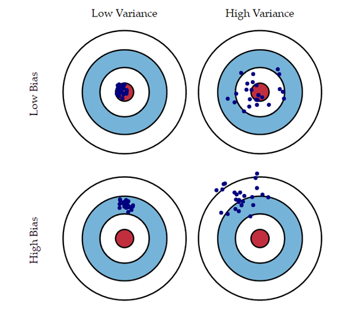
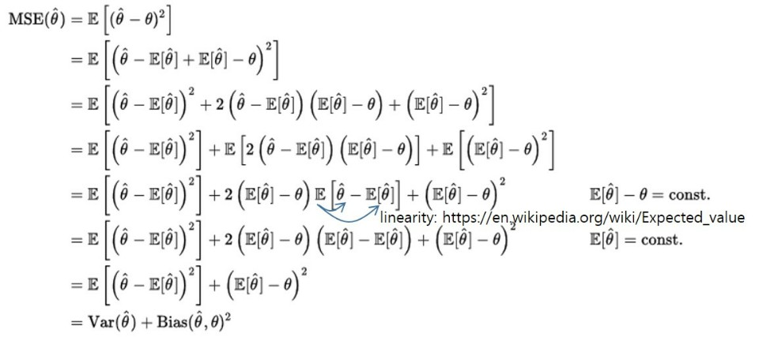
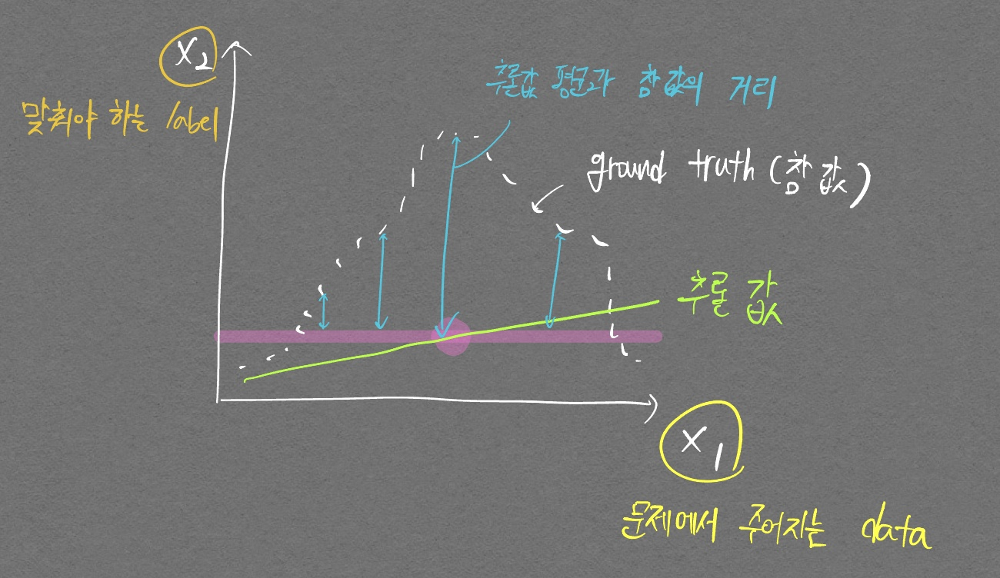

# 개념

- 최적의 회귀계수를 찾는 것

| 독립변수 개수 | 회귀 계수의 결합 |
| --- | --- |
| 1개: 단일회귀 | 선형: 선형 회귀 |
| 여러 개: 다중회귀 | 비선형: 비선형 회귀 |

# 분류와 회귀의 차이

- 지도학습은 두 가지 유형(분류, 회귀)
- 분류
    - 예측값이 카테고리와 같은 이산형 클래스
- 회귀
    - 예측값이 연속형 숫자 값

# 단순 선형회귀를 통해 이해해보기

- 단순 선형회귀는 독립변수 1개, 종속변수 1개인 선형 회귀
- 예로, 주택 가격이 주택의 크기로만 결정된다고 할 때
    - $f(x) = w_0 + w_1 \times x$
    - 예측가격 $\hat{y} = w_0 + w_1 + x$
    - 실제가격 $y = \hat{y} + Error$
- 최적의 회귀 모델을 만든다는 것은 Error 값 합이 최소가 될 수 있는 **최적의 회귀 계수(w)**를 찾는 것
    - Error 계산할 때 부호의 영향을 받지 않기 위해 절댓값 취해서 더하거나(Mean Absolute Error), **오류 값의 제곱을 구해서 더하는 방식(RSS, Residual Sum of Square)**을 취함
        - 미분을 편하게 하기위해 일반적으로 RSS가 많이 쓰임
        - 식: $RSS(w_0, w_1) = {1 \over N}\sum_{n=1}^{i=N}(y_i - (w_0 + w_1 \times x_i))^2$
        - 위 RSS 값이 최소가 되게 하는것 → **최적의 회귀 계수(w)**를 찾는 것

## 어떻게 최적의 회귀 계수를 찾을 것인가?

- 경사 하강법(Gradient Descent)
    - w 파라미터 개수가 적으면 미분계수가 0인 지점을 찾는 등 고차원 방정식을 활용할 수 있다
    - w 파라미터 개수가 늘면 해결하기 어려워지기 때문에 경사하강법 활용
        - ${\partial R(w) \over \partial w_1} = - {2 \over N} \sum_{i=1}^{N}x_i * (실제값_i - 예측값_i)$
        - ${\partial R(w) \over \partial w_0} = - {2 \over N} \sum_{i=1}^{N} (실제값_i - 예측값_i)$
    - 과정
        1. $w_0, w_1$를 임의의 값으로 설정하고 첫 비용 함수 값 계산
        2. $w_1$을 $w_1 + - \eta(- {2 \over N} \sum_{i=1}^{N}x_i * (실제값_i - 예측값_i))$, $w_0$을 $w_0 - \eta (- {2 \over N} \sum_{i=1}^{N} (실제값_i - 예측값_i))$로 업데이트 한 후 비용 함수 값 다시 계산
        3. 비용함수 값이 감소했으면 다시 step 2 반복. 더 이상 비용 함수 값이 감소하지 않으면 그때의 $w_1, w_0$을 구하고 반복을 중지

## 데이터가 많을 경우

- 경사하강법은 모든 데이터의를 입력으로 받은 후 가중치 업데이트를 실행함. 데이터가 많아질 경우 속도가 매우 느림
    - 따라서, **확률적 경사하강법**을 통해 데이터의 일부만을 활용해서 가중치 업데이트를 실행하는것이 일반적

# 혼동하지 않도록 중간 개념 잡기

- 비용함수
    - RSS(Residual Sum of Squares) = SSE(Sum of Squares Error)
- 비용함수의 값이 점차 낮아지게끔 하는 w 파라미터 찾는 방법 2가지
    1. OLS(Ordinary Least Squares) - 최소제곱법
        - 사이킷런의 **LinearRegression** 클래스가 사용하는 방법
        - 예측값과 참값의 차이(오차) 제곱이 제일 작은 함수를 얻을 수 있는 방법이며, 미분을 활용해 공식으로 나타낼 수 있다. 이 방법은 간단하지만 데이터가 많아지면 계산량이 매우 증가한다는 단점이 있어서 딥러닝에서는 적합하지 않다.
    2. GD(Gradient Descent)
- RSS vs MSE
    - 언뜻 같은 뜻으로 보이지만 아래와 같은 차이가 있다. (검색해보면 통계학적으로 더 복잡하게 다르나, 지금은 이정도의 차이로만 확인하고 넘어가자)
        - RSS: **Sum** of the squared errors
        - MSE: **Average sum** of the squared errors
- 회귀 평가 지표

    | 평가지표 | 설명 | 수식 |
    | --- | --- | --- |
    | MAE | Mean Absolute Error이며 실제 값과 예측값의 차이를 절댓값으로 변환해 평균한 것 | $${1 \over n} \sum_{i=1}^n \vert Y_i - \hat{Y_i} \vert$$|
    | MSE | Mean Squared Error이며 실제 값과 예측값의 차이를 제곱해 평균한 것 | $$ {1 \over n} \sum_{i=1}^n ( Y_i - \hat{Y_i} )^2 $$|
    | RMSE | MSE에 Root 씌운것 | $$ \sqrt{ {1 \over n} \sum_{i=1}^n ( Y_i - \hat{Y_i} )^2} $$|
    | R^2 | 실제값 분산 대비 예측값 분산 비율. 1에 가까울수록 예측 정확도가 높은 것 | $R^2 = {예측값 Variance \over 실제값 Variance}$|

# 다항회귀

- 가장 중요한 것은 차수(Degree)
    - 차수: **문자가 곱해진 횟수**
    - scikit-learn에서 PolynomialFeatures의 degree 인자는 최대 차수를 의미함
        
        ```python
        from sklearn.preprocessing import PolynomialFeatures
        import numpy as np
        
        # 다항식으로 변환한 단항식 생성, [[0,1],[2,3]]의 2X2 행렬 생성
        X = np.arange(6).reshape(2,3)
        print('일차 단항식 계수 feature:\n',X )
        
        # degree = 2 인 2차 다항식으로 변환하기 위해 PolynomialFeatures를 이용하여 변환
        poly = PolynomialFeatures(degree=2)
        poly.fit(X)
        poly_ftr = poly.transform(X)
        print('변환된 2차 다항식 계수 feature:\n', poly_ftr)
        ```
        
        
        
        

# 과적합을 막기위한 조치 → <span style='color:red'>규제(Regularization)</span>

Regularization을 알아보러 가기 전에! 다음의 그림을 완벽히(거의 완벽히.. ㅋㅋ) 이해해보자.

<p align="center">  </p>
<div align="center" markdown="1">
참 이해하는데 오래도 걸린 Variance, Bias 관련 그림
</div>

먼저 ML에서 흔히 사용하는 MSE Loss를 아래와 같이 Variance, Bias로 정리할 수 있다.

<p align="center">  </p>

이때의 포인트는, Variance는 ground truth와 상관없이 **추론값만의 분산**이다. 그리고 Bias는 추론값 평균과 참 값의 거리(Distance)이다.

아래 그림을 통해 명확히 이해해보자.

<p align="center">  </p>
<div align="center" markdown="1">
위 그림은 (high / low) Variance, (high / low) Bias인 그래프이다. 정답을 맞춰보자.
</div>

정답은 low Variance, high bias이다.

추론값의 변화가 거의 없다시피 하며, bias의 차이가 굉장히 크기 때문이다. 이 개념을 확실히 잡고 다음 개념글들로 넘어가자.

$비용함수의 목표 = Min(RSS(W) + \alpha \times \vert \vert W \vert \vert^2_2)$

- W 값이 커지면 과적합 될 가능성이 큼
    - why? PolynomialFeatures로 간단한 실험을 진행해볼 때 degree가 높아질수록 W계수 값들이 커지게 되서 과적합됨(MSE값 뽑아보면 degree 올라갈수록 굉장히 커짐)
        
          
        > 가운데 그림이 ground truth라고 할 때 가장 오른쪽 그림은 ground truth와 엄청 달라서 mse값이 매우 커짐. (위그림상으로는 제대로 표시가 안되 있지만 차수가 높아지는 만큼 오차도 굉장히 커져서 mse값이 겁나 커짐
        
- $\alpha$ 값 감소 → $RSS(W)$값 최소화(알파값이 작아지면 W의 영향력이 줄어드므로 RSS(W)를 줄이는데 집중하게 됌)
- $\alpha$ 값 증가 → $회귀계수 W$값 감소 = Variance를 줄인다

## 릿지회귀 (L2 Norm 사용)

- $Min(RSS(W) + \alpha \times \vert \vert W \vert \vert^2_2)$
- W 회귀계수의 크기를 줄이기는 하지만 0으로 만들지는 않는다

## 라쏘회귀 (L1 Norm 사용)

- $Min(RSS(W) + \alpha \times \vert \vert W \vert \vert_1)$
- 중요하지 않은 W 요소(특정 피쳐의 계수)를 0으로 만든다 (Feature selection 역할)

## 엘라스틱넷 회귀(L2 Norm, L1 Norm 둘 다 사용)

- $Min(RSS(W) + \alpha_1 \times \vert \vert W \vert \vert^2_2 + \alpha_2 \times \vert \vert W \vert \vert_1)$
- 릿지, 라쏘의 단점들을 보완

# 스케일링

- 여러가지 스케일링 방식이 존재
    - StandardScaler를 이용해 표준정규분포로 변환하거나, MinMaxScaler를 이용해 정규화를 진행
    - 스케일링, 정규화를 진행한 데이터에 추가적으로 Polynomial Feature를 적용
        - 보통 표준정규분포화 혹은 정규화로 성능 개선이 없을경우 적용함
    - Log 함수를 적용하는 `로그변환` 사용 (이게 제일 많이쓰고 성능도 좋음)

# 로지스틱 회귀

- 선형회귀 방식을 **분류**에 적용한 알고리즘
    - 많은 자연현상에서 특정 변수의 확률값은 선형이 아니라 시그모이드 함수와 같이 S자 커브 형태를 띔
        - 확률값이 선형이 아니라는 소리는 곧 확률값의 변화가 직선이 아니라는 말임. 확률값이 거의 100프로에 가까운 상태라면 확률값 변화는 매우 적어짐. 즉 직선이 아닌 형태가 됨
- 시그모이드 함수 수식
    
    $y = {1 \over 1+e^{-x}}$
    
- 로지스틱 회귀의 목적은 결국 W 계수값을 찾는것. 이 W가 어디 숨어있느냐?
    - 위 시그모이드 함수의 $x$ 대신 $wx$가 들어가 있다고 생각하면 됨. 이때 $x$는 log를 취하던, 제곱을 하던 상관없음. **$w$ 차수가 1이기 때문에!**
- 코드
    
    ```python
    import pandas as pd
    import matplotlib.pyplot as plt
    from sklearn.datasets import load_breast_cancer
    from sklearn.linear_model import LogisticRegression
    from sklearn.preprocessing import StandardScaler
    from sklearn.model_selection import train_test_split
    from sklearn.metrics import accuracy_score, roc_auc_score
    
    cancer = load_breast_cancer()
    
    # StandardScaler( )로 평균이 0, 분산 1로 데이터 분포도 변환
    scaler = StandardScaler()
    data_scaled = scaler.fit_transform(cancer.data)
    
    X_train , X_test, y_train , y_test = train_test_split(data_scaled, cancer.target, test_size=0.3, random_state=0)
    
    # 로지스틱 회귀를 이용하여 학습 및 예측 수행. 
    lr_clf = LogisticRegression()
    lr_clf.fit(X_train, y_train)
    lr_preds = lr_clf.predict(X_test)
    
    # accuracy와 roc_auc 측정
    print('accuracy: {:0.3f}'.format(accuracy_score(y_test, lr_preds)))
    print('roc_auc: {:0.3f}'.format(roc_auc_score(y_test , lr_preds)))
    ```
    
        accuracy: 0.977
        roc_auc: 0.972
    
    ```python
    from sklearn.model_selection import GridSearchCV
    
    params={'penalty':['l2', 'l1'],
            'C':[0.01, 0.1, 1, 1, 5, 10]}
    
    grid_clf = GridSearchCV(lr_clf, param_grid=params, scoring='accuracy', cv=3 )
    grid_clf.fit(data_scaled, cancer.target)
    print('최적 하이퍼 파라미터:{0}, 최적 평균 정확도:{1:.3f}'.format(grid_clf.best_params_, 
                                                      grid_clf.best_score_))
    ```
    
        최적 하이퍼 파라미터:{'C' : 1, 'penalty': 'l2'}, 최적 평균 정확도:0.975