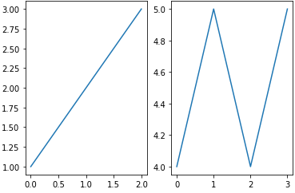
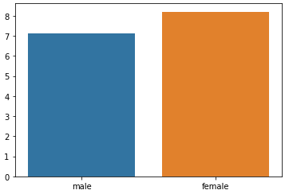
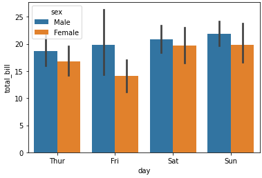
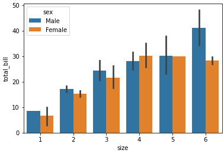
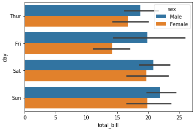
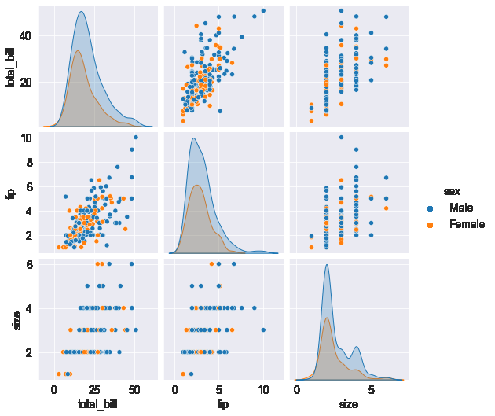
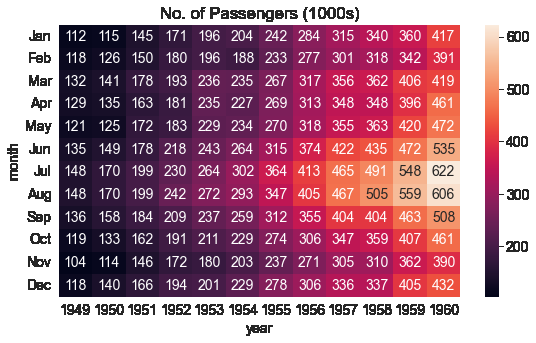
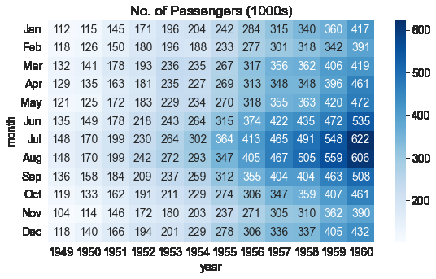

# Matplotlib
## 기초


```python
import matplotlib.pyplot as plt

plt.plot([2, 3, 5, 10])     # list, tuple, numpy 같은 Array 입력받을 수 있음
plt.show()  # x 값은 기본적으로 [0, 1, 2, 3]이 됨
```
    

    

```python
import matplotlib.pyplot as plt

plt.plot([1, 2, 3, 4], [2, 3, 5, 10])
plt.show()
```


    

    


```python
import matplotlib.pyplot as plt

data_dict = {'data_x': [1, 2, 3, 4, 5], 'data_y': [2, 3, 5, 10, 8]}

plt.plot('data_x', 'data_y', data=data_dict)        # dictionary와 연계가능. 먼저 dictionary를 제공하고 그것의 Key를 호출한다 생각하면 편함
plt.show()
```


    

    


## 축 글씨 및 길이 지정

### 레이블 여백, 폰트 설정, 위치 설정


```python
import matplotlib.pyplot as plt

font1 = {'family': 'serif',
         'color': 'b',
         'weight': 'bold',
         'size': 14
         }

font2 = {'family': 'fantasy',
         'color': 'deeppink',
         'weight': 'normal',
         'size': 'xx-large'
         }

plt.plot([1, 2, 3, 4], [2, 3, 5, 10])
plt.xlabel('X-Axis', labelpad=15, fontdict=font1, loc='right')
plt.ylabel('Y-Axis', labelpad=20, fontdict=font2, loc='top')
plt.show()
```


    

    


## 여러 그래프 표시
- plt.subplot, plt.subplots 2가지 방식이 있음
- 구조도 이해  


### plt.subplot


```python
import numpy as np
import matplotlib.pyplot as plt

x1 = np.linspace(0.0, 5.0)
x2 = np.linspace(0.0, 2.0)

y1 = np.cos(2 * np.pi * x1) * np.exp(-x1)
y2 = np.cos(2 * np.pi * x2)

plt.subplot(2, 1, 1)                # nrows=2, ncols=1, index=1 / 행렬 모양을 지정하고, 인덱스 지정한다 생각하면 되겠네
plt.plot(x1, y1, 'o-')
plt.title('1st Graph')
plt.ylabel('Damped oscillation')

plt.subplot(2, 1, 2)                # nrows=2, ncols=1, index=2
plt.plot(x2, y2, '.-')
plt.title('2nd Graph')
plt.xlabel('time (s)')
plt.ylabel('Undamped')

plt.tight_layout()
plt.show()
```


    

    

```python
fig , (ax1, ax2, ax3) = plt.subplots(figsize=(14,4), ncols=3)   # 이런식으로 써서도 접근 가능하다
```

```python
import numpy as np
import matplotlib.pyplot as plt

x1 = np.linspace(0.0, 5.0)
x2 = np.linspace(0.0, 2.0)

y1 = np.cos(2 * np.pi * x1) * np.exp(-x1)
y2 = np.cos(2 * np.pi * x2)

plt.subplot(1, 2, 1)                # nrows=1, ncols=2, index=1
plt.plot(x1, y1, 'o-')
plt.title('1st Graph')
plt.xlabel('time (s)')
plt.ylabel('Damped oscillation')

plt.subplot(1, 2, 2)                # nrows=1, ncols=2, index=2
plt.plot(x2, y2, '.-')
plt.title('2nd Graph')
plt.xlabel('time (s)')
plt.ylabel('Undamped')

plt.tight_layout()
plt.show()
```


    

    


### plt.subplots

```python
fig, axes = plt.subplot(1, 2)
axes[0].plot([1,2,3])
axes[1].plot([4,5,4,5])
```

  


```python
fig, axes = plt.subplots(2,2)       # fig: picture를 담은 객체, axes: 각각의 그래프를 Array 형태로 담음
axes[0][0].plot([1,2,3])
axes[1][0].plot([4,5,4,5])
```


    [<matplotlib.lines.Line2D at 0x1edc5b10460>]
    

    


## 마커 지정하기
- 지정할 수 있는 것들


```python
import matplotlib.pyplot as plt

# plt.plot([1, 2, 3, 4], [2, 3, 5, 10], 'bo-')    # 파란색 + 마커(o는 동그란거) + 실선
plt.plot([1, 2, 3, 4], [2, 3, 5, 10], 'bo--')     # 파란색 + 마커(o는 동그란거) + 점선
plt.xlabel('X-Axis')
plt.ylabel('Y-Axis')
plt.show()
```


    


## scatter를 활용해 군집화 데이터 표현하기
```python
import matplotlib.pyplot as plt
%matplotlib inline

clusterDF['meanshift_label']  = cluster_labels
centers = meanshift.cluster_centers_
unique_labels = np.unique(cluster_labels)
markers=['o', 's', '^', 'x', '*']

for label in unique_labels:
    label_cluster = clusterDF[clusterDF['meanshift_label']==label]
    center_x_y = centers[label]
    # 군집별로 다른 마커로 산점도 적용
    plt.scatter(x=label_cluster['ftr1'], y=label_cluster['ftr2'], edgecolor='k', marker=markers[label] )
    
    # 군집별 중심 표현
    plt.scatter(x=center_x_y[0], y=center_x_y[1], s=200, color='gray', alpha=0.9, marker=markers[label])
    plt.scatter(x=center_x_y[0], y=center_x_y[1], s=70, color='k', edgecolor='k', marker='$%d$' % label)
    
plt.show()
```


## precision_recall_curve 그리기

```python
from sklearn.metrics import precision_recall_curve

# 레이블 값이 1일때의 예측 확률을 추출 
pred_proba_class1 = lr_clf.predict_proba(X_test)[:, 1] 

# 실제값 데이터 셋과 레이블 값이 1일 때의 예측 확률을 precision_recall_curve 인자로 입력 
precisions, recalls, thresholds = precision_recall_curve(y_test, pred_proba_class1 )
print('반환된 분류 결정 임곗값 배열의 Shape:', thresholds.shape)
print('반환된 precisions 배열의 Shape:', precisions.shape)
print('반환된 recalls 배열의 Shape:', recalls.shape)

print("thresholds 5 sample:", thresholds[:5])
print("precisions 5 sample:", precisions[:5])
print("recalls 5 sample:", recalls[:5])

#반환된 임계값 배열 로우가 147건이므로 샘플로 10건만 추출하되, 임곗값을 15 Step으로 추출. 
thr_index = np.arange(0, thresholds.shape[0], 15)
print('샘플 추출을 위한 임계값 배열의 index 10개:', thr_index)
print('샘플용 10개의 임곗값: ', np.round(thresholds[thr_index], 2))

# 15 step 단위로 추출된 임계값에 따른 정밀도와 재현율 값 
print('샘플 임계값별 정밀도: ', np.round(precisions[thr_index], 3))
print('샘플 임계값별 재현율: ', np.round(recalls[thr_index], 3))

import matplotlib.pyplot as plt
import matplotlib.ticker as ticker
%matplotlib inline

def precision_recall_curve_plot(y_test , pred_proba_c1):
    # threshold ndarray와 이 threshold에 따른 정밀도, 재현율 ndarray 추출. 
    precisions, recalls, thresholds = precision_recall_curve( y_test, pred_proba_c1)
    
    # X축을 threshold값으로, Y축은 정밀도, 재현율 값으로 각각 Plot 수행. 정밀도는 점선으로 표시
    plt.figure(figsize=(8,6))
    threshold_boundary = thresholds.shape[0]
    plt.plot(thresholds, precisions[0:threshold_boundary], linestyle='--', label='precision')
    plt.plot(thresholds, recalls[0:threshold_boundary],label='recall')
    
    # threshold 값 X 축의 Scale을 0.1 단위로 변경
    start, end = plt.xlim()
    plt.xticks(np.round(np.arange(start, end, 0.1),2))
    
    # x축, y축 label과 legend, 그리고 grid 설정
    plt.xlabel('Threshold value') 
    plt.ylabel('Precision and Recall value')
    plt.legend(); plt.grid()
    plt.show()
    
precision_recall_curve_plot( y_test, lr_clf.predict_proba(X_test)[:, 1] )
```


# Seaborn

> Kaggle 머신러닝 대표 데이터인 Titanic 사용

Seaborn은 Matplot을 기반한 라이브러리지만 사용자가 더 쓰기 용이하도록 DataFrame을 바로 쓸 수 있도록 `data` parameter를 지원해주며, 각종 통계 지표들을 훨씬 직관적으로 쓸 수 있게 해준다.  

## barplot

x, y의 dimension을 맞춰서 간단하게 사용 가능하다.  
x, y중 하나는 numeric variable, 다른 하나는 categorical variable 이여야 한다. 이를 활용해 vertical bar plot을 만들거나, horizontal bar plot을 만들 수 있다. (x, y에 들어가는 값만 서로 바꿔주면 됨)

```python
sns.barplot(x=['male', 'female'], y = [7.1, 8.2])
```
<p align="center">  </p>


barplot의 강력함은 `groupby` 연산과, `mean` 연산을 한번에 해준다는 점이다.

```python
tips_df.head()
```

```
   total_bill   tip     sex smoker  day    time  size
0       16.99  1.01  Female     No  Sun  Dinner     2
1       10.34  1.66    Male     No  Sun  Dinner     3
2       21.01  3.50    Male     No  Sun  Dinner     3
3       23.68  3.31    Male     No  Sun  Dinner     2
4       24.59  3.61  Female     No  Sun  Dinner     4
```

```python
sns.barplot(x='day', y='total_bill', hue='sex', data=tips_df);
```

<p align="center">  </p>

day를 기준으로 group된 데이터들 중 각 day별 total_bill의 평균값을 계산해서 한번에 보여준다.  
가운데 검은선의 길이가 데이터의 퍼진 정도를 나타낸다. 금요일이 변동량이 가장 큼을 의미한다.

### hue를 활용한 막대그래프 구체화

hue 인자를 통해 bar(막대기)를 어떻게 세세하게 나눌것인지 결정한다.  

```python
sns.barplot(x='size', y='total_bill', hue='sex', data=tips_df);
```

<p align="center">  </p>

위 그래프는 다음의 코드를 보면 바로 이해가 갈것이다.

```python
tips_df.groupby(['day', 'sex']).mean()
```

<div>
<style scoped>
    .dataframe tbody tr th:only-of-type {
        vertical-align: middle;
    }

    .dataframe tbody tr th {
        vertical-align: top;
    }

    .dataframe thead th {
        text-align: right;
    }
</style>
<table border="1" class="dataframe">
  <thead>
    <tr style="text-align: right;">
      <th></th>
      <th></th>
      <th>total_bill</th>
      <th>tip</th>
      <th>size</th>
    </tr>
    <tr>
      <th>day</th>
      <th>sex</th>
      <th></th>
      <th></th>
      <th></th>
    </tr>
  </thead>
  <tbody>
    <tr>
      <th rowspan="2" valign="top">Thur</th>
      <th>Male</th>
      <td>18.714667</td>
      <td>2.980333</td>
      <td>2.433333</td>
    </tr>
    <tr>
      <th>Female</th>
      <td>16.715312</td>
      <td>2.575625</td>
      <td>2.468750</td>
    </tr>
    <tr>
      <th rowspan="2" valign="top">Fri</th>
      <th>Male</th>
      <td>19.857000</td>
      <td>2.693000</td>
      <td>2.100000</td>
    </tr>
    <tr>
      <th>Female</th>
      <td>14.145556</td>
      <td>2.781111</td>
      <td>2.111111</td>
    </tr>
    <tr>
      <th rowspan="2" valign="top">Sat</th>
      <th>Male</th>
      <td>20.802542</td>
      <td>3.083898</td>
      <td>2.644068</td>
    </tr>
    <tr>
      <th>Female</th>
      <td>19.680357</td>
      <td>2.801786</td>
      <td>2.250000</td>
    </tr>
    <tr>
      <th rowspan="2" valign="top">Sun</th>
      <th>Male</th>
      <td>21.887241</td>
      <td>3.220345</td>
      <td>2.810345</td>
    </tr>
    <tr>
      <th>Female</th>
      <td>19.872222</td>
      <td>3.367222</td>
      <td>2.944444</td>
    </tr>
  </tbody>
</table>
</div>


horizontal bar plot  

<p align="center">  </p>

### Numerical -> Categorial 변경

여러 시각화를 하다보면, duplicated로 인한 문제나 categorical 데이터 타입을 사용해야 하는 등의 필요조건이 자주 발생한다.  
아래와 같은 코드로 Numerical -> Categorical로 변경이 가능하다.

```python
# 입력 age에 따라 구분값을 반환하는 함수 설정. DataFrame의 apply lambda식에 사용. 
def get_category(age):
    cat = ''
    if age <= -1: cat = 'Unknown'
    elif age <= 5: cat = 'Baby'
    elif age <= 12: cat = 'Child'
    elif age <= 18: cat = 'Teenager'
    elif age <= 25: cat = 'Student'
    elif age <= 35: cat = 'Young Adult'
    elif age <= 60: cat = 'Adult'
    else : cat = 'Elderly'
    
    return cat

# 막대그래프의 크기 figure를 더 크게 설정 
plt.figure(figsize=(10,6))

#X축의 값을 순차적으로 표시하기 위한 설정 
group_names = ['Unknown', 'Baby', 'Child', 'Teenager', 'Student', 'Young Adult', 'Adult', 'Elderly']

# lambda 식에 위에서 생성한 get_category( ) 함수를 반환값으로 지정. 
# get_category(X)는 입력값으로 'Age' 컬럼값을 받아서 해당하는 cat 반환
titanic_df['Age_cat'] = titanic_df['Age'].apply(lambda x : get_category(x))
sns.barplot(x='Age_cat', y = 'Survived', hue='Sex', data=titanic_df, order=group_names)
titanic_df.drop('Age_cat', axis=1, inplace=True)
```

## pairplot

DataFrame을 구성하는 Numerical column들에 대한 상관관계나 Numerical column 들과 Categorical column 하나로 분류적 특성을 바로 확인할 수 있다.

```python
flowers_df.head()
```


<div>
<style scoped>
    .dataframe tbody tr th:only-of-type {
        vertical-align: middle;
    }

    .dataframe tbody tr th {
        vertical-align: top;
    }

    .dataframe thead th {
        text-align: right;
    }
</style>
<table border="1" class="dataframe">
  <thead>
    <tr style="text-align: right;">
      <th></th>
      <th>sepal_length</th>
      <th>sepal_width</th>
      <th>petal_length</th>
      <th>petal_width</th>
      <th>species</th>
    </tr>
  </thead>
  <tbody>
    <tr>
      <th>0</th>
      <td>5.1</td>
      <td>3.5</td>
      <td>1.4</td>
      <td>0.2</td>
      <td>setosa</td>
    </tr>
    <tr>
      <th>1</th>
      <td>4.9</td>
      <td>3.0</td>
      <td>1.4</td>
      <td>0.2</td>
      <td>setosa</td>
    </tr>
    <tr>
      <th>2</th>
      <td>4.7</td>
      <td>3.2</td>
      <td>1.3</td>
      <td>0.2</td>
      <td>setosa</td>
    </tr>
    <tr>
      <th>3</th>
      <td>4.6</td>
      <td>3.1</td>
      <td>1.5</td>
      <td>0.2</td>
      <td>setosa</td>
    </tr>
    <tr>
      <th>4</th>
      <td>5.0</td>
      <td>3.6</td>
      <td>1.4</td>
      <td>0.2</td>
      <td>setosa</td>
    </tr>
  </tbody>
</table>
</div>


```python
flowers_df.info()
tp = flowers_df.iloc[:, :4]
sns.pairplot(flowers_df, hue='species')
```

    <class 'pandas.core.frame.DataFrame'>
    RangeIndex: 150 entries, 0 to 149
    Data columns (total 5 columns):
     #   Column        Non-Null Count  Dtype  
    ---  ------        --------------  -----  
     0   sepal_length  150 non-null    float64
     1   sepal_width   150 non-null    float64
     2   petal_length  150 non-null    float64
     3   petal_width   150 non-null    float64
     4   species       150 non-null    object 
    dtypes: float64(4), object(1)
    memory usage: 6.0+ KB
    


    
<p align="center">  </p>
<div align="center" markdown="1"> hue가 없어도 색깔이 모두 파란색인 동일한 그래프가 출력된다.  점은 x좌표, y좌표만 있으면 찍히기 때문이다. (처음에 왜 hue가 없는데도 그림이 동일한지 의아했음). hue가 접목이되면 여기 그래프에선 색깔로 구분을 했지만, 원래는 z축인 3차원 그래프로 표현해야 하는 데이터이다.
</div>
    


```python
sns.pairplot(tips_df, hue='sex');
```


    
<p align="center">  </p>

# Matplot & Seaborn 같이 활용하기

## HeatMap 그리기

2차원 데이터를 시각화하는데 사용된다.


```python
flights_df = sns.load_dataset("flights")
```


```python
flights_df.head()
```


<div>
<style scoped>
    .dataframe tbody tr th:only-of-type {
        vertical-align: middle;
    }

    .dataframe tbody tr th {
        vertical-align: top;
    }

    .dataframe thead th {
        text-align: right;
    }
</style>
<table border="1" class="dataframe">
  <thead>
    <tr style="text-align: right;">
      <th></th>
      <th>year</th>
      <th>month</th>
      <th>passengers</th>
    </tr>
  </thead>
  <tbody>
    <tr>
      <th>0</th>
      <td>1949</td>
      <td>Jan</td>
      <td>112</td>
    </tr>
    <tr>
      <th>1</th>
      <td>1949</td>
      <td>Feb</td>
      <td>118</td>
    </tr>
    <tr>
      <th>2</th>
      <td>1949</td>
      <td>Mar</td>
      <td>132</td>
    </tr>
    <tr>
      <th>3</th>
      <td>1949</td>
      <td>Apr</td>
      <td>129</td>
    </tr>
    <tr>
      <th>4</th>
      <td>1949</td>
      <td>May</td>
      <td>121</td>
    </tr>
  </tbody>
</table>
</div>


```python
flights_df.info()
```

    <class 'pandas.core.frame.DataFrame'>
    RangeIndex: 144 entries, 0 to 143
    Data columns (total 3 columns):
     #   Column      Non-Null Count  Dtype   
    ---  ------      --------------  -----   
     0   year        144 non-null    int64   
     1   month       144 non-null    category
     2   passengers  144 non-null    int64   
    dtypes: category(1), int64(2)
    memory usage: 2.9 KB
    

Headmap을 위한 2차원 데이터를 만들기 위해 `Pandas.DataFrame.pivot` 메소드를 사용한다.  


```python
flights_df.pivot('month', 'year', 'passengers') # row 방향을 month로 구성
                                                # column 방향을 year로 구성
                                                # 그 안의 value를 passengers로 구성
```


<div>
<style scoped>
    .dataframe tbody tr th:only-of-type {
        vertical-align: middle;
    }

    .dataframe tbody tr th {
        vertical-align: top;
    }

    .dataframe thead th {
        text-align: right;
    }
</style>
<table border="1" class="dataframe">
  <thead>
    <tr style="text-align: right;">
      <th>year</th>
      <th>1949</th>
      <th>1950</th>
      <th>1951</th>
      <th>1952</th>
      <th>1953</th>
      <th>1954</th>
      <th>1955</th>
      <th>1956</th>
      <th>1957</th>
      <th>1958</th>
      <th>1959</th>
      <th>1960</th>
    </tr>
    <tr>
      <th>month</th>
      <th></th>
      <th></th>
      <th></th>
      <th></th>
      <th></th>
      <th></th>
      <th></th>
      <th></th>
      <th></th>
      <th></th>
      <th></th>
      <th></th>
    </tr>
  </thead>
  <tbody>
    <tr>
      <th>Jan</th>
      <td>112</td>
      <td>115</td>
      <td>145</td>
      <td>171</td>
      <td>196</td>
      <td>204</td>
      <td>242</td>
      <td>284</td>
      <td>315</td>
      <td>340</td>
      <td>360</td>
      <td>417</td>
    </tr>
    <tr>
      <th>Feb</th>
      <td>118</td>
      <td>126</td>
      <td>150</td>
      <td>180</td>
      <td>196</td>
      <td>188</td>
      <td>233</td>
      <td>277</td>
      <td>301</td>
      <td>318</td>
      <td>342</td>
      <td>391</td>
    </tr>
    <tr>
      <th>Mar</th>
      <td>132</td>
      <td>141</td>
      <td>178</td>
      <td>193</td>
      <td>236</td>
      <td>235</td>
      <td>267</td>
      <td>317</td>
      <td>356</td>
      <td>362</td>
      <td>406</td>
      <td>419</td>
    </tr>
    <tr>
      <th>Apr</th>
      <td>129</td>
      <td>135</td>
      <td>163</td>
      <td>181</td>
      <td>235</td>
      <td>227</td>
      <td>269</td>
      <td>313</td>
      <td>348</td>
      <td>348</td>
      <td>396</td>
      <td>461</td>
    </tr>
    <tr>
      <th>May</th>
      <td>121</td>
      <td>125</td>
      <td>172</td>
      <td>183</td>
      <td>229</td>
      <td>234</td>
      <td>270</td>
      <td>318</td>
      <td>355</td>
      <td>363</td>
      <td>420</td>
      <td>472</td>
    </tr>
    <tr>
      <th>Jun</th>
      <td>135</td>
      <td>149</td>
      <td>178</td>
      <td>218</td>
      <td>243</td>
      <td>264</td>
      <td>315</td>
      <td>374</td>
      <td>422</td>
      <td>435</td>
      <td>472</td>
      <td>535</td>
    </tr>
    <tr>
      <th>Jul</th>
      <td>148</td>
      <td>170</td>
      <td>199</td>
      <td>230</td>
      <td>264</td>
      <td>302</td>
      <td>364</td>
      <td>413</td>
      <td>465</td>
      <td>491</td>
      <td>548</td>
      <td>622</td>
    </tr>
    <tr>
      <th>Aug</th>
      <td>148</td>
      <td>170</td>
      <td>199</td>
      <td>242</td>
      <td>272</td>
      <td>293</td>
      <td>347</td>
      <td>405</td>
      <td>467</td>
      <td>505</td>
      <td>559</td>
      <td>606</td>
    </tr>
    <tr>
      <th>Sep</th>
      <td>136</td>
      <td>158</td>
      <td>184</td>
      <td>209</td>
      <td>237</td>
      <td>259</td>
      <td>312</td>
      <td>355</td>
      <td>404</td>
      <td>404</td>
      <td>463</td>
      <td>508</td>
    </tr>
    <tr>
      <th>Oct</th>
      <td>119</td>
      <td>133</td>
      <td>162</td>
      <td>191</td>
      <td>211</td>
      <td>229</td>
      <td>274</td>
      <td>306</td>
      <td>347</td>
      <td>359</td>
      <td>407</td>
      <td>461</td>
    </tr>
    <tr>
      <th>Nov</th>
      <td>104</td>
      <td>114</td>
      <td>146</td>
      <td>172</td>
      <td>180</td>
      <td>203</td>
      <td>237</td>
      <td>271</td>
      <td>305</td>
      <td>310</td>
      <td>362</td>
      <td>390</td>
    </tr>
    <tr>
      <th>Dec</th>
      <td>118</td>
      <td>140</td>
      <td>166</td>
      <td>194</td>
      <td>201</td>
      <td>229</td>
      <td>278</td>
      <td>306</td>
      <td>336</td>
      <td>337</td>
      <td>405</td>
      <td>432</td>
    </tr>
  </tbody>
</table>
</div>


```python
flights_df = sns.load_dataset("flights").pivot("month", "year", "passengers") #pivot은 여러 분류로 섞인 행 데이터를 열 데이터로 회전시킴
```

`flights_df`는 한 달에 한 행, 한 열이 있는 matrix로, 한 해 중 특정 달에 공항을 방문한 승객의 수를 나타낸다.
`sns.heatmap`함수를 사용하여 공황을 방문하는 승객의 수를 시각화 할 수 있다.


```python
import matplotlib.pyplot as plt

plt.title("No. of Passengers (1000s)")
sns.heatmap(flights_df);
```

<p align="center">  </p>


위 그래프의 밝은 색상은 더 많은 이용객이 방문했음을 의미한다. 그래프를 통해 2 가지를 추론이 가능하다.

- 7~8월경에 공항 이용객이 높다.
- 각 달의 공항 이용객은 해마다 증가하는 경향이 있다.

각 블록에 `annot=True`를 설정하여 실제 값을 표시 할 수 있고 `cmap` 인자로 팔레트의 색을 바꿀 수 있다.


```python
plt.title("No. of Passengers (1000s)")
sns.heatmap(flights_df, fmt="d", annot=True);
```


<p align="center">  </p>


```python
plt.title("No. of Passengers (1000s)")
sns.heatmap(flights_df, fmt="d", annot=True, cmap='Blues');
```

<p align="center">  </p>

## 히스토그램으로 데이터 분포 형태 살펴보기

```python
DataFrame.hist()  # target 데이터 같은게 들어있는 DataFrame이라고 가정
sns.distplot(DataFrame)  # 이걸로도 가능. (이게 더 이쁜듯)
```
    

- hist()처럼 아무 인자도 주지 않았을 경우 x축이 DataFrame 값임(즉 위 그림에선 0 ~ 200인 값이 대략 4200개 있다는 것)
- 위 그림은 데이터가 초반부에 치우쳐 있는 모습