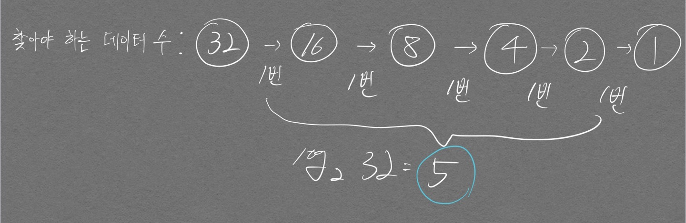

# 수행시간

- 2,000만회 -> 1초
  - 즉 N = 100만개라고 가정하면 NlogN 이하의 알고리즘을 사용해야 시간초과가 안나게 문제를 풀 수 있다. (O(NlogN) = 약 2,000만)

## 시간복잡도 계산하기

시간복잡도 계산은 아직도 꽤나 어렵다. 여러 예시를 통해 구체화 해보자.

```python
import sys
sys.setrecursionlimit(int(1e9))

n, m = map(int, sys.stdin.readline().rstrip().split())
arr = [int(input()) for _ in range(n)]

explorer = []
answer = 0
cnt = 0
def dfs(depth, idx):
    global answer, cnt
    cnt += 1

    if depth == m:
        answer += 1
        # print(explorer)
        return

    for i in range(2):
        explorer.append(arr[i])
        dfs(depth+1, 1)
        explorer.pop()

dfs(0, 0)
print(answer, cnt)
```

n = 2, m = 1000 일 때의 시간 복잡도는 어떻게 될까?  

`for`문이 1000번 중복으로 호출되기 때문에 $$2^1000$$ 이라는 어마어마한 시간복잡도가 나온다.

만약 위 코드를 idx를 이용해 아래와 같이 조합 개념을 첨부하면 어떨까?

```python
import sys
sys.setrecursionlimit(int(1e9))

n, m = map(int, sys.stdin.readline().rstrip().split())
arr = [int(input()) for _ in range(n)]

explorer = []
answer = 0
cnt = 0
def dfs(depth, idx):
    global answer, cnt
    cnt += 1

    if depth == m:
        answer += 1
        # print(explorer)
        return

    for i in range(idx, n):
        explorer.append(arr[i])
        dfs(depth+1, i)
        explorer.pop()

dfs(0, 0)
print(answer, cnt)
```

시간복잡도는 대략 500,000이 나오게 된다. 그림을 그려보면 규칙성에 의해 등차수열이 나오기에, 계산을 통해 전체 합을 알 수 있다.

## O(logN)의 의미

이진 탐색 부분을 공부하다가 깨달은 부분을 정리하고자 한다.

이진 탐색을 하게되면 데이터 개수가 32개라고 할 때, 찾아야 하는 영역이 32 -> 16 -> 8 -> 4 -> 2 -> 1 형태로 줄어들게 된다. 여기서 수행시간이 $$ O(logN) $$ 이라고 하는 부분이 잘 이해가 되지 않았는데 아래의 그림을 통해 이해할 수 있다.

<p align="center">  </p>

# 주의해야 할 사항
- 아래 코드는 False를 반환한다.


```python
a = 0.3 + 0.6

if a == 0.9:
    print(True)
else:
    print(False)

# round 처리를 통해 해결한다

if round(a, 1) == 0.9:
    print(True)
else:
    print(False)
```

    False
    True
    1
    

# 코드 단순화
- `or`, `and` 연산자를 이용한 코드 단순화

코딩 테스트 문제를 풀다보면 `index out of range` 오류를 만나는 경우가 흔하다. 이러한 경우를 방지하고자 난 if문으로 사전에 범위를 보장받고 그 다음 코드를 이어서 적어갔는데 문제가 조금만 디테일해져도 어지러운 코드가 되버린다.  

```python
# 나의 병맛같은 코드 예시

# 나의 병맛같은 코드 예시

arr = [1, 2, 3, 4, 5]
idx_list = [4, 7, 4]

for i in idx_list:    
    if i < 5:
        if arr[i] == 5:
            print("저는 5 입니다")
```

위 코드를 `and` 연산자를 이용하여 아래와 같이 단순화 할 수 있다.

```python

arr = [1, 2, 3, 4, 5]
idx_list = [4, 7, 4]
idx = 4

for i in idx_list:    
    if i < 5 and arr[i] == 5:
        print("저는 5 입니다")
```

`and` 연산은 앞에서 부터 True, False 검사를 하는데 하나라도 False가 나오면 **바로 if문을 탈출**하게 된다. 그래서 위와 같이 활용하면 `arr[i]`의 `i`값 범위를 **i < 5 인 범위로 보장받을 수 있게된다.**


- 반복문 중첩할 때 i, j 변수에 관해 생각해야 하는 점

아래 현상을 보자.  

```python
graph = [
    [1,2,3],
    [4,5,6],
    [7,8,9]
]

for i in range(len(graph)):
    for j in range(len(graph)):
        print(graph[i][j])

print('*' * 10)

for i in range(len(graph)):
    for j in range(len(graph)):
        print(graph[j][i])

print('*' * 10)

for j in range(len(graph)):
    for i in range(len(graph)):
        print(graph[i][j])
```

위 코드에서 내가 말하고자 하는 바는 **i, j 변수에 대한 고정관념을 탈피해야 한다**는 것이다.  
난 i를 row, j를 col에서만 쓰이는 변수로 생각했기에 위 코드 중 두번째 반복문 뭉치에서 나타나는 `graph[j][i]`가 여전히 어색하다.  단순히 i, j 변수는 바뀌는 값일 뿐이고 내가 그 코드를 `graph[i][j]`로 작성하느냐 `graph[j][i]`로 작성하느냐에 따라 그 역할이 달라지는 것이다.  
별것 아닌 것 같지만 문제를 풀때 i, j 의 고정관념에서 벗어나지 못하면 문제를 풀 때 애를 먹기가 쉽다.

# 리스트

## 리스트 슬라이싱

- [start:end:step]

```python
import numpy as np

arr = np.arange(0,8000).reshape(8, 1000)

for i in arr:
    print(i.shape)      # arr[0]에 접근하면 shape이 (1000,)이 되는것 주목.
                        # 지금보면 당연해 보이지만 간혹 shape(1, 8) 아닌가 하면서 헷갈릴 수 있음
    print(i[0:20:-2])
    break

for i in arr:
    print(i[20:0:-2])
    break

for i in arr:
    print(i[::-1])
    break

for i in arr:
    print(i.argsort()[::])      # index 반환하는 정렬해서 반환하는것 가능
```

```
(1000,)
[]
[20 18 16 14 12 10  8  6  4  2]
[999 998 997 996 995 994 993 992 991 990 989 988 987 986 985 984 983 982
 981 980 979 978 977 976 975 974 973 972 971 970 969 968 967 966 965 964
 963 962 961 960 959 958 957 956 955 954 953 952 951 950 949 948 947 946
 945 944 943 942 941 940 939 938 937 936 935 934 933 932 931 930 929 928
 927 926 925 924 923 922 921 920 919 918 917 916 915 914 913 912 911 910
 909 908 907 906 905 904 903 902 901 900 899 898 897 896 895 894 893 892
 891 890 889 888 887 886 885 884 883 882 881 880 879 878 877 876 875 874
 ...
 117 116 115 114 113 112 111 110 109 108 107 106 105 104 103 102 101 100
  99  98  97  96  95  94  93  92  91  90  89  88  87  86  85  84  83  82
  81  80  79  78  77  76  75  74  73  72  71  70  69  68  67  66  65  64
  63  62  61  60  59  58  57  56  55  54  53  52  51  50  49  48  47  46
  45  44  43  42  41  40  39  38  37  36  35  34  33  32  31  30  29  28
  27  26  25  24  23  22  21  20  19  18  17  16  15  14  13  12  11  10
   9   8   7   6   5   4   3   2   1   0]
[  0   1   2   3   4   5   6   7   8   9  10  11  12  13  14  15  16  17
  18  19  20  21  22  23  24  25  26  27  28  29  30  31  32  33  34  35
  36  37  38  39  40  41  42  43  44  45  46  47  48  49  50  51  52  53
  54  55  56  57  58  59  60  61  62  63  64  65  66  67  68  69  70  71
  72  73  74  75  76  77  78  79  80  81  82  83  84  85  86  87  88  89
  90  91  92  93  94  95  96  97  98  99 100 101 102 103 104 105 106 107
 ...
  928 929 930 931 932 933 934 935
 936 937 938 939 940 941 942 943 944 945 946 947 948 949 950 951 952 953
 954 955 956 957 958 959 960 961 962 963 964 965 966 967 968 969 970 971
 972 973 974 975 976 977 978 979 980 981 982 983 984 985 986 987 988 989
 990 991 992 993 994 995 996 997 998 999]
```

## 리스트 컴프리헨션


```python
array = [i for i in range(1, 20) if i%2 == 1]
array
```


    [1, 3, 5, 7, 9, 11, 13, 15, 17, 19]


- **2차원 행렬** 초기화는 반드시 리스트 컴프리헨션으로 진행


```python
n = 3
m = 4
array = [[0] * m for _ in range(n)]
array
```


    [[0, 0, 0, 0], [0, 0, 0, 0], [0, 0, 0, 0]]


```python
# 아래와 같이 코드를 짤 시 의도치 않은 결과가 나타날 수 있다.
n = 3
m = 4
array = [[0] * m] * n

array[1][1] = 5
array       # 내부적으로 포함된 3개의 리스트가 모두 동일한 객체에 대한 레퍼런스로 인식되기 때문에 3번이나 바뀐다
```


    [[0, 5, 0, 0], [0, 5, 0, 0], [0, 5, 0, 0]]


## 리스트 관련 메서드와 시간복잡도

|메서드명|시간복잡도|
|---|---|
|append()|O(1)|
|sort()|O(NlogN)|
|reverse()|O(N)|
|insert()|O(N)|
|count()|O(N)|
|remove()|O(N)|
|index|O(N)|

- append()와 달리 remove(), insert()의 수행시간이 오래걸린다는 것에 주목
- remove()의 경우 같은 값이 여러개 있는 경우 하나만 지워줌. 이때 전체를 다 지우기 위해선 아래 코드처럼 적용하는게 좋음

- list.index()

```python
col_list = ['a', 'b', 'c', 'd', 'e', 'f', 'g', 'h']     # 리스트에서 특정 element의 index 반환하고 싶을 때 사용
col_coor = col_list.index('c')      # 단 찾고자 하는 원소를 처음 만나면 바로 종료시키므로 O(n)
```


```python
a = [1, 2, 3, 3, 3]
a.remove(3)
print(f'한개 원소만 지워짐 -> {a}')

a = [1, 2, 3, 3, 3, 4, 5]
remove_set = [2, 3]
set = [i for i in a if i not in remove_set]
print(f'2, 3 원소가 모두 지워짐 {set}')

```

    한개 원소만 지워짐 -> [1, 2, 3, 3]
    2, 3 원소가 모두 지워짐 [1, 4, 5]
    


```python
# a = {1:'a', 2:'b'}
a = {'a':'abc', 'b':'ddd'}
print(type(a.values()))
print(type(a.keys()))
print(type(a.items()))
for i,b in a.items():
    print(i)
```

    <class 'dict_values'>
    <class 'dict_keys'>
    <class 'dict_items'>
    a
    b
    

## 집합 자료형
- 중복이 없다
- dictionary와 마찬가지로 순서가 없다
  - dictionary가 특정원소가 존재하는지 검사할 때 O(1) 걸리는 것 처럼 set도 O(1) 이다


```python
print({1,1,2,3,4,5})
```

    {1, 2, 3, 4, 5}
    

## 입출력

### 입력을 위한 전형적인 소스코드

- input(), input().split()의 중요한 차이
  - input()은 들어온 입력값을 그대로 str 처리한다.

    ```python
    val = input()
    val, type(val)
    ```

        ('. x .', str)

  - input().split()은 들어온 입력값을 공백으로 나눈 뒤 **list로 처리**한다.

    ```python
    val = input().split()
    val, type(val)
    ```

        (['.', 'x', '.'], list)


- 여러가지 경우

    ```python
    n = int(input())        # 처음에 입력할 데이터 갯수 입력

    print(list(map(int, input().split())))     # map 함수 반환 type이 map class 이므로 list로 변경해줘야함

    a, b, c = map(int, input().split())     # 오잉, 이렇게 하면 a, b, c의 type이 정수가 됨
                                            # 파이썬의 packing, Unpacking. 아래 설명 참고
    print(a, b, c)
    print(type(a))
    ```

        [4, 2, 1]
        4 4 4
        <class 'int'>
    

- map을 활용해서 값을 입력할 때

    ```python
    a = map(int, input().split())           # 공백으로 여러 값을 넣었다고 가정하면 a 에는 map 객체가 할당됨

    print(a)
    a, b, c = map(int, input().split())     # 공백으로 3개의 값을 넣었다고 가정하면 a, b, c에는 각각 그 값들이 할당됨.
                                            # 할당되는 변수와, 입력값 개수가 일치하지 않으면 에러 발생
    print(a, b, c)
    ```

    ```
    5
    <map object at 0x7f8dc4dd3af0>
    5 8 3
    5 8 3
    ```


- 입력이 공백으로 구분되지 않을 경우

2차원 맵을 구성해야 하는데 입력이  
11111  
11111  
11001  
이런식으로 들어오는 상황이 있다면 `list()` 기본 메서드를 사용하는것이 좋다. `list()`는 iterable한 객체를 입력으로 받는데 \`111\` 같은 str 타입 객체는 iterable하다는 것이 핵심이다.

```python
# 핵심코드는 list(input())

n, m = map(int, input().split())        # 맵의 가로, 세로 크기 입력
graph = []

for _ in range(n):
  graph.append(list(map(int, input())))     # 그냥 list(1111)하면 오류남. map(int, input())을 활용해야함
                                            # list() 에는 인자로 iterable한 객체를 넘겨줘야함
```

```
11111
['1', '1', '1', '1', '1']
```

### Packing, Unpacking
- Packing
  - 인자로 받은 여러개 값을 하나의  객체로 합쳐서 튜플로 받음

```python
def func(*args):
    print(args)
    print(type(args))

func("hi", [1, 2, 3])
```

    ('hi', [1, 2, 3])
    <class 'tuple'>

  - Keyword 인자 packing ( ** )
    - 패킹한 인자들을 키워드와 인자 쌍으로 이뤄진 딕셔너리로 관리함


```python
def kwpacking(**kwargs):
    print(kwargs)
    print(type(kwargs))

kwpacking(a=1, b=2, c=3)
```

    {'a': 1, 'b': 2, 'c': 3}
    <class 'dict'>
    

- Unpacking
  - 함수에 인자로 보낼 때 *를 붙여서 보내게 되면 하나의 객체가 풀려서 들어감
  - list와 같은 container 타입이면 모두 unpacking 가능


```python
def sum(a, b, c):
    return a + b + c

numbers = [1, 2, 3]
# sum(numbers) # error

print(sum(*numbers))
```

    6
    

### 출력 모양 조절하기 (sep, end)

print 문에서 2가지 인자 sep, end를 통해 원하는 출력형태를 만들 수 있다.

- sep
  - 이 옵션을 통해 print문의 출력문들 사이에 해당하는 내용을 넣을 수 있음. 기본값은 **공백**

  ```python
  print('H','O','J','U','N', sep='@')
  ```
  
        H@O@J@U@N

- end
  - 이 옵션을 통해 출력을 완료한 뒤 가장 마지막에 해당하는 내용을 넣을 수 있음. 기본값은 **개행(\n)**

- 활용 예시
    ```python
    n = int(input())

    array = []

    for i in range(n):
        array.append(int(input()))

    array = sorted(array, reverse = True)

    for i in array:
        print(i, end=' ')       # 이 코드를 통해 한 줄로 리스트의 모든값을 출력할 수 있다.
    ```

    ```
    3
    15
    27
    12
    27 15 12
    ```

## 정렬

- 기본적인 정렬 (Default는 **오름차순**, `reverse = True` 를 통해 **내림차순** 기능함)

```python
li = [0,7,2,1,3,5,2]

print(f"정렬된 리스트 반환하되 원본은 유지: {sorted(li)}")
print(f"원본 리스트: {li}")
print(f"원본까지 정렬: {li.sort()}")        # 이때 반환되는 것은 None임!
print(f"원본 리스트: {li}")
print(f"내림차순: {sorted(li, reverse=True)}")
```

        정렬된 리스트 반환하되 원본은 유지: [0, 1, 2, 2, 3, 5, 7]
        원본 리스트: [0, 7, 2, 1, 3, 5, 2]
        원본까지 정렬: None
        원본 리스트: [0, 1, 2, 2, 3, 5, 7]
        내림차순: [7, 5, 3, 2, 2, 1, 0]

- 리스트 하나의 element에 여러 값들이 들어있을 때 `중요!`{:.error}

```python
li = [(24, 25), (2, 35), (2, 30), (29,30), (3, 30)]

li.sort(key=lambda x: (x[1]))
li
```

        [(24, 25), (2, 30), (29, 30), (3, 30), (2, 35)]

각 element들의 2번째 요소를 기준으로 **오름차순** 정렬 되어 있음을 알 수 있다.  

여기서 조금 더 심화하여, 2번째 요소값이 같을 때 처리할 수 있는 방법을 추가할 수 있다.  

```python
li = [(24, 25), (2, 35), (2, 30), (29,30), (3, 30)]

li.sort(key=lambda x: (x[1], -x[0]))
li
```

        [(24, 25), (29, 30), (3, 30), (2, 30), (2, 35)]  

2번째 요소값이 같을 경우에는 `-x[0]`을 통해 첫번째 요소를 **내림차순**으로 정렬시킴

# cin 처럼 빠른 입력을 위한 코드


```python
import sys

R = 5

for i in range(R):
    graph.append(sys.stdin.readline().rstrip())
```

위와같이 `input()` 대신 `sys.stdin.readline().rstrip()`을 입력해주면 된다.  `rstrip()`을 빼먹을 경우 `\n` 같은 문자가 graph에 그대로 들어갈 수 있으니 꼭 붙여주자.


# 표준 라이브러리
- C++의 STL처럼 Python도 코딩테스트에 사용할 수 있는 표준 라이브러리가 존재한다
- 대표적으로 알아야 할 표준 라이브러리는 다음의 6개이다.
  1. 내장 함수
     - 별도의 Import 없이 바로 사용 가능
     - iterable 객체와 같이 활용 가능
  2. itertools
     - 반복되는 형태의 데이터 처리하는 기능 제공하는 라이브러리
     - **순열(permutations)과 조합(combinations)** 라이브러리가 가장 활용됨
  3. heapq
     - 힙 기능을 위한 라이브러리
     - 다익스트라 최단 경로 알고리즘을 포함해 다양한 알고리즘에서 **우선순위 큐** 기능을 구현하고자 할 때 사용됨
     - 파이썬 힙은 최소 힙(Min head)으로 구성되어 있어서 단순히 원소를 힙에 전부 넣었다가 빼는 것만으로도 시간 복잡도 $O(NlogN)$에 오름차순 정렬이 완료된다.
  4. bisect
     - **정렬된 배열** 에서 특정한 원소 찾야아 할 때 효과적
     - 코드를 조금 응용해서 값이 특정 범위에 속하는 원소의 개수를 찾을 때 효과적
     - 시간 복잡도 $O(log N)$
  5. collections
     - 유용한 자료구조 제공
     - **Deque, Counter** 라이브러리가 가장 활용됨
       - 일반적인 Queue 라이브러리를 구현할 때 Deque를 사용한다. Queue라이브러리가 별도로 있지만 일반적인 queue 자료구조가 아니다
       - 리스트, queue 모두 가장 뒤쪽에 있는 원소의 추가 제거는 $O(1)$ 이지만 앞쪽의 원소의 추가 제거는 리스트의 경우 $O(N)$ 이다. deque는 $O(1)$로 동일하다
       - FIFO 방식으로 구현하면 Queue, FILO 방식으로 구현하면 Stack. 즉 Deque는 Stack을 대체할 수 있다
       - Counter 라이브러리는 iterable 객체가 주어졌을 때 해당 객체 내부의 원소가 몇 번 등장했는지 알려준다
  6. math
     - 팩토리얼, 제곱근, 최대공약수(GCD)등을 계산해주는 기능 포함함

## 내장함수

### min, max, sorted, eval

```python
min_r = min([1,2,3,4,5])
max_r = max([1,2,3,4,5])

sort = sorted([1, 52, 5, 21])
sort_re = sorted([1, 52, 5, 21], reverse=True)
sort_re_key = sorted([('홍길동', 35), ('이순신', 75), ('아무개', 50)], key = lambda x: x[1], reverse=True)       # 이런식으로 lambda와 섞어서 활용도 가능
result = eval("(3+5) * 7")   # eval함수는 수학 수식이 문자열 형식으로 들어오면 해당 수식 계산 결과 반영

print(min_r)
print(max_r)
print(sort)
print(sort_re)
print(sort_re_key)
print(result)
```

### reverse, reversed, join

- `reversed()`, `reverse()` 내장함수
  - `reversed()` 함수는 iterator를 반환하기 때문에 `list()`, `join()`, `for 반복문` 등 iterator를 활용하는 메소드를 활용해야 한다.

```python
arr = [3, 5, 7, 9]
print(list(reversed(arr)))

print(f"arr 리스트는 변경되지 않음 {arr}" )

arr.reverse()
print(f"arr 리스트 변경됨 {arr}" )
```

- `join()` 내장함수
  - 리스트 안에 `str` 타입의 데이터들이 들어있을 때 사용하면 좋다.
  - 기본형태는 `'구분자'.join()`로 알아두면 이해하기 쉽다. 하나의 문자열로 만들어주는데 각 문자를 구분자로 구분해주겠다는 의미이다.

```python
arr = ['a', 'b', 'c']

print('_'.join(arr))
print(''.join(arr))     # ''와 같이 공백으로 둘 경우는 모든 문자가 붙은 문자열이 출력된다.
```


## itertools


```python
from itertools import permutations, combinations

data = ['A', 'B', 'C']
print(list(permutations(data, 3)))      # 3개를 뽑는 모든 경우의 수 -> 순열
print(list(combinations(data, 2)))      # 순서를 고려하지 않고 2개를 뽑는 모든 경우의 수 -> 조합
```

    [('A', 'B', 'C'), ('A', 'C', 'B'), ('B', 'A', 'C'), ('B', 'C', 'A'), ('C', 'A', 'B'), ('C', 'B', 'A')]
    [('A', 'B'), ('A', 'C'), ('B', 'C')]
    

- 코드로 permutation을 직접 구현해봤다..  
    - $$ {}_6P_6$$ 구현해보기

```python
num = 0
for a in range(6):
  for b in range(6):
    for c in range(6):
      for d in range(6):
        for e in range(6):
          for f in range(6):
            if a!=b and a!=c and a!=d and a!=e and a!=f and b!=c and b!=d and b!=e and b!=f and c!=d and c!=e and c!=f and d!=e and d!=f and e!=f:
              print(a,b,c,d,e,f)
              num+=1

print(num)
```

## headpq


```python
import heapq

def heapsort(iterable):
    h = []
    result = []

    # 모든 원소를 차례대로 힙에 삽입
    for value in iterable:
        heapq.heappush(h, value)
    
    # 힙에 삽입된 모든 원소를 차례대로 꺼내서 담음
    for _ in range(len(h)):
        result.append(heapq.heappop(h))

    return result

result = heapsort([1,3,5,7,9,2,4,6,8,0])
print(result)

# 최대힙을 위해서는 부호를 반대로 취해준다
def max_heapsort(iterable):
    h = []
    result = []

    # 모든 원소를 차례대로 힙에 삽입
    for value in iterable:
        heapq.heappush(h, -value)
    
    # 힙에 삽입된 모든 원소를 차례대로 꺼내서 담음
    for _ in range(len(h)):
        result.append(-heapq.heappop(h))

    return result

result = max_heapsort([1,3,5,7,9,2,4,6,8,0])
print(result)
```

    [0, 1, 2, 3, 4, 5, 6, 7, 8, 9]
    [9, 8, 7, 6, 5, 4, 3, 2, 1, 0]
    

## bisect


```python
from bisect import bisect_left, bisect_right

a = [1,2,4,4,8]
x = 4

# 각각 값이 들어가야하는 인덱스 값 반환
print(bisect_left(a, x))
print(bisect_right(a, x))

def count_by_range(data, left_value, right_value):
    left_index = bisect_left(data, left_value)
    right_index = bisect_right(data, right_value)
    return right_index - left_index

data = [1,2,3,3,3,3,4,4,8,9]
print(count_by_range(data, 4, 8))
```

    2
    4
    3
    

## collections

### deque

```python
from collections import deque

data = deque([2, 3, 4])
data.append(1)
data.append(5)

print(data)
print(list(data))
```

    deque([2, 3, 4, 1, 5])
    [2, 3, 4, 1, 5]
    


### Counter

```python
from collections import Counter

counter = Counter(['red', 'blue', 'red', 'green', 'blue', 'blue'])

print(counter['blue'])
print(counter['green'])
print(dict(counter))
```

    3
    1
    {'red': 2, 'blue': 3, 'green': 1}
    

### math


```python
import math

print(math.factorial(5))

print(math.sqrt(7))

print(math.gcd(21, 14))

print(math.pi)

print(math.e)
```

    120
    2.6457513110645907
    7
    3.141592653589793
    2.718281828459045

# 실수하기 쉬운 것

## // 연산, int( / ) 연산

```python
print(int(10 / 3))
print(10 // 3)

print(int(-10 / 3))
print(-10// 3)
```

    3
    3
    -3
    -4

둘 다 양수일 때는 동일한 결과를 내놓지만 문제는 **몫이 음수일 경우**이다.  
`int(10/3)`은 소수점 이하를 버리고, `-10//3`은 **몫보다 작은 정수중 가장 큰 정수이다.**

## 2중 for문 에서의 인덱스 헷갈리는 것

백준 [12100번](https://www.acmicpc.net/problem/12100)을 풀면서 헷갈렸던 부분이기도 하고, 내가 예전부터 이런 부분을 헷갈려했다.

```python
n = 3
for i in range(n):
    for j in range(n):
        print(graph[i][j])
```

위와 같이 i, j 변수를 이용해서 2차원 행렬을 탐색하는 코드가 있다고 하자. 저 코드는 **column wise**로 진행된다. 이 코드를 **row wise**하게 돌아가게 만들고 싶다고 하자. 그럼 2가지 방법이 존재한다.

```python
n = 3
for i in range(n):
    for j in range(n):
        print(graph[j][i])
```

위와 같이 i, j 변수의 쓰임은 그대로 두고, `graph`를 접근할때의 쓰임을 서로 바꾸는 것이다. 혹은,

```python
n = 3
for j in range(n):
    for i in range(n):
        print(graph[i][j])
```

위와 같이 `for`문에서의 i, j의 쓰임을 서로 바꾸고 `graph` 접근 부분은 그대로 두는 것이다. 이 글을 읽는 사람에 따라서 당연하게 받아들이는 사람도 있을 것이고, 둘중 하나의 방법만을 사용해서 다른 한 방법이 어색한 사람도 있을 것이다. 나 같은 경우가 후자에 속했다. 그런데 이 부분이 코딩테스트 문제를 풀다 보면 크게 헷갈려지게 된다.

`i` 변수는 항상 graph의 row 접근을 위해서만, `j`변수는 항상 graph의 column 접근을 위해서만 쓰여야 하는 착각이 들면서 구현이 헷갈려지기 시작한다. 이럴때 핵심적으로 생각해야 하는 것은

<div align="center" markdown="1">
i, j는 그저 인덱싱을 위한 변수일 뿐. i, j 알파벳에 의미를 가지지 말것.

2중 `for`문에서 i, j가 의미를 갖는 순간은, `graph[i][j]` 혹은 `graph[j][i]`로 코드 짜는 사람이 직접 변수를 **활용했을 때** 이다.
</div>

```python
for i in range(n):
    for j in range(n):
        # 이 부분을 구현하기 전에, i는 row용, j는 column용 이라는 고정관념을 버려라!
        # graph[i][j]로 하면 i, j가 각각 row, column 접근 인덱스 역할을 하는 것이고
        # graph[j][i]로 하면 i, j가 각각 column, row 접근 인덱스 역할을 하는 것이다!
```

나와 같은 방식으로 생각하고 싶다면, 2중 `for`문의 첫번째 인덱스의 변수 이름은 항상 `i`, 두번째 변수 이름은 항상`j`로 두는것이 문제를 풀 때 덜 헷갈리고 편할 것이다.

## 2차원, 3차원 매트릭스 초기화 할 때

문제를 풀다보면 2차원 매트릭스, 3차원 매트릭스를 초기화 해줘야 하는 경우가 있다.

좌표값과 해당 좌표값에 특정값이 들어있는 문제가 있다고 하자. 그럴땐 채널 1개짜리 2차원 매트릭스가 있는것으로 생각할 수 있다.

```python
r, c = map(int, input().split())        # 2차원 매트릭스의 행, 열 크기 입력 받기 ex) 5, 7

matrix = [[0 for _ in range(c)] for _ in range(r)]  # c, r 순으로 정보 활용

matrix[2][6]        # r, c 순서로 접근
```

위 코드를 보면, 초기화 할 때 좌표를 이용하는 순서(c, r)와 인덱스를 접근할 때의 순서(r, c)가 서로 정반대임을 알 수 있다.

좌표값과 해당 좌표값에 여러 값들이 들어있는 문제가 있다고 하자. 이땐 1채널이 아닌 다채널이 필요하므로 3차원 매트릭스를 사용해야 한다.

```python
r, c, num = map(int, input().split())

matrix = [[[0 for _ in range(c)]for _ in range(r)] for _ in range(3)]   # 좌표값을 제외하고 3개의 값들을 저장해야 한다고 가정하자. 그러기 위해선 3채널이 필요하다.

matrix[1][2][6]     # 채널, r, c 순서로 접근
```

역시 초기화할 때 이용했던 정보 순서`(c, r, channel)`이 접근할 때는 `(channel, r, c)`로 역순이 되어있는것에 주목하자.


#  알고리즘

## 소수 판별 알고리즘

- 기본 코드 $$O(N)$$

```python
def is_primary(n):
    if n == 1:
        return False
    for i in range(2, n):
        if n % i == 0:
            return False
    return True
```

    (False, True, False, False)

- 발전된 코드 $$O(\sqrt{N})$$

```python
import math

def is_primary(n):
    if n == 1:
        return False

    for i in range(2, int(math.sqrt(n)) + 1):       # 2.8xx 와 같이 나오면 2까지는
                                                    # 나눠봐야함. 그래서 + 1 붙음
        if n % i == 0:
            return False
    return True

is_primary(1), is_primary(3), is_primary(10), is_primary(25)
```

    (False, True, False, False)

## 소인수 분해 알고리즘

위 소수 판별 알고리즘의 코드를 약간 이용해서 다음과 같이 소인수 분해를 구현할 수 있다.

```python
import math

answer = []

num = 33

def factorization(num):
    d = num

    for i in range(2, int(math.sqrt(d)) + 1):
        while d %i == 0:
            answer.append(i)
            d //= i
    
    if d > 1:
        answer.append(d)        # 아직도 d가 1 이상이면 그 숫자는 소수임

factorization(num)

print(answer)
```

    [3, 11]


## 최대공약수, 최소공배수

`math.gcd` 를 통해 최대공약수를 쉽게 구할 수 있다.

분수를 다룰 때 기약분수를 만드는 작업에 유용하게 사용할 수 있다.  

분자, 분모를 **최대공약수**로 나누면 그것이 **기약분수**이기 때문이다.