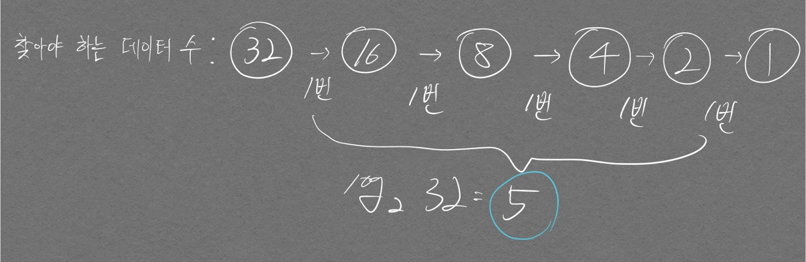

# 수행시간

- 2,000만회 -> 1초
  - 즉 N = 100만개라고 가정하면 NlogN 이하의 알고리즘을 사용해야 시간초과가 안나게 문제를 풀 수 있다. (O(NlogN) = 약 2,000만)

## O(logN)의 의미

이진 탐색 부분을 공부하다가 깨달은 부분을 정리하고자 한다.

이진 탐색을 하게되면 데이터 개수가 32개라고 할 때, 찾아야 하는 영역이 32 -> 16 -> 8 -> 4 -> 2 -> 1 형태로 줄어들게 된다. 여기서 수행시간이 $$ O(logN) $$ 이라고 하는 부분이 잘 이해가 되지 않았는데 아래의 그림을 통해 이해할 수 있다.

<p align="center">  </p>

# 주의해야 할 사항
- 아래 코드는 False를 반환한다.


```python
a = 0.3 + 0.6

if a == 0.9:
    print(True)
else:
    print(False)

# round 처리를 통해 해결한다

if round(a, 1) == 0.9:
    print(True)
else:
    print(False)
```

    False
    True
    1
    

# 리스트

## 리스트 슬라이싱

- [start:end:step]

```python
import numpy as np

arr = np.arange(0,8000).reshape(8, 1000)

for i in arr:
    print(i.shape)      # arr[0]에 접근하면 shape이 (1000,)이 되는것 주목.
                        # 지금보면 당연해 보이지만 간혹 shape(1, 8) 아닌가 하면서 헷갈릴 수 있음
    print(i[0:20:-2])
    break

for i in arr:
    print(i[20:0:-2])
    break

for i in arr:
    print(i[::-1])
    break

for i in arr:
    print(i.argsort()[::])      # index 반환하는 정렬해서 반환하는것 가능
```

```
(1000,)
[]
[20 18 16 14 12 10  8  6  4  2]
[999 998 997 996 995 994 993 992 991 990 989 988 987 986 985 984 983 982
 981 980 979 978 977 976 975 974 973 972 971 970 969 968 967 966 965 964
 963 962 961 960 959 958 957 956 955 954 953 952 951 950 949 948 947 946
 945 944 943 942 941 940 939 938 937 936 935 934 933 932 931 930 929 928
 927 926 925 924 923 922 921 920 919 918 917 916 915 914 913 912 911 910
 909 908 907 906 905 904 903 902 901 900 899 898 897 896 895 894 893 892
 891 890 889 888 887 886 885 884 883 882 881 880 879 878 877 876 875 874
 ...
 117 116 115 114 113 112 111 110 109 108 107 106 105 104 103 102 101 100
  99  98  97  96  95  94  93  92  91  90  89  88  87  86  85  84  83  82
  81  80  79  78  77  76  75  74  73  72  71  70  69  68  67  66  65  64
  63  62  61  60  59  58  57  56  55  54  53  52  51  50  49  48  47  46
  45  44  43  42  41  40  39  38  37  36  35  34  33  32  31  30  29  28
  27  26  25  24  23  22  21  20  19  18  17  16  15  14  13  12  11  10
   9   8   7   6   5   4   3   2   1   0]
[  0   1   2   3   4   5   6   7   8   9  10  11  12  13  14  15  16  17
  18  19  20  21  22  23  24  25  26  27  28  29  30  31  32  33  34  35
  36  37  38  39  40  41  42  43  44  45  46  47  48  49  50  51  52  53
  54  55  56  57  58  59  60  61  62  63  64  65  66  67  68  69  70  71
  72  73  74  75  76  77  78  79  80  81  82  83  84  85  86  87  88  89
  90  91  92  93  94  95  96  97  98  99 100 101 102 103 104 105 106 107
 ...
  928 929 930 931 932 933 934 935
 936 937 938 939 940 941 942 943 944 945 946 947 948 949 950 951 952 953
 954 955 956 957 958 959 960 961 962 963 964 965 966 967 968 969 970 971
 972 973 974 975 976 977 978 979 980 981 982 983 984 985 986 987 988 989
 990 991 992 993 994 995 996 997 998 999]
```

## 리스트 컴프리헨션


```python
array = [i for i in range(1, 20) if i%2 == 1]
array
```


    [1, 3, 5, 7, 9, 11, 13, 15, 17, 19]


- **2차원 행렬** 초기화는 반드시 리스트 컴프리헨션으로 진행


```python
n = 3
m = 4
array = [[0] * m for _ in range(n)]
array
```


    [[0, 0, 0, 0], [0, 0, 0, 0], [0, 0, 0, 0]]


```python
# 아래와 같이 코드를 짤 시 의도치 않은 결과가 나타날 수 있다.
n = 3
m = 4
array = [[0] * m] * n

array[1][1] = 5
array       # 내부적으로 포함된 3개의 리스트가 모두 동일한 객체에 대한 레퍼런스로 인식되기 때문에 3번이나 바뀐다
```


    [[0, 5, 0, 0], [0, 5, 0, 0], [0, 5, 0, 0]]


## 리스트 관련 메서드와 시간복잡도

|메서드명|시간복잡도|
|---|---|
|append()|O(1)|
|sort()|O(NlogN)|
|reverse()|O(N)|
|insert()|O(N)|
|count()|O(N)|
|remove()|O(N)|
|index|O(N)|

- append()와 달리 remove(), insert()의 수행시간이 오래걸린다는 것에 주목
- remove()의 경우 같은 값이 여러개 있는 경우 하나만 지워줌. 이때 전체를 다 지우기 위해선 아래 코드처럼 적용하는게 좋음

- list.index()

```python
col_list = ['a', 'b', 'c', 'd', 'e', 'f', 'g', 'h']     # 리스트에서 특정 element의 index 반환하고 싶을 때 사용
col_coor = col_list.index('c')      # 단 찾고자 하는 원소를 처음 만나면 바로 종료시키므로 O(n)
```


```python
a = [1, 2, 3, 3, 3]
a.remove(3)
print(f'한개 원소만 지워짐 -> {a}')

a = [1, 2, 3, 3, 3, 4, 5]
remove_set = [2, 3]
set = [i for i in a if i not in remove_set]
print(f'2, 3 원소가 모두 지워짐 {set}')

```

    한개 원소만 지워짐 -> [1, 2, 3, 3]
    2, 3 원소가 모두 지워짐 [1, 4, 5]
    


```python
# a = {1:'a', 2:'b'}
a = {'a':'abc', 'b':'ddd'}
print(type(a.values()))
print(type(a.keys()))
print(type(a.items()))
for i,b in a.items():
    print(i)
```

    <class 'dict_values'>
    <class 'dict_keys'>
    <class 'dict_items'>
    a
    b
    

## 집합 자료형
- 중복이 없다
- dictionary와 마찬가지로 순서가 없다
  - dictionary가 특정원소가 존재하는지 검사할 때 O(1) 걸리는 것 처럼 set도 O(1) 이다


```python
print({1,1,2,3,4,5})
```

    {1, 2, 3, 4, 5}
    

## 입출력

### 입력을 위한 전형적인 소스코드

- 여러가지 경우

    ```python
    n = int(input())        # 처음에 입력할 데이터 갯수 입력

    print(list(map(int, input().split())))     # map 함수 반환 type이 map class 이므로 list로 변경해줘야함

    a, b, c = map(int, input().split())     # 오잉, 이렇게 하면 a, b, c의 type이 정수가 됨
                                            # 파이썬의 packing, Unpacking. 아래 설명 참고
    print(a, b, c)
    print(type(a))
    ```

        [4, 2, 1]
        4 4 4
        <class 'int'>
    

- map을 활용해서 값을 입력할 때

    ```python
    a = map(int, input().split())           # 공백으로 여러 값을 넣었다고 가정하면 a 에는 map 객체가 할당됨

    print(a)
    a, b, c = map(int, input().split())     # 공백으로 3개의 값을 넣었다고 가정하면 a, b, c에는 각각 그 값들이 할당됨.
                                            # 할당되는 변수와, 입력값 개수가 일치하지 않으면 에러 발생
    print(a, b, c)
    ```

    ```
    5
    <map object at 0x7f8dc4dd3af0>
    5 8 3
    5 8 3
    ```


2차원 맵을 구성해야 하는데 입력이  
11111  
11111  
11001  
이런식으로 들어오는 상황이 있다면 `list()` 기본 메서드를 사용하는것이 좋다. `list()`는 iterable한 객체를 입력으로 받는데 \`111\` 같은 str 타입 객체는 iterable하다는 것이 핵심이다.

```python
# 핵심코드는 list(input())

n, m = map(int, input().split())        # 맵의 가로, 세로 크기 입력
graph = []

for _ in range(n):
  graph.append(list(map(int, input())))     # 그냥 list(1111)하면 오류남. map(int, input())을 활용해야함
                                            # list() 에는 인자로 iterable한 객체를 넘겨줘야함
```

```
11111
['1', '1', '1', '1', '1']
```

### Packing, Unpacking
- Packing
  - 인자로 받은 여러개 값을 하나의  객체로 합쳐서 튜플로 받음

```python
def func(*args):
    print(args)
    print(type(args))

func("hi", [1, 2, 3])
```

    ('hi', [1, 2, 3])
    <class 'tuple'>

  - Keyword 인자 packing ( ** )
    - 패킹한 인자들을 키워드와 인자 쌍으로 이뤄진 딕셔너리로 관리함


```python
def kwpacking(**kwargs):
    print(kwargs)
    print(type(kwargs))

kwpacking(a=1, b=2, c=3)
```

    {'a': 1, 'b': 2, 'c': 3}
    <class 'dict'>
    

- Unpacking
  - 함수에 인자로 보낼 때 *를 붙여서 보내게 되면 하나의 객체가 풀려서 들어감
  - list와 같은 container 타입이면 모두 unpacking 가능


```python
def sum(a, b, c):
    return a + b + c

numbers = [1, 2, 3]
# sum(numbers) # error

print(sum(*numbers))
```

    6
    

### 출력 모양 조절하기

print 문에서 2가지 인자 sep, end를 통해 원하는 출력형태를 만들 수 있다.

- sep
  - 이 옵션을 통해 print문의 출력문들 사이에 해당하는 내용을 넣을 수 있음. 기본값은 **공백**
- end
  - 이 옵션을 통해 출력을 완료한 뒤 가장 마지막에 해당하는 내용을 넣을 수 있음. 기본값은 **개행(\n)**

- 활용 예시
    ```python
    n = int(input())

    array = []

    for i in range(n):
        array.append(int(input()))

    array = sorted(array, reverse = True)

    for i in array:
        print(i, end=' ')       # 이 코드를 통해 한 줄로 리스트의 모든값을 출력할 수 있다.
    ```

    ```
    3
    15
    27
    12
    27 15 12
    ```

# cin 처럼 빠른 입력을 위한 코드


```python
import sys
data = sys.stdin.readline().rstrip()
data
```


    ''


# 표준 라이브러리
- C++의 STL처럼 Python도 코딩테스트에 사용할 수 있는 표준 라이브러리가 존재한다
- 대표적으로 알아야 할 표준 라이브러리는 다음의 6개이다.
  1. 내장 함수
     - 별도의 Import 없이 바로 사용 가능
     - iterable 객체와 같이 활용 가능
  2. itertools
     - 반복되는 형태의 데이터 처리하는 기능 제공하는 라이브러리
     - **순열(permutations)과 조합(combinations)** 라이브러리가 가장 활용됨
  3. heapq
     - 힙 기능을 위한 라이브러리
     - 다익스트라 최단 경로 알고리즘을 포함해 다양한 알고리즘에서 **우선순위 큐** 기능을 구현하고자 할 때 사용됨
     - 파이썬 힙은 최소 힙(Min head)으로 구성되어 있어서 단순히 원소를 힙에 전부 넣었다가 빼는 것만으로도 시간 복잡도 $O(NlogN)$에 오름차순 정렬이 완료된다.
  4. bisect
     - **정렬된 배열** 에서 특정한 원소 찾야아 할 때 효과적
     - 코드를 조금 응용해서 값이 특정 범위에 속하는 원소의 개수를 찾을 때 효과적
     - 시간 복잡도 $O(log N)$
  5. collections
     - 유용한 자료구조 제공
     - **Deque, Counter** 라이브러리가 가장 활용됨
       - 일반적인 Queue 라이브러리를 구현할 때 Deque를 사용한다. Queue라이브러리가 별도로 있지만 일반적인 queue 자료구조가 아니다
       - 리스트, queue 모두 가장 뒤쪽에 있는 원소의 추가 제거는 $O(1)$ 이지만 앞쪽의 원소의 추가 제거는 리스트의 경우 $O(N)$ 이다. deque는 $O(1)$로 동일하다
       - FIFO 방식으로 구현하면 Queue, FILO 방식으로 구현하면 Stack. 즉 Deque는 Stack을 대체할 수 있다
       - Counter 라이브러리는 iterable 객체가 주어졌을 때 해당 객체 내부의 원소가 몇 번 등장했는지 알려준다
  6. math
     - 팩토리얼, 제곱근, 최대공약수(GCD)등을 계산해주는 기능 포함함

## 내장함수


```python
result = min([1,2,3,4,5])
print(result)

result = eval("(3+5) * 7")   # eval함수는 수학 수식이 문자열 형식으로 들어오면 해당 수식 계산 결과 반영
print(result)

result = sorted([1,52, 5, 21])
print(result)
result = sorted([1,52, 5, 21], reverse=True)
print(result)
result = sorted([('홍길동', 35), ('이순신', 75), ('아무개', 50)], key = lambda x: x[1], reverse=True)       # 이런식으로 lambda와 섞어서 활용도 가능
print(result)
```

    1
    56
    [1, 5, 21, 52]
    [52, 21, 5, 1]
    [('이순신', 75), ('아무개', 50), ('홍길동', 35)]
    

## itertools


```python
from itertools import permutations, combinations

data = ['A', 'B', 'C']
print(list(permutations(data, 3)))      # 3개를 뽑는 모든 경우의 수 -> 순열
print(list(combinations(data, 2)))      # 순서를 고려하지 않고 2개를 뽑는 모든 경우의 수 -> 조합
```

    [('A', 'B', 'C'), ('A', 'C', 'B'), ('B', 'A', 'C'), ('B', 'C', 'A'), ('C', 'A', 'B'), ('C', 'B', 'A')]
    [('A', 'B'), ('A', 'C'), ('B', 'C')]
    

## headpq


```python
import heapq

def heapsort(iterable):
    h = []
    result = []

    # 모든 원소를 차례대로 힙에 삽입
    for value in iterable:
        heapq.heappush(h, value)
    
    # 힙에 삽입된 모든 원소를 차례대로 꺼내서 담음
    for _ in range(len(h)):
        result.append(heapq.heappop(h))

    return result

result = heapsort([1,3,5,7,9,2,4,6,8,0])
print(result)

# 최대힙을 위해서는 부호를 반대로 취해준다
def max_heapsort(iterable):
    h = []
    result = []

    # 모든 원소를 차례대로 힙에 삽입
    for value in iterable:
        heapq.heappush(h, -value)
    
    # 힙에 삽입된 모든 원소를 차례대로 꺼내서 담음
    for _ in range(len(h)):
        result.append(-heapq.heappop(h))

    return result

result = max_heapsort([1,3,5,7,9,2,4,6,8,0])
print(result)
```

    [0, 1, 2, 3, 4, 5, 6, 7, 8, 9]
    [9, 8, 7, 6, 5, 4, 3, 2, 1, 0]
    

## bisect


```python
from bisect import bisect_left, bisect_right

a = [1,2,4,4,8]
x = 4

# 각각 값이 들어가야하는 인덱스 값 반환
print(bisect_left(a, x))
print(bisect_right(a, x))

def count_by_range(data, left_value, right_value):
    left_index = bisect_left(data, left_value)
    right_index = bisect_right(data, right_value)
    return right_index - left_index

data = [1,2,3,3,3,3,4,4,8,9]
print(count_by_range(data, 4, 8))
```

    2
    4
    3
    

## collections

### deque

```python
from collections import deque

data = deque([2, 3, 4])
data.append(1)
data.append(5)

print(data)
print(list(data))
```

    deque([2, 3, 4, 1, 5])
    [2, 3, 4, 1, 5]
    


### Counter

```python
from collections import Counter

counter = Counter(['red', 'blue', 'red', 'green', 'blue', 'blue'])

print(counter['blue'])
print(counter['green'])
print(dict(counter))
```

    3
    1
    {'red': 2, 'blue': 3, 'green': 1}
    

### math


```python
import math

print(math.factorial(5))

print(math.sqrt(7))

print(math.gcd(21, 14))

print(math.pi)

print(math.e)
```

    120
    2.6457513110645907
    7
    3.141592653589793
    2.718281828459045

