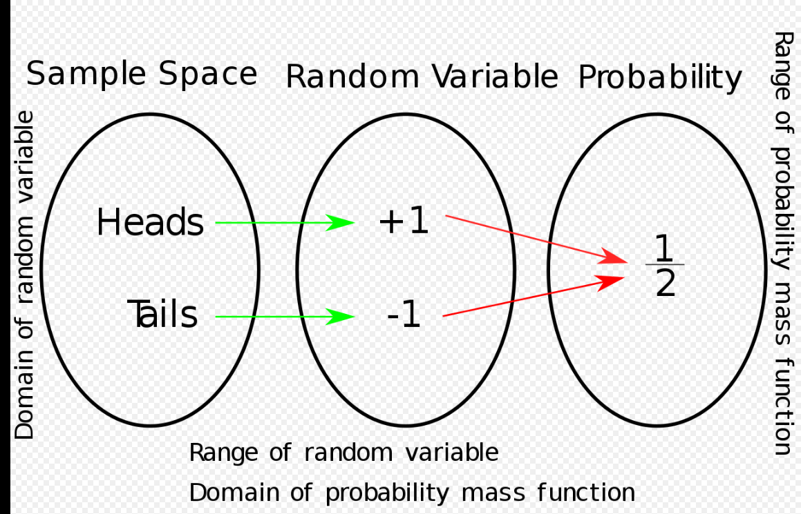
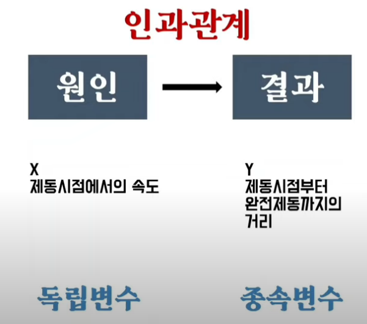

# 평균, 분산, 표준편차 개념잡기


- 위 정규분포 변환 공식의 직관적 이해
    - 데이터 값을 평균으로 빼주면 평균이 0이 된다는것은 받아들여짐
    - 표준편차라는 **값**의 의미는 데이터가 퍼진 정도를 의미함. 이 값으로 평균이 0으로 옮겨진 모든 데이터들을 각각 **나눠주면** 각 데이터들의 상대적 위치 변화는 없고 절대적인 위치의 변화만 이뤄지는 **스케일링** 작업이 된다
        
        
        
    

## 공분산과 상관관계

- 분산: 하나의 변수가 변수의 평균에서 얼마나 멀리 떨어져 있는가?
  - 이때 하나의 변수라는건 하나의 값을 의미하는게 아니라 **가능한 모든 값을 의미**하는 것임. 즉, 모든 값들을 따져봤을 때 얼마나 평균에서 멀리 떨어져 있는가?

- 공분산: 두 개의 변수가 각각의 평균에서 얼마나 멀리 떨어져 있는지를 동시에 살펴보는 것.

    ```python
    def covariance(x, y):
        n = len(x)
        return dot(de_mean(x), de_mean(y)) / (n-1)      # de_mean은 각 element의 편차값 return
                                                        # dot 연산은 각 element를 곱한 후 모두 더함. 즉 scalar 값
    ```
    - 위 코드에서 알 수 있듯 두 x쪽 편차값과 y쪽 편차값 **부호가 동시에 일치할 수록 큰 양의 값이** 나온다.
    - x쪽 편차값과 y쪽 편차값의 **부호가 동시에 다를수록 큰 음의 값이**가 나온다.
    - 하지만 이 공분산 값의 **크기**가 크다고 해서, 더 유사성이 크다고 볼 수는 없다. (두 변수의 공분산을 구한 뒤 한쪽 변수의 모든 값에 *2를 취해보자. 두 변수의 상관관계는 변하지 않지만 공분산 값의 크기는 커지게 된다.)
    - 그래서 각각의 표준편차를 나눠준 **상관관계**가 더 자주 사용된다.
- 상관관계: 공분산 값 에서 각 변수의 표준편차를 나눠준 것
  - 상관관계가 만능은 아님.
    
    ```python
    x = [-2, -1, 0, 1, 2]
    y = [2, 1, 0, 1, 2]
    ```

    - 이 두 변수의 상관관계는 0이지만 분명 절댓값의 관계를 가지고 있다. 상관 관계가 0에 가까울 수록 두 변수 사이의 선형적 관계가 적다는 것을 의미한다. 즉, 비선형적 관계에 대해서는 상관 관계로 분석하는게 무의미 할 수 있다.
    - 상관관계와 인과관계의 단어를 헷갈리지 말자. 상관 관계가 인과 관계를 포함하는 개념이다. 인과 관계는 명백히 원인과 결과로 나뉘어져서 원인이 시간적으로 앞선 사건이 되고 결과가 뒤의 사건이 된다.  가령 흡연과 폐암은 높은 상관 관계가 있지만, 흡연을 한다고 해서 100% 폐암에 걸리는 것은 아니다.
# 확률변수, 확률밀도


## 표준화 수식 심층 이해를 위한 빌드업


**저 노랑거(기댓값, 분산 개념) 궁금하면 아래로 계속 내려가~~**

### 확률분포 이해


이때 확률 변수의 수식은 다음과 같다.  

<p align="center">  </p>
<div align="center" markdown="1">
위 그림은 확률변수를 수식으로 나타낼 때 이해하는데 도움을 준다.

$$ X: S -> R $$

위 표기법은 `함수`를 의미하며, 확률 변수는 즉 함수이다. 왜 그런지 모르겠으면 [여기 참고](/MathNotation/#수학-표기법)
</div>

이때의 확률 질량 함수는 다음과 같이 표기된다.

$$ f_x(x) = Pr(X=x) = Pr({s \in S: X(s) = x})$$


# 사건

## 독립 사건, 종속 사건

- 독립 사건: A, B가 전혀 상관 없는 사건  

$$ P(E, F) = P(E)P(F) $$

- 종속 사건: A의 발생 여부가 B에 영향을 끼치거나 혹은 그 반대의 경우, A와 B를 종속 사건이라고 함
  - 두 개의 동전을 던졌을 때, 하나의 동전이 먼저 떨어져서 앞면이 나온 상태에서, 두 동전이 모두 뒷면이 나오는 경우의 발생 여부는 알 수 있다. 이렇게 사건이 구성되면 종속 사건이 된다.

## 조건부 확률

나를 10년째 괴롭히는 개념이다 ㅋㅋㅋ.  

[여기 블로그 글](https://m.blog.naver.com/PostView.nhn?isHttpsRedirect=true&blogId=sbssbi69&logNo=221213397699)을 참고하여 개념이 예전보다 더 잡힌 것 같다.  

핵심은 경우의 수를 따지는 방법인듯 하다.  

||교통사고 발생일|교통사고 미발생일||
|:---:|:---:|:---:|:---:|
|비 온 날| 14.6일(4%) | 58.4일(16%)|73일(20%)|
|비 안온 날|21.9일(6%)|270.1일(74%)|292일(80%)|
|계|36.5일(10%)|328.5일(90%)|365일(100%)|

<div align="center" markdown="1">
위 표에서 14.6 + 58.4 + 21.9 + 270.1 = 365일 이라는것에 주목하자. 
</div>

- 교통사고, 비 라는 2가지 아이템을 선정하고 사건을 교통사고의 유무, 비의 유무로 나누는 순간 발생할 수 있는 모든 경우는 위 테이블에 나와있다.
  - 사건은 내가 정하는바에 따라서 독립사건이 될 수도 있고, 종속사건이 될 수도 있다. 가령, 동전을 두개 던져서 앞면이 하나 나오는 사건 A, 뒷면이 하나 나오는 사건 B라고 하면 A, B는 독립 사건이다. 하지만 앞면이 하나 나오는 사건 A, 뒷면이 두개 나오는 사건을 B라고 하면 A, B는 종속 사건이다.
- 다시 위 표로 주목해보면, 비가 올 때 교통사고가 발생할 확률을 구해보자. 그러기 위해선 전체 경우의 수가 73일로 한정 되어야 한다. 이미 비는 오는것으로 확정이 나 있는 상태이기 때문에 여기서 확률 계산을 시작해야 한다. 이 73일 중에서 교통 사고가 발생한 경우의 수는 14.6일 즉, $$ 14.6 \over 73$$이 전체 확률이 된다. 이때 반드시 알고 있어야 하는것이, 이 14.6일은 **전체 365일**에 하루씩 봤는데, 우연히 어떤 날에 비도 오고, 교통사고도 난 날이 있어서 하나씩 카운트 한 날의 갯수이다. 즉, 14.6일은 전체 365일 중, 동시에 발생했던 경우의 수를 카운트 한 것이다.

# 회귀 분석

<p align="center">  </p>
<div align="center" markdown="1">
인과관계가 있는 두 변수에 대해서 어떠한 인과관계가 있는지 밝혀내는 것이 바로 **회귀분석**  
</div>

