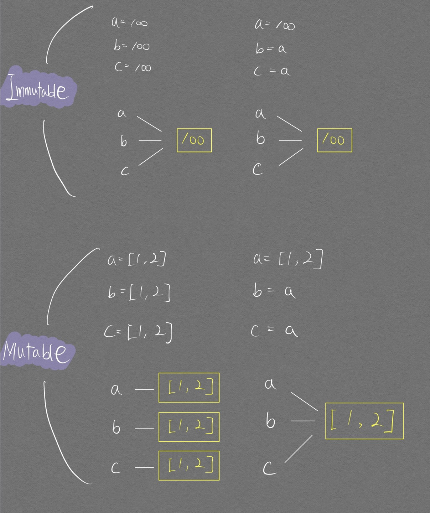

> Python을 잘 다루기 위한 기초 문법 정리용 포스트

# Immutable, Mutable (중요)

<p align="center">  </p>
동일한 객체를 여러 변수들에 할당하는 경우에는 immutable, mutable 모두 동일한 주소값을 갖는다. 그러나 mutable 객체를 가리키는 변수를 이용해 여러 변수에 동시에 영향을 주게끔 객체 <mark>수정</mark>이 가능하다. immutable의 경우에는 수정이 불가하기에 같은 객체를 가리키는 여러변수에 동시에 영향을 줄 수 없다.
{:.info}

- b 변수의 값을 100으로 변경하여도!    메모리에 할당되었으며 99 라는 값을 가진 Immutable **객체**의 `값이 바뀌지 않음`
  - 단지 b라는 변수는 이제부터 새로운 주소의 99라는 값을 가진 Immutable **객체**를 참조함

- arr2 변수의 값을 변경하면!   메모리에 할당되었으며 [1,2,3] 이라는 값을 가진 Mutable **객체**의 `값이 변경됨`

아래 코드를 통해 정확히 이해해보자.

```python
print("Immutable 객체")
a = 99
b = 99
c = 99
d = 99
e = 99

print(hex(id(a)))
print(hex(id(b)))
print(hex(id(c)))
print(hex(id(d)))
print(hex(id(e)))           # 99 라는 객체 하나를 모든 변수가 바라보고 있다

a = 100

print(a, hex(id(a)))
print(b, hex(id(b)))
print(c, hex(id(c)))
print(d, hex(id(d)))
print(e, hex(id(e)))        # a 변수만 100이라는 객체를 바라보기 시작하며 나머지는 그대로 99를 바라보고 있다.
```

```
Immutable 객체
0x7fffbafb6740
0x7fffbafb6740
0x7fffbafb6740
0x7fffbafb6740
0x7fffbafb6740
100 0x7fffbafb6760
99 0x7fffbafb6740
99 0x7fffbafb6740
99 0x7fffbafb6740
99 0x7fffbafb6740
```

```python
print("Mutable 객체")

arr1 = [1, 2, 3]
arr2 = [1, 2, 3]
arr3 = [1, 2, 3]
arr4 = [1, 2, 3]

print(hex(id(arr1)))
print(hex(id(arr2)))
print(hex(id(arr3)))
print(hex(id(arr4)))        # 각각의 변수에 각기 다른 리스트 객체를 바라보고 있다.

arr1 = [1,2,3,4,5]
print(arr1, hex(id(arr1)))
print(arr2, hex(id(arr2)))
print(arr3, hex(id(arr3)))
print(arr4, hex(id(arr4)))  # 모든 변수가 여전히 각기 다른 리스트 객체를 바라보고 있다.
```

```
Mutable 객체
0x1d7d16d89c0
0x1d7d324b340
0x1d7d328f1c0
0x1d7d3227c80
[1, 2, 3, 4, 5] 0x1d7d3227f00
[1, 2, 3] 0x1d7d324b340
[1, 2, 3] 0x1d7d328f1c0
[1, 2, 3] 0x1d7d3227c80
```

하지만 매우 중요한 점은 아래에 있다.
{:.error}

```python
arr1 = arr2

print(hex(id(arr1)))
print(hex(id(arr2)))        

arr1[2] = 9

print("arr1의 원소만 바꿨을 때")
print(arr1, hex(id(arr1)))
print(arr2, hex(id(arr2)))      # arr1, arr2가 동일한 주소를 바라보고 있다.

arr1 = [1,2,3,4,5]

print("arr1에 새로운 mutable 객체를 줬을 때")
print(arr1, hex(id(arr1)))
print(arr2, hex(id(arr2)))      # arr1, arr2가 다른 주소를 바라보게 된다.
```

```
0x1d7d324b340
0x1d7d324b340
arr1의 원소만 바꿨을 때
[1, 2, 9] 0x1d7d324b340
[1, 2, 9] 0x1d7d324b340
arr1에 새로운 mutable 객체를 줬을 때
[1, 2, 3, 4, 5] 0x1d7d32b3ac0
[1, 2, 9] 0x1d7d324b340
```

새로운 Mutable 객체를 할당했을 때는 **arr1, arr2의 주소값이 분리된다**는 것이다. (나는 여태까지 arr1, arr2의 값이 동시에 바뀔 것으로 예상하고 있었다...)  
즉, 완전히 **다른 변수가 된다.**

## 얕은 복사, 깊은 복사

```python
a = [[1], [2]]
b = a[:]

b[0][0] = 5

print(id(a), id(b))    # 다른 주소가 찍힌다
print(a)               # 하지만 a 객체의 내부 객체들이 변경된다.
print(b)               
```

    1673804360192 1673804361344
    [[5], [2]]
    [[5], [2]]

나는 처음에 a[:]를 통해 b 변수에 할당하면 깊은 복사가 되서 b 변수에 할당 되는 것인줄 알았다.  그러나 완전히 잘못 알고 있었다. 핵심은 list안의 객체가 mutable인지 immutable인지를 구분해야 한다.  위 코드와 같이 리스트 안에 리스트로 mutable 객체가 들어있는 경우 그 안의 값들은 원본 객체(a 리스트)안의 객체들을 참조하고 있다.

<p align="center">  </p>

## 아직 해결해야할 고민

- arr1의 원소만 바꾼다면, arr1, arr2의 두 변수는 동일한 **리스트 객체**를 바라보고 있어서 값이 같이 바뀌는 것으로 이해가 된다. 그렇다면 여러 객체를 담을 수 있는 array 성향의 타입이라면 모두 mutable로 봐야 하는가?
  - Tuple이 있어서 그렇지는 않다.
- mutable과 call by reference가 어떻게 다른가?
  - Mutable의 의미는 `수정 가능한` 이라는 뜻이다. 즉, 객체가 수정 가능하면 mutable 객체라고 불린다.
  - Python은 call-by-reference, call-by-value와 달리 call-by-assignment(call-by-object-reference) 이다.
    - 그 이유는 Python은 모든 것을 `객체`로 판단한다는 데에 있다.
      ```python
      a = 'alpaca'    # 'alpaca'라는 객체에 a라는 이름표가 붙은 것
                      # 변수 a가 특정 메모리 공간을 할당받은 컨테이너 개념이 아니라, just 이름표
      ```
    - 위 알파카 객체를 합정역 31번 사물함에 뒀다고 하자
    - 위 알파카 객체에 a라는 이름표를 붙인것이며, b, c등의 여러 이름표가 붙을 수 있지만 알파카 객체의 위치(주소값)은 변하지 않는다.
    - Python에는 global, local로 나눈 2개의 namespace가 존재한다.
    - 즉, 전역 변수를 함수에서 인자로 받아오더라도 함수 내에서는 지역변수(이름표)에 불과하며, 함수 내에서 이름표를 떼서 다른 객체에 붙인다고 한들, 그 이름표는 함수 내에서만 사용하는 이름표일 뿐이다.
      ```python
      def func(arr1):
        arr1 = [1,2,3,4]
        # arr1[1] = 9

      li = [1,2]
      func(li)
      li
      ```

      ```
      [1, 2]
      ```
    - li의 값이 [1, 2]로 유지되는 것을 볼 수 있다. 이는 call by reference였다면 주소값이 가지고 있는 값을 변경시킨 것이기 때문에 위와 같은 출력이 불가능하다.
    - 인자로 가져온 arr1의 mutable 속성 (수정 가능한 속성)을 이용하지 않고 새로운 객체를 할당시킨 것이기 때문에 arr = [1,2,3,4]를 하는순간 li 변수와, arr1 변수의 주소값이 달라진다.

# 리스트 다루기

## 리스트 초기화

리스트는 다음과 같은 형태로 초기화가 가능하다.  

```python
print([0, 1] * 10)
```

    [0, 1, 0, 1, 0, 1, 0, 1, 0, 1, 0, 1, 0, 1, 0, 1, 0, 1, 0, 1]

하지만 `numpy`, `Tensor` 와 같은 타입은 `브로드 캐스팅`{:.error}이 적용된다. 주의하자  

```python
print(np.array([0, 1]) * 10)
print(torch.Tensor([0, 1]) * 10)
print([0, 1] * 10)
```

    [ 0 10]
    tensor([ 0., 10.])
    [0, 1, 0, 1, 0, 1, 0, 1, 0, 1, 0, 1, 0, 1, 0, 1, 0, 1, 0, 1]


## 리스트 슬라이싱

- [start : end : step]
- 주의해야 할 사항
  - step이 작동하는 것은 항상 start에서 시작하며, 방향은 부호로 정해진다. (+: 오른쪽, -: 왼쪽)

```python
stack = ['a', 'b', 'c', 'd', 'e']

print(stack[0:3:-1])    # step이 음의 부호여서 왼쪽 방향으로 진행하는 것인데 start가 0, end가 3까지 이므로 시작하자마자 끝난다.
                        # 그래서 null 반환한다.
print(stack[:3:-1])     # 얘는 step이 음의 부호이기 때문에 잠재적으로 start를 4로 둔다.(뒤에서 부터 시작) 즉, stack[4:3:-1]
```

```
[]
['e']
```

그러므로 step을 활용할 때는 위와같은 코드로 작성하지 않고 아래와 같이 작성하도록 하자.

```python
stack = ['a', 'b', 'c', 'd', 'e']

print(stack[0:3:1])

print(stack[4:-1:-1])
```

```
['a', 'b', 'c']
['e', 'd', 'c', 'b']
```

### numpy 슬라이싱, 인덱싱

단어에 주의해야 한다.

`슬라이싱`{:.warning}: **여러개 원소**를 동시에 가져오는 과정. `:` 부호가 사용된다  
`인덱싱`{:.success}: **원소 1개**를 골라 추출하는 과정. 정수가 쓰인다

- 인덱싱

```python
import numpy as np

a = np.array([[1, 2, 3, 4],
             [5, 6, 7, 8],
             [9, 10, 11, 12],
             [13, 14, 15, 16]])

a[1, 3]   # 8
a[1][3]   # 8
```

위 처럼 두가지 방법의 인덱싱이 가능하나 `a[1, 3]`이 수행시간면에서 빠르기에 권장된다고 한다. (개인적으로 사용하기도 더 쉽다)

numpy는 리스트와 흡사하기 때문에 슬라이싱, 인덱싱이 모두 가능하다.  

중요한 차이점은 `슬라이싱은 차원을 유지하면서 결과를 반환하지만`{:.warning}, `인덱싱은 차원을 자동으로 낮춰서 반환함`{:.success}

```python
import numpy as np

a = np.array([[1, 2, 3, 4],
             [5, 6, 7, 8],
             [9, 10, 11, 12],
             [13, 14, 15, 16]])

print(a[0, 1])     # 인덱싱 2번 적용. 즉 차원이 2번 줄음
print(a[0, 1:2])   # 인덱싱 1번, 슬라이싱 1번 적용. 즉 차원이 1번 줄음
```
    2
    [2]

하지만 아래처럼 리스트 안에서 인덱싱을 할때는 차원 해석을 어떻게 해야하는지 아직 판단이 안섬.  
왜 저렇게 나오는지는 감으로 알겠지만.. 차원이 하나씩 낮아진다던지 등으로 깔끔하게 정리하고 싶은데..

```python
print(a[[1,2], [3,3]])      # 인덱싱 2번 적용으로 생각하고 싶으나 차원은 1번만 줄음
print(a[[1,2], [3]])
print(a[[1,2], 3])
```

    [ 8 12]
    [ 8 12]
    [ 8 12]

## 리스트 컴프리헨션
- if문은 for문의 오른쪽, if-else문은 for문의 왼쪽에서 사용해야 함
    - if문 사용


    ```python
    a = [1,2,3,4,5,6,7,8,9,10]

    b = [i for i in a if i%2==0]

    # if 조건을 and/or로 두 개 이상 쓸 수 있음
    c = [i for i in a if i%2==0 and i%3==0]

    print(b)
    >>> [2, 4, 6, 8, 10]

    print(c)
    >>> [6]
    ```

    - if-else문 사용


    ```python
    a = [1,2,3,4,5,6,7,8,9,10]

    b = [i if i%2==0 else '홀수' for i in a ]

    print(b)
    >>> ['홀수', 2, '홀수', 4, '홀수', 6, '홀수', 8, '홀수', 10]
    ```

# 패키지와 모듈

## 기본 개념

| \_\_init\_\_.py, import, from import 를 설명하기 위한 단락

python 3.3부터는 \_\_init\_\_.py 모듈이 패키지내에 따로 없어도, 패키지로 인식된다. 그럼 이거 꼭 써야할까?  
꼭 그럴 필요는 없다고 생각한다. 그러나, python 하위 버젼과의 호환성이나, 특정 패키지에서 사용하고자 하는 여러 module들을 \_\_init\_\_.py에 모아두는 것이 import 관련 버그 처리나, 협업을 위해 훨씬 좋다고 생각한다.

`모듈`{:.info}: `.py 파일`{:.error}  
`패키지`{:.info}: `디렉토리`{:.error}. 디렉토리 안에 여러개의 모듈을 넣어둘 수 있다.

- `import`를 사용할 때 기억해야 할 점
  - `import` 뒤에 오는 `name`{:.info}을 실제로 사용할 때 항상 그 `name`{:.info}을 **그대로** 사용해 줘야 한다.
    ```python
    import numpy

    numpy.exp([1, 3, 5])    # numpy라는 name을 그대로 사용함
    ```
  - `import`만 사용될 때는 `모듈, 패키지`{:.warning} 만 올 수 있지만 `from`과 같이 연계하여 사용할 경우 `함수, 변수, 클래스`{:.warning}도 올 수 있다.  
  main.py를 작성한다고 가정할 때 아래 코드를 보자
    ```python
    '''파일 구조
    hojun
      | --- game
      | --- | --- fifa.py (여기 스크립트에 fifa_print 함수가 정의되어 있음)
      | --- | --- league.py
    main.py
    '''

    import hojun.game.fifa.fifa_print   # 에러남. import만 사용하는데 함수를 import 하려고 했으므로
    from hojun.game.fifa import fifa_print    # 사용 가능
    import hojun.game.fifa

    fifa_print()    # import 에서 사용한 name이 fifa_print이므로 해당 name을 그대로 사용해 주는 모습
    hojun.game.fifa.fifa_print()    # import 에서 사용한 name을 그대로 사용해주고 추가적으로 함수명까지 사용하여
                                    # 접근 가능
    ```
  - `import`, `from import`가 따로 있는 이유: 함수명 중복 방지  
  아래와 같은 코드는 에러는 나지 않지만 이런 경우가 많아지면 버그 잡기가 어려워짐
    ```python
    from numpy import *
    from math import *

    exp([1, 3, 5])    # numpy 패키지에 존재하는 모듈(혹은 클래스, 변수, 함수)을 의미하는 것인지
                      # math 패키지에 존재하는 모듈(혹은 클래스, 변수, 함수)을 의미하는 것인지 모호함
    ```

  - `import` `패키지`{:.info}

  <div align="center" markdown="1">  지금부터는 \_\_init\_\_.py 에 **명시되어 있는** 참조만 따르겠다.
  </div>

  아래 main.py 코드를 보자. `dir()` 출력 결과를 통해 `hojun` namespace를 사용하면 fifa 모듈, lol 모듈에 접근이 가능함을 알 수 있다.  
    ```python
    '''파일 구조 및 __init__.py, main.py의 소스코드
    hojun
      |---__init__.py
            from . fifa
            from . lol

      |---fifa.py
      |---lol.py
    main.py
      import hojun
      print(dir())
      hojun.fifa.fifa_print()
      hojun.lol.lol_print()
    '''

    import hojun
    print(dir())      # dir() 파이썬 내부 함수는 참조 가능한 namespace를 출력한다.
    hojun.fifa.fifa_print() # __init__.py 에 주목한다.
                            # __init__.py가 from . import fifa 이므로 fifa를 통해 접근할 수 있다.
    hojun.lol.lol_print()

    ```
        ['__annotations__', '__builtins__', '__cached__', '__doc__', '__file__', '__loader__', '__name__', '__package__', '__spec__', 'hojun']
        I'm fifa
        I'm lol
    
  - `from` `패키지`{:.info}` import *`

  <div align="center" markdown="1">  지금부터는 \_\_init\_\_.py 에 **명시되어 있는** 참조만 따르겠다. 단 \_\_init\_\_.py 에서 `__all__ = [module_name]` 로 상위 패키지에서 참조 가능한 모듈을 제한하는 작업이 가능하다.
  </div>

  아래 main.py 코드를 보자.
    ```python
    '''파일 구조 및 __init__.py의 소스코드
    hojun
      |---__init__.py
            from . fifa
            from . lol
            __all__ = ['fifa']    # fifa 모듈만 참조 가능하게 하겠다.

      |---fifa.py
      |---lol.py
    main.py
      from hojun import *
      print(dir())
      hojun.fifa.fifa_print()
      hojun.lol.lol_print()
    '''

    import hojun
    print(dir())
    hojun.fifa.fifa_print() 
    hojun.lol.lol_print()

    ```

        ['__annotations__', '__builtins__', '__cached__', '__doc__', '__file__', '__loader__', '__name__', '__package__', '__spec__', 'fifa']
        I'm fifa
        Traceback (most recent call last):
          File "D:\Work\AINetworks_Tire\Project_Module\LifeOfTire\main.py", line 6, in <module>
            lol.lol_print()
        NameError: name 'lol' is not defined

  - \_\_all\_\_로 보충 설명
    - `*`를 통해 모든 변수, 클래스, 함수를 상위 디렉토리에서 참조 가능하도록 했지만, 그 중에서 공개하길 원치 않는 변수, 클래스, 함수가 존재할 수 있다. 이러한 경우 필터링을 하기 위해 사용된다.  
    ```python
    __all__ = ['add', 'triangle_area']

    from .operation import *
    from .geometry import *
    ```
  
    add, traiangle_area 함수만 상위 패키지에서 접근하여 사용할 수 있게 된다. .gitignore 처럼 필터링 역할을 해준다고 생각하면 편할 듯 하다.


## 경로 에러 처리

Open source를 실행하거나, 내가 코드를 짜면서 여러 모듈들을 import 할 때 No module error가 자주 발생해 정신이 나가곤 한다. 이러한 문제 해결을 위해 다음을 기억하자.

1. `.package`, `..parent_package` 등과 같이 상대 경로(relative path)를 통해 import를 시도하려는 경우 **동일 패키지 안에 속해야 한다**
  - 상위 경로의 다른 패키지에서 모듈을 가져오고 싶다면 `sys.path`를 사용하는 방법뿐인 듯 하다.


# 매직 메서드, 스페셜 변수

`__dict__`, `__call__`과 같이 언더스코어(_)로 묶여 있는 것들을 매직 메서드 혹은 스페셜 변수라고 부른다.

`dir()`를 통해 현재 스크립트에서 사용 가능한 매직 메서드, 스페셜 변수를 확인하거나, `dir(Object)`를 통해 특정 Object에서 실행 가능한 매직 메서드, 스페셜 변수를 확인할 수 있다.

## \_\_dict\_\_

클래스 객체의 속성 정보를 확인하기 위해 사용됨.  
특정 객체에 대해 아래 코드와 같이  
```python
class Test:
  def __init__(self, name):
    self.name = name
    self.test_dict = {'a':1, 'b':2}
    self.test_list = ['1', '2', '3']

test_object = Test("minimal")

print(type(test_object.__dict__))
print(test_object.__dict__)
```
    <class 'dict'>
    {'name': 'minimal', 'test_dict': {'a': 1, 'b': 2}, 'test_list': ['1', '2', '3']}

활용 가능하며, 객체의 속성들을 접근하기 쉽게 **Dict 형태로 변환**해 주는 것이다.

# pip install 옵션

[공식문서의 option 부분](https://pip.pypa.io/en/stable/cli/pip_install/#options)

## -m 옵션

Python 스크립트를 **배포하는 상황**에서 필요하다.  
pip 명령어를 통해 특정 스크립트를 받으면 사용자마다 해당 스크립트가 다운로드 되는 **경로가 달라진다**  
`-m` 옵션을 붙이면 sys.path에 있는 모든 경로를 조사하여 모듈을 받아오기 때문에 사용자는 `pip install`로 특정 스크립트를 받은 후 해당 스크립트가 어느 경로에 다운로드 되었는지 따로 파악할 필요없이 바로 `import [스크립트 이름]`으로 사용 가능하다.