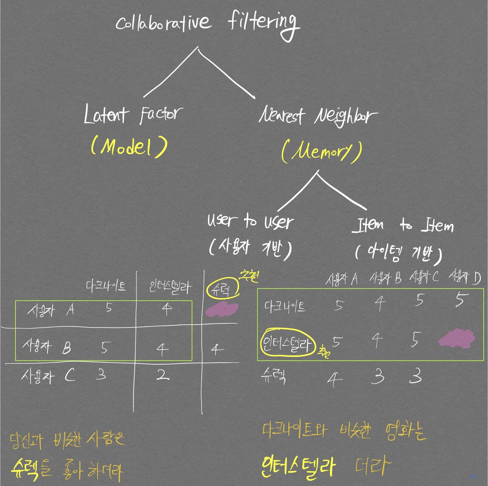
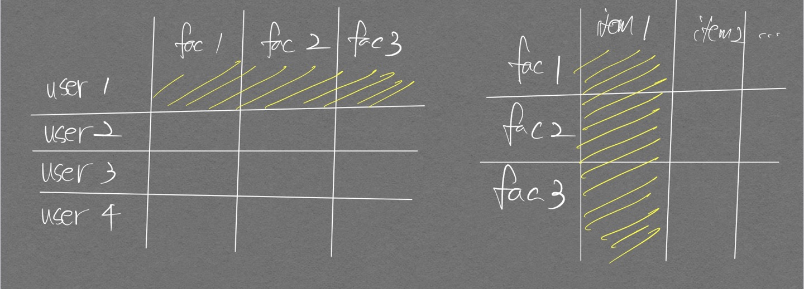

# 구조도

<p align="center">  </p>
<div align="center" markdown="1"> 추천시스템 수업 강의자료 
</div>

<p align="center">  </p>
<div align="center" markdown="1"> 파이썬 머신러닝 완벽가이드 구조도.  
아래 행렬표의 왼쪽 그림이 사용자 기반, 오른쪽 그림이 아이템 기반
</div>

# Content-based filtering
콘텐츠 기반 필터링이다. 추천하고자 하는 아이템이 영화라고 했을 때 콘텐츠는 장르, 평점, 등장인물등 영화를 구성하는 `속성값` 으로 볼 수 있을듯 하다.

## 코드 구현

[TMDB 포스트](/TMDBMovieData)

# Collaborative filtering

가장 많이 사용되는 추천시스템 기법으로, 사용자가 아이템을 매긴 평점 정보나 상품 구매 이력과 같은 **사용자 행동 양식(User Behavior)만을** 기반으로 추천하는 것이다.  

Collaborative filtering은 다음의 두가지로 나뉘게 되며 각 항목별로 설명하고자 한다.
1. Nearest neighborhood: 유저 기반, 아이템 기반으로 다시 나뉜다.
   - `콘텐츠 기반 필터링`{:.info}과 `아이템 기반 협업 필터링`{:.success}의 차이점: 영화를 예시로 들 때, 내 생각에 `콘텐츠 기반 필터링`{:.info}은 콘텐츠들을 활용해 **<span style="color:red">영화</span>간의 similarity를 구해** 사용자에게 영화를 추천해주는 것이고, `아이템 기반 협업 필터링`{:.success}은 User의 영화 평가 정보(User behavior)를 활용해 **<span style="color:red">영화</span>간의 similarity를 구해** 사용자에게 영화를 추천해주는 것인듯 하다. 추가적으로 `유저 기반 협업 필터링`{:.warning}은 User의 영화 평가 정보를 활용해 **<span style="color:purple">유저</span>간의 similarity를 구해** 사용자에게 영화를 추천해주는 듯 하다.
2. Latent factor

## Nearest neighborhood

2가지 방식인 Item-Based, User-Based으로 나뉜다.

### Item-Based

#### 코드 구현
[MovieLens 아이템 기반 협업 필터링 추천 시스템 포스트](/MovieLensItemBasedRecoomendationSystem)

### User-Based

## Latent Factor

[블로그추천](https://www.blossominkyung.com/recommendersystem/collaborative-filtering)

행렬 분해(Matrix Factorization)을 활용해 Collaborative filtering을 구현하는 것을 의미한다.  
`user-item score matrix` 가 있을 때 행렬 분해를 적용하면 비어있는 값들을 채운 `predicted score matrix` 를 만들 수 있게 된다.  
주목할 만한 점은 이때의 `user-item score matrix`는 대부분의 값이 비워져있는 **sparse matrix** 이다.  
행렬 분해를 적용하기 위해 SVD(Singular Vector Decomposition) 방법을 자주 사용하지만 sparse matrix에 대해서 SVD를 바로 적용할 수 없어서 확률적 경사 하강법(Stochastic Gradient Descent)이나 ALS(Alternating Least Squares) 방식을 이용해 SVD를 수행한다.

### 코드 구현
[MovieLens 행렬 분해 잠재요인 협업 필터링 추천 시스템 포스트](/MovieLensItemBasedRecoomendationSystem/#movielens-행렬-분해-잠재요인-협업-필터링)


### 확률적 경사 하강법 적용 SVD

```python
import numpy as np
```


```python
# 원본 행렬 R 생성
# 분해 행렬 P, Q 초기화
# 잠재 요인 차원 K는 3으로 설정
R = np.array([[4, np.NaN, np.NaN, 2, np.NaN],
    [np.NaN, 5, np.NaN, 3, 1],
    [np.NaN, np.NaN, 3, 4, 4],
    [5, 2, 1, 2, np.NaN]])

num_users, num_items = R.shape
K=3

# P와 Q 행렬의 크기를 지정하고 정규 분포를 가진 임의의 값으로 입력
np.random.seed(1)

# np.random.normal 함수는 정규분포를 띄며 scale은 표준편차를 의미함.
P = np.random.normal(scale=1./K, size=(num_users, K))
Q = np.random.normal(scale=1./K, size=(num_items, K))

print(P)
print(Q)
```

    [[ 0.54144845 -0.2039188  -0.17605725]
     [-0.35765621  0.28846921 -0.76717957]
     [ 0.58160392 -0.25373563  0.10634637]
     [-0.08312346  0.48736931 -0.68671357]]
    [[-0.1074724  -0.12801812  0.37792315]
     [-0.36663042 -0.05747607 -0.29261947]
     [ 0.01407125  0.19427174 -0.36687306]
     [ 0.38157457  0.30053024  0.16749811]
     [ 0.30028532 -0.22790929 -0.04096341]]
    


```python
arr = np.array([[1,2,3],[4,5,6]])

print(f"arr: \n{arr} \n")
print(f"arr[[0, 1], [1,2]]: \n{arr[[0,1 ], [1,2]]}")
```

    arr: 
    [[1 2 3]
     [4 5 6]] 
    
    arr[[0, 1], [1,2]]: 
    [2 6]
    


```python
from sklearn.metrics import mean_squared_error

def get_rmse(R, P, Q, non_zeros):
    error = 0
    # 두 개의 분해된 행렬 P와 Q.T의 내적으로 예측 R 행렬 생성
    full_pred_matrix = np.dot(P, Q.T)

    # 실제 R 행렬에서 널이 아닌 값의 위치 인덱스 추출해 실제 R 행렬과 예측 행렬의 RMSE 추출
    x_non_zero_ind = [non_zero[0] for non_zero in non_zeros]
    y_non_zero_ind = [non_zero[1] for non_zero in non_zeros]
    R_non_zeros = R[x_non_zero_ind, y_non_zero_ind]
    full_pred_matrix_non_zeros = full_pred_matrix[x_non_zero_ind, y_non_zero_ind]       # 이런식으로 x좌표를 row 자리에, y좌표를 column 자리에 배치하여 여러 값들에 인덱싱이 가능하다
    mse = mean_squared_error(R_non_zeros, full_pred_matrix_non_zeros)
    rmse = np.sqrt(mse)

    return rmse
```


```python
# R > 0인 행 위치, 열 위치, 값을 non_zeros 리스트에 저장
non_zeros = [(i, j, R[i, j])for i in range(num_users) for j in range(num_items) if R[i, j] > 0]

steps = 1000
learning_rate = 0.01
r_lambda = 0.01

# SGD 기법으로 P, Q 매트릭스 계속 업데이트.
for step in range(steps):
    for i, j, r in non_zeros:
        # 실제 값과 예측 값의 차이인 오류 값 구함
        # P, Q 행렬은 정규분포로 초기화 해둔 상태여서 Null값이 없음
        eij = r - np.dot(P[i, :], Q[j, :].T)        # Q에 대해 전치를 하기때문에 j 변수가 row 인덱스 쪽으로 온다
        # Regularization을 반영한 SGD 업데이트 공식 적용
        P[i, :] = P[i, :] + learning_rate * (eij * Q[j, :] - r_lambda * P[i, :])
        Q[j, :] = Q[j, :] + learning_rate * (eij * P[i, :] - r_lambda * Q[j, :])

        rmse = get_rmse(R, P, Q, non_zeros)
        if (step%50) == 0:
            print("### Iteration step: ", step, "rmse: ", rmse)
```

    ### Iteration step:  0 rmse:  3.261355059488935
    ### Iteration step:  0 rmse:  3.26040057174686
    ### Iteration step:  0 rmse:  3.253984404542389
    ### Iteration step:  0 rmse:  3.2521583839863624
    ### Iteration step:  0 rmse:  3.252335303789125
    ### Iteration step:  0 rmse:  3.251072196430487
    ### Iteration step:  0 rmse:  3.2492449982564864
    ### Iteration step:  0 rmse:  3.247416477570409
    ### Iteration step:  0 rmse:  3.241926055455223
    ### Iteration step:  0 rmse:  3.2400454107613084
    ### Iteration step:  0 rmse:  3.240166740749792
    ### Iteration step:  0 rmse:  3.2388050277987723
    ### Iteration step:  50 rmse:  0.5003190892212748
    ### Iteration step:  50 rmse:  0.5001616291326989
    ### Iteration step:  50 rmse:  0.49899601202578087
    ...
    ### Iteration step:  950 rmse:  0.015972009545965248
    ### Iteration step:  950 rmse:  0.0161070634587959
    ### Iteration step:  950 rmse:  0.016192355609214733
    ### Iteration step:  950 rmse:  0.016447171683479155
    


```python
# P, Q.T 내적 결과 확인.
print(np.dot(P, Q.T))
```

    [[3.99127879 1.38011248 1.22717318 1.99969301 1.63600009]
     [5.90537068 4.97742516 0.85959715 2.98397607 1.00334834]
     [6.15298189 1.22747711 2.9872171  3.97842077 3.98565348]
     [4.97037862 2.00475587 1.00592323 2.00945909 1.34879089]]

전치 행렬 생각할 때는 먼저 인덱싱 부분을 표시한 후 전치를 생각하면 편하다.  
아래 그림 오른쪽 행렬(Q 행렬) 참고.  
<p align="center">  </p>


## Memory based 방식
Similarity를 이용함.  

## Model based 방식
SVD, KNN과 같이 이미 구현되어있는 Model 이용함.