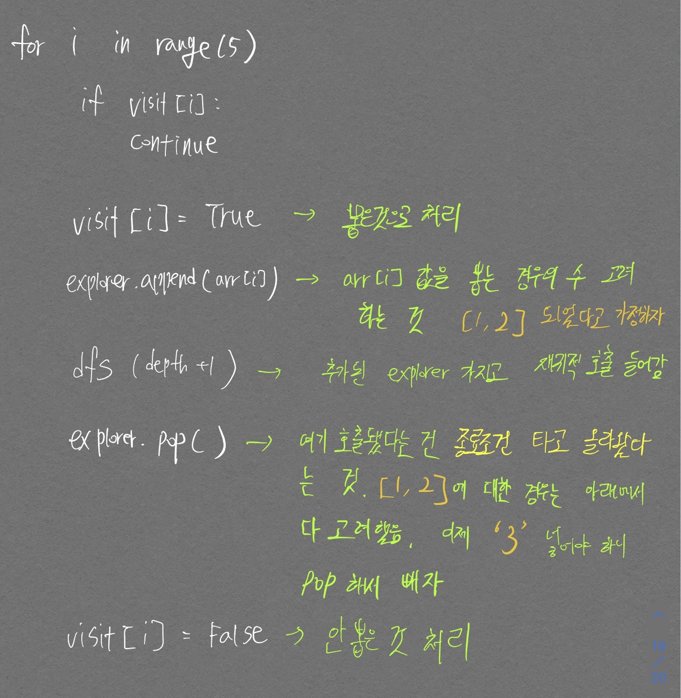
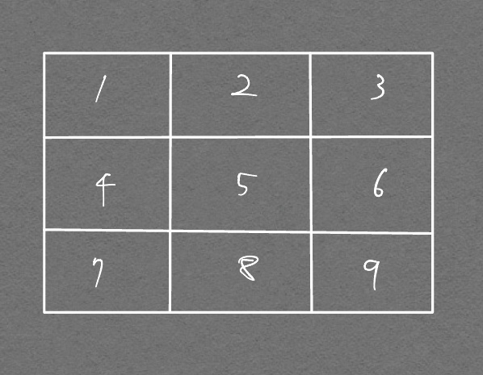
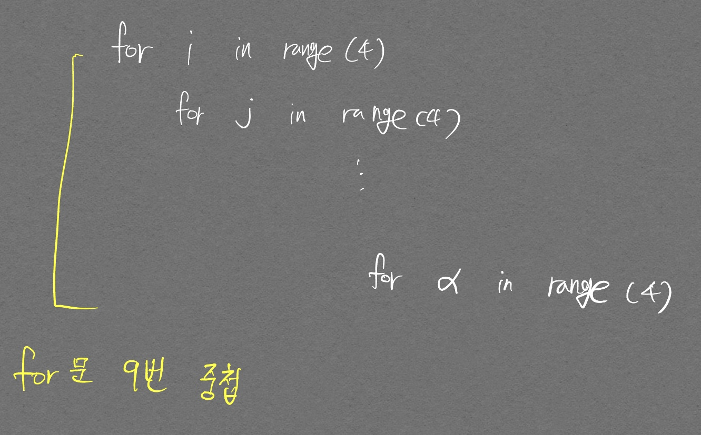
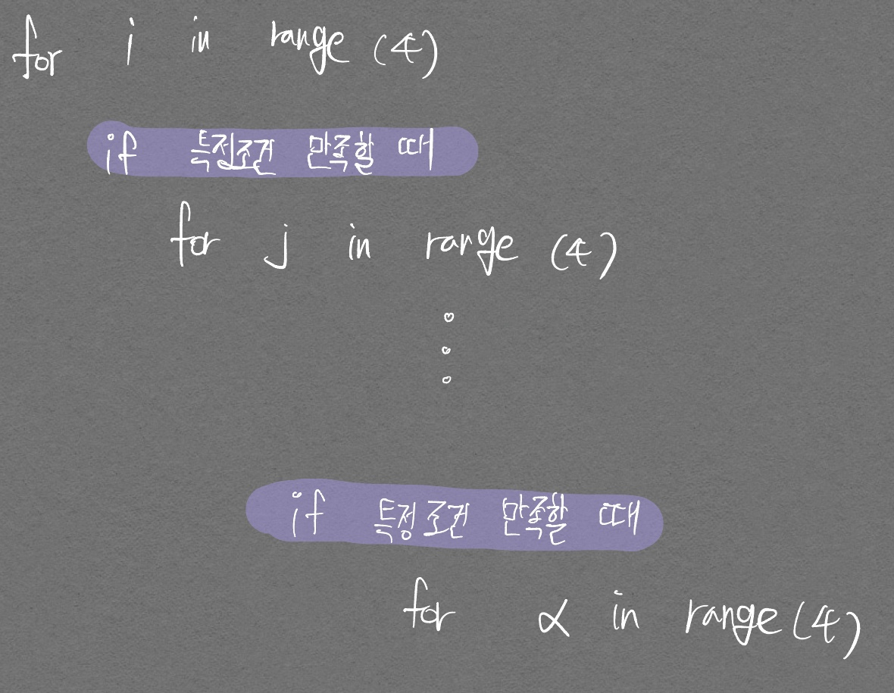
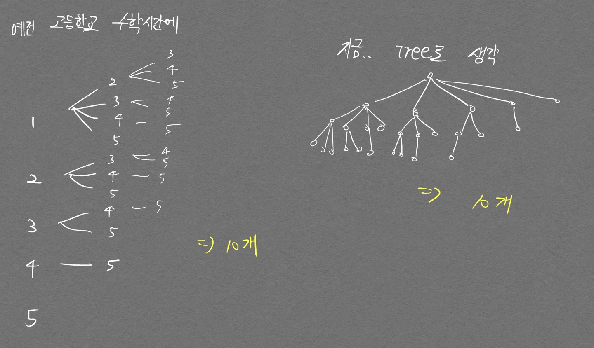

[완전 탐색 및 백트래킹, DFS 개념잡기 좋은 블로그 링크](https://velog.io/@newon-seoul/%EB%AC%B8%EA%B3%BC%EC%83%9D%EC%9D%B4-%EC%A0%81%EC%96%B4%EB%B3%B4%EB%8A%94-%EB%B0%B1%ED%8A%B8%EB%9E%98%ED%82%B9-%EC%9E%AC%EA%B7%80%EC%99%80-DFS-%EB%A5%BC-%EA%B3%81%EB%93%A4%EC%9D%B8)

완전 탐색(Brute-Force), 시뮬레이션을 `구현`{:.error}으로 봄

- 완전탐색: 모든 경우의 수를 주저 없이 다 계산하는 해결 방법
- 시뮬레이션: 문제에서 제시한 알고리즘을 한 단계씩 차례대로 직접 수행하는 방법

실전 문제풀이를 하다보니 내가 완전 탐색에 대한 개념이 잘 잡혀 있지 않은것 같아서 조금 정리해본다.  

완전 탐색의 정의는 다음과 같다.

무식하게 푼다(Brute-force)라는 말로도 쓰이며 가능한 경우의 수를 일일이 나열하면서 답을 찾는 방법
{:.info}

완전 탐색을 구현하는 방법은 여러가지가 있다.
- `if, else`문을 통한 경우의 수 나누기로 다 탐색해보기
- 순열, 조합
- DFS, BFS
- 비트마스크
- 백트래킹

문제를 풀다 보면 순열, 조합을 이용해서 경우의 수를 찾아가는 문제들이 많이 보이는데 같은 문제를 내장함수 `permutations, combinations`를 사용해서 푸는 경우도 있고, 그냥 `if, else`문으로 푸는 경우도 있고, DFS, BFS로 푸는 경우도 있어서 이 기회에 좀 deep 하게 고민해 봤다.  

먼저 단순 `for`문으로 순열과 조합을 표현하는 예시이다.
```python
# 5P3

for i in range(5):
  for j in range(5):
    for k in range(5):
      if i==j or j==k or k==i:
        continue
      print(i, j, k)
```

    0 1 2
    0 1 3
    0 1 4
    0 2 1
    0 2 3
    0 2 4
    0 3 1
    .
    .
    .
    4 3 0
    4 3 1
    4 3 2

```python
# 5C3
for i in range(5):
  for j in range(i+1, 5):
    for k in range(j +1, 5):
      print(i, j, k)
```

    0 1 2
    0 1 3
    0 1 4
    0 2 3
    0 2 4
    0 3 4
    1 2 3
    1 2 4
    1 3 4
    2 3 4

이제 이 순열, 조합을 단순 `for`문이 아닌 `DFS` 방법으로 구현해보자.  

```python
visit = [False] * 5
num = 0
def dfs_permutation(depth):
    global num

    if depth == 3:
        print(explorer)
        num += 1
    
    for i in range(5):
        if visit[i]:
            continue

        visit[i] = True
        explorer.append(arr[i])
        dfs_permutation(depth+1)
        explorer.pop()
        visit[i] = False

dfs_permutation(0)
print(num)
```

    0 1 2
    0 1 3
    0 1 4
    0 2 1
    0 2 3
    0 2 4
    0 3 1
    .
    .
    .
    4 3 0
    4 3 1
    4 3 2

순열의 핵심은 경우의 수를 뽑을 때 순서는 상관있고, 앞에서 뽑았으면 뒤에서 같은 수를 못 뽑는것을 고려하면 된다. 앞에서 뽑은것은 `visit` 변수로 처리해주고 DFS의 매 순간 `explorer`에 값 하나를 넣고 종료조건 까지 들어가므로, 종료조건을 나왔을 때 다음 경우를 위해 `explorer.pop()`으로 한칸 비워줘야 한다.

<p align="center">  </p>

조합의 경우는 오히려 더 간단하다. 조합이 `for`문으로 어떻게 구현되었는지를 생각하고, 그 logic을 `DFS`에 녹여내는 것이다.  

```python
explorer = []

arr = [0, 1, 2, 3, 4]

def dfs_combination(idx):
    if len(explorer) == 3:
        print(explorer)
        return
    
    for i in range(idx, 5):
        explorer.append(arr[i])
        dfs_combination(i+1)
        explorer.pop()

dfs_combination(0)
```

    [0, 1, 2]
    [0, 1, 3]
    [0, 1, 4]
    [0, 2, 3]
    [0, 2, 4]
    [0, 3, 4]
    [1, 2, 3]
    [1, 2, 4]
    [1, 3, 4]
    [2, 3, 4]


중복 조합의 경우에는 위 logic에서 딱 하나만 생각하면 된다. **중복을 허용한다.**

그래서 다음 `dfs`를 호출할 때 `i+1`이 아닌 현재의 idx `i`를 넘겨주면 된다.

```python
N = 5
explorer = []
arr=[0, 1, 2, 3, 4]
cnt = 0

def dfs(depth, idx):
    global cnt

    if depth == 3:
        print(explorer)
        cnt+=1
        return 

    for i in range(idx, N):
        explorer.append(arr[i])
        dfs(depth+1, i)
        explorer.pop()

dfs(0, 0)
print(cnt)
```

    [0, 0, 0]
    [0, 0, 1]
    [0, 0, 2]
    [0, 0, 3]
    [0, 0, 4]
    [0, 1, 1]
    [0, 1, 2]
    [0, 1, 3]
    [0, 1, 4]
    [0, 2, 2]
    [0, 2, 3]
    [0, 2, 4]
    [0, 3, 3]
    [0, 3, 4]
    [0, 4, 4]
    [1, 1, 1]
    [1, 1, 2]
    [1, 1, 3]
    [1, 1, 4]
    [1, 2, 2]
    [1, 2, 3]
    [1, 2, 4]
    [1, 3, 3]
    [1, 3, 4]
    [1, 4, 4]
    ...
    [3, 3, 4]
    [3, 4, 4]
    [4, 4, 4]
    35


# 상하좌우 문제
> P 110쪽

- 내 풀이


```python
n = input()
n = int(n)
arr = input().split()

x, y = 1, 1

for command in arr:
  if command == 'L' and 0 < x-1 < n + 1:
    x-=1

  elif command == 'R' and 0< x+1 < n + 1:
    x += 1

  elif command == 'U' and 0 < y-1 < n + 1:
    y-=1

  elif command == 'D' and 0<y+1 < n + 1:
    y+=1

print(y, x)
```

- 이 문제는 서적 코드보다 내 코드가 훨씬 간결한듯 해서 따로 기재는 안하겠다.


# 시각 문제
> P. 113쪽


- 내 풀이 (못 풀었음)


```python
N = int(input())

import time as t

sec='00'
min='00'
time='00'

count = 0

while(True):
    
  if sec == '60':
    sec = '0'
    min = str(int(min) + 1)

  if min == '60':
    min = '0'
    time = str(int(time) + 1)

  if int(time) == N+1:
    break

  if time[0] or time[1] or min[0] or min[1] or sec[0] or sec[1] == '3':
      print(time+' ' + min + ' '+ sec)
      count += 1

  
  sec = str(int(sec) + 1)  
  
print(count)
```

- 굉장히 문제가 많은 코드
  - if문 뒤 or 연산을 저따구로 쓰고있는 코딩 할 줄 모르는 내 자신의 모습을 보고있다...
     - 내 의도는 모든 자리중 하나라도 '3'이 있다면 count += 1 을 진행하기 위함이었지만 아주 초보자 같은 코드를 짜버렸다
     - 비교연산자 == 는 or 보다 우선순위가 높기 때문에 sec[1] == '3'이 우선으로 계산된다
     - or 연산은 앞에서 한번이라도 True가 나오면 그 뒤에 연산은 진행하지 않는다
       - sec[1] == '3' 이 진행된 이후 time[0]이 True인지 False인지 확인하게 된다. 이때 time[0]에는 항상 값이 존재하므로 True가 되며 이후 time[1]부터는 조회를 하지 않기 때문에 time 변수에 1자리 str이 들어있어도 **값 조회 자체가 안되서** Index error가 발생하지 않는다
       - 비슷한 논리로 and 연산자는 하나라도 False가 발생할경우 뒤의 값들을 조회하지 않고 바로 False 처리 한다

- 두번째 도전

```python
n = input()
n = int(n)

count = 0

for hour in range(n+1):
  for min in range(60):
    for sec in range(60):
      check = str(hour) + str(min) + str(sec)
      if '3' in check:
        count+=1

print(count)
```

  - 7분만에 해결하였음. **Time 이라는 것은 가장 밑에서부터 체계적으로(정해진 규칙에 따라) 올라가는 Logic 이다. 즉 3중 반복문을 사용한다**


# 왕실 나이트 문제

> p 115

- 내 풀이


```python
position = input()

row_list = [1,2,3,4,5,6,7,8]
col_list = ['a', 'b', 'c', 'd', 'e', 'f', 'g', 'h']

count = 8

row_coor = int(position[1]) - 1
# col_coor = [idx for idx,i in enumerate(col_list) if position[0] == i][0]
col_coor = col_list.index(position[0])

move = [(-1, -2), (-2, -1), (-2, 1), (-1, 2), (1, 2), (2, 1), (2, -1), (1, -2)] # y 움직인 것, x 움직인 것

for (dy, dx) in move:
  if (row_coor + dy) < 0 or (row_coor+dy) > 7 or (col_coor + dx) < 0 or (col_coor+dx) > 7:
    count -= 1

print(count)
```

- 처음에 문자열과 정수형이 섞인 input에서 모두 정수값을 뽑는데 시간을 좀 썼음..
  ```python
  # 해괴한 코드 완성..
  col_coor = [idx for idx,i in enumerate(col_list) if position[0] == i][0]
  ```

  - 위 코드 처럼 list.index를 활용하면 훨씬 간편해질 수 있었음

- 책 풀이

```python
# 현재 나이트의 위치 입력받기
input_data = input()
row = int(input_data[1])
column = int(ord(input_data[0])) - int(ord('a')) + 1

# 나이트가 이동할 수 있는 8가지 방향 정의
steps = [(-2, -1), (-1, -2), (1, -2), (2, -1), (2, 1), (1, 2), (-1, 2), (-2, 1)]

# 8가지 방향에 대하여 각 위치로 이동이 가능한지 확인
result = 0
for step in steps:
    # 이동하고자 하는 위치 확인
    next_row = row + step[0]
    next_column = column + step[1]
    # 해당 위치로 이동이 가능하다면 카운트 증가
    if next_row >= 1 and next_row <= 8 and next_column >= 1 and next_column <= 8:
        result += 1

print(result)
```

- 코드 분석
  ```python
  column = int(ord(input_data[0])) - int(ord('a')) + 1
  # ord는 입력된 문자의 unicode 정수를 반환함
  # crd는 입력된 unicode 정수의 문자를 반환함
  ```

  - 위와 같은 방식으로 문자를 정수로 치환할 수 있다
  - 전반적으로 logic은 거의 같음

# 구현 피지컬 올리기

<hr>
코딩 능력에 선천적인 재능이 없는듯 하여 후천적 노력으로 발전시키고자 한다...  
분명 머리는 나쁜게 맞는데 게임은 랭커까지 가고... 뭘까 나란 사람;;
<hr>

## 조건문 걸 때 모두 동일한 Logic으로!

투 포인터를 공부한 후 며칠 뒤 다시 투 포인터를 혼자 구현해보려고 처음에 짠 코드다.

```python
n=10
data = [1,2,3,4,2,5,3,1,1,2]

start, end = 0, 0
m = 5

sub = 0
answer = 0

while start < n and end < n:
    if sub == m:
        answer += 1
        end += 1

    elif sub < m:
        sub +=data[end]
        end += 1

    else:
        sub -= data[start]
        start += 1
```

    7

정답은 3인데 출력이 7이 나온다. 내가 위 코드를 짠 흐름은 다음과 같다.  
1. start, end를 `while`문을 통해서 범위를 지정
2. `elif`, `else` 순으로 먼저 구현했음. 가장 초기에 `sub = 0` 에서부터 시작하는걸 생각해서, `sud+= ~` 이후 인덱스 조정하는 방식 선택
3. `if`문 구현. answer 값 올리고, 인덱스 조정하는 방식 선택

위 코드의 문제점이 뭘까?

if 문들의 logic을 동일하게 유지하지 않았다는 것이다.{:.error}

`elif, else`은 현재 인덱스값을 더하고, 인덱스를 조정하고 있으면서, `if`문에선 인덱스 조정만 하고 있다. 역시나 현재 인덱스값을 `sub`에 처리해주는게 필요하다.

어떻게 하면 정답이 나올지는 미래의 내가 다시 생각해보자.

# 완전탐색 시간복잡도 편건 깨기(중요)

DFS, BFS 관련 문제를 풀다보면 아래와 같이 map을 탐색하는 문제가 자주 나온다.

<p align="center">  </p>

나는 이와 같은 문제를 DFS 코드로 방문처리 하기 위해 다음과 같이 코드를 짰다.

```python
n = int(input())
graph = [[0 for _ in range(n)] for _ in range(n)]
visit = [[False for _ in range(n)] for _ in range(n)]

dx, dy = [-1, 0, 1, 0], [0, 1, 0, -1]

cnt = 0
answer = 0

def dfs(x, y):
    global cnt, answer
    # 방문 처리
    visit[x][y] = True
    answer += 1

    for i in range(4):
        nx, ny = x + dx[i], y + dy[i]
        cnt += 1
        if 0<= nx < n and 0<= ny < n and not visit[nx][ny]:
            dfs(nx, ny)

dfs(0, 0)
print(cnt)
```

나는 위 코드의 `cnt` 변수가 $$ 4^9 $$의 값이 나올 줄 알았으나, 36이 나오는 것을 보고 당황했다.

처음에 난 다음과 같이 생각했다.

<p align="center">  </p>
<div align="center" markdown="1">
DFS가 9번 호출되니 `for`문이 9번 중첩되는구나.
</div>

굉장히 그럴사한 **이 편건을 깨야한다...**

아래와 그림과 같이 생각해야 한다.

<p align="center">  </p>
<div align="center" markdown="1">
`for`문이 9번 중첩되는 구조는 맞으나, 각 `for`문은 **사전 조건(방문 안 되었을때)을 만족할 때만 돌아갈 수 있다.**
</div>

그래서 단순히 9번 중첩된 `for`문에 비해 **경우의 수가 훨씬 줄어들 게 되는것이다.**

# DFS 시간복잡도 계산하기 예시

[백준 11053 문제](https://www.acmicpc.net/problem/11053) 문제를 풀다가 완전 탐색으로 풀면 시간 초과가 날지 한번에 판단되지 않았다. 이를 한번에 판단하기 위해 다음의 쉬운 경우를 한번 보자.

서로 다른 5개의 숫자 중 3개를 뽑는 경우의 수를 DFS로 구현할 때 시간복잡도가 어떻게 될 것인가?

<p align="center">  </p>

따라서 위 문제는...