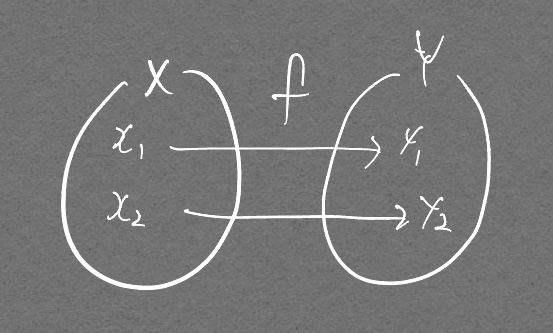

# 수학 표기법
> 생략되거나 해석이 어려운 수학 표기법 정리

# $$ f: X -> Y $$

  

위 그림을 어떻게 표기하는가에 대
예전부터 봤을 기호지만, 깊게 생각하고 넘어간적이 없어서 확률쪽을 공부할 때 약간 애를 먹었던 기호다.  
함수 = `Relation` 라는 것을 핵심으로 생각하고 다음의 표현법을 기억하자.  

$$ f: X -> Y $$

위 기호의 정확한 정의는 X의 원소 x마다 Y의 유일한 원소 y가 **하나씩 대응되는 것**이다.

## $$ \sum $$

- 어디까지 index가 진행될지 생략되었으며, 이중으로 시그마 기호가 나왔을 때  $ g[i, j] = {1 \over W_s} \sum_m \sum_n f[m, n]n_{\sigma_s}[i-m, j-n] $ (bilateral filter 수식)
  - m, n이 가능한 접근 가능한 모든 경우를 생각하면 됨
  - inner 시그마부터 생각하면 됨 (이중 반복문!)
