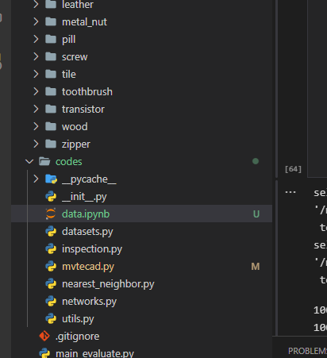
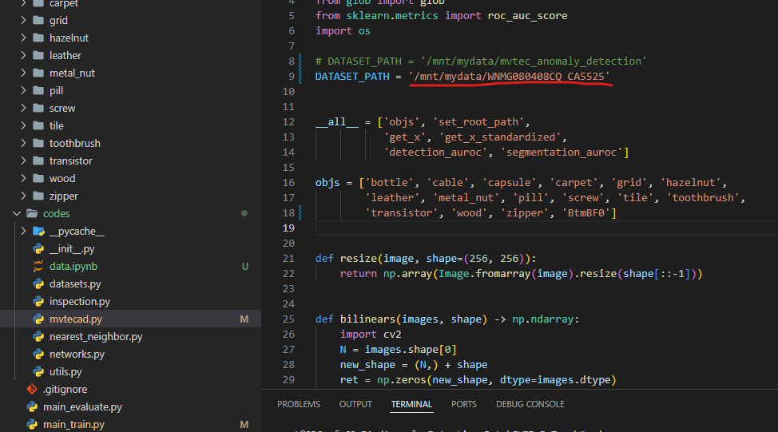

# 데이터 분석

    

## 레이블 해석
- 파일 이름은 3구간으로 나눌 수 있음
  - Top or Btm: 위 혹은 아래에서 촬영한 이미지임
  - BF or CX or DF or BL: 조명값을 다르게해서 4번 촬영함
  - 0 or 1 or 2 or 3: 제품에서의 촬영 위치

- 레이블 정보 해석
  - GroundTruth=0.000: 정상, GroundTruth=1.000: 비정상
  - Blob_num_at_BF: BF 이미지에서의 바운딩박스 갯수
  - Defect0_TrueDefect=1.000, Defect0_Classification=1.000: Defect가 존재하며 종류는 `부착`
  - Blob0_Pixel_num_BF: BF 이미지에서의 바운딩박스의 픽셀 갯수

## 문제점

- 학습에 사용 가능한 비정상 데이터의 갯수가 정상 데이터에 비해 매우 적음 (Class Imbalanced)
- 이미지의 resolution에 비해 결함 영역이 굉장히 적음(픽셀 단위로 봐야하며 결함 영역에 해당하는 픽셀수가 매우 적음. 약 20픽셀 정도)
- 결함 영역에 대한 Bounding box + Classification => Detection 처리를 해줘야 하기 때문에 Task 난이도가 상당히 높은걸로 보임

# 접근 방향

부족한 학습 데이터의 현 상황을 고려하여 학습용 레이블 없이 일정 성능을 낼 수 있는 비지도 학습 방식으로의 접근방식 고려
- [self-supervised learning](/Self-Supervised) 방식을 통한 데이터 자체의 이해도 향상을 통해 Anomal detection 성능을 높이고자 함

## 관련 소스
1. [awesome-anomaly-detection](https://github.com/hoya012/awesome-anomaly-detection)
   - Anomaly detection 관련하여 높은 성능 및 관련 코드 링크를 제공해주는 Github Repository
2. Patch SVDD: Patch-level SVDD for Anomaly Detection and Segmentation
   - Deep SVDD, Patch-level의 self-supervised learning 방식을 통해 이상 영역 localization 진행
3. Constrained Contrastive Distribution Learning for Unsupervised Anomaly Detection and Localisation in Medical Images
   - 이상 영역 segmentation (아직 좀 더 논문 분석 필요)
4. FastFlow: Unsupervised Anomaly Detection and Localization via 2D Normalizing Flows
   - 최근 나온 여러 딥러닝 모델들 중 MVTecAD 데이터셋에서 가장 높은 성능을 기록한 SOTA(State-Of-The-Art) 코드
   - [anomalib](https://github.com/openvinotoolkit/anomalib/tree/feature/fastflow) 오픈소스 라이브러리를 통해 접근 가능

## mmdetection 사이트

- patch 단위로 inference가 가능하게끔 API를 제공해줌
[SAHI: Slicing Aided Hyper Inference](https://github.com/obss/sahi/tree/main)

# PatchSVDD 실험 진행

## 실험 환경
- Docker + WSL2
- Python: 3.7
- Torch: 1.10.0
- 특이사항: 리눅스 환경에서만 작동시킬 수 있는 라이브러리가 존재하여 `Docker + WSL2` 구성으로 이를 해결함

## 코드 및 폴더 설명

  

도커 컨테이너에서 실험 진행중이며 data.ipynb 파일로 데이터 전처리 작업 진행중

  

mvtecad.py 파일의 경로를 수정하여 작업 진행중이며, 현재 png 파일이 아닌 bmp 파일로 처리함으로 인해 dimension을 강제로 껴맞추는 코드로 돌리는 중임. 향후 수정 필요할 듯.

## 실험 방향

### 조그만 부분 detecting을 위한 cropping 실험

비정상 부분의 주변을 학습데이터로 추출한뒤 학습 진행 후 원할하게 검출하는지 실험 진행.

현재 300epoch으로 학습 진행 후 AnomalyMap을 산출하였으며, 조그마한 crack도 anomaly로 어느정도 잡고 있음을 보였다.  
전반적으로 정상으로 보이는 데이터에 대해서도 anomaly가 높은 것들이 존재하여 아직 많은 작업이 필요할 것으로 보인다.  

이미지는 계약 관계상 올릴 수 없어서 이렇게 말로 풀어쓴다..
{:.error}

- [x] 서버(inha bridge)에 실험결과 업로드
- [x] Anomalib 활용하여 좌표값 반환, Patch Core 학습 시키기
- [ ] 먼지 Detecting에 우선적으로 Focusing  
  - [x] txt 파일 읽어서 어떤 txt파일에 특정 class 있는지 파악 하는 코드 구현함 

### Anomalib을 활용한 PatchCore 모델 실험

- [x] PatchCore 모델 원본데이터, Cropping 데이터 학습 시키고 경과 보기.
- [x] Masking을 통해 특정 부분 데이터 추출할 수 있는 코드 만들기.
- [ ] 레이블 정보를 활용하여 MvTec 데이터 포맷으로 만들어주는 코드 작성

### 윤곽선(Contour) 추출 실험

[간단 예시](https://ansan-survivor.tistory.com/642)  
[심화 예시](https://learnopencv.com/contour-detection-using-opencv-python-c/)

### IOU 기반의 Metrics 코드 작성

[jaccard_similarity_score](https://scikit-learn.org/stable/modules/generated/sklearn.metrics.jaccard_score.html)  