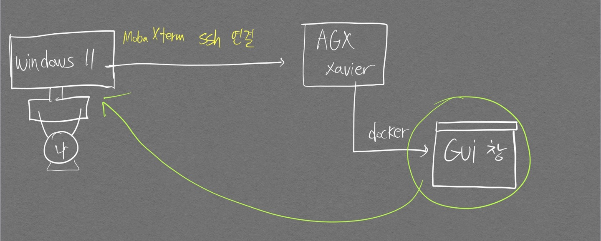

# 기본 활용법

## 이미지

### 이미지 받아오기, 실행하기

- [dockerhub 사이트](https://hub.docker.com/)에서 `RepositoryName:Tag` 를 통해 가져올 수 있다.

    ```bash
    # ros(melodic) 관련 이미지 받아옴. RepositoryName:Tag 혹은 ImageID로도 가능
    docker pull [저장소이름:tag or 이미지ID]
    ```
- 이미지를 Local에서 찾고, 없는 경우 Docker hub에서 해당 이미지 Pull해서 실행까지 하길 원하는 경우 `docker run` 명령어를 통해 진행할 수 있다.

    ```bash
    # 받아온 ros 이미지를 통해 컨테이너 생성. 하지만 이렇게 생성할 경우 실행되자마자 바로 컨테이너가 종료됨.
    # docker run 명령어는 docker pull, docker create, docker start를
    # 순차적으로 실행하는 것과 같다.
    docker run [저장소이름:tag or 이미지ID]
    ```
- 그래픽 카드와 연계하면서, 종료되지 않고 Docker 환경에서 계속 작업하길 원한다면 `-it --gpus all` 옵션 추가
- `--name` 옵션을 통해 사용자만의 이미지 name을 지정하여 생성된 컨테이너를 쉽게 다룰 수 있다.

    ```bash
    # 종료되지 않고 계속해서 docker 환경에서 작업하길 원하면 -it 옵션 추가.
    # gpu도 컨테이너 상에서 사용하고 싶다면 --gpus all 옵션 추가.
    # --name 옵션을 통해 나만의 컨테이너 index를 만들 수 있음.
    # 시작 위치는 /bin/bash
    docker run -it --gpus all --name[지정하고 싶은 이름] [저장소이름:tag or 이미지ID] /bin/bash
    ```

- 처음 실행된 Container에서 Git 설치하려면 다음과 아래 명령어를 입력하자

    ```bash
    # 새롭게 열린 docker 컨테이너의 vscode 창에서 터미널을 열고
    apt-get install sudo

    # git install
    sudo apt-get install git
    sudo apt install git

    # version check
    git --version
    ```

# 컨테이너

## 생성만 되어있는 컨테이너 실행하기
```bash
docker start -it --gpus all --name "CONTAINER NAME or CONTAINER ID"
```

## 현재 실행중인 컨테이너 작동시키기

```bash
docker attach "CONTAINER ID" /bin/bash
            or
docker attach "CONTAINER NAME" /bin/bash
```

## 컨테이너 및 이미지 삭제하기

```bash
docker rm [image id] or [container id]
```

## DockerHub에 작업한 것 저장하기

```bash
# 현재의 컨테이너 상태를 이미지로 만들기
docker commit "CONTAINER ID" "원하는 IMAGE ID"

# 이미지 잘 올라갔는지 확인
docker images

# docker user id 변수 지정해두기 (docker hub ID로 해야함. 권한 오류 해결)
export DOCKER_ID_USER="ghwns1102"

# 태그 변경
docker tag "아까만든 IMAGE ID" $DOCKER_ID_USER/아까만든 IMAGE ID

# 태그 적용되어 있는 Image를 Dockerhub에 push
docker push $DOCKER_ID_USER/아까만든 IMAGE ID
```

## 이미지, 컨테이너 조회하기

```bash
# 옵션이 없다면 현재 실행중인 컨테이너 정보만 조회
# 모든 컨테이너 정보 보려면 --all 옵션 추가
docker container ls -a

# 이미지 정보 조회
docker image ls -a
```

## 컨테이너 이미지화 하기
현재 작업중이던 컨테이너를 이미지화 하여 새로운 컨테이너를 생성하는 작업을 한다던가, DockerHUB에 올리는 작업이 가능하다.

```bash
# -m 옵션으로 메세지 추가 가능(기존의 컨테이너에서 어떤 작업을 진행하였는지 기록하면 협업할 때 좋음)
# 작업중이던 컨테이너 id, 만들고자 하는 이미지 name을 입력한다
docker commit -m "Add shared volume" 492b17f283f1 patchsvdd
```


## 볼륨 추가하기

호스트 파일을 활용한다거나, 컨테이너에서 작업한 데이터를 외부에 따로 저장하고 싶을 때 호스트의 디렉토리를 접근할 수 있는 폴더 생성이 가능하다.  
작업중이던 컨테이너에 볼륨을 추가하고 싶은 경우는 현재 작업중인 컨테이너를 멈추고 이미지화를 한 뒤, 볼륨을 추가시키면서 새로운 컨테이너를 생성해야 한다.  
이미지화 하는 방법은 위의 [컨테이너 이미지화 하기](#컨테이너-이미지화-하기) 참고

```bash
# -v 옵션뒤에 호스트 경로를 입력해준 후, :를 통해 구분하고 그 이후 컨테이너 상에서 호스트 경로를 접근할 디렉토리를 지정(생성)한다.
# --shm-size는 공유메모리를 확보하기 위함이다. (없으면 Pytorch 코드 돌릴 때 메모리부족 에러 발생)
docker run -it -v [host 경로:Docker 컨테이너 내부 경로] --gpus all
--shm-size=400gb --name ["원하는 닉네임"] [저장소이름:tag or 이미지ID] /bin/bash
```

## GUI 사용하기

```bash
# 최초로 실행해줘야 하는 명령어
# xhost + [ip주소] 를 치면 이제부터 local 화면에서 remote ip주소 컴퓨터에서 출력하는 gui를 볼 수 있음
xhost +local:docker

# GUI 기능 추가
docker run -it -v /tmp/.X11-unix:/tmp/.X11-unix -e DISPLAY=$DISPLAY --name [지정하고 싶은 이름] [저장소이름:tag or 이미지ID]

# 실행된 컨테이너에서 아래 명령어 입력을 통해 관련 패키지 다운로드
apt-get update
apt-get install x11-apps

# gui 작동 테스트 (성공하면 마우스 포인터를 따라다니는 눈 애니메이션 나옴)
xeyes
```

### 로컬 컴퓨터에서 ssh로 Xavier 연결하여 개발 쉽게하기

Xavier에서 직접 구글링을 해가며 개발하는것이 불편하여 내 로컬 컴퓨터에서 ssh를 통해 Xavier에 접속하는 방식으로 환경을 구성하였다.  

<p align="center">  </p>  
<div align="center" markdown="1"> 복잡하다면 복잡할 수 있는 구조..  
Windows11 PC에서 Xavier의 Ubuntu18.04(l4t32.7.2)를 mobaxTerm 프로그램의 ssh 연결을 사용해 접속하고 Xavier 보드에서 실행된 Docker container의 GUI 화면을 Windows11 PC에서 띄우는 것이다.
</div>

드릅게 안되서 꽤나 고생했는데 새벽 감성이 충만한 시점에 한글로 구글링을 했더니 좋은 분이 알려주셨다..!

```bash
sudo docker run -it --net=host --runtime nvidia -e DISPLAY=$DISPLAY -v /home/hci/Desktop:/mnt/Desktop -v /tmp/.X11-unix:/tmp/.X11-unix --volume="$HOME/.Xauthority:/root/.Xauthority:rw" --name base_gui_v1 nvcr.io/nvidia/l4t-base:r32.7.1
```

핵심은 `--net=host`, `--volume="$HOME/.Xauthority:/root/.Xauthority:rw"` 로 보인다.

단, 컨테이너를 만들 때 [GUI 사용하기](#gui-사용하기) 명령어를 `Xavier`에서 직접 입력해줘야 그 다음부터 내 로컬컴퓨터에서 컨테이너를 실행해도 GUI를 띄울 수 있다.

도커 컨테이너에서 GUI 화면 띄우는 명령어를 실행했는데 `Error: Can't open display: localhost:11.0` 같은 에러 메세지가 뜨면서 GUI 화면이 안뜬다면 컨테이너 내부의 `DISPLAY` 변수값을 ubuntu terminal의 `DISPLAY` 변수값과 일치시켜 주면 해결 될 것이다.
{:.error}

## 카메라 추가하기

`-v` 옵션으로 사용 가능하다고 하여 적용해봤지만 작동하지 않아 `--device` 명령어 사용함  
`webcamoid` 프로그램을 활용해 리눅스에서 카메라를 테스트 해 볼 수 있다.

```bash
# local 상에서
apt-get install webcamoid
webcamoid       # 어떤 Video가 rgb 영상을 출력하는지 check


docker run -it --device /dev/[위 프로그램에서 확인한 camera Video. ex) video0] --name[지정하고 싶은 이름] [저장소이름:tag or 이미지ID]
```

## 오디오(스피커) 추가하기
python 모듈 중 playsound 모듈을 Docker 컨테이너 내부에서 실행하려고 하니 수많은 에러가 발생한다.  

구글링을 해보면 단순히 `--device /dev/snd`를 추가하라고만 하는데 이걸로는 되지 않는다. (사운드를 재생하는데 필요한 여러 부수의 것들이 존재한다고 한다.)

아래의 명령어를 통해 컨테이너를 구동시켜줘야 한다.  

```bash
docker run -it \
    --device /dev/snd \
    -e PULSE_SERVER=unix:${XDG_RUNTIME_DIR}/pulse/native \
    -v ${XDG_RUNTIME_DIR}/pulse/native:${XDG_RUNTIME_DIR}/pulse/native \
    -v ~/.config/pulse/cookie:/root/.config/pulse/cookie \
    --group-add $(getent group audio | cut -d: -f3) \
    [Docker image id]
```