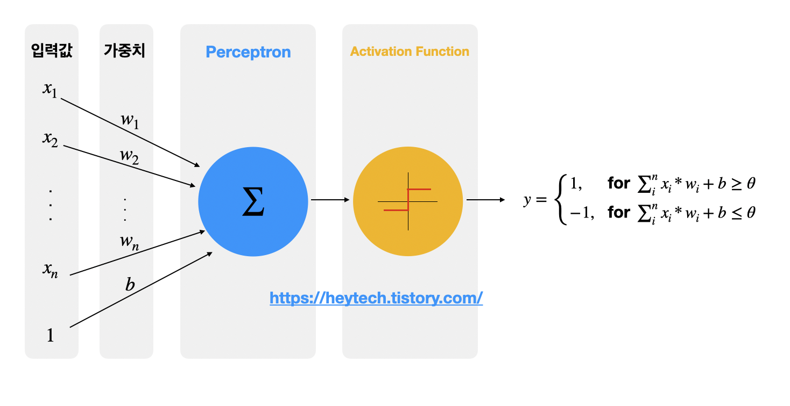
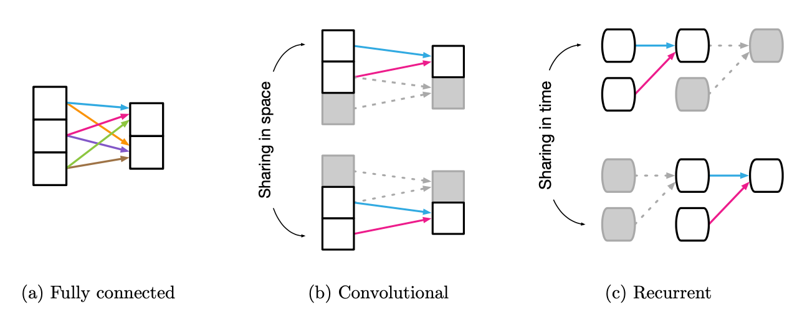

# 신경망이란?

## Perceptron

Perception(인지) + Neuron(신경망)의 합성어로, **다수의 신호를 받아 하나의 신호로 출력하는 것**을 의미한다.  
생물이 뭔가를 인지하기 위해선 그 생물 내부의 신경망이 다수의 정보를 입력받아 하나의 인지결과를 도출해야 하기 때문에 인공지능 분야에서는 이 중간 과정을 **Perceptron**으로 부른다.  

  

Perceptron 입출력 도식화

## Multi-layer-perceptron (신경망)
여러개의 Perceptron을 동시에 이어서 비선형적 결과를 도출 가능하게 한 구조를 의미한다.  

**MLP가 곧 신경망이다.**

## Inductive Bias

Transformer 모델을 잠시 보다가 알게 된 개념이다.  

> Transformer는 CNN에 비해 고유한 inductive biases가 부족하므로 충분하지 못한 양의 데이터로 학습할 때 일반화가 잘 되지 않는다.

- inductive bias: 머신러닝 문제를 더 잘 풀기 위해 **사전 정보를 통해 추가된 가정**
  - ex) Linear Regression 모델은 종속 변수와 독립 변수가 선형적으로 관련있다고 **가정하는 것**. 즉 이때의 inductive bias는 선형관계

  

[그림 출처](https://re-code-cord.tistory.com/entry/Inductive-Bias%EB%9E%80-%EB%AC%B4%EC%97%87%EC%9D%BC%EA%B9%8C#Relational%--Inductive%--Biases%--on%--CNN%-C%--RNN%-C%--GNN)

CNN 같은 경우 **1) 주변 픽셀끼리의 연관성이 높고** **2) 특징을 가지고 있는 픽셀들이 한 지점에 뭉쳐있는** 특성을 우리는 느낌적으로 이미지를 볼 때 알 수 있다. 이 2가지를 수학적으로 반영한 것이 CNN이다.

FCN 같은 경우는 모든 weight가 출력에 영향을 미치기 때문에 inductive bias가 매우 작다고 할 수 있다. (사전 정보를 안쓰는것과 마찬가지이므로)

# 대표 알고리즘

## CNN

합성곱, 또는 convolution은 하나의 함수와 또 다른 함수를 **반전 이동**한 값을 곱한 다음, 구간에 대해 적분하여 새로운 함수를 구하는 **수학 연산자**이다.

위 합성곱 연산을 활용한 신경망이 `CNN`{:.error}이다.

다음 설명은 혁펜하임님의 강의를 정리한 부분이다.

1차원 데이터를 CNN 알고리즘으로 처리할 때의 핵심 수식은 다음과 같다.

$ \sigma_{k=-\infty}^{\infty}{x[k]h[n-k]}$

n 도메인의 x, h 두개의 함수로 이루어진 식. x가 신호, h가 필터

x[n] -> x[k]로 치환  
h[n] -> h[k] -> h[-k] (뒤집고) -> h[-(k-n)] (n 만큼 shift)

신호 level에서 본 수식은 다음과 같다.

$ (f * g)(t) = \int_{\infty}^{\infty}{f(\gamma)g(t - \gamma)}dr $

## Deconvolution

전치합성곱을 이용하면 초기에 내가 컨볼루션을 진행했던 이미지 데이터를 어느정도 복원할 수 있는 것인줄 알았다. 그런데 그런 개념은 아닌 것 같다.. ([여기 사이트에 따르면 수학적 역 관계가 아니라고 한다](https://zzsza.github.io/data/2018/02/23/introduction-convolution/)) 아직 좀더 이해가 필요하다..

[이해를 도와주는 강추 사이트](https://naokishibuya.medium.com/up-sampling-with-transposed-convolution-9ae4f2df52d0)

[pytorch 활용해서 cnn, transposed cnn 관계 알아보기](https://nbviewer.org/github/metamath1/ml-simple-works/blob/master/CNN/transconv_fullconv.ipynb)

# Params & FLOPs

- Parameters: Deep learning model의 **weights, bias** 값들에 대한 메모리 사이즈
- FLOPs(**FL**oating point **OP**erations): 절대적 연산량 횟수

# 선형대수학 접목

> 아래 글을 보기전에 3blue-1brown 선형대수학의 1강, 2강을 꼭 시청해서, `선형변환 행렬은 그 행렬을 구성하는 기저 벡터를 스케일링 하는 작업이다` 라는 문구를 이해할 수 있을 때 아래글을 보도록 하자.

## Linear Classifier
우리가 흔히 볼 수 있는 Linear classifier Layer에 관해 선형대수학의 벡터 측면으로 살펴보자.  (열심히 공부하고 있는 선형대수학을 접목시키는듯 하여 뿌듯하다..!)

    

위 3x4 **가중치** 행렬을 4개의 basis column vector 라고 간주하며, 입력 데이터 벡터(입력 사진)은  각 basis column vector들의 스케일링을 해줄 수 있는 요소임.  
좀더 자세히 파면 입력 벡터도 하나의 벡터이므로 화살표로 생각할 수 있고, 가중치 행렬이 선형변환 행렬인 것임.   
다음 그림을 통해 자세히 살펴보자 (설명의 용이성을 위해 위 고양이 그림과는 별개로 새로운 문제를 풀겠다. 구분해야 하는 클래스 개수 3개, 입력 데이터 차원 2)

내가 생각하는 벡터로의 Linear classifier 설명 끝판왕 그림이다. (머리 좋은 친구들한텐 아무것도 아니겠지만, 난 원래 바보니까 개인적으로 대견하다!)  
다음 문구들에 집중하면서 이해하도록 하자.
- 위 그림은 3x2 가중치 행렬, 2x1 데이터 벡터를 통해 2개의 class를 분류해내는 그림이다.
- 가중치 행렬은 총 3개의 basis vector(w1, w2)를 가지고 있으며 각 벡터들은 3개의 element를 가지고 있다.
  - 3x2 가중치 행렬의 3은 **class 수** 이다. class가 많아질수록 가중치 행렬의 row 숫자를 늘려 가중치 행렬의 basis vector가 움직일 수 있는 **차원의 수를 확장시켜 준다.**
    - 파이토치의 fully connected layer의 맨 마지막 부분(class 최종 분류하는 부분)의 NN.Linear(in_features, out_features)에서 out_features가 최종 layer 가중치 행렬의 basis vector들이 이동할 수 있는 차원수를 결정한다
  - 3x2 가중치 행렬의 2는 데이터 element 개수이다.(입력 사진이 2픽셀이라고 가정한 상황이다.)
  - 데이터 벡터(x1, x2)는 가중치 행렬로 인해 변형되어(선형변환) 새로운 벡터(파란색)가 된다! $$ W\overrightarrow{X} = W\overrightarrow{X \prime}$$
- 이제 분홍색 데이터들과 파란색 벡터 한개의 Distance를 구해보자
  - 분홍색 데이터 개수가 18개이므로 각각의 분홍색 데이터 벡터와 파란색 벡터의 Distance를 구한 뒤 합치면 하나의 Distance값이 나온다.
- 이런식으로 초록색 데이터, 보라색 데이터와의 Distance도 구한다.
- 구해야 하는 Distance를 다 구했으므로 Distance를 최소화 할 수 있는 Loss 함수를 설계 및 적용한다.
  - Loss 함수의 Focus는 실제 클래스와 예측 클래스가 다르면 큰 값을 return 하는것이 기본 아이디어다. 대표적으로 (MSE, RMSE Loss 함수가 있다.)
- 이렇게 구한 LOSS 값을 이용해서 적절히 초록색 벡터를 수정해준다(가중치 업데이트 과정)
- 데이터는 바뀌지 않는  상수이고, 초록색 벡터가 바뀌었으므로 방금 거친 Distance 구하는 과정을 다시 한다면, LOSS 값도 변경 될 것이다.(이 Loss값이 점점 낮아지게끔 학습을 진행해야 한다..!)

> 한가지 놓치지 말아야 할 점으로 위 데이터는 Non-linear 데이터로 사실 linear-classifier 모델로 풀기 어려운 문제이다.  
> 입력 데이터의 차원인 2차원 평면에서 볼 때 보라색 데이터와 초록색 데이터가 겹치고, 분홍색 데이터와 초록색 데이터가 굉장히 겹쳐있어서 Linear-classifier 모델로 풀기 매우 어렵다.

## GNN(Graph Neural Network)로 데이터 관점으로 행렬곱 보기

<iframe width="560" height="315" src="https://www.youtube.com/embed/GXhBEj1ZtE8" title="YouTube video player" frameborder="0" allow="accelerometer; autoplay; clipboard-write; encrypted-media; gyroscope; picture-in-picture" allowfullscreen></iframe>
&nbsp;

  

실제로 행렬곱 하면서 연산 진행해보면 왜 위와같은 그림이 나오는지 알 수 있다.

# CNN은 Linear Transformation인가?
가장 원초적인 질문을 스스로한테 해본다. CNN Layer는 Linear Transformation인가?  
직접 써가며 유도를 해가면 Linear Operation 임을 알 수 있다.

# 기울기 소실

- 위 그림처럼 3개의 sigmoid layer를 가지고 있는 모델이 있다고 가정하자

- 위 그림과 같이 오차역전파법을 통해 ${\partial y \over \partial w_3}, {\partial y \over \partial w_2}, {\partial y \over \partial w_1}$을 각각 구할 수 있으며 해당 값을 그래프로 표현하면 아래와 같다

- 기울기 값이 점점 줄어드는것을 확인할 수 있다.
    - 기울기 값이 줄어든다는 것은 가중치 업데이트를 할 때 줄수있는 변화량이 적어진다는 것이고, 변화량이 점점 적어질수록 학습이 제대로 이루어지기 힘들다

