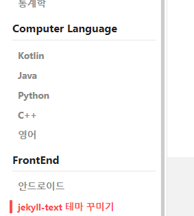
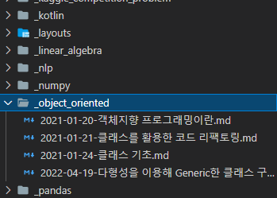

# 새로운 Sub Category 만들기

- navigation.yml 수정

<p align="center">
<div class="card">
  <div class="card__image">
    
  </div>
  <div class="card__content">
    <div class="card__header">
      위 네비게이션에 필요한 소제목, URL 지정이 필요하다
    </div>
  </div>
</div>
</p>

| /_data/navigation.xml 파일

```yaml
study-nav:
  - title: 컴퓨터 전공
    children:
      - title: 객체지향 프로그래밍
        url:    /categories/object_oriented.html
```

- collection 지정

collection이 아직 자세히 무슨 역할을 하는것인지는 모르겠지만 collection을 활용해서 원하는 포스트들만 뜨게 할 수 있다.

| _config.yml

```yaml
collections:
  categories:
    output: true
  
  # 카테고리, 서브 카테고리 collection들
  # 컴퓨터 전공
  object_oriented:
    output: true
  data_structure:
    output: true
  github:
    output: true
```


- collection 이름과 같은(단, 언더바는 빼야함) 디렉토리 생성 후 포스터 작성
<p align="center">
    
</p>


