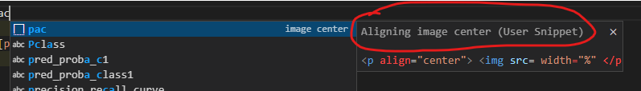

# 상황 별 해결방법

## snippets - 반복코드 미리 작성해서 불러오기

반복되는 코드 작업이 실증날 때 keyword 하나로 코드를 불러올 수 있게 해줌

1. 커스텀 스니펫 작성  
`ctrl + shift + p` 이후 `configure user snippets` 치고 Enter
2. Global하게 적용할지 or 언어별로 적용할지 선택
3. 코드 작성

```json
"image center":{
    "prefix": "pac",
    "body": [
        "<p align=\"center\"> "
    ],
    "description": "Aligning image center"
}
```

```txt
$1, $2 등의 넘버링으로 tap을 눌렀을 때 커서가 옮겨지는 구간 지정 가능
```

- prefix: keyword임. 이걸 통해 코드 불러오기 가능
- body: 불러올 코드
- description: keyword 작성했을 때 vscode 상에서 조그마한 창으로 설명 나오는 부분

<p align="center">  </p>

혹시라도 vscode 상에서 자동완성 창이 안나오시는 분들은 `ctrl + space`로 자동완성 창을 띄워보세요
{:.error}