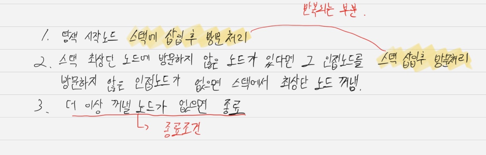
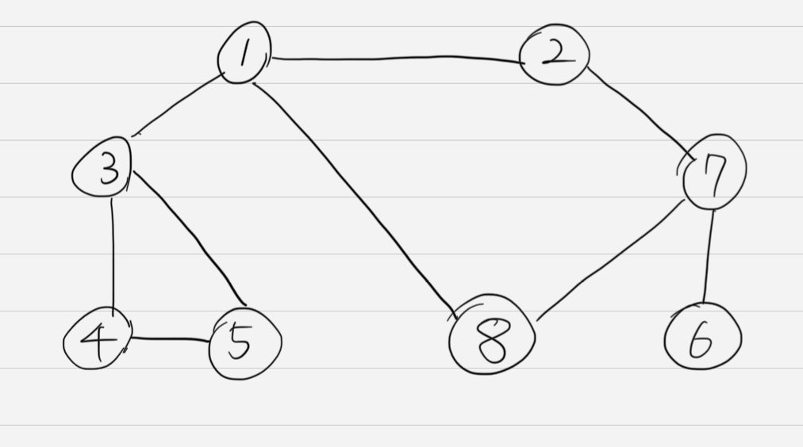
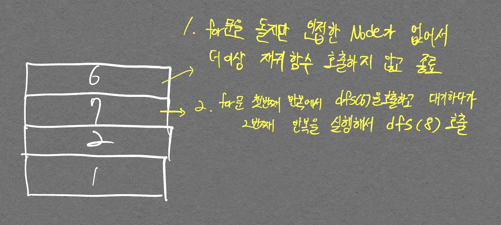
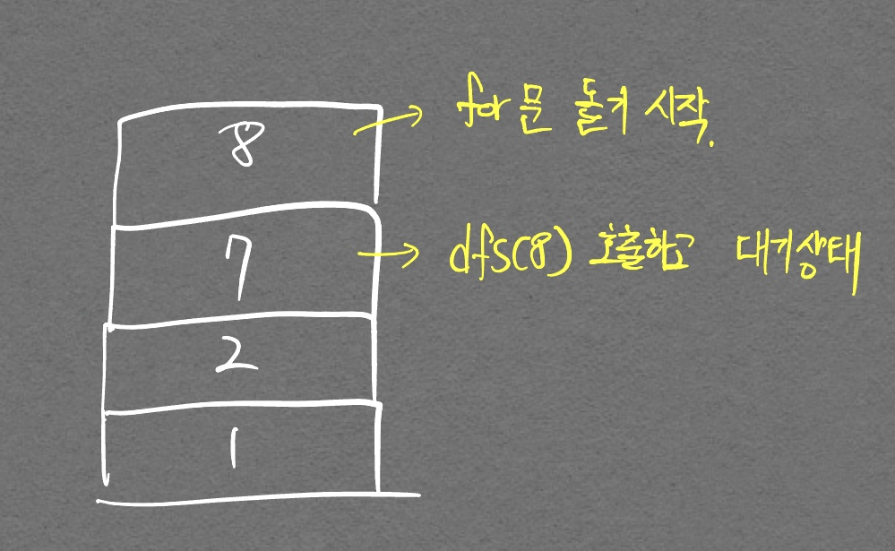
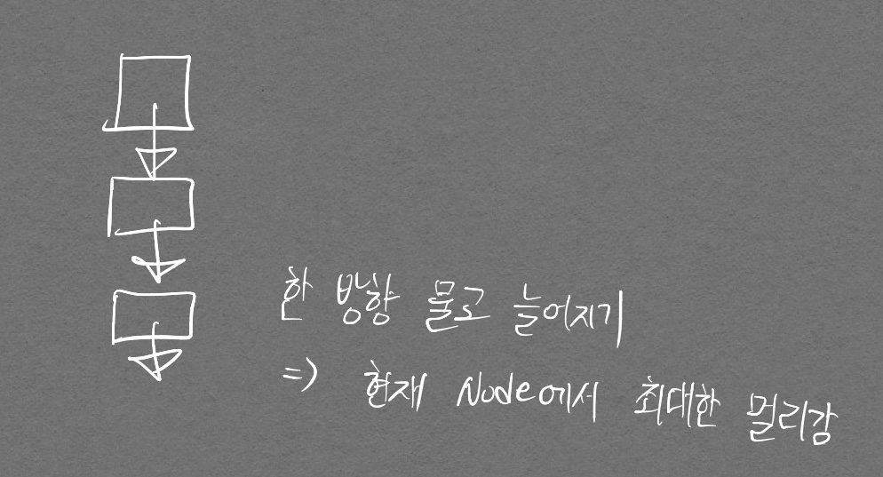
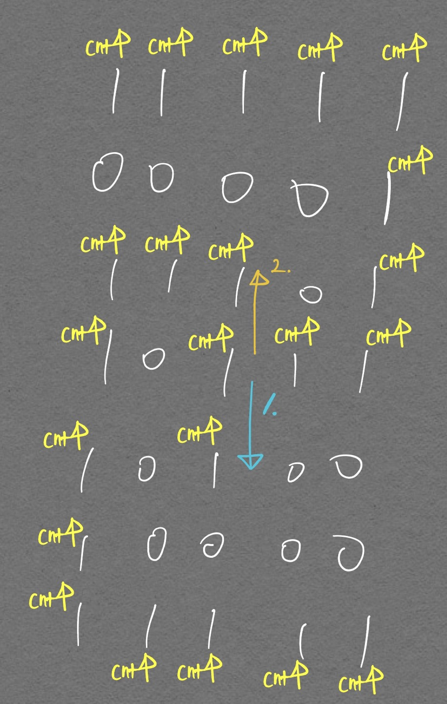
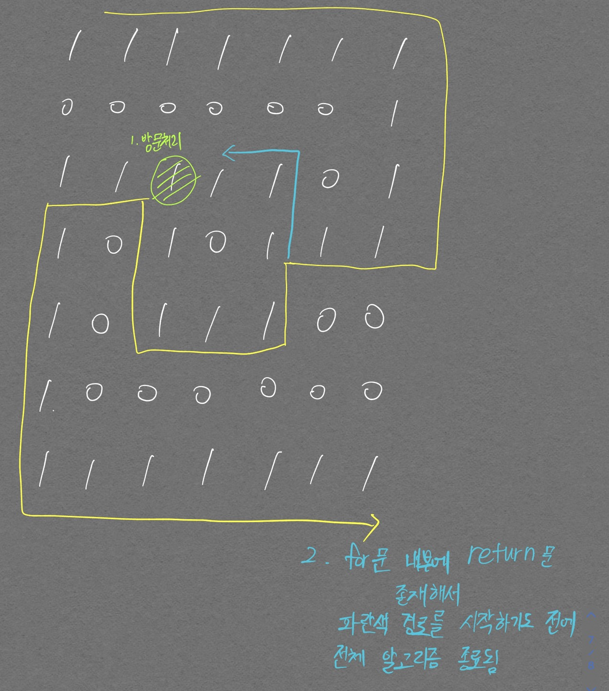
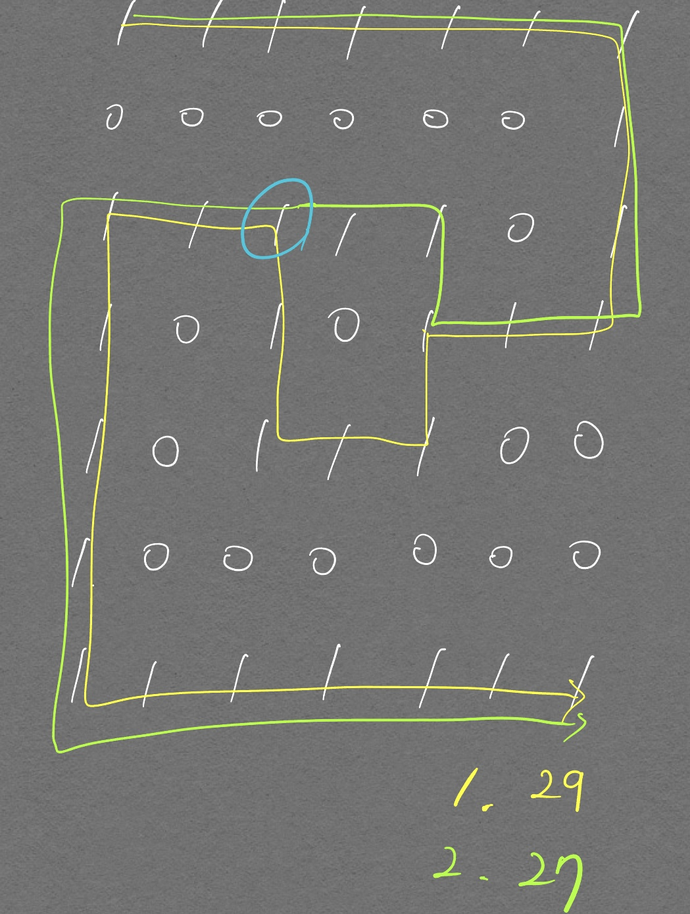
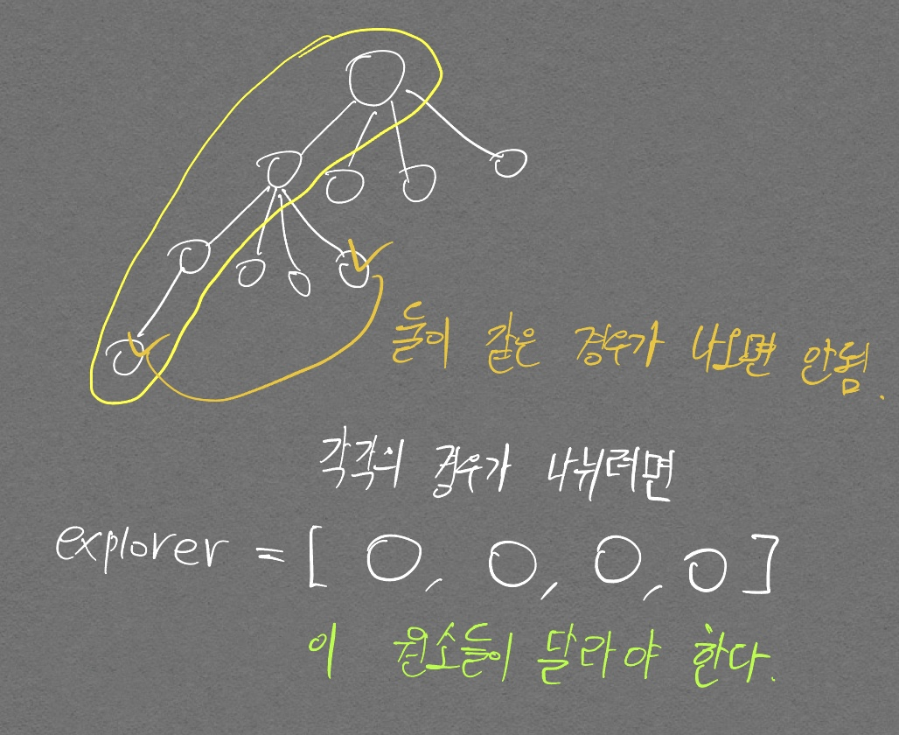

DFS의 경우 함수 초기 부분에 인자로 넘어온 node를 방문처리 해야하며  
BFS의 경우 Queue에 삽입하자마자 방문처리 해야한다는 것을 명심 (DFS처럼 반복문 초기 부분에 `popleft()` 이후 방문처리하면 Queue에 삽입되어있지만 아직 Pop 되지 않은 node들이 중복해서 Queue에 들어오는 경우가 생김)
{:.info}

# DFS

## 개념

가장 깊숙이 위치하는 노드에 닿을 때까지 탐색한다. 다른 말로 최대한 멀리 있는 노드를 우선으로 탐색하는 방식이라고도 한다.

<p align="center">  </p>
<div align="center" markdown="1">  구현을 위한 기능 명시
</div>

아래 구현 코드를 보면 stack을 사용하는 것이 명식적으로 보이지 않지만(리스트를 사용하는 것이 보이지 않지만)[^1], 재귀적 함수 호출 자체가 스택을 활용하는 것으로 생각할 수 있기에 DFS는 스택을 활용한다고 볼 수 있다.

[^1]: 파이썬은 리스트를 통해 스택 자료구조를 구현할 수 있다.

<p align="center">  </p>
<div align="center" markdown="1"> 아래 코드 예시에 활용되는 그래프 그림 
</div>


## 코드

```python
# DFS 메서드 정의
def dfs(graph, v, visited):
    # 현재 노드를 방문 처리
    visited[v] = True
    print(v, end=' ')
    # 현재 노드와 연결된 다른 노드 재귀적 방문
    # graph의 각 리스트에 접근하는 인덱스가 곧 노드 번호여서 인덱스 = 노드 번호로 바로 맵핑 가능
    # 코딩 테스트에선 대부분 낮은 값의 노드를 우선 방문하는 것으로 되어있음
    for i in graph[v]:
        if not visited[i]:
            dfs(graph, i, visited)

visited = [False] * 9

# 값이 낮은 노드가 먼저 for문에서 선택되기 위해 값 순서대로 정렬화된 모습 확인
# 빈 리스트가 있는 이유는, DFS 함수를 설계할 때 1번 노드부터 최초 실행되는 것으로 설계하였기에
# graph도 인덱스 1부터 의미있는 정보를 담게하기 위해 빈 리스트가 필요하다.
graph = [
    [],
    [2, 3, 8],
    [1, 7],
    [1, 4, 5],
    [3, 5],
    [3, 4],
    [7],
    [2, 6, 8],
    [1, 7],
]

dfs(graph, 1, visited)
```
```
1 2 7 6 8 3 4 5 
```

<p align="center">  </p>
<div align="center" markdown="1"> 코드 이해를 돕기 위한 그림 (1) 
</div>

<p align="center">  </p>
<div align="center" markdown="1"> 코드 이해를 돕기 위한 그림 (2) 
</div>

# BFS

## 개념

너비 우선 탐색을 말하며, 가까운 노드부터 탐색하는 알고리즘이다.

- 구현을 위한 기능 명시

<p align="center">  </p>

DFS와 달리 Queue 자료구조를 사용한다는 점에 주목하자.  
Queue는 선입선출 구조이며, 현재 노드에서의 인접한 점을 모두 방문하기 위해 인접한 노드들을 한번에 Queue에 넣는다. (DFS는 하나씩 스택에 넣음)


## 코드

```python
from collections import deque

# BFS 정의
def bfs(graph, start, visited):
    # Queue 구현을 위한 deque 라이브러리 사용
    queue = deque([start])      # 맨 처음 함수를 호출할 때 queue에 노드를 삽입하는 것

    # 현재 노드를 방문 처리
    visited[start] = True

    # 큐가 빌 때까지 반복
    # 이렇게 while에 바로 엮을 수 있다는것에 주목
    # 이런식으로 안하고 break 문 등으로 해결하려고 하면 index error 나면서 출력결과가 안맞아서 오답 될 테니
    # 꼭 염두할 것!
    while queue:
        # 큐에서 하나의 원소를 뽑아 출력
        v = queue.popleft()
        print(v, end=' ')

        # 해당 원소와 연결된, 아직 방문하지 않은 원소들을 큐에 삽입
        for i in graph[v]:
            if not visited[i]:
                queue.append(i)
                visited[i] = True
    

graph = [
    [],
    [2, 3, 8],
    [1, 7],
    [1, 4, 5],
    [3, 5],
    [3, 4],
    [7],
    [2, 6, 8],
    [1, 7],
]

visited = [False] * 9

bfs(graph, 1, visited)
```

```
1 2 3 8 7 4 5 6
```

||DFS|BFS|
|---|---|---|
|동작원리| 스택 | 큐 |
|구현방법| 재귀 함수| 큐 자료구조 이용|

DFS가 스택 자료구조를 사용한다고 말하지 않는 이유는 단지 재귀함수를 통해 스택 같은 효과를 낸 것이기 때문이다.  
반면 BFS는 실제로 Queue 자료구조를 사용하여 구현한다.

# 문제

## p.149 음료수 얼려 먹기

- 해답 코드


```python
n, m = map(int, input().split())
graph = []

for _ in range(n):
  graph.append(list(map(int, input())))

def dfs(y, x):

  # 주어진 범위를 벗어나는 경우 즉시 종료
  # 이건 재귀함수의 종료 조건이라기 보다는 예외처리
  if y <= -1 or y >= n or x<= -1 or x >= m:
    return False

  # 현재 노드를 아직 방문 안했다면
  if graph[y][x] == 0:
    # 해당 노드 방문 처리
    graph[y][x] = 1

    #상, 하, 좌, 우 위치에 대해 모두 재귀적으로 호출
    dfs(y-1, x)
    dfs(y+1, x)
    dfs(y, x+1)
    dfs(y, x-1)

    return True
  return False

count = 0

for row in range(n):
  for col in range(m):
    if dfs(row, col) == True:
      count += 1

print(count)
```

잘못 생각했던 부분이 2가지 있었다.  
- BFS로만 풀 수 있다고 생각했다. (인접한 부분 방문만 생각이 들었기 때문)
  - DFS로 풀 수 있는 문제이며 이게 왜 DFS인지 의문이 들어 조금 고민해보았다.
  - 해답을 보고 DFS로만 풀 수 있는것이겠구나 생각을 했지만, BFS로도 풀 수 있을 것 같아 직접 구현해보았다. (아래 코드 참고)
<p align="center">  </p>

- 인접 리스트 방식으로 graph를 변경해야 한다고 생각했다.
  - 위 코드 구현을 보면 그런 부수작업이 필요 없다는 것을 알 수 있다.

- BFS로 내가 직접 풀은 코드 (보람차다..!)

```python
n, m = map(int, input().split())

graph = []

from collections import deque

for _ in range(n):
  graph.append(list(map(int, input())))

def bfs(y, x):
  # if y <= -1 or y >= n or x <= -1 or x >= m:
  #   return False
  queue = deque([(y, x)])
  
  # 방문 처리
  graph[y][x] = 1

  while queue:
    coor = queue.popleft()
    dy, dx = coor[0], coor[1]

    if dy-1 >= 0 and graph[dy-1][dx] == 0:
      queue.append((dy-1, dx))
      graph[dy-1][dx] = 1
    if dy+1 < n and graph[dy+1][dx] == 0:
      queue.append((dy+1, dx))
      graph[dy+1][dx] = 1
    if dx-1 >= 0 and graph[dy][dx-1] == 0:
      queue.append((dy, dx-1))
      graph[dy][dx-1] = 1
    if dx+1 < m and graph[dy][dx+1] == 0:
      queue.append((dy, dx+1))
      graph[dy][dx+1] = 1

  return True

  

  
  

count = 0

for row in range(n):
  for col in range(m):
    if graph[row][col] == 0:
      count += 1
      bfs(row, col)
    
    # if (row, col) == True:    # 이걸 호출하는게 아니지.. 이러면 그냥 bfs 20번 호출한거니 20이 나오지..
      # count += 1

print(count)
```

```
15 14
00000111100000
11111101111110
11011101101110
11011101100000
11011111111111
11011111111100
11000000011111
01111111111111
00000000011111
01111111111000
00011111111000
00000001111000
11111111110011
11100011111111
11100011111111
8
```

- 위 코드 핵심 부분을 최적화하면 아래와 같다

```python      
    # if dy-1 >= 0 and graph[dy-1][dx] == 0:
    #   queue.append((dy-1, dx))
    #   graph[dy-1][dx] = 1
    # if dy+1 < n and graph[dy+1][dx] == 0:
    #   queue.append((dy+1, dx))
    #   graph[dy+1][dx] = 1
    # if dx-1 >= 0 and graph[dy][dx-1] == 0:
    #   queue.append((dy, dx-1))
    #   graph[dy][dx-1] = 1
    # if dx+1 < m and graph[dy][dx+1] == 0:
    #   queue.append((dy, dx+1))
    #   graph[dy][dx+1] = 1

    # 위 주석한 부분 대체
    if (0 <= ny and ny < n) and (0 <= nx and nx < m) and graph[ny][nx] == 0:
        queue.append((ny, nx))
        graph[ny][nx] = 1
```

## p.153 미로 탈출

DFS, BFS중 어떤 방법으로 풀어야 할지 감이 오지 않아서 DFS로 풀었다.  
구현하는데 있어서 스스로 Edge Case를 만들어가면서 DFS 알고리즘이 내 의도대로 완벽하게 돌아가도록 단계별로 구현하였다.

- 첫번째 구현

```python
import copy

N, M = map(int, input().split())

graph = [list(map(int, input())) for _ in range(N)]

# visit = [[False]*M for _ in range(N)]

cnt = 0
answer = 1e+10

def dfs(x, y):
  global cnt
#   global answer
  # print(f"{x, y}로 이동")
  cnt+=1
  
  if x == N-1 and y == M-1:
    return True, cnt
    
  # visit[x][y] = True
  dir = [(1, 0), (0, 1), (0, -1), (-1, 0)]

  for dx, dy in dir:
    nx, ny = x+dx, y+dy
    # if 0 <= nx < N and 0 <= ny < M and graph[nx][ny] == 1 and not visit[nx][ny]:
    if 0 <= nx < N and 0 <= ny < M and graph[nx][ny] == 1:
    #   reached, result = dfs(nx, ny, cnt, copy.deepcopy(visit))
      reached, result = dfs(nx, ny)
      
      if reached: # 끝까지 도달 했으면
        # answer = min(answer, result)
        # print(f"{answer}로 갱신")
        return True, result

  return False, 0

# dfs(0, 0)
_, answer = dfs(0, 0)
print(answer)
```

    5 6
    101010
    111111
    000001
    111111
    111111
    10


막연하게 DFS를 구현하다가 방문 처리를 하지 않았는데도 정답이 출력되는 것을 보고 방문 처리 할 필요가 없는 것인가 잠시 고민하면서 Edge Case를 만들어봤다.

다음이 엣지 케이스의 입력이다.

    6 5
    11111
    00001
    11101
    10111
    10000
    11111

<p align="center">  </p>
<div align="center" markdown="1"> 방문 처리를 하지 않았기 때문에 `주황색`{:.warning} 좌표에서 호출한 `파랑색`{:.info} 좌표 에서 다시 `주황색`{:.warning} 좌표를 호출하기 때문에 무한루프에 빠진다.
</div>

그래서 다음 코드와 같이 방문처리를 진행하니 위의 Edge Case는 통과되었다.

```python
import copy

N, M = map(int, input().split())

graph = [list(map(int, input())) for _ in range(N)]

visit = [[False]*M for _ in range(N)]

cnt = 0
answer = 1e+10

def dfs(x, y):
  global cnt
#   global answer
  # print(f"{x, y}로 이동")
  cnt+=1
  
  if x == N-1 and y == M-1:
    return True, cnt
    
  visit[x][y] = True
  dir = [(1, 0), (0, 1), (0, -1), (-1, 0)]

  for dx, dy in dir:
    nx, ny = x+dx, y+dy
    if 0 <= nx < N and 0 <= ny < M and graph[nx][ny] == 1 and not visit[nx][ny]:
    #   reached, result = dfs(nx, ny, cnt, copy.deepcopy(visit))
      reached, result = dfs(nx, ny)
      
      if reached: # 끝까지 도달 했으면
        # answer = min(answer, result)
        # print(f"{answer}로 갱신")
        return True, result

  return False, 0

# dfs(0, 0)
_, answer = dfs(0, 0)
print(answer)
```

하지만 아래와 같은 Case가 입력된다면 어떨까?  

    7 5
    11111
    00001
    11101
    10111
    10100
    10000
    11111

우린 정답이 21이 나오길 원하지만 22가 나오게 된다. 그 이유는 아래 그림으로 설명하겠다.

<p align="center">  </p>
<div align="center" markdown="1"> 모든 재귀함수에서 전역변수 cnt에 접근해서 방문할 때 마다 1씩 올리고 있으므로 22가 출력된다.  어떻게 하면 `파란색`{:.info} 좌표로의 cnt를 무시하게 할 수 있을까?
</div>

정답은 각 호출된 **함수별로 자신만의 cnt값을 가지고 있으면 된다.**  그래서 아래와 같이 코드를 짜면 위 문제가 해결되게 된다. 이해가 가지 않는다면 [재귀 함수](/DataStructureWiki/#재귀-함수) 포스팅을 보고 깊이 생각해 보자.  

```python
import copy

N, M = map(int, input().split())

graph = [list(map(int, input())) for _ in range(N)]

visit = [[False]*M for _ in range(N)]

cnt = 0
answer = 1e+10

def dfs(x, y, cnt):
#   global answer
  # print(f"{x, y}로 이동")
  cnt+=1
  
  if x == N-1 and y == M-1:
    return True, cnt
    
  visit[x][y] = True
  dir = [(1, 0), (0, 1), (0, -1), (-1, 0)]

  for dx, dy in dir:
    nx, ny = x+dx, y+dy
    if 0 <= nx < N and 0 <= ny < M and graph[nx][ny] == 1 and not visit[nx][ny]:
    #   reached, result = dfs(nx, ny, cnt, copy.deepcopy(visit))
      reached, result = dfs(nx, ny, cnt)
      
      if reached: # 끝까지 도달 했으면
        # answer = min(answer, result)
        # print(f"{answer}로 갱신")
        return True, result

  return False, 0

# dfs(0, 0)
_, answer = dfs(0, 0, cnt)
print(answer)
```

마지막으로 생각해낸 Edge Case는 다음과 같다.  

    7 7
    1111111
    0000001
    1111101
    1010111
    1011100
    1000000
    1111111

도착할 수 있는 경로가 2가지가 있으며 각각 27, 29이다. 우린 27이 정답으로 나오길 원하지만 우리가 구현한 DFS 문제에는 다음의 2가지 문제점이 있다.

<p align="center">  </p>
<div align="center" markdown="1"> 1. 노란색 좌표로 이동하면서 그림에 표시하였듯 경로가 겹치는 부분이 방문처리가 되어서 파란색 좌표를 통한 경로가 지나갈 수가 없게됨.  2. 애초에 `return 문`이 `for 문` 내부에 존재하기 때문에 파란색 경로를 시작하기도 전에 전체 알고리즘이 종료되어 버림
</div>

따라서 `for 문`에 있는 return문을 지워버리고 `cnt` 변수를 각 호출된 함수에서 따로 값을 가지고 있던것처럼 `visit` 리스트도 각 호출된 함수가 값을 가지고 있게 구현하였다.  리스트는 mutable 객체이기 때문에 copy.deepcopy()로 넘겨줘야 각 함수별로 다른 visit 리스트를 가지게 된다. 코드는 다음과 같다.  

```python
import copy

N, M = map(int, input().split())

graph = [list(map(int, input())) for _ in range(N)]

visit = [[False]*M for _ in range(N)]

cnt = 0
answer = 1e+10

def dfs(x, y, cnt, visit):
  global answer
  cnt+=1
  
  if x == N-1 and y == M-1:
    return True, cnt
    
  visit[x][y] = True
  dir = [(1, 0), (0, 1), (0, -1), (-1, 0)]

  for dx, dy in dir:
    nx, ny = x+dx, y+dy
    if 0 <= nx < N and 0 <= ny < M and graph[nx][ny] == 1 and not visit[nx][ny]:
      reached, result = dfs(nx, ny, cnt, copy.deepcopy(visit))
      # reached, result = dfs(nx, ny, cnt)
      
      if reached: # 끝까지 도달 했으면
        answer = min(answer, result)
        # return True, answer

  return False, 1e+10

dfs(0, 0, cnt, visit)
# _, answer = dfs(0, 0, cnt)
print(answer)
```

하지만 위 코드는 공간복잡도가 굉장히 커지게 되서 상당히 비효율적인 코드가 된다.

정말 많은 여정을 달려왔고, 이제 마지막으로 BFS를 활용한 정답 코드를 보자.

```python
from collections import deque

n, m = map(int, input().split())

graph = []
for i in range(n):
  graph.append(list(map(int, input())))

dx = [-1, 1, 0, 0]
dy = [0 ,0, -1, 1]

def bfs(x, y):
  queue = deque()
  queue.append((x, y))
  while queue:
    x, y = queue.popleft()
    for i in range(4):
      nx = x + dx[i]
      ny = y + dy[i]

      if nx < 0 or ny < 0 or nx >= n or ny >= m:
        continue

      if graph[nx][ny] == 0:
        continue

      if graph[nx][ny] == 1:
        graph[nx][ny] = graph[x][y] + 1
        queue.append((nx, ny))
  return graph[n-1][m-1]

print(bfs(0, 0))
```

    7 7
    1111111
    0000001
    1111101
    1010111
    1011100
    1000000
    1111111
    27

따로 방문처리를 하기 보다는 `graph[nx][ny] == 1` 를 통해 이전에 지나갔는지 아닌지를 판단하고 있다.  

이 개념을 BFS, DFS에 적용했을 때의 차이는 다음과 같다.  

<p align="center">  </p>
<div align="center" markdown="1"> 초록색 숫자가 호출 순서이며, 노란색 숫자가 `cnt` 값이다. 상대적으로 빠른 경로를 먼저 1에서 `cnt + 1`값으로 대체시키기 때문에 최단거리가 출력될 수 있다.
</div>

<p align="center">  </p>
<div align="center" markdown="1"> DFS 일 때 2가지 값이 나오기 때문에 BFS에 비해 복잡하게 구현해야 한다.
</div>


# 깨알팁

DFS 문제를 풀다 보면 순열, 조합을 구현해야 하는 경우가 발생한다.  
DFS로 순열을 구현할 땐 `visit` 테이블을 통해 방문 처리를 해줘야 하지만, 조합을 구현할 땐 `visit` 테이블 필요없이 idx만 잘 조정해주면 된다.

# 구현 실수 줄이기

## BFS

[백준: 2178번](https://www.acmicpc.net/problem/2178)을 통해 BFS에서 흔히 발생할 수 있는 실수를 기억해두자.

위 문제는 2가지 방식으로 풀 수 있다.
1. 여태까지 온 거리를 누적시키면서 방문하는 위치의 matrix값 변경
2. queue에 distance 변수를 통해 현재까지 온 경로에 대한 최단 거리를 저장하게 끔 구현

위 2번 방법에서 다음과 같은 실수를 조심하자

```python
import sys
from collections import deque

def solution():
    global n, m
    answer = 0
    n, m = map(int, sys.stdin.readline().rstrip().split())
    matrix = []
    for _ in range(n):
        matrix.append(list(map(int, sys.stdin.readline().rstrip())))

    visit = [[False]*m for _ in range(n)]

    return bfs(matrix, visit)

def bfs(matrix, visit):
    q = deque()
    distance = 0
    dx = [-1, 0, 1, 0]
    dy = [0, 1, 0, -1]
    
    # 방문 처리
    distance += 1
    q.append([0, 0, distance])
    visit[0][0] = True

    while q:
        cx, cy, c_distance = q.popleft()

        if cx == n-1 and cy == m-1:
            return c_distance
            
        for i in range(4):
            nx, ny = dx[i] + cx, dy[i] + cy

            if 0<= nx < n and 0<= ny < m and not visit[nx][ny] and matrix[nx][ny] != 0:
                c_distance += 1
                q.append([nx, ny, c_distance])
                visit[nx][ny] = True
    

print(solution())
```

위 코드에서 잘못된 부분을 찾아보자. `c_distance` 변수를 통해 최단 경로를 BFS 탐색의 매 순간마다 활용하도록 하고 있다. 하지만 위 처럼 구현할 경우 `for문`을 4번 반복하면서 최악의 경우에는 한칸을 이동하는데, c_disntace는 기존보다 4 증가할수 있다. 위 처럼 구현하지 말고, 반드시 `q.append([nx, ny, c_disntace +1])` 형태로 구성해서 `for문`에 영향받지 않도록 해야한다.

## 방문처리 하기

BFS, DFS 알고리즘 구현이 어느정도 익숙해지면서 다음과 같은 의문이 들었다.  

<div align="center" markdown="1">
**어떨땐 방문처리 코드 구현 필요가 없고, 어떨때는 필요한 것 같은데 이 구분이 어떻게 되지?**
</div>

먼저, 5개의 숫자 (0, 1, 2, 3, 4) 중 3개를 뽑는(즉, 순서 상관 없음) 코드를 DFS로 구현해보자.

```python
explorer = []

def dfs(depth, idx):
  if depth >= 3:
    print(explorer)
    return

  for i in range(idx, 5):
    explorer.append(i)
    dfs(depth+1, i+1)
    explorer.pop()

dfs(0, 0)
```

위 코드는 방문 처리를 하지 않는다. 왜 방문처리를 하지 않는게 가능할까? 바로 다음 그림 때문이다.

<p align="center">  </p>
<div align="center" markdown="1">
`for`문의 인덱스를 통해 explorer에 들어가는 값이 정해지는데, 이 인덱스는 dfs 알고리즘의 `depth`가 깊어질수록 제한되게 된다. 이와 같은 이유로 이미 탐색한 경우(5개 중 3개 뽑은 경우)와 다른 경로로 탐색한 경우가 겹치지 않게 된다.
</div>