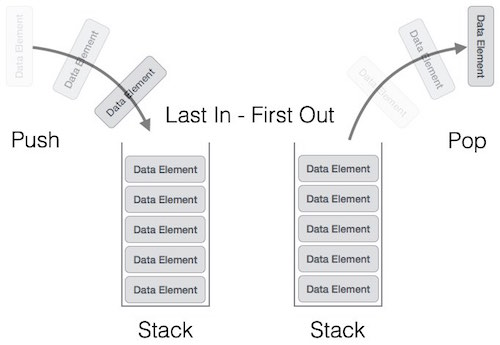
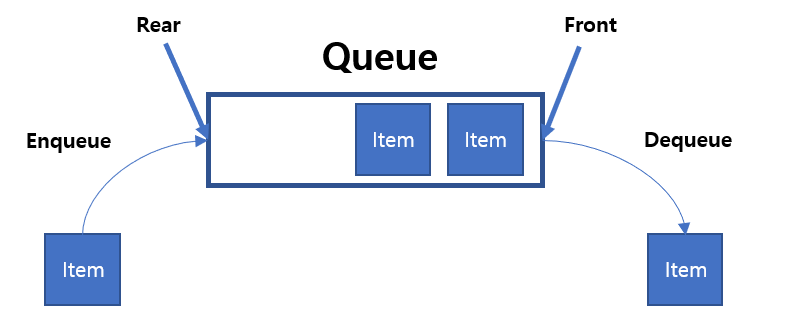
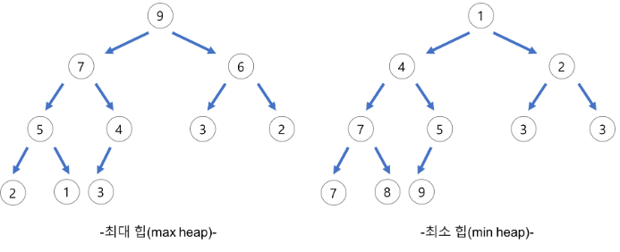
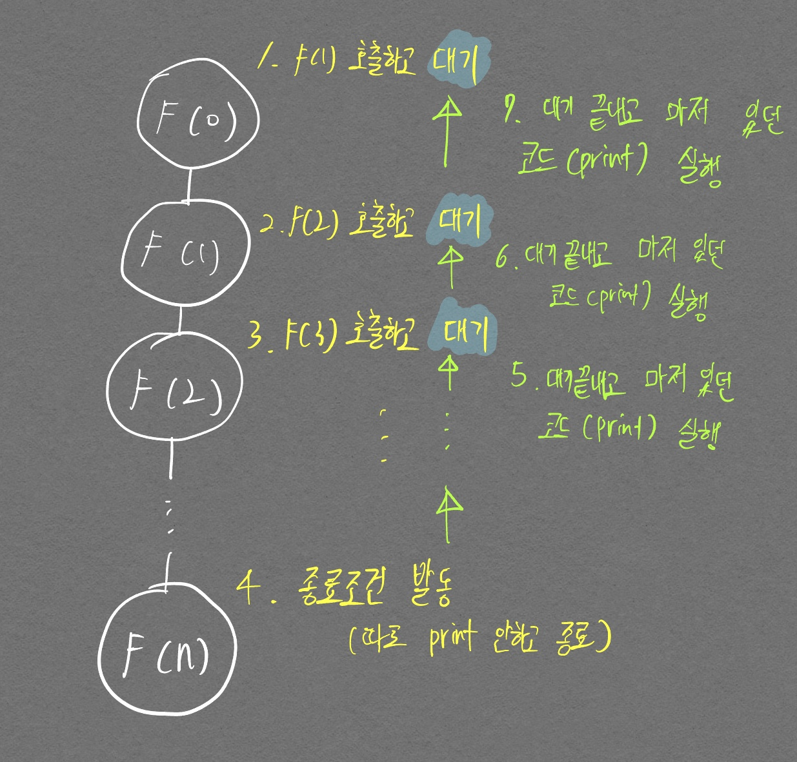
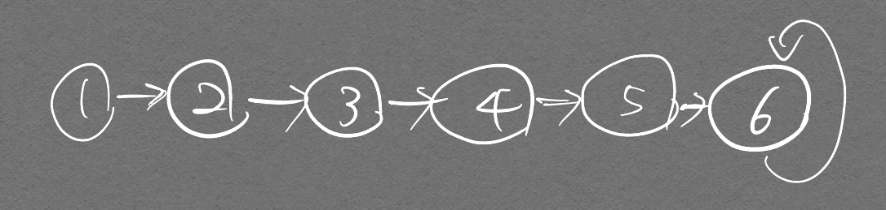
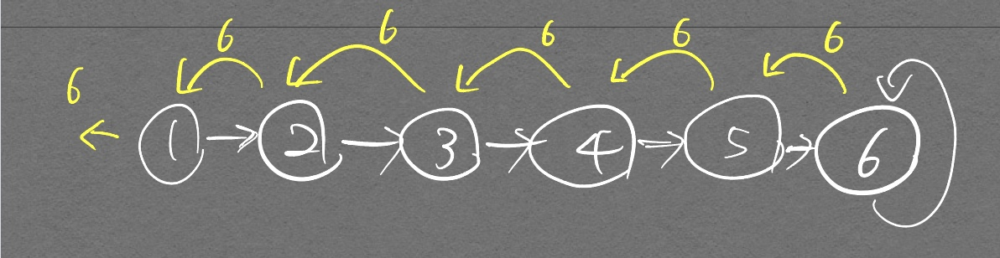
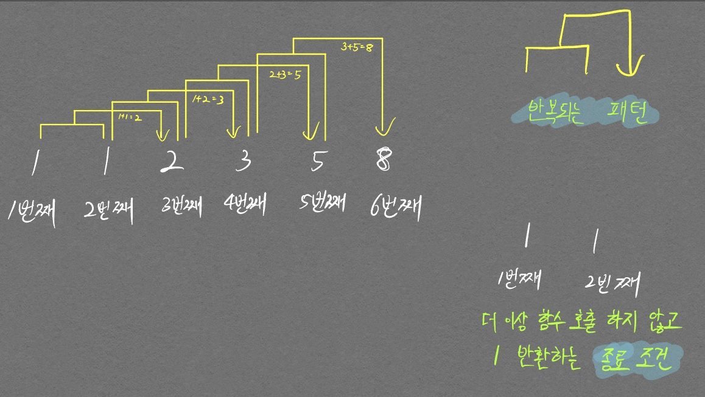
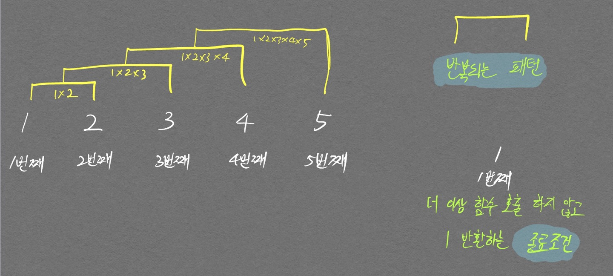

# Stack
- First In Last Out (선입후출 구조)

<p align="center">  </p>
[출처](https://wayhome25.github.io/cs/2017/04/18/cs-20/)

## 코드
- 파이썬 기본 함수들만 사용하여 구현 가능


```python
stack = []

stack.append(5)
stack.append(2)
stack.append(3)
stack.append(7)
stack.pop()
stack.append(1)
stack.append(4)
stack.pop()

print(stack)
print(stack[::-1])
```
```
[5, 2, 3, 1]
[1, 3, 2, 5]
```
# Queue
First In First Out (선입선출 구조)

<p align="center">  </p>

## 코드
- deque 라이브러리 사용하여 구현
  - deque로는 stack도 사실 구현 가능하다


```python
from collections import deque

queue = deque()

queue.append(5)
queue.append(2)
queue.append(3)
queue.append(7)
queue.popleft()
queue.append(1)
queue.append(4)
queue.popleft()

print(queue)
queue.reverse()
print(queue)
```

```
deque([3, 7, 1, 4])
deque([4, 1, 7, 3])
```

## Priority Queue

데이터가 들어온 순서와 상관없이 우선순위가 가장 높은 데이터를 가장 먼저 삭제함.  

Priority Queue중 하나가 **Heap**  

<p align="center">  </p>
<div align="center" markdown="1"> Heap (Python은 기본적으로 Min Heap 사용)
</div>  

다익스트라 알고리즘의 경우 비용이 적은 노드를 우선 방문하므로 Python의 `heapq` 라이브러리를 그대로 사용하면 된다.  
Python 이여도 음수 부호(-)를 사용해서 Heap에 넣었다가 뺄 때 다시 음수 부호(-)를 붙이는 방식으로 Max Heap을 간단하게 만들 수도 있다.

Heap 뿐 아니라 리스트 자료구조를 이용해서도 우선순위 Queue를 구현할 수 있다.  

|우선순위 큐 구현 방식|삽입 시간|삭제 시간|
|---|---|---|
|리스트|$$ O(1)$$ |$$O(N)$$|
|큐|$$O(Log N)$$|$$O(Log N)$$|  

따라서 모든 데이터를 넣고 빼는데 걸리는 시간을 계산해보면 Heap: $$ O(NlogN) $$, 리스트: $$ O(N^2) $$    
그래서 Heap을 우선순위Queue의 자료구조로 많이 사용한다.


# 재귀 함수
재귀 함수 자체를 자료구조라고 하지는 않지만 여지껏 개념이 모호하기에 완벽하게 정리해보고자 한다.  
재귀 함수는 자기 자신을 다시 호출하는 패턴을 가지고 있는 함수를 말하며 내부적으로는 Stack 자료구조를 활용한다.  
구현에 필수적으로 필요한것은 `1. 반복적 패턴`{:.error} `2. 종료조건`{:.error}이다.  아래 구체적 설명을 통해 재귀 함수를 완벽히 이해하자.

- 기본 예시
  - 인자 수 만큼 print문을 실행하는 함수 구현

```python
def recursive_function(i):
  # 15번째 출력이 됐을 때 종료되도록 종료조건 명시

  if i == 15:
    return

  recursive_function(i + 1)
  print(i, "번째 재귀 함수를 종료합니다.")

recursive_function(0)
```

```
14 번째 재귀 함수를 종료합니다.
13 번째 재귀 함수를 종료합니다.
12 번째 재귀 함수를 종료합니다.
11 번째 재귀 함수를 종료합니다.
10 번째 재귀 함수를 종료합니다.
9 번째 재귀 함수를 종료합니다.
8 번째 재귀 함수를 종료합니다.
7 번째 재귀 함수를 종료합니다.
6 번째 재귀 함수를 종료합니다.
5 번째 재귀 함수를 종료합니다.
4 번째 재귀 함수를 종료합니다.
3 번째 재귀 함수를 종료합니다.
2 번째 재귀 함수를 종료합니다.
1 번째 재귀 함수를 종료합니다.
0 번째 재귀 함수를 종료합니다.
```

<p align="center">  </p>
<div align="center" markdown="1">  종료조건을 달성한 이후부터 print문이 실행되게끔 코드를 구현하여 stack 자료구조로 인해 0부터 14번째까지 순차적으로 출력되는 것을 확인할 수 있다.  
위 그림은 재귀적으로 호출할 때 **인자값을 하나씩 올려서 넘겨주고**, 그 올라가는 인자값을 종료조건으로 활용하고 있는 것이다.
</div>

위 문제를 약간 변형하여 다음 문제를 풀어보자.  

- 아래 그림과 같은 그래프가 있다고 가정했을 때 가장 마지막 노드를 부모 노드라고 하자. 이 부모 노드의 값을 출력시켜라.

<p align="center">  </p>

```python
node_num = 6        # 노드 수
edge_num = 6        # 엣지 수

graph = [[] for i in range(6 + 1)]

# 인접리스트 형태로 구현
graph[1].append(2)
graph[2].append(3)
graph[3].append(4)
graph[4].append(5)
graph[5].append(6)
graph[6].append(6)

def find_parent(cur_node):
    # 원래는 연결된 노드 기반으로 다른 연결된 노드들을 탐색해야 하는 작업이 필요하지만, 여기서는 생략
    # 구현을 쉽게하기위해 순차적으로 연결시킴
    if cur_node == graph[cur_node][0]: # 현재 노드와 연결된 노드가 같다면
        return graph[cur_node][0]
    return find_parent(graph[cur_node][0])

val = find_parent(1)
print(val)
```

위 코드처럼 `return 재귀함수` 형태로 재귀함수를 바로 호출하면, 종료조건에서 출력하는 값을 끝까지 가져올 수 있다.  생각해보면 당연한것이 자기 자신을 호출한 함수는 호출이후부터 값이 return 될 때 까지 대기하게 되는데 종료조건으로 반한된 값을 대기했던 재귀함수가 받게되고 계속 바로바로 return 으로 반환하면서 종료하는 구조기이 때문이다.  
그래서 부모노드의 값인 6이 출력되게 된다. 그림으로 좀더 설명하자면  

<p align="center">  </p>
<div align="center" markdown="1"> 노란색 화살표가 스택에서 pop 되어서 기존에 대기중이던 재귀함수들이 값을 계속 이어받는 그림을 나타낸 것이다.  
</div>

노란색 화살표가 반복적으로 나타나는것에 주목하자. 우린 이 화살표를 통해 재귀함수를 이해할 것이다.  이 화살표 개념이 피보나치 수열을 구현하는데 어떻게 적용되는지 보자.

피보나치 수열은 다음 그림처럼 나타낼 수 있다.


<p align="center">  </p>
<div align="center" markdown="1"> 이 그림에 재귀함수의 핵심 2가지가 모두 보인다.  
첫째. 반복되는 패턴  
둘째. 종료 조건
</div>

위 그림을 코드로 표현하면 다음과 같이 아주 간단한 재귀함수이다.

```python
def fibo(n):
    if n == 1 or n == 2:
        return 1
    return fibo(n-1) + fibo(n-2)

fibo(6)
```

다음으로 팩토리얼을 구현하는 그림을 보자.  

<p align="center">  </p>

- 코드

```python
def fact(n):
  num = 1
  for i in range(n):
    num*=(i+1)
  return num


def recur_fact(n):
  if n <= 1:
    return 1
  
  return n * recur_fact(n-1)
  
  
print(fact(5))
print(recur_fact(5))
```

```
120
120
```

위의 피보나치 그림과 차이점을 잘 보자.  
피보나치는 3번째 피보나치 값(1+1 = 2)을 계산하기 위해선 `1번째 피보나치 값`{:.info}과 `2번째 피보나치 값(1)`{:.info}이 필요했다. 그래서 `return fibo(n-1) + fibo(n-2)` 형태로 구현된 것이고,  
팩토리얼 같은 경우 2번째 팩토리얼 값(1*2 = 2)을 계산하기 위해선 `1번째 팩토리얼 값(1)`{:.info}과 `자기 자신의 인덱스 순서`{:.warning}가 필요했다. 그래서 `return fact(n-1) * n` 형태로 구현되었다.  
`파란색 태그`{:.info}가 return 안에서 재귀적으로 호출되고 있는 것과 `주황색 태그`{:.warning}가 return 안에서 재귀적 호출이 아닌 자신의 인자를 활용하고 있는것에 주목하자. (재귀적 호출할 때 자기 자신의 인자를 그대로 쓰면 무한루프 걸린다.)

종료조건, 반복 패턴은 수학에서 점화식 개념에서 쓰인다. 즉 점화식을 세울 수만 있으면 소스코드로 그대로 구현이 가능하다. 이 개념이 다이나믹 프로그래밍에서 중요한 개념이 된다.

$$ n이\,0\, 혹은\, 1일때: factorial(n) = 1 \\ n이\, 1보다\, 클\, 때: factorial(n) = n \times factorial(n-1) $$

여기까지 모든 글을 보면서 천천히 곱씹고 직접 코드도 구현해보면서 이해하자. 그래도 이해가 되지 않거나, 핵심을 기억하고 싶다면 다음 문구를 외우자.

첫째. 종료조건을 만들기  
둘째. 반복되는 패턴을 재귀함수 내부의 return(종료조건 if문에 들어있는 return이 아님)문에서 구현하기
{:.warning}

꼭 return 안에서 재귀함수를 호출할 필요는 없지만, return 값이 재귀적 기능에 중요한 역할을 함을 알고 적절한 값을 반환하게 해야 우리가 원하는 재귀적 기능이 수행된다.  

또한 중요한 점으로 아래의 두 코드를 보자.  

```python
def recursive_search(cx, cy):
  # 종료조건 1. 끝까지 도달했을 경우
  # print(f"{cx, cy}로 이동!")
  if cy >= C-1:
    return True

  for i in range(3):
    nx, ny = cx+dx[i], cy+dy[i]
    # if 1<= nx <=R and 1 <= ny <= C and graph[nx-1][ny-1] == '.' and visited[nx-1][ny-1] == 0:
    if 0<= nx < R and 0 <= ny < C and graph[nx][ny] == '.' and visited[nx][ny] == 0:  
      visited[nx][ny] = 1
      return recursive_search(nx, ny)

  # 끝까지 못갔을 경우
  return False
```

```python
def recursive_search(cx, cy):
  # 종료조건 1. 끝까지 도달했을 경우
  # print(f"{cx, cy}로 이동!")
  if cy >= C-1:
    return True

  for i in range(3):
    nx, ny = cx+dx[i], cy+dy[i]
    # if 1<= nx <=R and 1 <= ny <= C and graph[nx-1][ny-1] == '.' and visited[nx-1][ny-1] == 0:
    if 0<= nx < R and 0 <= ny < C and graph[nx][ny] == '.' and visited[nx][ny] == 0:  
      visited[nx][ny] = 1
      if recursive_search(nx, ny):
        return True

  # 끝까지 못갔을 경우
  return False
```

두 코드의 차이점은 `for 문`안에서 바로 return을 해주었는지 그렇지 않은지의 차이이다. [백준 3109번](/ProblemSovingGreedy/#3109번-빵집) 문제를 풀다가 알게된 사실이다. 첫번째 코드의 경우 `for문` 내부에서 `if` 조건을 한번이라도 만족한 그 순간의 함수에서 더이상 `for문`의 인덱스가 늘어날 일은 없다. (함수가 return으로 인해 바로 `for문`을 탈출하고 종료됨)  
반면 두번째 코드의 경우 바로 return이 호출되는 것이 아니기 때문에 `for문`을 계속 돌게된다.

```python
def find_parent(parent, x):
  # 루트 노드가 아니면, 루트 노드 찾을때까지 재귀적 호출
  if parent[x] != x:
    parent[x] = find_parent(parent, parent[x])
  return parent[x]    # 이런 코드처럼 재귀 함수 자체를 return 안에 넣을 필요는 없다.
                      # 하지만 재귀 함수가 반환한 값을 return문에 넣어줘야 
                      # 재귀 기능이 완성된다. (재귀 함수는 모두 연관되어 있기 때문)
```


# Graph(Node, Edge)
컴퓨터공학에서의 Graph란 노드와 엣지 정보를 가지고 있는 **자료구조**이다.
Graph를 표현하는 방식은 2가지 이다.  
1. 인접행렬(Adjacency Matrix) 방법
2. 인접 리스트(Adjacency List) 방법 존재

## Adjacency Matrix

2차원 배열로 그래프의 연결 관계를 표현하는 방식

||0|1|2|
|---|---|---|---|
|0|0|7|5|
|1|7|0|무한|
|2|5|무한|0|

### 코드

```python
INF = 999999999

# 2차원 리스트를 활용해 인접 행렬 표현
# 아래 그래프는 노드 3개 짜리
graph = [
    [0, 7, 5],
    [7, 0, INF],
    [5, INF, 0]
]

print(graph)
```

```
[[0, 7, 5], [7, 0, 999999999], [5, 999999999, 0]]
```

## Adjacency List

**모든 노드**에 연결된 노드에 대한 정보를 차례대로 연결하여 저장  

<p align="center">  </p>

### 코드

```python
# 행(Row)이 3개인 2차원 리스트로 인접 리스트 ㅍ현
graph = [[] for _ in range(3)]

# 노드 0에 연결된 노드 정보 저장(노드, 거리)
graph[0].append((1, 7))
graph[0].append((2, 5))

# 노드 1에 연결된 노드 정보 저장(노드, 거리)
graph[1].append((0,7))

# 노드 2에 연결된 노드 정보 저장(노드, 거리)
graph[2].append((0, 5))

print(graph)
```

```
[[(1, 7), (2, 5)], [(0, 7)], [(0, 5)]]
```

파이썬 기본 문법으로 인접 행렬 방식, 인접 리스트 방식 모두 구현 가능
{:.info}

노드 갯수가 N, 엣지 갯수가 E라고 할 때

||노드, 엣지 정보 저장할 때 드는 메모리|특정 노드 A와 B의 연결 정보 얻는 속도|
|:---:|:---:|:---:|
|인접 행렬|$$O(V^2)$$|$$O(1)$$|
|인접 리스트|$$O(E)$$|$$O(V)$$ 이게 왜 $$O(V)$$ 인지 아직은 좀 감이 안잡히네|

메모리 측면에서는 인접 리스트 방식의 이점이 크지만  
속도 측면에서는 인접 행렬 방식의 이점이 크다.


## Tree (트리)

- 트리 관련 용어
  - 루트 노드(root node): 최상위 노드
  - 단말 노드(leaf node): 자식이 없는 노드
  - 크기(size): 트리에 포함된 모든 노드 개수
  - 깊이(depth): 루트 노드부터의 거리
  - 높이(height): 깊이 충 최댓값
  - 차수(degree): 각 노드의 (자식 방향) 간선 개수

> 기본적으로 트리 크기가 N일 때, 전체 간선의 개수는 N-1개!

- 이진 탐색 트리(Binary Search Tree): 이진 탐색이 **동작할 수 있도록** 고안된 효율적 탐색이 가능한 자료구조
  - 왼쪽 자식 노드 < 부모 노드 < 오른쪽 자식 노드: 부모 노드보다 왼쪽 노드가 작으며, 부모 노드보다 오른쪽 노드가 큼

- 트리의 순회: 트리 자료구조에 포함된 노드를 특정한 방법으로 한 번씩 방문하는 방법 의미(트리 정보의 시각적 확인 용이)
  - 전위 순회(pre-order traverse): 루트를 먼저 방문
  - 중위 순회(in-order traverse): 왼쪽 자식 방문 후 루트 방문
  - 후위 순회(post-order traverse): 왼쪽 자식 방문 후 **루트가 아닌** 오른쪽 자식을 방문한 뒤 루트 방문

> 전위, 중위, 후위가 헷갈릴땐 루트 노드가 언제 출력되는지를 생각하면 된다!  
> 전위 순회 / (루트) 왼쪽 오른쪽  
> 중위 순회 / 왼쪽 (루트) 오른쪽  
> 후위 순회 / 왼쪽 오른쪽 (루트)  

<p align="center">  </p>

- 구현 코드

  ```python
  # 트리 순회 구현
  class Node:
      def __init__(self, data, left_node, right_node):
          self.data = data
          self.left_node = left_node
          self.right_node = right_node

  # pre-order traversal
  def pre_order(node):
      print(node.data, end=' ')
      if node.left_node != None:
          pre_order(tree[node.left_node])
      if node.right_node != None:
          pre_order(tree[node.right_node])

  def in_order(node):
      if node.left_node != None:
          in_order(tree[node.left_node])
      print(node.data, end=' ')
      if node.right_node != None:
          in_order(tree[node.right_node])

  def post_order(node):
      if node.left_node != None:
          post_order(tree[node.left_node])
      if node.right_node != None:
          post_order(tree[node.right_node])
      print(node.data, end=' ')

  n = int(input())
  tree = {}

  for i in range(n):
      data, left_node, right_node = input().split()
      if left_node == "None":
          left_node = None
      if right_node == "None":
          right_node = None
      tree[data] = Node(data, left_node, right_node)

  pre_order(tree['A'])
  print()
  in_order(tree['A'])
  print()
  post_order(tree['A'])
  ```

트리는 다음의 조건을 만족하는 자료구조이다.
1. 트리는 하나의 루트 노드를 갖는다.
2. 루트 노드는 0개 이상의 자식 노드를 가지고 있다.
3. 그 자식 노드 또한 0개 이상의 자식 노드를 가지고 있고, 이는 반복적으로 정의된다.
4. 싸이클이 존재할 수 없다.

트리는 그래프의 한 종류이며 **최소 연결 트리**라고도 불린다.  

싸이클이 없기 때문에 정점 개수가 V개면 간선 개수는 V-1개 이다.

# 해쉬테이블

## 시간 복잡도

- 수정, 삭제 모두 O(1)  

## 원리

- Key, value가 아닌 value만 사용  

<p align="center">  </p>

- Array로 이루어져있으며 index를 Hash function을 통해 접근
  - 위 그림에서 글자수를 index로 반환해주는 Hash function이 있다고 하면 cake를 key로 줬을 때 바로 5달러로 접근 가능
  - taco를 넣게되면 기존에 저장되어있는 4로 접근하기 때문에 **Collision** 발생하며 이를 Hash collision이라고 함
    - 이것때문에 항상 O(1)로 삽입, 삭제, 탐색이 이루어지는것은 아니지만 평균적으로 따지기 때문에 O(1)로 생각하면 된다고 함. 평균적..?