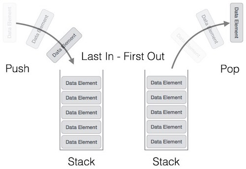
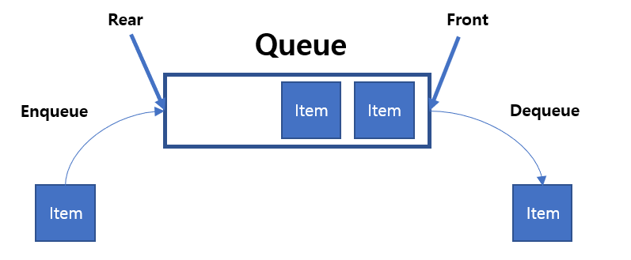
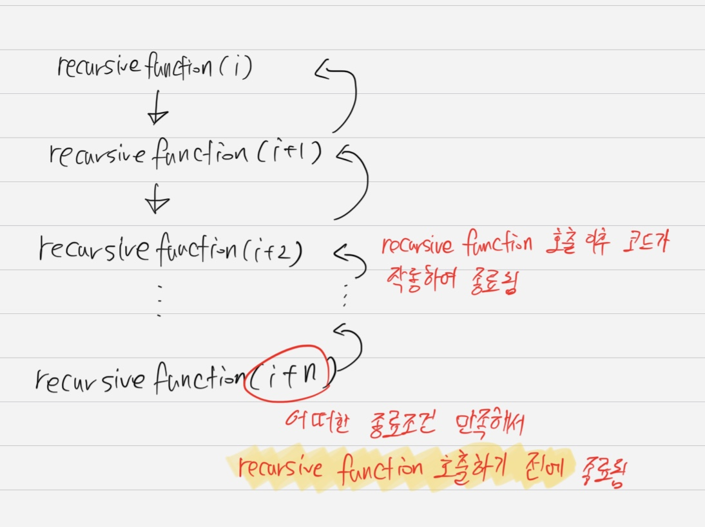
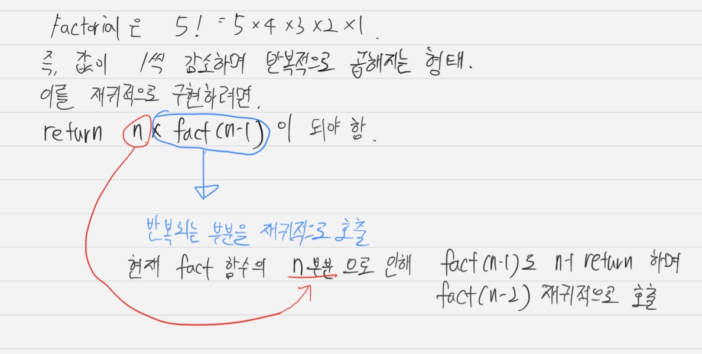
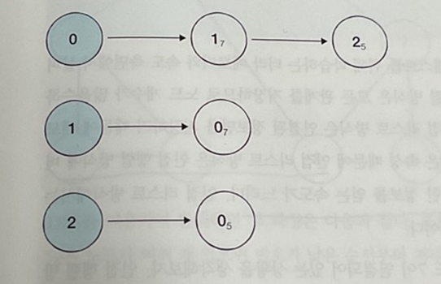

# Stack
- First In Last Out (선입후출 구조)

<p align="center">  </p>
[출처](https://wayhome25.github.io/cs/2017/04/18/cs-20/)

## 코드
- 파이썬 기본 함수들만 사용하여 구현 가능


```python
stack = []

stack.append(5)
stack.append(2)
stack.append(3)
stack.append(7)
stack.pop()
stack.append(1)
stack.append(4)
stack.pop()

print(stack)
print(stack[::-1])
```
```
[5, 2, 3, 1]
[1, 3, 2, 5]
```
# Queue
First In First Out (선입선출 구조)

<p align="center">   </p>" width="70%"> </p>

## 코드
- deque 라이브러리 사용하여 구현
  - deque로는 stack도 사실 구현 가능하다


```python
from collections import deque

queue = deque()

queue.append(5)
queue.append(2)
queue.append(3)
queue.append(7)
queue.popleft()
queue.append(1)
queue.append(4)
queue.popleft()

print(queue)
queue.reverse()
print(queue)
```

```
deque([3, 7, 1, 4])
deque([4, 1, 7, 3])
```

# 재귀 함수

자기 자신을 다시 호출하는 함수.  
내부적으로는 스택 자료구조 활용함.  
구현에 필수적으로 필요한 건 재귀적 호출이 끝나는 **종료조건**

<p align="center">  </p>

위 그림은 재귀적으로 호출할 때 **인자값을 하나씩 올려서 넘겨주고**, 그 올라가는 인자값을 **종료조건**으로 활용하고 있는 것이다.

## 코드

- 기본 구현


```python
def recursive_function(i):
  # 100번째 출력이 됐을 때 종료되도록 종료조건 명시

  if i == 15:
    return

  recursive_function(i + 1)
  print(i, "번째 재귀 함수를 종료합니다.")

recursive_function(0)
```
```
14 번째 재귀 함수를 종료합니다.
13 번째 재귀 함수를 종료합니다.
12 번째 재귀 함수를 종료합니다.
11 번째 재귀 함수를 종료합니다.
10 번째 재귀 함수를 종료합니다.
9 번째 재귀 함수를 종료합니다.
8 번째 재귀 함수를 종료합니다.
7 번째 재귀 함수를 종료합니다.
6 번째 재귀 함수를 종료합니다.
5 번째 재귀 함수를 종료합니다.
4 번째 재귀 함수를 종료합니다.
3 번째 재귀 함수를 종료합니다.
2 번째 재귀 함수를 종료합니다.
1 번째 재귀 함수를 종료합니다.
0 번째 재귀 함수를 종료합니다.
```

- 팩토리얼 구현을 통한 심화 이해

```python
def fact(n):
  num = 1
  for i in range(n):
    num*=(i+1)
  return num


def recur_fact(n):
  if n <= 1:
    return 1
  
  return n * recur_fact(n-1)
  
  
print(fact(5))
print(recur_fact(5))
```

```
120
120
```

- 팩토리얼 코드 그림 보충설명

<p align="center">  </p>

재귀적으로 호출하면 훨씬 코드가 간결해지며, **수학의 점화식을 소스코드로 그대로 옮겼다**는 점에서 의의가 크다  
이는 다이나믹 프로그래밍에서의 중요 개념이 된다.  

$$ n이\,0\, 혹은\, 1일때: factorial(n) = 1 \\ n이\, 1보다\, 클\, 때: factorial(n) = n \times factorial(n-1) $$

# Graph(Node, Edge)

Graph를 표현하는 방식은 인접행렬(Adjacency Matrix) 방법, 인접 리스트(Adjacency List) 방법 존재

## Adjacency Matrix

2차원 배열로 그래프의 연결 관계를 표현하는 방식

||1|2|3|
|---|---|---|---|
||0|1|2|
|0|0|7|5|
|1|7|0|무한|
|2|5|무한|0|

### 코드

```python
INF = 999999999

# 2차원 리스트를 활용해 인접 행렬 표현
graph = [
    [0, 7, 5],
    [7, 0, INF],
    [5, INF, 0]
]

print(graph)
```

```
[[0, 7, 5], [7, 0, 999999999], [5, 999999999, 0]]
```

## Adjacency List

**모든 노드**에 연결된 노드에 대한 정보를 차례대로 연결하여 저장  

<p align="center">  </p>

### 코드

```python
# 행(Row)이 3개인 2차원 리스트로 인접 리스트 ㅍ현
graph = [[] for _ in range(3)]

# 노드 0에 연결된 노드 정보 저장(노드, 거리)
graph[0].append((1, 7))
graph[0].append((2, 5))

# 노드 1에 연결된 노드 정보 저장(노드, 거리)
graph[1].append((0,7))

# 노드 2에 연결된 노드 정보 저장(노드, 거리)
graph[2].append((0, 5))

print(graph)
```

```
[[(1, 7), (2, 5)], [(0, 7)], [(0, 5)]]
```

파이썬 기본 문법으로 인접 행렬 방식, 인접 리스트 방식 모두 구현 가능
{:.info}

메모리 측면에서는 인접 리스트 방식의 이점이 크지만  
속도 측면에서는 인접 행렬 방식의 이점이 크다.


# 해쉬테이블

## 시간 복잡도

- 수정, 삭제 모두 O(1)  

## 원리

- Key, value가 아닌 value만 사용  

<p align="center">  </p>

- Array로 이루어져있으며 index를 Hash function을 통해 접근
  - 위 그림에서 글자수를 index로 반환해주는 Hash function이 있다고 하면 cake를 key로 줬을 때 바로 5달러로 접근 가능
  - taco를 넣게되면 기존에 저장되어있는 4로 접근하기 때문에 **Collision** 발생하며 이를 Hash collision이라고 함
    - 이것때문에 항상 O(1)로 삽입, 삭제, 탐색이 이루어지는것은 아니지만 평균적으로 따지기 때문에 O(1)로 생각하면 된다고 함. 평균적..?