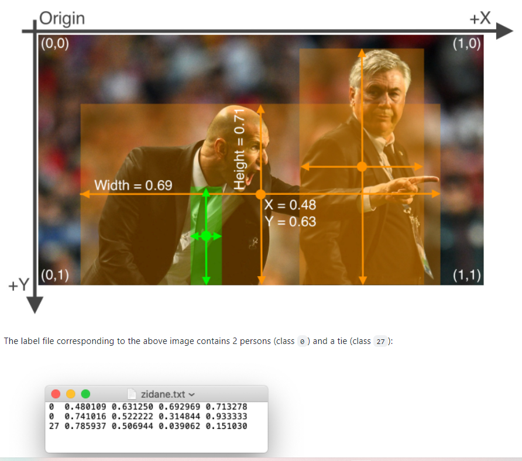
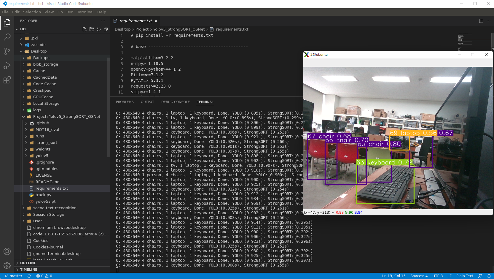
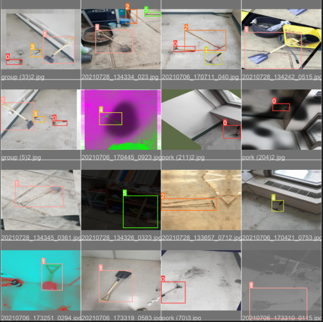
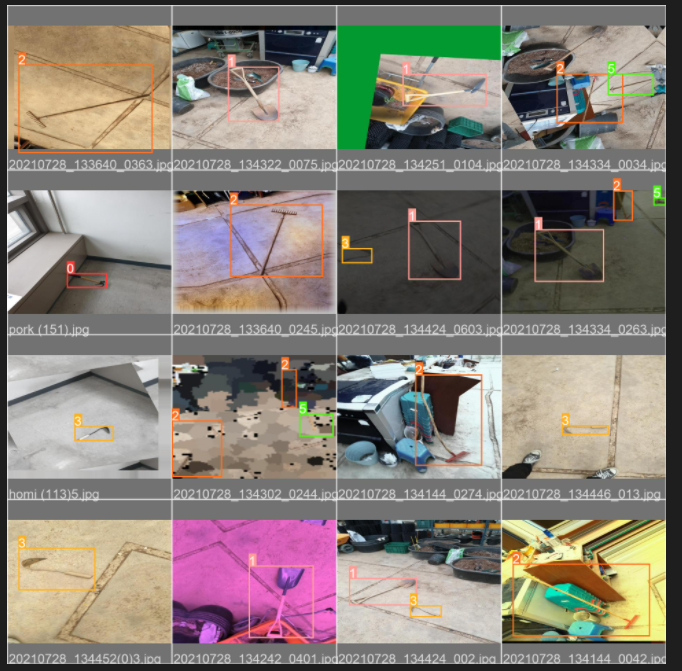
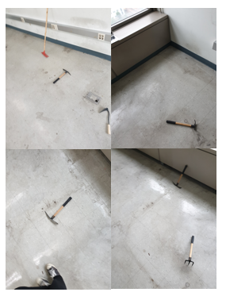
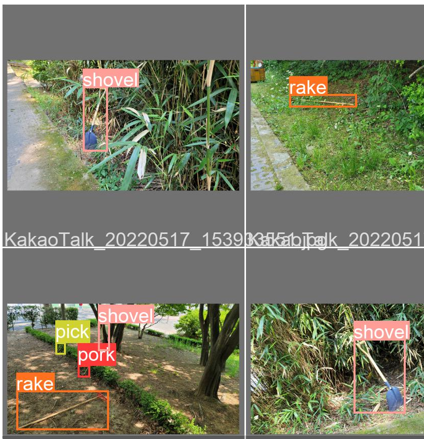
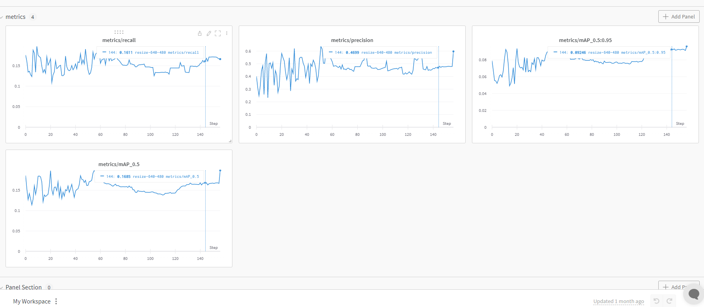
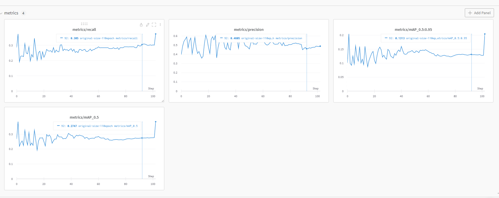

# 계획

- TensorRT 접목을 통한 가속화
  - [ ] EasyOCR 안되면 CRNN으로도 해보는 방향 시도
  - [ ] easyOCR GPU 모드에서 배치사이즈 늘리면 inference 속도 올릴 수 있다고 함. 적용해보자 [링크](https://github.com/JaidedAI/EasyOCR/issues/426)
- **여러 실험, 어그멘테이션 등으로 농기구 인식률 향상시키기 (이게 제일 중요)**
  - [ ] 어그멘테이션 적용
    - [ ] 테스트 데이터를 hard하게 구성해두자! 이를 통해 몇 epoch 부터 test set 성능이 안좋아지는지 check (wandb 활용!)
  - [ ] DeepSort 적용
- HCI 향상
  - [ ] Bluetooth로 마이크, 스피커 대체
  - [ ] 헬멧에 카메라 다는 것보다 더 나은 방향으로 접근(이건 모든 기능 구현이 끝나고 진행)

# TensorRT 관련
[Easy-OCR & TensorRT Github](https://github.com/NVIDIA-AI-IOT/scene-text-recognition)  
[TensorRT Tutorial](https://learnopencv.com/how-to-convert-a-model-from-pytorch-to-tensorrt-and-speed-up-inference/)

# 깊이 추정 관련
- 안드로이드 핸드폰으로 Depth 관련 기능을 구현할 수 있는 것으로 보인다.  
[Android DepthAPI](https://developers.google.com/ar/develop/java/depth/developer-guide)

# Xavier 관련 지식 정리

## Docker

L4T-Base container 라는것을 사용하며 여기서 L4T의 의미는 Tegra에서 실행 가능한 Linux를 말한다. (Xavier 볼 수 있는 약간 독특한 Ubuntu 18.04를 의미하는 듯 하다.)  

Xavier에서 Docker를 활용하여 RealSense 환경, Yolov5 관련 환경등을 이미지화 하여 프로젝트 환경 관련 유지보수에 이점을 얻고자 한다.

# Yolov5 구현 관련 지식 정리

## 레이블링 포맷

```
<class> <x_center> <y_center> <width> <height>
```

<p align="center">  </p>

# 3D 프린팅 제작

RealSense와 연결되는 나사 폭 6.2mm  

x 반도에 등쪽 부분에 장비들 거는 형식으로 가면 좋을 것 같음

# 개발 과정

2차년도 개발할 때 Xavier local에 모든 환경 및 설정파일 설치해서 진행했는데, 버젼을 올리거나 환경을 바꿔야 할 일이 생길 때마다 아주 골머리였다. 그래서 이번 3차년도에는 Docker를 적용하고자 하였으며, 여러 시행착오 끝에 Windows 상에서 ssh 연결 및 X11-forwarding을 통해 훨씬 더 나은 환경으로 구성하여 개발을 진행한다. 

<div align="center" markdown="1">  
코드가 궁금하다면 [여기 포스트 참고](/http://yanghojun.github.io/UseCommand/#%EB%A1%9C%EC%BB%AC-%EC%BB%B4%ED%93%A8%ED%84%B0%EC%97%90%EC%84%9C-ssh%EB%A1%9C-xavier-%EC%97%B0%EA%B2%B0%ED%95%98%EC%97%AC-%EA%B0%9C%EB%B0%9C-%EC%89%BD%EA%B2%8C%ED%95%98%EA%B8%B0)
</div>

## Deepsort 알고리즘 적용
날짜: 2022-06-24

Tracking 알고리즘 적용 테스트가 끝이 났다. 도커 컨테이너 내부에서 잘 동작하는 것을 확인할 수 있었지만, __`torch.cuda.is.available() = False`로 인해 아직 GPU 모드에서의 테스트는 진행하지 못했다.__  
python3.6 이상을 요구하는 라이브러리를 몇개 제거하여 l4t ml 컨테이너에서 `torch.cuda.is.available() = True`를 확인하며 동작하게 하였다.    

<p align="center">  </p>

<div align="center" markdown="1"> vscode는 xavier Session 에서 연 것이며, yolov5 tracking gui는 xavier 내부 container에서 실행한 것이다. 
</div>


## Data augmentation 검증 및 DeepSort 알고리즘에 학습한 가중치 load
날짜: 2022-07-03

<p align="center">    </p>
<div align="center" markdown="1"> Augmentation 적용한 농기구 학습 이미지
</div>

### Wandb Metrics 점수 조회
날짜: 2022-07-03

- Validation에 사용한 이미지  

일반적인 환경에서 농기구를 잘 인식하는지 확인하기 위해 Validation에 사용되는 데이터는 학습 이미지 환경(주로 연구실 배경임)과 전혀 다르게(야외 촬영) 구성하였다.

<p align="center">   </p>
<div align="center" markdown="1"> (좌) 학습에 사용된 농기구 이미지 예시, (우) 검증에 사용된 농기구 이미지 예시
</div>

- wandb 점수 그래프

<p align="center">  </p>

<div align="center" markdown="1"> 축소 이미지(640 x 480) 사이즈에 대한 metrics score

**약 0.16 정도의 recall 점수 확인**
</div>

<p align="center">  </p>

<div align="center" markdown="1"> (하) 원본 이미지(3024 x 4032) 사이즈에 대한 metrics score 

**약 0.30 정도의 recall 점수 확인**
</div>

Recall 점수에 대해서 봤을 때 원본 이미지가 약 2배 정도 높은 점수를 기록하고 있지만 임베디드 시스템의 특성상 이미지 사이즈가 커질수록 처리 속도가 크게 느려지기 때문에 축소된 이미지로 기능 구현을 이어나갈 예정이다.  

## Depth Camera 연동

realsense camera 연동하는데 계속 에러가 나서 정신 나가는줄 알았다.  

l4t version을 조금 낮추고, 별에별 구글링으로 나온 코드들을 치고 삭제하고 다시하고 삽질을 해본 결과 다음의 명령어로 성공할 수 있었다.  

```bash
# Installs librealsense and pyrealsense2 on the Jetson NX running Ubuntu 18.04
# and using Python 3
# Tested on a Jetson NX running Ubuntu 18.04 and Python 3.6.9 on 2020-11-04

sudo apt-get update && sudo apt-get -y upgrade
sudo apt-get install -y --no-install-recommends \
    python3 \
    python3-setuptools \
    python3-pip \
    python3-dev

# Install the core packages required to build librealsense libs
sudo apt-get install -y git libssl-dev libusb-1.0-0-dev pkg-config libgtk-3-dev
# Install Distribution-specific packages for Ubuntu 18
sudo apt-get install -y libglfw3-dev libgl1-mesa-dev libglu1-mesa-dev

# Install LibRealSense from source
# We need to build from source because
# the PyPi pip packages are not compatible with Arm processors.
# See link [here](https://github.com/IntelRealSense/librealsense/issues/6964).

# First clone the repository
git clone https://github.com/IntelRealSense/librealsense.git
cd ./librealsense

# Make sure that your RealSense cameras are disconnected at this point
# Run the Intel Realsense permissions script
./scripts/setup_udev_rules.sh

# Now the build
mkdir build && cd build
## Install CMake with Python bindings (that's what the -DBUILD flag is for)
## see link: https://github.com/IntelRealSense/librealsense/tree/master/wrappers/python#building-from-source
cmake ../ -DBUILD_PYTHON_BINDINGS:bool=true
## Recompile and install librealsense binaries
## This is gonna take a while! The -j4 flag means to use 4 cores in parallel
## but you can remove it and simply run `sudo make` instead, which will take longer
sudo make uninstall && sudo make clean && sudo make -j4 && sudo make install

## Export pyrealsense2 to your PYTHONPATH so `import pyrealsense2` works
export PYTHONPATH=$PYTHONPATH:/usr/local/lib/python3.6/pyrealsense2
```

<div align="center" markdown="1"> 출처:  [https://github.com/IntelRealSense/librealsense/issues/7722](https://github.com/IntelRealSense/librealsense/issues/7722)  
Docker Hub에 바로 realsense 카메라만 연동해서 사용할 수 있도록 image를 올려두었다.  
[Dockerhub ghwns1102/yolocr 링크](https://hub.docker.com/repository/docker/ghwns1102/yolocr)
</div>

내 AGX Xavier 정보
- Jetpack 4.6.2(L4T 32.7.2) - 하지만 L4T 32.6.1짜리 Docker를 사용했다. [NVIDIA L4T ML 링크](https://catalog.ngc.nvidia.com/orgs/nvidia/containers/l4t-ml)