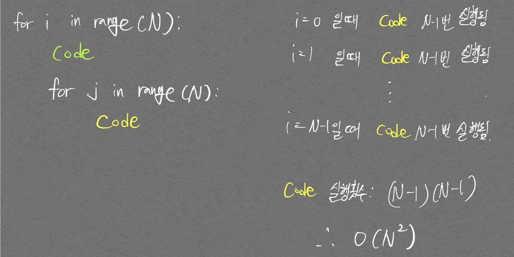
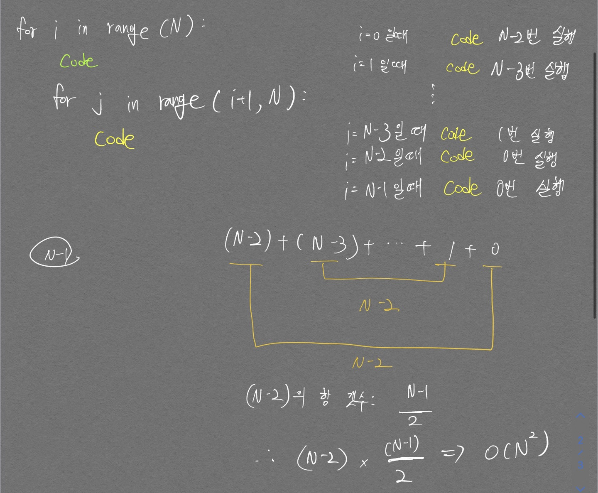
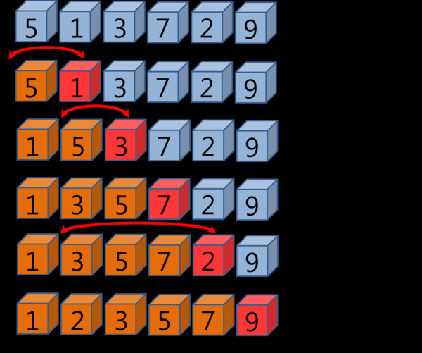
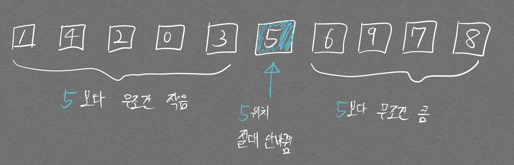
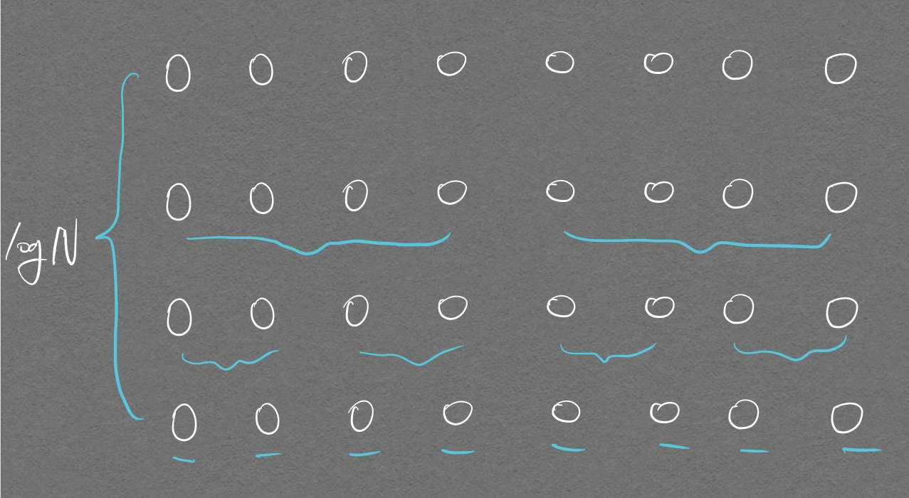

# 선택 정렬

| 가장 작은 데이터를 선택해 맨 앞에 있는 데이터와 바꾸고, 그 다음 작은 데이터를 선택해 두번째 데이터와 바꾸는 과정을 반복해보면 어떨까?

첫번째 for문의 idx가 array끼리의 자리 변경을 위한 앞 인덱스 저장.  
두번째 for문이 앞에 지정된 인덱스를 제외한 모든 뒤 요소들끼리 크기 비교를 통해 최소값을 가지는 인덱스 저장.

두 인덱스를 활용하여 값 변경

```python
array = [7, 5, 9, 0, 3, 1, 6, 2, 4, 8]

for i in range(len(array)):
  min_index = i     # 가장 작은 원소의 인덱스
  for j in range(i+1, len(array)):
    if array[min_index] > array[j]:     # 가장 작은 원소를 찾기위해 맨 앞 element부터 search
      min_index = j
  array[i], array[min_index] = array[min_index], array[i]       # 파이썬은 swap 기능을 통해 간단하게 swap

print(array)
```

```
[0, 1, 2, 3, 4, 5, 6, 7, 8, 9]
```

시간복잡도를 계산해보는데 `for j in range(i+1, len(array))` 부분으로 인해 $$ N + (N - 1) + (N - 2) + ... + 2 = {N^2 + N \over 2}$$ 가 되고 `for n in range(len(array))`로 인해 $$ O(N^3) $$ 이 되는것이 아닌가 헷갈렸다.  
$${N^2 + N \over 2}$$에 `for n in range(len(array))`가 돌아가는 것도 포함되어 있는 것이다.  

다음의 그림을 보면 이해가 쉬울 것이다.  

<p align="center">  </p>

<p align="center">  </p>


# 삽입정렬

| 데이터를 하나씩 확인하며, 각 데이터를 적절한 위치에 삽입하고 바로 끝내면 어떨까?

<p align="center">  </p>
[출처: https://m.blog.naver.com/PostView.naver?isHttpsRedirect=true&blogId=justant&logNo=20204025251](https://m.blog.naver.com/PostView.naver?isHttpsRedirect=true&blogId=justant&logNo=20204025251)

- 위 그림의 주황색 영역은 **이미 정렬이 되어 있는것**으로 간주.  
= 빨간색 요소를 적절한 위치에 삽입하는것이 목표이며 주황색 요소의 맨 뒤부터 앞까지 순차적으로 비교를 진행함.  
- 중요한것은 한번이라도 빨간색 요소보다 작은 주황색 요소가 발견되었다면 그대로 종료함.
  - 이 특성때문에 정렬이 어느정도 되어있는 array의 경우 퀵 정렬 알고리즘보다도 빠르다.

```python
array = [7, 5, 9, 0, 3, 1, 6, 2, 4, 8]

for i in range(1, len(array)):
  # 처음 시작할 때 맨 앞 노드는 정렬되어 있는것으로 가정.
  # 생각해보면 당연한게 정렬이란 개념은 2개 이상 원소가 있을 때 부터 필요한것임
  for j in range(i, 0, -1):  # 인덱스 i부터 1까지 감소하며 반복하는 문법
    if array[j] < array[j-1]:  # 한 칸씩 왼쪽으로 이동
      array[j], array[j-1] = array[j-1], array[j]
    else:  # 자기보다 작은 데이터를 만나면 그 위치에서 멈춤
      break

print(array)
```

```
[0, 1, 2, 3, 4, 5, 6, 7, 8, 9]
```

$$O(N^2)$$
의 소요시간을 갖지만 최선의 경우 $$O(N)$$의 소요시간을 갖는다.

# 퀵 정렬

| 기준 데이터를 설정하고 그 기준보다 큰 데이터와 작은 데이터의 위치를 바꾸면 어떨까?

- 이해하는데 가장 도움이 됐던 영상
  - 영상은 pivot을 비교할 리스트의 가장 오른쪽에 두는 것으로 설명 했지만 아래 작성해놓은 코드는 pivot을 비교할 리스트의 가장 왼쪽에 두는것으로 구현되어 있다.

<p align="center">
<iframe width="560" height="315" src="https://www.youtube.com/embed/cWH49IKDIiI" title="YouTube video player" frameborder="0" allow="accelerometer; autoplay; clipboard-write; encrypted-media; gyroscope; picture-in-picture" allowfullscreen></iframe>
</p>

- 핵심적으로 기억해야 할 부분은 피벗이 이동한 경우 이동된 그 위치는 이제부터 **고정된다. (앞으로 안바뀜)**
  - 그 위치에서의 왼쪽, 오른쪽이 정렬된지는 모르겠으나, 왼쪽은 자신보다 작고 오른쪽은 자신보다 큰 값들로 이루어져 있다.

<p align="center">  </p>

```python
array = [5, 7, 9, 0, 3, 1, 6, 2, 4, 8]

def quick_sort(array, start, end):
  if start >= end:    # 재귀함수 종료조건
                      # 비교할 array가 하나일 때 start, end가 같아진다.
    return
    
  pivot = start
  left = start + 1
  right = end

  while(left <= right):  # 이 조건으로 인해 left, right 인덱스가 교차되는 순간 탈출하게 됨
                         # 아래 if left > right 조건문을 같이 보면, 피벗 위치가 변경되는 순간 while문 탈출하고 재귀적 호출 진행됨
                         # This is art..

    # 피벗보다 큰 데이터를 찾을 때까지 반복
    while left <= end and array[left] <= array[pivot]:
      left += 1

    # 피벗보다 작은 데이터를 찾을 때가지 반복
    while right > start and array[right] >= array[pivot]:
      right -= 1

    if left > right: # 엇갈렸다면 작은 데이터와 피벗을 교체
                     # 이렇게 교체 된 이후에는, while문의 조건이 false로 변경됨
                     # 여기 if문을 들어온 순간 while문도 탈출 예정. 즉 pivot, right swap하고 바로 변경된다.
      array[right], array[pivot] = array[pivot], array[right]
    else: # 엇갈리지 않았다면 작은 데이터와 큰 데이터 교체
      array[left], array[right] = array[right], array[left]

  # 분할 이후 왼쪽 부분과 오른쪽 부분에서 각각 정렬 수행
  quick_sort(array, start, right-1)
  quick_sort(array, right + 1, end)
  
quick_sort(array, 0, len(array) - 1)
print(array)
```

```
[0, 1, 2, 3, 4, 5, 6, 7, 8, 9]
```

```python
array = [5, 7, 9, 0, 3, 1, 6, 2, 4, 8]

def quick_sort(array):
  # 리스트가 하나 이하의 원소만 담고 있다면 종료
  # 나 처음에 구현할 때 == 1 로 했었음..
  if len(array) <= 1:
    return array

  pivot = array[0]    # 리스트의 제일 앞을 pivot으로 지정
  tail = array[1:]    # pivot 제외한 부분에 대해 작업 예정

  left_side = [x for x in tail if x < pivot]
  right_side = [x for x in tail if x > pivot]

  return quick_sort(left_side) + [pivot] + quick_sort(right_side)

print(quick_sort(array))
```

```
[0, 1, 2, 3, 4, 5, 6, 7, 8, 9]
```

<p align="center">  </p>

위 그림처럼 N이 늘어날 때 높이는 $$ logN $$ 이라고 할 수 있다.  
즉 데이터 N이 기하급수적으로 늘어나도 평균 시간 복잡도가 $$ O(N log N)$$이다.  
하지만 최악의 경우(가장 왼쪽 데이터를 피벗으로 잡는다고 할 때 이미 정렬되어 있는 경우, 높이가 매우 커짐) $$ O(N^2) $$ 이다.

# 계수정렬

| 정수형 데이터를 정렬할 때, 리스트의 정수형 인덱스를 counting에 활용하여 매우 빠르게 정렬해보자

로직은 쉽다.  

```python
array = [7, 5, 9, 0, 3, 1, 6, 2, 9, 1, 4, 8, 0, 5, 2]

count = [0] * (max(array) + 1)

for i in range(len(array)):
  count[array[i]] += 1

for i in range(len(count)):   
  for j in range(count[i]):
    print(i, end=' ')
```

수행시간이 최악의 경우에도 $$ O(N + K)$$ 이다. 난 처음에 2중 반복문이여서 왜 $$ O(N^2) $$이 아니였는지 의아했지만 두번째 반복문 부분이 count 배열 크기에 의존하였으며 이 count 배열 크기는 data 갯수가 아닌 현재 데이터 중 최대값 K로 결정된 다는 것 때문에 $$ O(N + K) $$ 이다.  
근데 $$O(N+K)$$면 그냥 $$O(N)$$으로 나타내도 될 듯 하다


# 문제

| p.183

- 기존 풀이


```python
n, k = map(int, input().split())

a = []
b = []

a = list(map(int, input().split()))
b = list(map(int, input().split()))

for _ in range(k):
  a_min, b_max = min(a), max(b)

  if a_min < b_max:
    a[a.index(a_min)], b[b.index(b_max)] = b[b.index(b_max)], a[a.index(a_min)]

sum = 0

for _ in range(len(a)):
  sum += a[_]

print(sum)
```

- 좀 더 효율적인 풀이
  - 오름차순, 내림차순 정렬을 활용하여 break를 통해 더 빠른 알고리즘을 구현하였음

```python

```