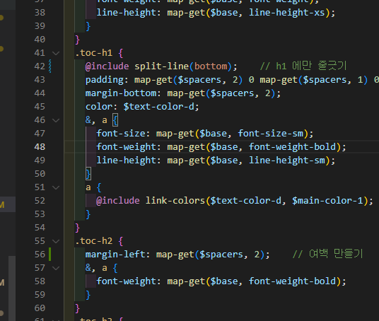
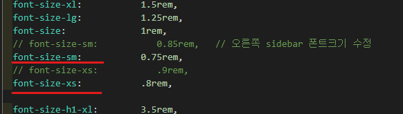
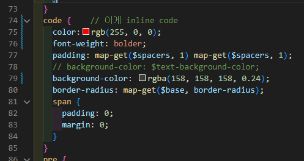
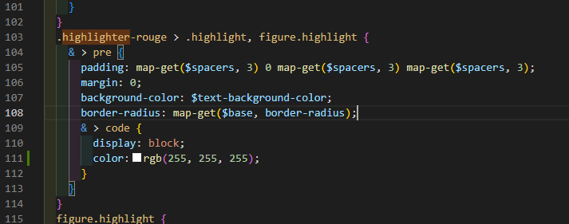
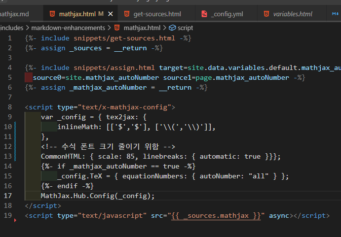

# toc 수정

## 여백 늘리기

- 오른쪽 toc의 글자 크기별로(h1, h2, h3) 여백을 줘서 구분감을 키움

<p align="center">  </p>
<div align="center">_toc.scss 파일</div>

## 글자 크기 수정

<p align="center">  </p>
<div align="center">_variables.scss 파일</div>


## 크기 늘리기

`_variable.scss` 파일 수정

```scss
$layout: (
  header-height:          5rem,
  header-height-sm:       3rem,
  content-max-width:      950px,
  sidebar-width:          250px,
  sidebar-header-height:  3rem,
  // aside-width:            220px
  aside-width:            300px   // 기존보다 조금 더 늘렸다.
);
```

# 포스터 수정

## 글자 크기 수정

```yaml
  font-size-h1:           2.2rem,
  font-size-h2:           1.6rem,
  font-size-h3:           1.2rem,
  font-size-h4:           0.9rem,
  font-size-h5:           0.7rem,
  font-size-h6:           0.7rem,
```
<div align="center"> _variables.scss 파일 </div>

## h1, h2 밑줄 안가게 하기

```yaml

// 변경 전
h1,h2
  {
    @include split-line(bottom);
  }

// 변경 후
h1
{
    @include split-line(bottom); // h1 아래에만 밑줄이 그어지도록 변경
}
```
<div align="center"> _reset.scss 파일 </div>

## highlight 글자 색깔 변경

`이 하이라이트 색깔 바꾸는 것임`

<p align="center">  </p>
<div align="center" markdown="1"> _article-content.scss 
</div>

- code창 안에 있는 일반 plain-text 색깔 지정을 위해서는 아래를 편집하면 됨

<p align="center">  </p>
<div align="center" markdown="1"> _article-content.scss 
</div>

## mathjax (수식) 폰트 크기 변경

<p align="center">  </p>


# Jekyll 다운됐을 때 대비

## Content

<div class="item">
  <div class="item__content">
    <div class="item__header">
      <h4>Photograph</h4>
    </div>
    <div class="item__description">
      <p>
        A photograph is an image created by light falling on a photosensitive surface, usually photographic film or an electronic image sensor, such as a CCD or a CMOS chip.
      </p>
    </div>
  </div>
</div>

```html
<div class="item">
  <div class="item__content">
    <div class="item__header">
      <h4>Photograph</h4>
    </div>
    <div class="item__description">
      <p>...</p>
    </div>
  </div>
</div>
```

## Image and Content


<div class="item">
  <div class="item__image">
    
  </div>
  <div class="item__content">
    <div class="item__header">
      <h4>Photograph</h4>
    </div>
  </div>
</div>

```html
<div class="item">
  <div class="item__image">
    
  </div>
  <div class="item__content">
    <div class="item__header">
      <h4>Photograph</h4>
    </div>
  </div>
</div>
```

<div class="item">
  <div class="item__image">
    
  </div>
  <div class="item__content">
    <div class="item__header">
      <h4>Photograph</h4>
    </div>
    <div class="item__description">
      <p>
        A photograph is an image created by light falling on a photosensitive surface, usually photographic film or an electronic image sensor, such as a CCD or a CMOS chip.
      </p>
    </div>
  </div>
</div>

```html
<div class="item">
  <div class="item__image">
    
  </div>
  <div class="item__content">
    <div class="item__header">
      <h4>Photograph</h4>
    </div>
    <div class="item__description">
      <p>...</p>
    </div>
  </div>
</div>
```

## Image Size

<div class="item">
  <div class="item__image">
    
  </div>
  <div class="item__content">
    <div class="item__header">
      <h4>Photograph</h4>
    </div>
  </div>
</div>

```html
<div class="item">
  <div class="item__image">
    
  </div>
  <div class="item__content">
    <div class="item__header">
      <h4>Photograph</h4>
    </div>
  </div>
</div>
```

<div class="item">
  <div class="item__image">
    
  </div>
  <div class="item__content">
    <div class="item__header">
      <h4>Photograph</h4>
    </div>
    <div class="item__description">
      <p>
        A photograph is an image created by light falling on a photosensitive surface, usually photographic film or an electronic image sensor, such as a CCD or a CMOS chip.
      </p>
    </div>
  </div>
</div>

```html
<div class="item">
  <div class="item__image">
    
  </div>
  <div class="item__content">
    <div class="item__header">
      <h4>Photograph</h4>
    </div>
    <div class="item__description">
      <p>...</p>
    </div>
  </div>
</div>
```

<div class="item">
  <div class="item__image">
    
  </div>
  <div class="item__content">
    <div class="item__header">
      <h4>Photograph</h4>
    </div>
    <div class="item__description">
      <p>
        A photograph is an image created by light falling on a photosensitive surface, usually photographic film or an electronic image sensor, such as a CCD or a CMOS chip.
      </p>
    </div>
  </div>
</div>

```html
<div class="item">
  <div class="item__image">
    
  </div>
  <div class="item__content">
    <div class="item__header">
      <h4>Photograph</h4>
    </div>
    <div class="item__description">
      <p>...</p>
    </div>
  </div>
</div>
```


## Image

<div class="card">
  <div class="card__image">
    
  </div>
</div>

```html
<div class="card">
  <div class="card__image">
    
  </div>
</div>
```

## Content

<div class="card">
  <div class="card__content">
    <div class="card__header">
      <h4>Photograph</h4>
    </div>
    <p>A photograph is an image created by light falling on a photosensitive surface, usually photographic film or an electronic image sensor, such as a CCD or a CMOS chip.</p>
  </div>
</div>

```html
<div class="card">
  <div class="card__content">
    <div class="card__header">
      <h4>Photograph</h4>
    </div>
    <p>...</p>
  </div>
</div>
```

## Image and Content

<div class="card">
  <div class="card__image">
    
  </div>
  <div class="card__content">
    <div class="card__header">
      <h4>Photograph</h4>
    </div>
  </div>
</div>

```html
<div class="card">
  <div class="card__image">
    
  </div>
  <div class="card__content">
    <div class="card__header">
      <h4>Photograph</h4>
    </div>
  </div>
</div>
```

<div class="card">
  <div class="card__image">
    
  </div>
  <div class="card__content">
    <div class="card__header">
      <h4>Photograph</h4>
    </div>
    <p>
      A photograph is an image created by light falling on a photosensitive surface, usually photographic film or an electronic image sensor, such as a CCD or a CMOS chip.
    </p>
  </div>
</div>

```html
<div class="card">
  <div class="card__image">
    
  </div>
  <div class="card__content">
    <div class="card__header">
      <h4>Photograph</h4>
    </div>
    <p>...</p>
  </div>
</div>
```

## Image Overlay

<div class="card">
  <div class="card__image">
    
    <div class="overlay">
      <p>Photograph</p>
    </div>
  </div>
</div>

```html
<div class="card">
  <div class="card__image">
    
    <div class="overlay">
      <p>Photograph</p>
    </div>
  </div>
</div>
```

<div class="card">
  <div class="card__image">
    
    <div class="overlay overlay--bottom">
      <p>Photograph</p>
    </div>
  </div>
</div>

```html
<div class="card">
  <div class="card__image">
    
    <div class="overlay overlay--bottom">
      <p>Photograph</p>
    </div>
  </div>
</div>
```

## Flat

<div class="card card--flat">
  <div class="card__image">
    
  </div>
  <div class="card__content">
    <div class="card__header">
      <h4>Photograph</h4>
    </div>
  </div>
</div>

```html
<div class="card card--flat">
  <div class="card__image">
    
  </div>
  <div class="card__content">
    <div class="card__header">
      <h4>Photograph</h4>
    </div>
  </div>
</div>
```

## Clickable

<div>
  <div class="card card--clickable">
    <div class="card__image">
      
    </div>
  </div>
</div>

```html
<a href="">
  <div class="card card--clickable">
    <div class="card__image">
      
    </div>
  </div>
</a>
```

## Logo

<p>TeXt   <span></span> as logo, you can change it by replacing <em>_includes/svg/logo.svg</em> with your own logo.</p>

## Favicon

TeXt recommend [RealFaviconGenerator](https://realfavicongenerator.net/) for generating favicon.

Open [RealFaviconGenerator](https://realfavicongenerator.net/), click “Select your Favicon picture” and then choose your favicon picture.


After settings you need tell the generator where you would place favicon files, TeXt default put them to */assets*.

It’s recommended to put favicon files at the root of your site.
{:.warning}


If all are done, just click “Generate your Favicons and HTML code” to the last step.


Download favicon package and unzip it to the path you just set, and replace the HTML code in *_includes/head/favicon.html*.