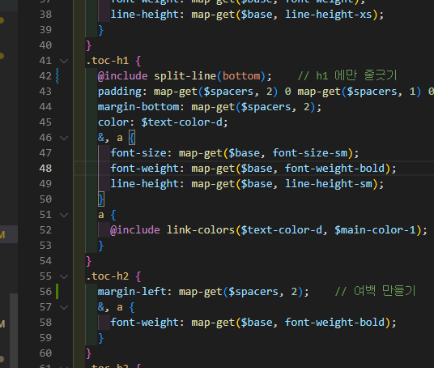
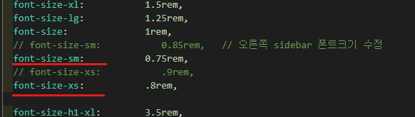
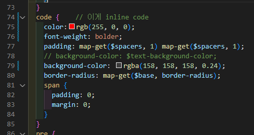
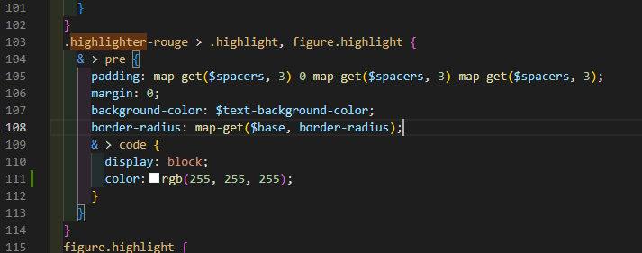

# toc 수정

## 여백 늘리기

- 오른쪽 toc의 글자 크기별로(h1, h2, h3) 여백을 줘서 구분감을 키움

<p align="center">  </p>
<div align="center">_toc.scss 파일</div>

## 글자 크기 수정

<p align="center">  </p>
<div align="center">_variables.scss 파일</div>

# 포스터 수정

## 글자 크기 수정

```yaml
  font-size-h1:           2.2rem,
  font-size-h2:           1.6rem,
  font-size-h3:           1.2rem,
  font-size-h4:           0.9rem,
  font-size-h5:           0.7rem,
  font-size-h6:           0.7rem,
```
<div align="center"> _variables.scss 파일 </div>

## h1, h2 밑줄 안가게 하기

```yaml

// 변경 전
h1,h2
  {
    @include split-line(bottom);
  }

// 변경 후
h1
{
    @include split-line(bottom); // h1 아래에만 밑줄이 그어지도록 변경
}
```
<div align="center"> _reset.scss 파일 </div>

## highlight 글자 색깔 변경

`이 하이라이트 색깔 바꾸는 것임`

<p align="center">  </p>
<div align="center" markdown="1"> _article-content.scss 
</div>

- code창 안에 있는 일반 plain-text 색깔 지정을 위해서는 아래를 편집하면 됨

<p align="center">  </p>
<div align="center" markdown="1"> _article-content.scss 
</div>