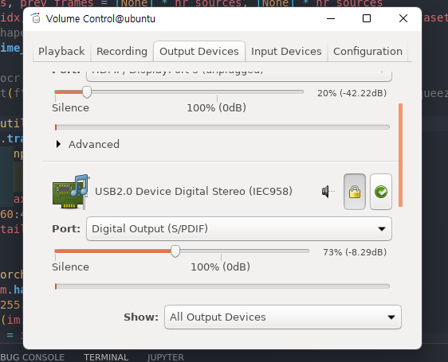

| 온갖 수많은 버그와, 환경 충돌을 이겨낸 포스트이다.. 정신건강이 이롭고 싶다면 맨 위 항목부터 순차적으로 설치할것을 명심해라..

# 환경설정
## Jetpack 및 jetson-stats 설치
Jetpack 4.6.1은 설치 후 모니터에 신호가 들어오지 않는 에러가 발생한다...  따라서 Jetpack 4.6.2로 설치하였다.

WIFI, Ethernet 으로 별 쌩쑈를 다 해봤는데도 sdkmanager를 통해 설치를 진행할 때 Internel access에서 error가 발생하여 원할히 설치가 되지 않았다. 따라서 L4T(Linux For Tegra)만 설치한 후 Jetson 기기에서 로컬로 Jetpack(4.6.2 버젼)을 설치하였다. 명령어는 다음과 같다.  

```bash
sudo apt update
sudo apt install nvidia-jetpack
sudo -H pip install -U jetson-stats
```

이후 터미널에 `jtop`을 쳐서 cuda, cudnn, tensorrt 등이 잘 설치되어있는지 확인하자. (Opencv의 Cuda가 No인 것이 매우 불편할 것인데 그건 아래에서 설명하겠다.)

## Pytorch 설치

Forum에 있는 jetson용 pytorch를 install 하는데 1.10.0을 설치하고 싶어도 1.8.0이 깔리는 기이한 현상이 나타났다..  그래서 다음의 페이지를 참고하여 설치하였다. [Q-engineering](https://qengineering.eu/install-pytorch-on-jetson-nano.html)  

보기 쉽게 필요한 command들을 나열해놨다.  

<div align="center" markdown="1">  Pytorch 1.10.0, torchvision 0.11.0 설치
</div>

```bash
# install the dependencies (if not already onboard)
sudo apt-get install python3-pip libjpeg-dev libopenblas-dev libopenmpi-dev libomp-dev
sudo -H pip3 install future
sudo pip3 install -U --user wheel mock pillow
sudo -H pip3 install testresources
# above 58.3.0 you get version issues
sudo -H pip3 install setuptools==58.3.0
sudo -H pip3 install Cython
# install gdown to download from Google drive
sudo -H pip3 install gdown
# download the wheel
gdown https://drive.google.com/uc?id=1TqC6_2cwqiYacjoLhLgrZoap6-sVL2sd
# install PyTorch 1.10.0
sudo -H pip3 install torch-1.10.0a0+git36449ea-cp36-cp36m-linux_aarch64.whl
# clean up
rm torch-1.10.0a0+git36449ea-cp36-cp36m-linux_aarch64.whl
sudo apt-get install libjpeg-dev zlib1g-dev libpython3-dev libavcodec-dev libavformat-dev libswscale-dev
git clone --branch 0.11.1 https://github.com/pytorch/vision torchvision   # see below for version of torchvision to download
cd torchvision
export BUILD_VERSION=0.11.1
python3 setup.py install --user
cd ../
```

## OpenCV(Cuda version) 설치

Jetpack을 설치하고 `sudo apt install nvidia-jetpack` 명령어까지 성공적으로 실행했다면 OpenCV 4.1 버전이 설치되어 있을 것이다.  나는 CUDA 사용이 가능한 OpenCV를 설치하고 싶어서 아래의 명령어를 통해 설치하였다.  

```bash
wget https://github.com/Qengineering/Install-OpenCV-Jetson-Nano/raw/main/OpenCV-4-5-4.sh
sudo chmod 755 ./OpenCV-4-5-4.sh
./OpenCV-4-5-4.sh
```

OpenCV-4-5-4.sh 스크립트를 실행하는데 rm 명령어 부분에서 에러가 나서 다음과 같이 해결하였다. (Opencv-4-5-4.sh sudo rm-r /usr/include/opencv4/opencv2 명령어를 건너띄고 직접 실행시킨 것임)

```bash
cd ~/opencv
sudo make install
sudo ldconfig
make clean
sudo apt-get update
```

## Yolov5 실행시키기 위한 관련 라이브러리 설치

```bash
# pip install -r requirements.txt

# base ----------------------------------------

matplotlib>=3.2.2
numpy>=1.18.5
# opencv-python>=4.1.2
# Pillow>=7.1.2
PyYAML>=5.3.1
requests>=2.23.0
scipy>=1.4.1
# torch>=1.7.0
# torchvision>=0.8.1
tqdm>=4.41.0
tensorboard
# plotting ------------------------------------

pandas>=1.1.4
seaborn>=0.11.0

# deep_sort -----------------------------------

easydict

# torchreid

Cython
h5py
six
tb-nightly
future
yacs
gdown
flake8
yapf
isort==4.3.21
imageio
```
위 스크립트를 requirement.txt 파일로 만든 후 `pip3 install -r requirement.txt`를 통해 설치하자. (굉장히 오래걸린다. 인내심을 가지고 기다리자)

Yolov5 repository에 있는 requirement.txt 파일의 일부를 수정하여 python3.6 에서도 실행될 수 있게끔 하였다.

## Realsense Camera (d455) 연동

realsense camera 연동하는데 계속 에러가 나서 정신 나가는줄 알았다.  

아래는 내가 삽질하면서 찾은 command 이다.  

순조롭게만 진행하면 바로 realsense camera가 연동될 것이다.

```bash
# Installs librealsense and pyrealsense2 on the Jetson NX running Ubuntu 18.04
# and using Python 3
# Tested on a Jetson NX running Ubuntu 18.04 and Python 3.6.9 on 2020-11-04

sudo apt-get update && sudo apt-get -y upgrade
sudo apt-get install -y --no-install-recommends \
    python3 \
    python3-setuptools \
    python3-pip \
    python3-dev

# Install the core packages required to build librealsense libs
sudo apt-get install -y git libssl-dev libusb-1.0-0-dev pkg-config libgtk-3-dev python3-dev python-dev
# Install Distribution-specific packages for Ubuntu 18
sudo apt-get install -y libglfw3-dev libgl1-mesa-dev libglu1-mesa-dev

# Install LibRealSense from source
# We need to build from source because
# the PyPi pip packages are not compatible with Arm processors.
# See link [here](https://github.com/IntelRealSense/librealsense/issues/6964).

# First clone the repository
git clone https://github.com/IntelRealSense/librealsense.git
cd ./librealsense

# Make sure that your RealSense cameras are disconnected at this point
# Run the Intel Realsense permissions script
./scripts/setup_udev_rules.sh

# Now the build
mkdir build && cd build
## Install CMake with Python bindings (that's what the -DBUILD flag is for)
## see link: https://github.com/IntelRealSense/librealsense/tree/master/wrappers/python#building-from-source
cmake ../ -DBUILD_PYTHON_BINDINGS:bool=true
## Recompile and install librealsense binaries
## This is gonna take a while! The -j4 flag means to use 4 cores in parallel
## but you can remove it and simply run `sudo make` instead, which will take longer
sudo make uninstall && sudo make clean && sudo make -j4 && sudo make install
```

위에까지 성공했다면 `sudo vim ~/.bashrc` 명령어를 통해 `export PYTHONPATH=$PYTHONPATH:/usr/local/lib/python3.6/pyrealsense2`를 맨 마지막줄에 넣어주고 `source ~/.bashrc` 이후 `python3` 및 `import pyrealsense2`를 통해 제대로 import 되는지 check 하자.  


## EasyOCR 설치

분명 torch를 설치한 상태인데 torch를 찾을 수 없다면서 easyocr 설치가 중단되었다.  
아래의 명령어로 설치하니 어느정도 진전이 있었다.  
```python
python3 -m pip install easyocr
```

-m 옵션을 사용하면 sys.path의 **모든 경로를 조사한 다음** 모듈을 설치하기 때문에 그냥 pip3 install로만 설치하려고 했을 때 못찾았던 torch 파일을 찾은것으로 보인다.  

또한 opencv-python-headless 라이브러리로 인한 에러가 발생할 수 있는데 그럴경우는 다음의 아래와 같이 해결할 수 있다.  

```python
pip3 list | grep opencv

# 나같은 경우는 opencv-python-headless-4.5.4.60 만 나와서
# pip3 install opencv-python==4.5.4.60으로 버젼을 맞춰주었다.
# 위에서 opencv cuda 버젼으로 설치한것과 꼬이지 않을까 걱정했으나 잘된다.
pip3 install opencv-python==4.5.4.60
```


# Docker 명령어

- l4t-base에 gui, mount, runtime nvidia 옵션 붙이기


```bash
sudo docker run -it --runtime nvidia -v /home/hci/Desktop:/mnt/Desktop -v /tmp/.X11-unix:/tmp/.X11-unix -e DISPLAY=unix$DISPLAY --name base nvcr.io/nvidia/l4t-base
```

- realsense 이미지, 오디오, gui, mount 옵션 다 같다 붙이기

```bash
sudo docker run -it --net=host --runtime nvidia -e DISPLAY=$DISPLAY -v /home/hci/Desktop:/mnt/Desktop -v /tmp/.X11-unix:/tmp/.X11-unix --volume="$HOME/.Xauthority:/root/.Xauthority:rw" --device /dev/video0 --device /dev/video1 --device /dev/video2 --device /dev/snd -e PULSE_SERVER=unix:${XDG_RUNTIME_DIR}/pulse/native  -v ${XDG_RUNTIME_DIR}/pulse/native:${XDG_RUNTIME_DIR}/pulse/native -v ~/.config/pulse/cookie:/root/.config/pulse/cookie --group-add $(getent group audio | cut -d: -f3) --name l4t_v5 l4t32.6.1_realsense_v1.1
```

## 도커에서 스피커가 안나올 때

도커 컨테이너에서 audio를 재생해보려고 며칠동안 이것저것 해봤는데 잘 안된다.  
다시 로컬에서 audio 테스트를 하는데 소리가 나질 않아서 아래 명령어로 관련 패키지를 밀고 재설치 하였다.  
[관련 사이트](https://www.maketecheasier.com/fix-no-sound-issue-ubuntu/)

`--purge` 명령어가 전체 삭제할 때 유용한 듯 하다.

```bash
sudo apt remove --purge alsa-base pulseaudio
sudo apt install alsa-base pulseaudio
```

<div align="center" markdown="1">  pulse-audio를 backend로 실행시키고, 여기다가 play할 mp3파일을 보내면 해결 할 수 있을듯 하다.  
[참고링크](https://www.youtube.com/watch?v=SF_WMBpQ0Qs){:.button.button--primary.button--pill}
{:.info}
</div>


# 그냥 스피커 안 나올때

- Depth Camera: **usb 3.0**, 스피커: **usb 2.0**에 잘 꽂았는지 check
- terminal 상에서 sound manager 키기

    ```python
    pavucontrol
    ```

    <p align="center">  </p>
    <div align="center" markdown="1">
    `pavucontrol` 명령어를 통해 sound manager 창을 킬 수 있다.
    </div>

