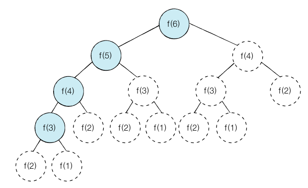
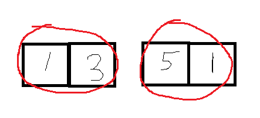
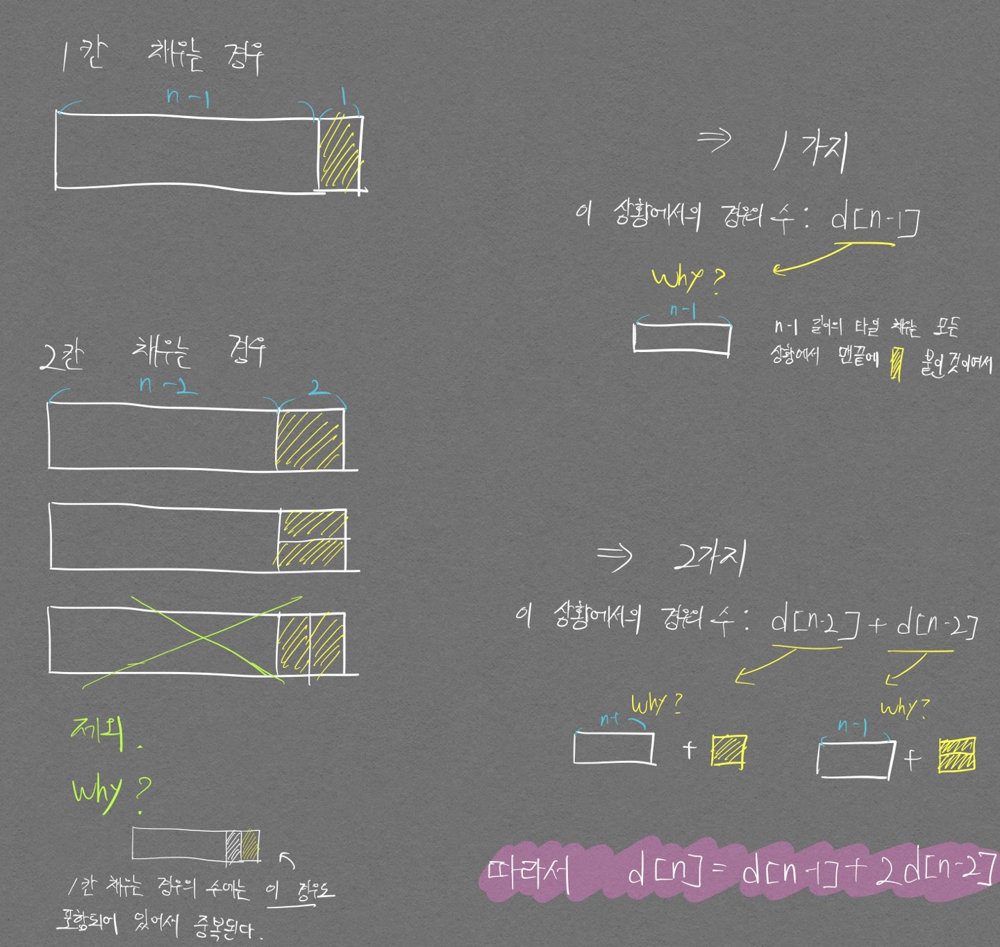

# 기본 개념
<div align="center" markdown="1">  
핵심은 <mark>중복되는 연산을 줄이자</mark>
</div>

<p align="center">  </p>
<div align="center" markdown="1"> 피보나치 그림 예시  
원래는 흰색 노드 값들도 모두 계산해야줘야 하지만  
한번 계산이 끝난 값들을 메모리에 저장해두고 재사용하여 중복 연산을 줄인다.
</div>

- 다이나믹 프로그래밍으로 해결한다는 말의 의미: **큰 문제를 작게 나누고, 같은 문제면 한 번씩만 풀어 문제를 효율적으로 해결하자**
- 어디서나 적용 가능한 것은 아니며 다음 2가지 조건을 만족해야함
  1. 큰 문제를 작은 문제로 나눌 수 있다.
  2. 작은 문제에서 구한 정답은 그것을 포함하는 큰 문제에서도 동일하다.

피보나치 문제의 점화식은 다음과 같다.  

$F_1 = 1, F_2 = 1$  
$F_n = F_{n-1} + F_{n-2}$

- 재귀 함수를 통해 구현하면 처음 그래프 그림 예시가 된다.

    ```python
    def fibo(x):
        if x==1 or x==2:
            return 1
        return fibo(x - 1) + fibo(x - 2)
    
    print(fibo(4))
    ```

- 재귀 함수를 통한 메모이제이션 기법 적용한 피보나치 수열 구현(메모이제이션: 구한 결과를 메모리 공간에 메모해두고 같은 식을 다시 호출하면 메모한 결과를 그대로 가져오는 기법)

    ```python
    # 한번 계산된 결과를 메모이제이션(Memoization)하기 위한 리스트 초기화
    d = [0] * 100

    # 피보나치 함수(Fibonacci Function)를 재귀적으로 구현(탑다운 다이나믹 프로그래밍)
    def fibo(x):

      # 종료 조건(1 혹은 2일 때 1을 반환)
      if x==1 or x==2:
        return 1

      # 이미 계산한 적 있는 문제라면 그대로 반환
      if d[x] != 0:
        return d[x]

      # 아직 계산하지 않았다면 메모리에 저장하고 계산된 값 반환
      result = fibo(x-1) + fibo(x-2)
      d[x] = result

      return result

    print(fibo(99))
    ```

- 반복문을 통한 DP 테이블 기법 적용한 피보나치 수열

    ```python
    # 앞서 계산된 결과를 저장하기 위한 DP 테이블 초기화
    d = [0] * 100

    # 첫 번째 피보나치 수와 두 번째 피보나치 수는 1
    d[1] = 1
    d[2] = 1

    def fibo(n):
    for i in range(3, n + 1):
        d[i] = d[i - 1] + d[i - 2]

    return d[n]

    print(fibo(8))
    ```

재귀 함수를 통해 다이나믹 프로그래밍을 구현하는것을 탑다운(하향식) 방법이라고 하며, 위에서 메모이제이션 개념을 통해 계산한 값을 **재사용** 하였음을 보였다.  
반면 반복문을 통해 다이나믹 프로그래밍을 구현하는것을 바텀업(상향식) 방법이라고 하며, DP 테이블 개념을 통해 계산된 값을 **저장** 하였음을 보였다.  
DP 테이블은 **재사용**의 개념이 아니다. 또한 재귀함수 깊이 오류로 인해 에러가 날 수 있기 때문에 가능하다면 바텀업 방식을 사용하는것이 권장된다.

# 문제

## p.217

- 내 풀이

```python
x = int(input())

cnt = 0

while True:
    if x == 1:
        break

    if x == 2:
        x /= 2
        cnt += 1
    
    if x == 3:
        x /= 3
        cnt += 1
    
    if x == 4:
        x /= 2
        cnt += 1

    if x % 5 != 0:
        x -= 1
        cnt += 1
    else:
        x /= 5
        cnt += 1

print(cnt)
```

답안은 맞게 풀었지만 비효율적으로 코드를 짠 느낌이 있다. DP 문제이지만 **전혀 DP 처럼 풀지 못했다.**  
DP 처럼 풀기 위해서는 다음의 2가지가 필요하다.  
1. 큰 Task를 반복성이 있는 작은 Task로 나눈다.
2. 작은 task에서 이미 계산된 것은 또 같은 계산 process를 진행하지 않고 결과값만 사용한다. (중복제거)

- 모범 풀이

```python
x = int(input())

d = [0] * 30001

for i in range(2, x+1):
  d[i] = d[i-1] + 1
  
  if i % 2 == 0:
    d[i] = min(d[i], d[i // 2] + 1)

  if i % 3 == 0:
    d[i] = min(d[i], d[i // 3] + 1)

  if i % 5 == 0:
    d[i] = min(d[i], d[i // 5] + 1)

print(d[x])
```

전날 위 모범답안을 보면서 이해하고 다음날 다시 풀어봤는데 제대로 풀지 못했다. 이해를 잘 하지 못한것이다. 다음의 포인트들 때문에 전날과 다른 출력 결과가 나왔었다.

```python
  if i % 2 == 0:
    d[i] = min(d[i], d[i // 2])     # 맨 처음 d[i] = d[i-1] + 1 을 통해 현재 진행중인 연산 카운팅을 해주므로
                                    # if문 3곳에서는 + 1 을 해줄 필요가 없을 것이라 생각함

  if i % 3 == 0:
    d[i] = min(d[i], d[i // 3])

  if i % 5 == 0:
    d[i] = min(d[i], d[i // 5])
```

논리적인 사고력이 부족해서 발생하는 문제로 보인다 ㅋㅋㅋ... ㅜㅜㅜㅜ  
다음을 중시해야 한다.  
- 맨 처음 `d[i] = d[i-1] + 1`을 통해 다른 if 문들을 통과하기전 현재의 d[i]는 내가 해야하는 4가지 연산(i-1, i/2, i/3, i/5)중 가장 작은 연산 기록을 가지고 있는것으로 간주하며 (아직 비교는 하지 않았지만 코드 흐름상 그렇게 생각해야함), 이에 따라 + 1 을 통해 마무리 작업을 해준다.

그래서 아래와 같이 코드를 짰지만 역시나 정답 출력결과물과는 달랐다.

```python
x = int(input())

d = [0] * 30001

for i in range(2, x+1):
  d[i] = d[i-1] + 1
  
  if i % 2 == 0:
    d[i] = min(d[i], d[i // 2]) + 1

  if i % 3 == 0:
    d[i] = min(d[i], d[i // 3]) + 1

  if i % 5 == 0:
    d[i] = min(d[i], d[i // 5]) + 1

print(d[x])
```

if 문에서 두 연산 결과를 비교하여 가장 작은 값을 선정한 이후 맨 처음 `d[i] = d[i - 1] + 1 `에서 해줬던 것 처럼 + 1 로 마무리 작업을 해준것인데 다음의 문제점들이 발생한다.  
- 2, 3, 5 로 모두 나눌 수 있는 경우들을 생각해보면 + 1 이 계속 누적된다.  나는 값이 대체 되는것을 원하므로 for문 한번 돌 때 + 1이 **한번만** 이루어져야 하지만, for문 한번에 + 4 가 될 수도 있다.

따라서 다음과 같이 코드를 짜야 정답 결과물이 출력된다.

```python
x = int(input())

d = [0] * 30001

for i in range(2, x+1):
  d[i] = d[i-1] + 1
  
  if i % 2 == 0:
    d[i] = min(d[i], d[i // 2]) + 1

  if i % 3 == 0:
    d[i] = min(d[i], d[i // 3]) + 1

  if i % 5 == 0:
    d[i] = min(d[i], d[i // 5]) + 1

print(d[x])
```

## p.220

2개중 전체 문제를 작은 문제로 쪼개서 생각 및 구현까지 완료한 것은 정말 좋았다. 실제로 짝수 갯수로 배열을 채워서 작동시키면 올바르게 작동하는 걸로 보인다.  

<p align="center">  </p>  

위 그림이 내 아이디어였는데 이 그림의 문제점은 **배열 갯수를 짝수로 가정해버리는 것이다.** 홀수 갯수로 배열을 채우면 index 에러가 나면서 종료가 되버린다.

```python
N = int(input())
storage = [0] * N

result = 0

val = input().split()

for idx, value in enumerate(val):
  storage[idx] = int(value)

idx = 0
temp_idx = []
while(True):
  if idx >= N:
    break
    
  if storage[idx] >= storage[idx+1]:
    temp_idx.append(idx)

  elif storage[idx] < storage[idx+1]:
    temp_idx.append(idx+1)

  # 같은거 처리 어케하지?
  else:
    print("같은거..")
    pass

  idx += 2
  
  if idx == 2:
    continue

  if temp_idx[-1] - temp_idx[-2] == 1:    # 붙어있다면..
    tp1 = storage[temp_idx[-2] -1] + storage[temp_idx[-1]]
    tp2 = storage[temp_idx[-2] -1] + storage[temp_idx[-1] + 1]
    tp3 = storage[temp_idx[-2]] + storage[temp_idx[-1] + 1]

    max = 0
    if tp1 > max:
      max = tp1
    if tp2 > max:
      max = tp2
    if tp3 > max:
      max = tp3

    if max == tp1:
      temp_idx[-2] -= 1

    elif max == tp2:
      temp_idx[-2] -= 1
      temp_idx[-1] += 1
    else:
      temp_idx[-1] += 1

  

for idx in temp_idx:
  result += storage[idx]

print(result)
```

답안 코드를 이해하기 위해선 아래 말을 완벽히 이해하고 있어야 한다.  

DP table에 들어있는 각각의 값들은 그 index에서 최고로 높게 훔친 값이며 각각의 인덱스마다 선택된 경우의 수가 다를 수 있다. 가령 d[3]이 3, 5를 택했다고 해서, d[4]도 무조건 3, 5를 택하고 시작해야 하는 법은 없다.
{:.info}
즉, `d[3]`, `d[4]`에는 각각 다른 경우의 수가 들어있다. 즉 여러 경우의 수를 서로 비교해가면서 계속 `d`를 채워나간다.  

코드로 구현하기 가장 어려웠던 부분이 `d[0]`, `d[1]`를 어떻게 처리해줘야 하는지였다. 다음과 같은 마인드 세팅을 했더니 한결 수월해졌다.  

`d[0]`은 숫자가 하나 주워진 것이므로 무조건 택해야 최대값이고, `d[1]`은 두 숫자가 붙어있기는 하지만 단지 두개의 숫자일 뿐이므로 둘 중 max 값을 고르면 된다.
{:.success}  

그럼 `d[0]`, `d[1]`도 각각의 인덱스(첫번째, 두번째)에서 최대값을 가지고 있는것이 되므로 `d[2]`부터 본격적으로 $$a_{i} = max(a_{i-1}, a_{i-2} + 현재 창고값)$$ 점화식을 적용해서 이어나가면 된다.

## p.223

손도 못댔다.. ㅋㅋ;;;;;;;;;;  

DP 문제가 굉장히 어색하다.  
답안 코드를 보고도 이해를 못해서 [나동빈 설명 영상](https://www.youtube.com/watch?v=YHZiWaL49HY)을 보고 간신히 이해하였다...  

추가적으로 스스로 이해를 위한 그림을 그려봤다.  

<p align="center">  </p>

- 답안 코드


```python
  n = int(input())

  # d = [0] * 1000
  d = [0] * 1001

  # 1칸 일 때 고려하는것 이므로 d[0]가 아닌 d[1]로 생각하는것이 편하다.
  d[1] = 1
  d[2] = 3

  for i in range(n):
    d[i] = (d[i-1] + 2 * d[i-2]) % 796796

  print(d[n])
```

## p.226 문제는 풀어봐야함