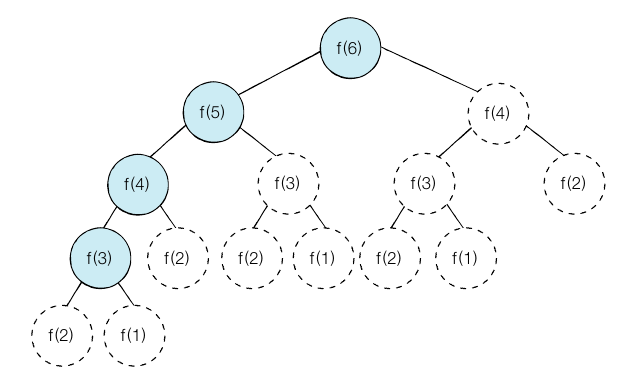

# 기본 개념
<div align="center" markdown="1">  
핵심은 <mark>중복되는 연산을 줄이자</mark>
</div>

<p align="center">  </p>
<div align="center" markdown="1"> 원래는 흰색 노드 값들도 모두 계산해야줘야 하지만  
한번 계산이 끝난 값들을 메모리에 저장해두고 재사용하여 중복 연산을 줄인다.
</div>

- 다이나믹 프로그래밍으로 해결한다는 말의 의미: **큰 문제를 작게 나누고, 같은 문제면 한 번씩만 풀어 문제를 효율적으로 해결하자**
- 어디서나 적용 가능한 것은 아니며 다음 2가지 조건을 만족해야함
  1. 큰 문제를 작은 문제로 나눌 수 있다.
  2. 작은 문제에서 구한 정답은 그것을 포함하는 큰 문제에서도 동일하다.

# 피보나치 예시

- 재귀 함수를 통한 단순 피보나치 수열 구현

    ```python
    def fibo(x):
        if x==1 or x==2:
            return 1
        return fibo(x - 1) + fibo(x - 2)
    
    print(fibo(4))
    ```

- 재귀 함수를 통한 메모이제이션 기법 적용한 피보나치 수열 구현(메모이제이션: 구한 결과를 메모리 공간에 메모해두고 같은 식을 다시 호출하면 메모한 결과를 그대로 가져오는 기법)

    ```python
    # 한번 계산된 결과를 메모이제이션(Memoization)하기 위한 리스트 초기화
    d = [0] * 100

    # 피보나치 함수(Fibonacci Function)를 재귀적으로 구현(탑다운 다이나믹 프로그래밍)
    def fibo(x):
    # 종료 조건(1 혹은2일 때 1을 반환)
    if x == 1 or x == 2:
    return 1

    # 이미 계산한 적 있는 문제라면 그대로 반환
    if d[x] != 0:
    return d[x]

    # 아직 계산하지 않은 문제라면 점화식 따라서 피보나치 결과 반환
    result = fibo(x - 1) + fibo(x - 2)
    d[x] = result
    return result

    print(fibo(99))
    ```

- 반복문을 통한 DP 테이블 기법 적용한 피보나치 수열

    ```python
    # 앞서 계산된 결과를 저장하기 위한 DP 테이블 초기화
    d = [0] * 100

    # 첫 번째 피보나치 수와 두 번째 피보나치 수는 1
    d[1] = 1
    d[2] = 1

    def fibo(n):
    for i in range(3, n + 1):
        d[i] = d[i - 1] + d[i - 2]

    return d[n]

    print(fibo(8))
    ```

재귀 함수를 통해 다이나믹 프로그래밍을 구현하는것을 탑다운(하향식) 방법이라고 하며, 위에서 메모이제이션 개념을 통해 계산한 값을 **재사용** 하였음을 보였다.  
반면 반복문을 통해 다이나믹 프로그래밍을 구현하는것을 바텀업(상향식) 방법이라고 하며, DP 테이블 개념을 통해 계산된 값을 **저장** 하였음을 보였다.  
DP 테이블은 **재사용**의 개념이 아니다. 또한 재귀함수 깊이 오류로 인해 에러가 날 수 있기 때문에 가능하다면 바텀업 방식을 사용하는것이 권장된다.

# 문제

| p.217

- 내 풀이

```python
x = int(input())

cnt = 0

while True:
    if x == 1:
        break

    if x == 2:
        x /= 2
        cnt += 1
    
    if x == 3:
        x /= 3
        cnt += 1
    
    if x == 4:
        x /= 2
        cnt += 1

    if x % 5 != 0:
        x -= 1
        cnt += 1
    else:
        x /= 5
        cnt += 1

print(cnt)
```

답안은 맞게 풀었지만 비효율적으로 코드를 짠 느낌이 있다. DP 문제이지만 **전혀 DP 처럼 풀지 못했다.**  
DP 처럼 풀기 위해서는 다음의 2가지가 필요하다.  
1. 큰 Task를 반복성이 있는 작은 Task로 나눈다.
2. 작은 task에서 이미 계산된 것은 또 같은 계산 process를 진행하지 않고 결과값만 사용한다. (중복제거)

- 모범 풀이

```python
x = int(input())

d = [0] * 30001

for i in range(2, x+1):
  d[i] = d[i-1] + 1
  
  if i % 2 == 0:
    d[i] = min(d[i], d[i // 2] + 1)

  if i % 3 == 0:
    d[i] = min(d[i], d[i // 3] + 1)

  if i % 5 == 0:
    d[i] = min(d[i], d[i // 5] + 1)

print(d[x])
```

전날 위 모범답안을 보면서 이해하고 다음날 다시 풀어봤는데 제대로 풀지 못했다. 이해를 잘 하지 못한것이다. 다음의 포인트들 때문에 전날과 다른 출력 결과가 나왔었다.

```python
  if i % 2 == 0:
    d[i] = min(d[i], d[i // 2])     # 맨 처음 d[i] = d[i-1] + 1 을 통해 현재 진행중인 연산 카운팅을 해주므로
                                    # if문 3곳에서는 + 1 을 해줄 필요가 없을 것이라 생각함

  if i % 3 == 0:
    d[i] = min(d[i], d[i // 3])

  if i % 5 == 0:
    d[i] = min(d[i], d[i // 5])
```

논리적인 사고력이 부족해서 발생하는 문제로 보인다 ㅋㅋㅋ... ㅜㅜㅜㅜ  
다음을 중시해야 한다.  
- 맨 처음 `d[i] = d[i-1] + 1`을 통해 다른 if 문들을 통과하기전 현재의 d[i]는 내가 해야하는 4가지 연산(i-1, i/2, i/3, i/5)중 가장 작은 연산 기록을 가지고 있는것으로 간주하며 (아직 비교는 하지 않았지만 코드 흐름상 그렇게 생각해야함), 이에 따라 + 1 을 통해 마무리 작업을 해준다.

그래서 아래와 같이 코드를 짰지만 역시나 정답 출력결과물과는 달랐다.

```python
x = int(input())

d = [0] * 30001

for i in range(2, x+1):
  d[i] = d[i-1] + 1
  
  if i % 2 == 0:
    d[i] = min(d[i], d[i // 2]) + 1

  if i % 3 == 0:
    d[i] = min(d[i], d[i // 3]) + 1

  if i % 5 == 0:
    d[i] = min(d[i], d[i // 5]) + 1

print(d[x])
```

if 문에서 두 연산 결과를 비교하여 가장 작은 값을 선정한 이후 맨 처음 `d[i] = d[i - 1] + 1 `에서 해줬던 것 처럼 + 1 로 마무리 작업을 해준것인데 다음의 문제점들이 발생한다.  
- 2, 3, 5 로 모두 나눌 수 있는 경우들을 생각해보면 + 1 이 계속 누적된다.  나는 값이 대체 되는것을 원하므로 for문 한번 돌 때 + 1이 **한번만** 이루어져야 하지만, for문 한번에 + 4 가 될 수도 있다.

따라서 다음과 같이 코드를 짜야 정답 결과물이 출력된다.

```python
x = int(input())

d = [0] * 30001

for i in range(2, x+1):
  d[i] = d[i-1] + 1
  
  if i % 2 == 0:
    d[i] = min(d[i], d[i // 2]) + 1

  if i % 3 == 0:
    d[i] = min(d[i], d[i // 3]) + 1

  if i % 5 == 0:
    d[i] = min(d[i], d[i // 5]) + 1

print(d[x])
```