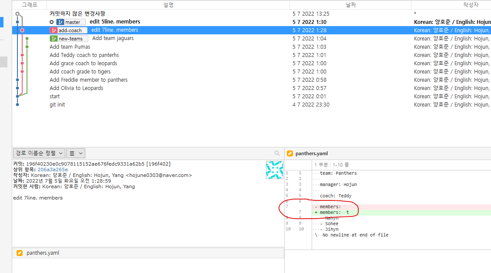
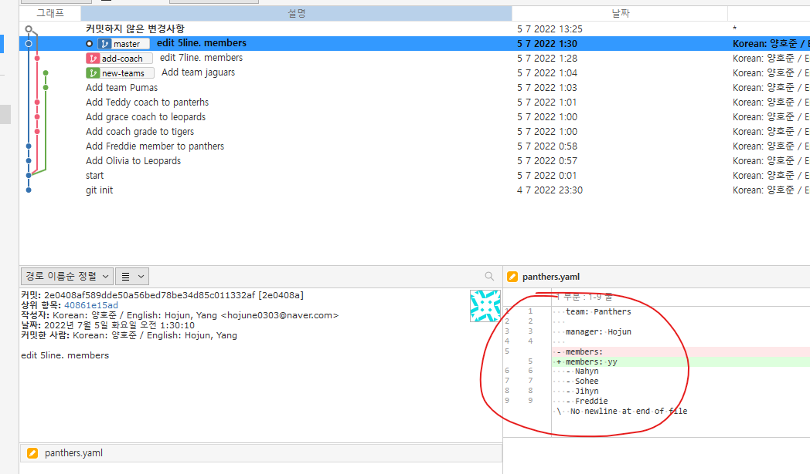
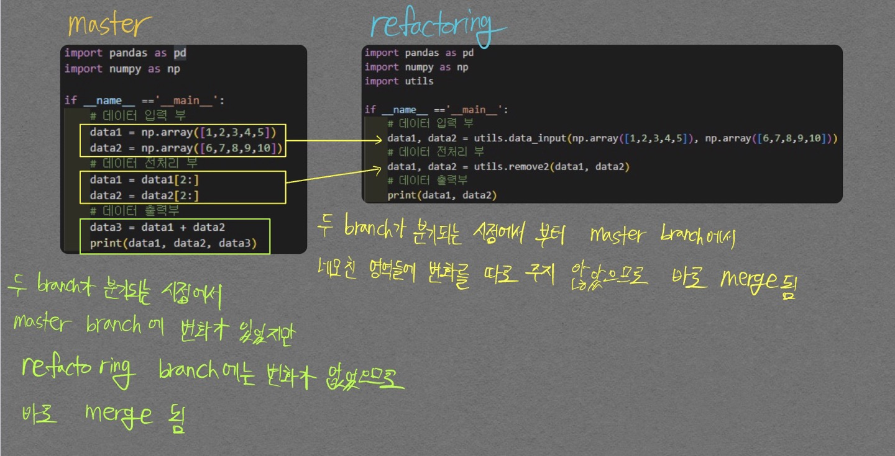
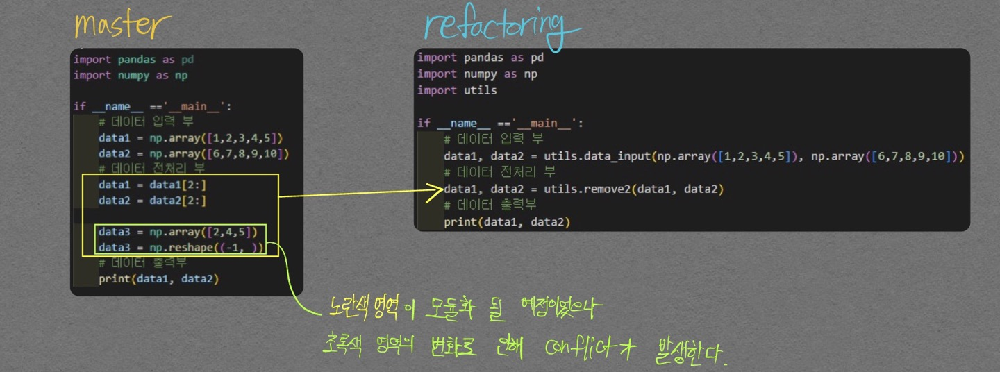
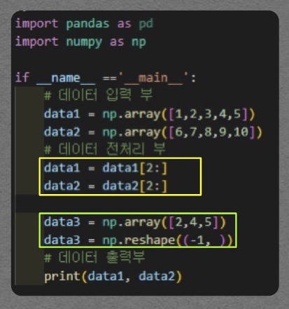

# Deteched HEAD 발생

git은 스냅샷(commit)을 참조하는 것을 통해 형상관리를 하게 되는데, 이 commit을 참조할 수 있는 방법이 바로 `HEAD` 이다.  
문제는 이 `HEAD`가 branch를 가리키는 것이 일반적이지만, **commit을 가리키는 상황**도 발생할 수 있는것이다.  
즉, `HEAD`가 commit을 가리키는 상황일 때 Deteched HEAD 라고 말한다.  

<p align="center">  </p>
<div align="center" markdown="1"> git은 HEAD가 위 그림과 같이 branch를 가리키는 것을 지향한다. 
</div>

<p align="center">  </p>
<div align="center" markdown="1"> commit을 가리키는 상황(Deteched HEAD) 상황일 때는 제대로 된 형상관리가 어렵다. 위 그림에서의 작업공간이 commit b 이기 때문에 기존 branch에 commit이 불가능하며, Deteched HEAD 상태에서 commit을 하면서 작업을 진행한 들, 다른 작업물과 merge 할 수 없다.(branch가 없기 때문)
</div>

이러한 상황을 해결할 수 있는 방법은 간단하게 **detached HEAD 상태일 때 했던 작업을 branch로 만들어주는 것이다.**

# Pull Request 진행하기
- Pull request = Merge request로 생각하면 편하다
  - 나의 branch를 remote의 master branch에 merge하고 싶을 때 담당자에게 `검토` 받는것
  
  - 상황에 따라 2가지 Pull Request로 나뉨
    1. 나에게 Remote 저장소 수정권환이 있을경우
       - 내 branch를 다른 사람의 branch에 merge할 때 하기전에 검토해줘! 라고 하는것
    2. 나에게 수정권한이 없는 Remote 저장소 (주로 오픈소스)
       - 나 짱짱맨이니까 내 코드 한번 반영하는거 검토해줘! 놀라움을 선사해주지

수행방법은 다음과 같다.  

1. 원하는 Repository `fork`
2. Local에 git clone
3. 코드 수정이후 `branch` 만들어서 `fork한 내 github Repository`에 push
4. 아래 그림 버튼 클릭  

5. comment 남기고 Create pull request 클릭  


[참고사이트](https://www.youtube.com/watch?v=uvsz2XgRPfM)

# Conflict 발생

두개의 branch를 하나로 합칠 때(merge) **같은 파일의 같은 줄**이 변경이 될 경우 컴퓨터가 어떤 변경사항을 반영해야할지 결정할 수 없어서 conflict가 발생한다.  

중요 사항으로 **같은 파일의 다른 줄**이 변경되는것은 merge 할 때 conflict가 나지 않는다.  

<p align="center">  </p>  

<div align="center" markdown="1">  commit 메세지 **start**부터 master, add-coach, new-teams 3개의 branch로 나뉘게 되었으며  
add-coach의 **edit 7line members** commit을 확인해보면 7번째줄에 있는 `- members: `를 `- members: t`로 수정하였다.
</div>

<div align="center" markdown="1">  
</div>

<p align="center">  </p>  

<div align="center" markdown="1">  master의 **edit 5line members** commit을 확인해보면 5번째줄에 있는 `- members: ` 를 `- members: yy`로 수정하였다.
</div>

두 branch를 merge 하려고하면 `members` line에 대한 두 변화중 어떤 변화를 선택해야할지 컴퓨터는 정할 수 없어서 conflict 판정을 내게 된다.

## 협업할 때 우려되는 사항

개인적인 생각으로 merge를 진행할 때 다음과 같은 상황을 조심해야 할 것 같다.

1. main branch에서 주 기능을 수행하고, 서브 기능을 branch로 분기하여 개발을 완료해서 merge할 때 conflict가 발생하지 않아도 main branch의 코드 흐름에 심각한 에러를 초래할 수 있다.  

상황을 예로 들어보면

```python
import pandas as pd
import numpy as np

if __name__ =='__main__':
    # 데이터 입력 부
    data1 = np.array([1,2,3,4,5])
    data2 = np.array([6,7,8,9,10])
    # 데이터 전처리 부
    data1 = data1[2:]
    data2 = data2[2:]
    # 데이터 출력부
    print(data1, data2)
```
위 코드가 보기가 불편해서 모듈화를 진행하고 싶다고 하자. `refactoring` branch를 생성하여 refactoring을 다음 코드와 같이 끝냈다고 하자.  

```python
import pandas as pd
import numpy as np
import utils

if __name__ =='__main__':
    # 데이터 입력 부
    data1, data2 = utils.data_input(np.array([1,2,3,4,5]), np.array([6,7,8,9,10]))
    # 데이터 전처리 부
    data1, data2 = utils.remove2(data1, data2)
    # 데이터 출력부
    print(data1, data2)
```

refactoring 작업중에 특이사항으로 data2는 원본 shape을 유지하게 바꿨다고 하자. 그래도 data2 변수가 print 에만 활용되므로 위 스크립트를 작동시키는데는 문제가 없다. 이렇게 `refactoring` branch가 작업을 완료하는 동안 `master` branch에서 데이터 출력부에 `data3`를 집어넣고 commit 하였다고 하자.  

```python
import pandas as pd
import numpy as np

if __name__ =='__main__':
    # 데이터 입력 부
    data1, data2 = utils.data_input(np.array([1,2,3,4,5]), np.array([6,7,8,9,10]))
    # 데이터 전처리 부
    data1, data2 = utils.remove2(data1, data2)
    # 데이터 출력부
    data3 = data1 + data2
    print(data1, data2, data3)
```

이렇게 진행된 `master` branch와 `refactoring` branch 간의 merge를 진행한다고 하자. conflict가 발생하겠는가?  
conflict는 다음과 같은 로직(내 추측이다)에 의해 발생하지 않는다.  

<p align="center">  </p>


- merge된 이후의 코드  


```python
import pandas as pd
import numpy as np
import utils

if __name__ =='__main__':
    # 데이터 입력 부
    data1, data2 = utils.data_input(np.array([1,2,3,4,5]), np.array([6,7,8,9,10]))
    # 데이터 전처리 부
    data1, data2 = utils.remove2(data1, data2)
    # 데이터 출력부
    data3 = data1 + data2
    print(data1, data2, data3)
```

data1, data2의 shape이 다르기 때문에 error가 발생한다.

P.S 어떤 상황에서 Conflict가 발생하는가?
{:.warning}

<p align="center">  </p>  
<div align="center" markdown="1"> conflict 발생 상황 예시 
</div>

나는 처음엔 아래 그림과 같이 될 것이라고 생각하고 conflict가 발생하지 않을줄 알았다.  

<p align="center">  </p>  

아직은 추측이지만 git은 다음 영역(위 그림에서는 <span style="color:green"> # 데이터 출력부</span>)부터를 `master` branch, `refactoring` branch가 같은 코드 영역으로 잡아뒀기 때문에 이 전까지의 영역을 노란색 영역이 설정된것으로 보인다.

## Remote 저장소의 변경사항으로 인해 Conflict 발생할 때
내가 수정한 파일을 원격 저장소(Github repository)에 push 하려하는데 내가 모르는 변경사항이 파일(내가 로컬에서 수정한)에 있는 경우

- Visual studio 설정
  - 대중적이면서 시각적 지원이 훌륭한 Visual Studio Code를 활용하자
  - [설명 링크](https://medium.com/@hohpark/vs-code%EB%A5%BC-git-diff-tool%EB%A1%9C-%EC%84%A4%EC%A0%95%ED%95%98%EA%B8%B0-88baa1d9f2b3)

- 해결법

```bash

git pull            
# 변경 내역을 가져온다. 
# 덮어써지더라도 이미 로컬에서 commit 해놓은 내역이 있기 때문에 쫄지 않아도 된다. 
# 언제든 복구할 수 있다.

git status          
# both modified로 명시된 부분이 충돌난 부분이다. 

git mergetool       
# vscode를 통해 쉽게 conflict를 해결할 수 있게 해준다. _BASE는 공통부분임 
# _LOCAL과 _REMOTE를 통해 어떤 부분이 다른지 확인할 수 있다.
```

- git mergetool 명령어 실행시 ipynb 파일의 충돌을 확인하기 위해선 아래 그림을 보자

<table>
<tr>
<td>

</td>
<td>

</td>
</tr>
<tr>
<td colspan="2" align="center">

</td>
</tr>
<tr>
<td colspan="2" align="center">
느낌표 눌러서 나타난 파일을 통해 수정 작업 진행하면 됨 <br><br>

REMOTE 확장자 가진 파일: REMOTE 부분<br>
LOCAL 확장자 가진 파일: LOCAL 부분<br>
BASE 확장자 가진 파일: REMOTE, LOCAL의 공통 부분<br>

</td>
</tr>
</table>