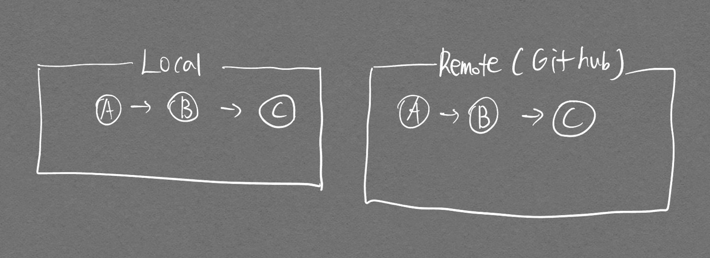
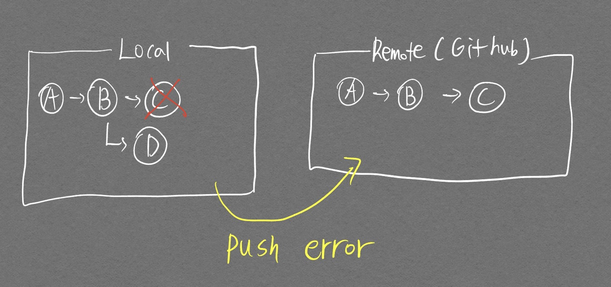
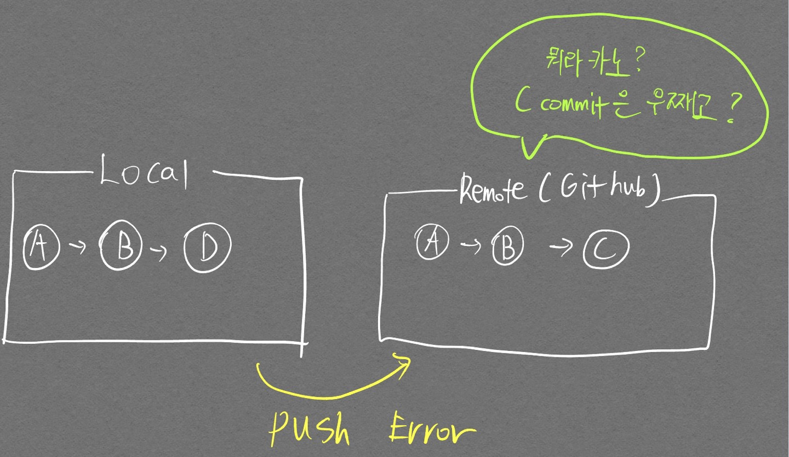
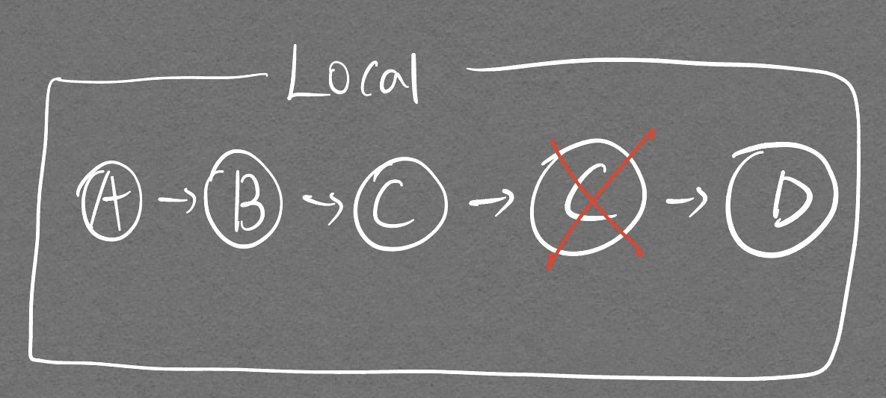
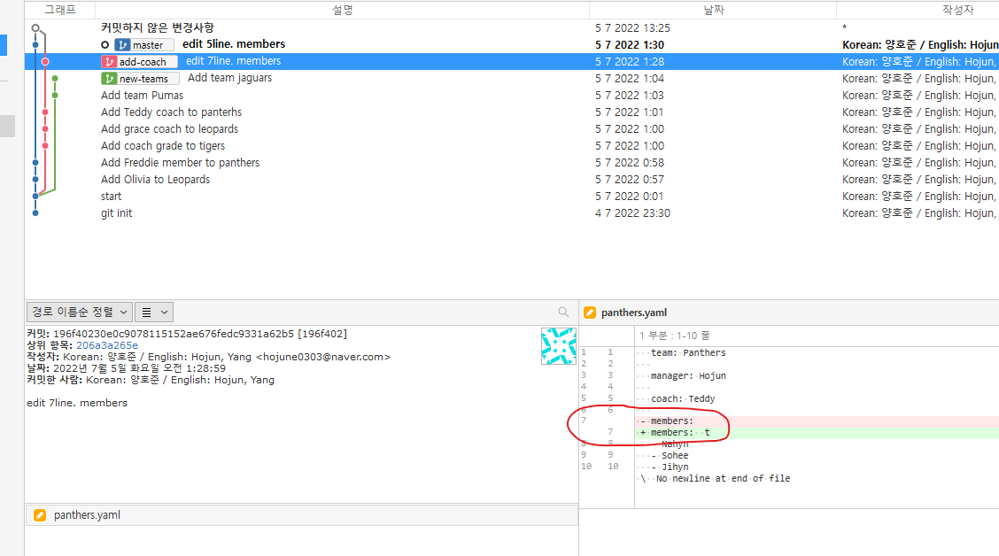
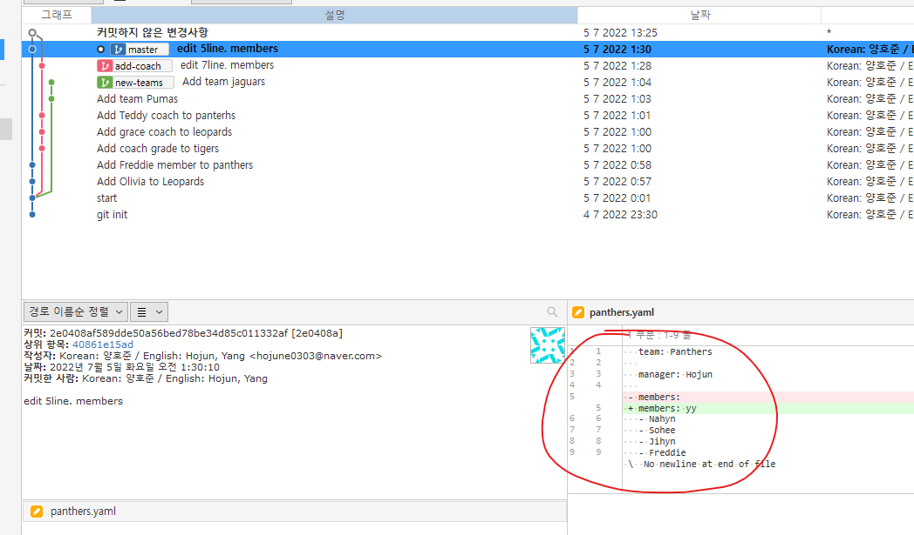
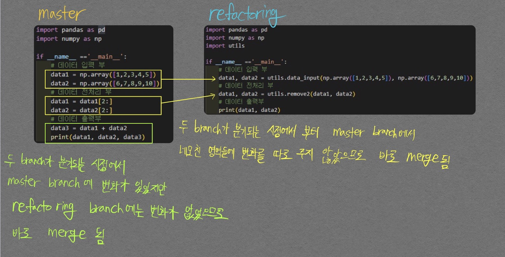
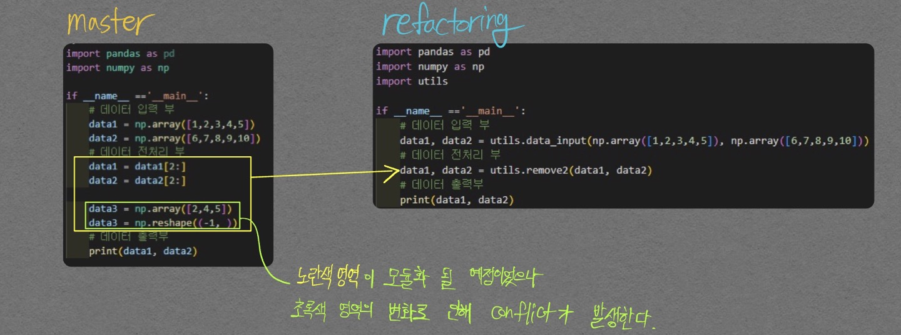
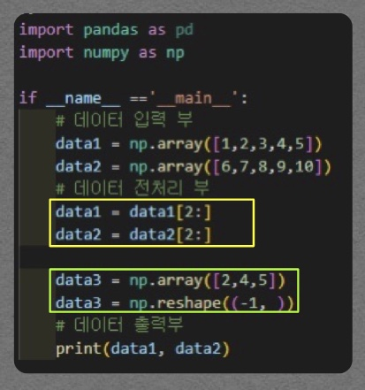
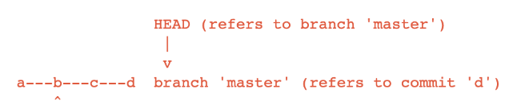

<hr>
Git은 정말 많은 개념이 있고, 그 구조도 복잡하다. 이걸 하나하나 다 익히고 나서 적용하기에는 처음에 배워야 할 것도 너무 많고, 배워도 나중에 적용하기가 어렵다.  
그래서 프로젝트를 진행하면서 발생하는 **상황들을 해결하는 방향**으로 공부를 하는것이 훨씬 접근하기 용이할 것으로 보인다.
<hr>

# Remote Repository commit 내역 삭제하기
- 필요한 명령어
  - `git revert`

local에서 commit 내역을 삭제하는 경우 `git reset` 명령어를 통해 간단하게 가능하다.  
하지만 `git reset`을 **한번이라도 진행한 후** remote repository에 새로운 commit을 push를 하려는 순간  

    hint: Updates were rejected because the remote contains work that you do
    hint: not have locally. This is usually caused by another repository pushing
    hint: to the same ref. You may want to first integrate the remote changes
    hint: (e.g., 'git pull ...') before pushing again.
    hint: See the 'Note about fast-forwards' in 'git push --help' for details.

와 같은 에러가 발생한다. 왜 그런지 다음의 그림을 통해 이해해보자.  

<p align="center">  </p>
<div align="center" markdown="1">
Local, Remote가 동기화 되어있는 상황
</div>

<p align="center">  </p>
<div align="center" markdown="1">
C commit에서 실수한 부분을 눈치채서, `git reset`명령어로 C commit을 지우고 D commit을 만들어서   
Push 하려는 순간 에러 발생
</div>

<p align="center">  </p>
<div align="center" markdown="1">
Local 에서 `git log` 명령어를 찍어보면 a -> b -> d 로 되어있다. 이때 Local에서 push 명령어를 입력하게 되면  Remote 입장에서 C commit은 온데간데 없어지고 갑자기 D commit이 들어오려고 하는것이기에 당황해서 error를 발생시키는 것이다. 
</div>

<p align="center">  </p>
<div align="center" markdown="1">
이를 해결하려면 우리는 위 그림과 같이 `git log`를 찍었을 때
C commit을 지운것을 **commit 내역으로 남겨놔야 한다**
</div>

이 작업은 `git revert` 명령어를 통해 가능하다.  

```bash
git revert <commit c>
```

헷갈리지 말아야 할 것이 commit c를 **지운다**는 의미인 것이지 commit c로 돌아간다의 의미가 아니다.

그러기 위해 우선적으로 `git fetch`를 통해 Remote의 history를 가져온 후 HEAD를 **C commit으로 변경한 후** `git revert`를 진행해서 commit을 남겨줘야 하는 부차적인 작업이 필요하다.  

이러한 작업은 `git stash`, `git branch`, `git switch` 등의 명령어를 통해 가능하다.

# 실수로 Pull한 local repository 다시 원래대로 복구시키기
symbolic reference중 하나인 **ORIG_HEAD**를 사용하면 간편하게 복구가 가능하다.  

ORIG_HEAD: HEAD의 위치를 변경하는 위험한 명령어 (ex. `git reset`, `git pull`)를 수행할 때, 수행 전의 commit을 가지고 있는 symbolic reference. 이를 통해 쉽게 원상복구가 가능하다.

```bash
git reset --hard ORIG_HEAD
```

`git reset`, `git pull`과 같이 **HEAD**를 직접적으로 움직이는 명령어들은 자칫 Repository를 꼬이게 만들 수 있기에

# git log \-\-graph 분석


<p align="center" markdown="1">
하늘색 그래프가 local master 인지, local hojun/dev인지 파악하기 위해 시간을 날렸는데, 이걸 알아내는건 중요하지 않다.  
어차피 색깔은 `git switch`를 할 때마다 `HEAD`에 따라서 바뀌는 것이다. 위 그림에서 얻어갈 것은 `HEAD`가 기존 History를 모두 반영하고 있는 Local master, Remote master를 가리키고 있다는 것만 알면 된다.
</p>

위 log graph는 vscode extension `Git Lens`를 통해 출력한 log graph이다.  
갈색 캐릭터가 나, 빨간 캐릭터가 사수분 commit 내역이다. 다음과 같은 의문 때문에 log graph를 분석하고자 했다.  

> `Merge branch` 'hojun/dev` 이후 사수분의 commit 내역이 이어진 것처럼 보여서 사수분이 Remote/hojun/dev를 pull 한 다음 작업을 하신게 아닌가 생각했다. 결론적으로 말하면 잘못 생각한 것이고, 사수분은 Remote/master에서 작업한 것이다.

갈색 캐릭터가 나이고 빨간색 캐릭터가 같이 협업하시는 사수분 commit 내역이다.

branch 정보는 다음과 같다.

- local: master, hojun/dev
- remote: master

local의 master, remote의 master가 같은것에 유의하며 분석해보자.

1. Upload hojun_cookbook directory
    - `local master`, `remote master`가 동기화되서 gitlab에 push 되었다.

2. Merge branch 'hojun/dev'
    - `local master`에서 `git merge hojun/dev`를 통해 `local hojun/dev`와 병합한 것임을 나타낸다.
    - 이후 gitlab에 `remote master`에 push 하였다.

3. 사수님이 진행한 중간 검은색 commit 내역
    - 사수님은 내가 병합까지 마친 commit부터 작업을 진행하시고 commit을 진행하신 뒤 `remote master`에 push 하셨다.

4. Code Refactoring & Update Pytorch ~~
    - 여기가 중요하다. 사수님이 올린 remote commit 내역을 **최신화하지 않고** `local hojun/dev`에서 작업을 진행했다.

5. Merge branch 'master' into hojun/dev
    - 여긴 내가 실수한 부분으로 보인다. 보통 `HEAD -> master`인 상태에서 개발중인 branch를 merge하는 형태로 가야하는데 `HEAD -> hojun/dev`인 상태에서 master를 merge하는 형태로 갔다.
    - 이렇게 진행할 경우 `master`가 가리키는 commit이 최신이 아니게 된다. 항상 `HEAD -> master`에서 다른 branch의 merge를 진행하도록 하자.

6. Merge branch 'master' of https://gitlab.autoever~~
    - 위 5번까지 commit 된 상태에서 push를 하려고 하니 4번에 적어둔 것 처럼 사수님의 commit 내역을 **최신화하지 않은것 때문에** error가 발생했다.
    - 본 내역은 `git pull origin master`를 통해 `remote  master`와 merge를 진행한 것이다. conflict가 없었기에 별 문제없이 merge가 끝난 이후 `remote master`에 push 하였다.


<p align="center" markdown="1">
위 빨간색 영역이 정말 못생겼다. 5번 commit에서 실수했기 때문에 생긴 모양인데, `local hojun/dev`를 `remote master`에 push 하는 식으로 진행했다면 완전히 같은 의미를 담은 두 commit중 한 commit만 해도 됐을 듯 하다.  
`git rebase`, `git revert` 등으로 수정이 가능할 것으로 보인다.
</p>

# Pull 하기 전 변경사항이 뭔지 제대로 확인하기
다른 사람의 commit 내역을 내 local Repository에 Pull 하기 전에 변경사항이 뭔지 구체적으로 알고 싶은 경우가 발생한다.  
다음의 명령어가 필요하다.

- `git diff`

## 현재 내 local repo와 remote repo의 차이 비교하기

- Local Git은 항상 remote와 통신하고 있는것은 아니다. Remote에 변경사항이 있다고 하더라도 Local Git user가 명령어로 Remote의 변경사항을 한번 가져오는 명령어를 쳐줘야 한다. 그것이 `git fetch`이다. `git pull`은 Local Git에 Remote 변경사항을 바로 적용하기 때문에 가급적 피하도록 하자. 먼저 변경사항을 확인한 이후 안전하게 pull 하는것이 좋다.


```bash
git fetch <remote repo> <remote branch>
git diff <local branch> <remote branch>

# LOCAL, Remote 변경사항 비교
git diff HEAD origin/master
```

- `git log --all`

`--all` 옵션을 통해서 remote repo의 commit 내역을 볼 수 있다.

```bash
git log --all
```


# Pull Request 진행하기
- Pull request = Merge request로 생각하면 편하다
  - 나의 branch를 remote의 master branch에 merge하고 싶을 때 담당자에게 `검토` 받는것
  
  - 상황에 따라 2가지 Pull Request로 나뉨
    1. 나에게 Remote 저장소 수정권환이 있을경우
       - 내 branch를 다른 사람의 branch에 merge할 때 하기전에 검토해줘! 라고 하는것
    2. 나에게 수정권한이 없는 Remote 저장소 (주로 오픈소스)
       - 나 짱짱맨이니까 내 코드 한번 반영하는거 검토해줘! 놀라움을 선사해주지

수행방법은 다음과 같다.  

1. 원하는 Repository `fork`
2. Local에 git clone
3. 코드 수정이후 `branch` 만들어서 `fork한 내 github Repository`에 push
4. 아래 그림 버튼 클릭  

5. comment 남기고 Create pull request 클릭  


[참고사이트](https://www.youtube.com/watch?v=uvsz2XgRPfM)

# Conflict 발생

두개의 branch를 하나로 합칠 때(merge) **같은 파일의 같은 줄**이 변경이 될 경우 컴퓨터가 어떤 변경사항을 반영해야할지 결정할 수 없어서 conflict가 발생한다.  

중요 사항으로 **같은 파일의 다른 줄**이 변경되는것은 merge 할 때 conflict가 나지 않는다.  

<p align="center">  </p>  

<div align="center" markdown="1">  commit 메세지 **start**부터 master, add-coach, new-teams 3개의 branch로 나뉘게 되었으며  
add-coach의 **edit 7line members** commit을 확인해보면 7번째줄에 있는 `- members: `를 `- members: t`로 수정하였다.
</div>

<div align="center" markdown="1">  
</div>

<p align="center">  </p>  

<div align="center" markdown="1">  master의 **edit 5line members** commit을 확인해보면 5번째줄에 있는 `- members: ` 를 `- members: yy`로 수정하였다.
</div>

두 branch를 merge 하려고하면 `members` line에 대한 두 변화중 어떤 변화를 선택해야할지 컴퓨터는 정할 수 없어서 conflict 판정을 내게 된다.

## 협업할 때 우려되는 사항

개인적인 생각으로 merge를 진행할 때 다음과 같은 상황을 조심해야 할 것 같다.

1. main branch에서 주 기능을 수행하고, 서브 기능을 branch로 분기하여 개발을 완료해서 merge할 때 conflict가 발생하지 않아도 main branch의 코드 흐름에 심각한 에러를 초래할 수 있다.  

상황을 예로 들어보면

```python
import pandas as pd
import numpy as np

if __name__ =='__main__':
    # 데이터 입력 부
    data1 = np.array([1,2,3,4,5])
    data2 = np.array([6,7,8,9,10])
    # 데이터 전처리 부
    data1 = data1[2:]
    data2 = data2[2:]
    # 데이터 출력부
    print(data1, data2)
```
위 코드가 보기가 불편해서 모듈화를 진행하고 싶다고 하자. `refactoring` branch를 생성하여 refactoring을 다음 코드와 같이 끝냈다고 하자.  

```python
import pandas as pd
import numpy as np
import utils

if __name__ =='__main__':
    # 데이터 입력 부
    data1, data2 = utils.data_input(np.array([1,2,3,4,5]), np.array([6,7,8,9,10]))
    # 데이터 전처리 부
    data1, data2 = utils.remove2(data1, data2)
    # 데이터 출력부
    print(data1, data2)
```

refactoring 작업중에 특이사항으로 data2는 원본 shape을 유지하게 바꿨다고 하자. 그래도 data2 변수가 print 에만 활용되므로 위 스크립트를 작동시키는데는 문제가 없다. 이렇게 `refactoring` branch가 작업을 완료하는 동안 `master` branch에서 데이터 출력부에 `data3`를 집어넣고 commit 하였다고 하자.  

```python
import pandas as pd
import numpy as np

if __name__ =='__main__':
    # 데이터 입력 부
    data1, data2 = utils.data_input(np.array([1,2,3,4,5]), np.array([6,7,8,9,10]))
    # 데이터 전처리 부
    data1, data2 = utils.remove2(data1, data2)
    # 데이터 출력부
    data3 = data1 + data2
    print(data1, data2, data3)
```

이렇게 진행된 `master` branch와 `refactoring` branch 간의 merge를 진행한다고 하자. conflict가 발생하겠는가?  
conflict는 다음과 같은 로직(내 추측이다)에 의해 발생하지 않는다.  

<p align="center">  </p>


- merge된 이후의 코드  


```python
import pandas as pd
import numpy as np
import utils

if __name__ =='__main__':
    # 데이터 입력 부
    data1, data2 = utils.data_input(np.array([1,2,3,4,5]), np.array([6,7,8,9,10]))
    # 데이터 전처리 부
    data1, data2 = utils.remove2(data1, data2)
    # 데이터 출력부
    data3 = data1 + data2
    print(data1, data2, data3)
```

data1, data2의 shape이 다르기 때문에 error가 발생한다.

P.S 어떤 상황에서 Conflict가 발생하는가?
{:.warning}

<p align="center">  </p>  
<div align="center" markdown="1"> conflict 발생 상황 예시 
</div>

나는 처음엔 아래 그림과 같이 될 것이라고 생각하고 conflict가 발생하지 않을줄 알았다.  

<p align="center">  </p>  

아직은 추측이지만 git은 다음 영역(위 그림에서는 <span style="color:green"> # 데이터 출력부</span>)부터를 `master` branch, `refactoring` branch가 같은 코드 영역으로 잡아뒀기 때문에 이 전까지의 영역을 노란색 영역이 설정된것으로 보인다.

## Remote 저장소의 변경사항으로 인해 Conflict 발생할 때
내가 수정한 파일을 원격 저장소(Github repository)에 push 하려하는데 내가 모르는 변경사항이 파일(내가 로컬에서 수정한)에 있는 경우

- Visual studio 설정
  - 대중적이면서 시각적 지원이 훌륭한 Visual Studio Code를 활용하자
  - [설명 링크](https://medium.com/@hohpark/vs-code%EB%A5%BC-git-diff-tool%EB%A1%9C-%EC%84%A4%EC%A0%95%ED%95%98%EA%B8%B0-88baa1d9f2b3)

- 해결법

```bash

git pull            
# 변경 내역을 가져온다. 
# 덮어써지더라도 이미 로컬에서 commit 해놓은 내역이 있기 때문에 쫄지 않아도 된다. 
# 언제든 복구할 수 있다.

git status          
# both modified로 명시된 부분이 충돌난 부분이다. 

git mergetool       
# vscode를 통해 쉽게 conflict를 해결할 수 있게 해준다. _BASE는 공통부분임 
# _LOCAL과 _REMOTE를 통해 어떤 부분이 다른지 확인할 수 있다.
```

- git mergetool 명령어 실행시 ipynb 파일의 충돌을 확인하기 위해선 아래 그림을 보자

<table>
<tr>
<td>

</td>
<td>

</td>
</tr>
<tr>
<td colspan="2" align="center">

</td>
</tr>
<tr>
<td colspan="2" align="center">
느낌표 눌러서 나타난 파일을 통해 수정 작업 진행하면 됨 <br><br>

REMOTE 확장자 가진 파일: REMOTE 부분<br>
LOCAL 확장자 가진 파일: LOCAL 부분<br>
BASE 확장자 가진 파일: REMOTE, LOCAL의 공통 부분<br>

</td>
</tr>
</table>

# Deteched HEAD 발생

git은 스냅샷(commit)을 참조하는 것을 통해 형상관리를 하게 되는데, 이 commit을 참조할 수 있는 방법이 바로 `HEAD` 이다.  
문제는 이 `HEAD`가 branch를 가리키는 것이 일반적이지만, **commit을 가리키는 상황**도 발생할 수 있는것이다.  
즉, `HEAD`가 commit을 가리키는 상황일 때 Deteched HEAD 라고 말한다.  

<p align="center">  </p>
<div align="center" markdown="1"> git은 HEAD가 위 그림과 같이 branch를 가리키는 것을 지향한다. 
</div>

<p align="center">  </p>
<div align="center" markdown="1"> commit을 가리키는 상황(Deteched HEAD) 상황일 때는 제대로 된 형상관리가 어렵다. 위 그림에서의 작업공간이 commit b 이기 때문에 기존 branch에 commit이 불가능하며, Deteched HEAD 상태에서 commit을 하면서 작업을 진행한 들, 다른 작업물과 merge 할 수 없다.(branch가 없기 때문)
</div>

이러한 상황을 해결할 수 있는 방법은 간단하게 **detached HEAD 상태일 때 했던 작업을 branch로 만들어주는 것이다.**


# 다른 팀원들과 다른 나만의 main.py 사용하기

<div align="center" markdown="1">
상황 요약
</div>

>사내 팀원들은 master branch에서 `main.py`의 일부를 바꾸며 조금씩 push 중인 상황.  
>나는 실험을 위해 나만의 `main.py`를 계속해서 사용해야하므로 `hj_pcd_study`{:.info} 브런치를 파서 master branch의 3개 commit을 fetch한 이후 push 1번 진행한 상황.  
>아직은 다른 팀원이 `main.py`를 수정하지 않아서 main.py에서 conflict가 발생하지 않으나, `main.py`이 지속적으로 변경되는 상황을 가정했을 때  
>나는 주기적으로 master branch에서 **`main.py`만 제외하고 `hj_pcd_study`{:.info}에 merge 해야 하는지가 의문임.**  
>본 포스트를 정리하면서 어떻게 접근할 지 생각해보자.

- 생각한 방법
  - 지속적으로 master branch를 pull 하되, master branch의 main.py는 pull 대상에서 제외시킨다. 즉 pull 한 commit의 일부를 수정하는 등의 부가적인 작업이 필요한 것으로 보인다.

- 예상되는 Conflict
  - 3개 commit fetch 이후 내가 주석 처리한 부분을 merge하고 push를 진행한 상태 (23.04.12)인데 다른 팀원의 Local에는 이 부분이 주석처리가 안돼있음. 여기에 새로운 코드를 추가하고 push를 한 뒤, 내가 이 부분을 merge하면 에러가 날 것으로 보임.


# 서로 다른 Branch간 staging area 차이 확인하기.

- 불가능함.
  - Git은 하나의 Local Machine이 Working Directory, Staging Area를 공유함.
  - 관련 Question
    - Staging Area에 Modified 상태인 파일이 있어도 다른 Branch로 switch가 가능하던데, Branch 단위로 Staging area를 저장할 수 있는것 아닌지?
      - Answer: 아님. 서로 다른 Branch로 옮겨도 `git status` 명령어를 치면 동일한 출력 보일것임.
    - Staging Area가 깨끗하지 않아도 어떤 경우에는 다른 branch로 switch가 되고, 어떤 경우에는 commit을 먼저 하고 switch 하라고 함. 무슨 차이가 있는지?
      - Answer: 이전의 경우, 두 branch가 동일한 파일을 git이 tracking 하고 있는 상황. 이후의 경우, 하나의 branch는 변경사항이 존재하는 파일을 tracking 중이고(staging area에 있고) 다른 branch는 그 파일이 없는 상황. staging area는 공유되야 하므로(즉, branch가 바뀌는것에 영향 받지 않아야 하므로) 이런 상황에선 에러 발생.