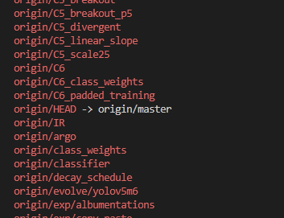
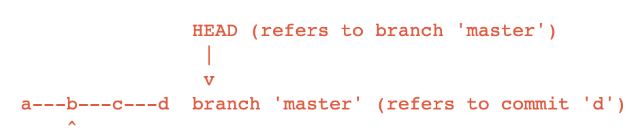
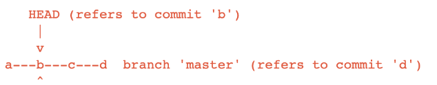

# Fetch 명령어 활용

`git fetch`는 원격저장소의 변경사항들을 로컬저장소에 가져오기 전 변경사항을 확인하고 싶은 경우 사용함.  

1. 변경사항을 확인하고자 하는 repository를 remote repository로 추가해야함.
    ```bash
    git remote -v      # 현재의 remote repository 상태 확인

    git remote add upstream [확인하고자 하는 repository]       # upstream 이라는 name으로 확인하고자 하는 repository 추가
    ```
2. `git fetch upstream`을 통해 등록한 remote repository 로 부터 최신 업데이트를 가져온다.
    ```bash
    git fetch upstream
    ```
3. `git branch -r`을 통해 fetch를 확인할 수 있는 브랜치 내역들이 나옴

    <p align="center">  </p>
    <div align="center" markdown="1"> fork한번 한 yolov5 repository에 대해 시간이 지난 후 fetch 해주고 `branch -r` 명령어를 입력해준 상태임. 수많은 branch가 존재함을 확인할 수 있음
    </div>

    - `git diff [local branch] [fetch한 branch]`를 통해 현재 내 local과 fetch branch의 어느 부분이 다른지 대략적으로 확인할 수 있음

4. `git checkout [원하는 branch]`를 통해 해당 branch 조회 가능. (이렇게 branch를 접근해도 local 파일이 변하거나 하지 않는다. 단지 어떤것이 변경사항인지 확인할 수 있는것이다.)
5. `git pull [remote] [branch]`를 통해 원하는 remote branch의 작업물을 local에 적용시킬 수 있음.
   - 이때 같은 파일을 수정함으로 인해 conflict가 발생한다면 다음 포스트 참고 -> [Git Confilct 충돌 해결](/Conflict 상황 및 해결법)


# Deteched HEAD 발생

git은 스냅샷(commit)을 참조하는 것을 통해 형상관리를 하게 되는데, 이 commit을 참조할 수 있는 방법이 바로 `HEAD` 이다.  
문제는 이 `HEAD`가 branch를 가리키는 것이 일반적이지만, **commit을 가리키는 상황**도 발생할 수 있는것이다.  
즉, `HEAD`가 commit을 가리키는 상황일 때 Deteched HEAD 라고 말한다.  

<p align="center">  </p>
<div align="center" markdown="1"> git은 HEAD가 위 그림과 같이 branch를 가리키는 것을 지향한다. 
</div>

<p align="center">  </p>
<div align="center" markdown="1"> commit을 가리키는 상황(Deteched HEAD) 상황일 때는 제대로 된 형상관리가 어렵다. 위 그림에서의 작업공간이 commit b 이기 때문에 기존 branch에 commit이 불가능하며, Deteched HEAD 상태에서 commit을 하면서 작업을 진행한 들, 다른 작업물과 merge 할 수 없다.(branch가 없기 때문)
</div>

이러한 상황을 해결할 수 있는 방법은 간단하게 **detached HEAD 상태일 때 했던 작업을 branch로 만들어주는 것이다.**