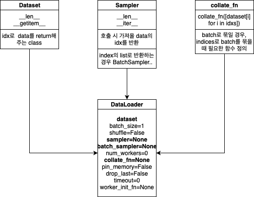

> 본 포스트는 Pytorch 프레임워크를 공부하기 위한 포스트 입니다.  
> 데이터 전처리, 시각화, 효율적인 학습 방법등을 중점적으로 다루고자 합니다.  
> 참고한 블로그 목록: [윤대희님 블로그](https://076923.github.io/posts/#PyTorch)

# Pytorch 라이브러리 구조

<p align="center">  </p>


# Tensor 관련 여러 메서드와 함수

## Tensor 연산 관련 에러 발생할 때

다음과 같은 사항을 점검해보자.

- Data가 Tensor로 변환되는 Data인가?
- 연산하고 있는 Tensor간 data type이 같은가?
- 연산시 CPU Tensor와 GPU Tensor를 같은 Device로 통일했는가? (같은 device 끼리만 연산이 이뤄져야함)

## 복사 방법
`detach()`, `clone()` 방법이 존재한다.

- `detach()`: 기존 Tensor에서 gradient 전파가 안되는 텐서를 생성함
  - 단 storage를 공유하기 때문에 detach로 생성한 Tensor가 변경되면 원본 Tensor도 똑같이 변경됨 (Mutable 인듯)
  - 비슷한 느낌으로 `with torch.no_grad()`가 있으며 이 구문 아래의 텐서들은  `requires_grad`를 모두 `False`로 처리됨.
- `clone()`: 기존 Tensor와 내용을 복사한 텐서 생성. `detach()`는 computational graph는 복사하지 않는다는게 차이점인 것으로 보임

# Custom Dataset 구축하기

torch.utils.data를 상속하는 객체들로 구축한다.
{:.info}

<p align="center"> 

</p>
<div align="center">
전체적인 그림 구조 (출처: https://hulk89.github.io/pytorch/2019/09/30/pytorch_dataset/)
</div>

각 객체들을 구현하는 법을 파이썬 코드로 정리해 보았다. 총 3개의 객체를 통해 <mark>DataLoader</mark> 객체를 생성하고 이걸 통해 batch_size, shuffle 등의 다양한 조작을 진행한다.
- Dataset 객체
    ```python
    import torch
    import torch.utils.data as data


    class BasicDataset(data.Dataset):
        def __init__(self, x_tensor, y_tensor):
            super(BasicDataset, self).__init__()

            self.x = x_tensor
            self.y = y_tensor
            
        def __getitem__(self, index):
            return self.x[index], self.y[index]

        def __len__(self):
            return len(self.x)
            
    if __name__ == "__main__":
        train_x = torch.rand(500)
        train_y = torch.rand(500)
        tr_dataset = BasicDataset(train_x, train_y)
    ```
- Sampler 객체
  - data의 Index 반환
  - Dataset을 인자로 받음
  - shuffle을 위해 사용됨
  - 사용 목적에 따른 다양한 객체 종류가 있음
    - `SequentialSampler`: 항상 같은 순서
    - `RandomSampler`: 랜덤, replacement 여부 선택 가능, 개수 선택 가능
    - `SubsetRandomSampler`: 랜덤 리스트, 위와 두 조건 불가능
    - `WeightRandomSampler`: 가중치에 따른 확률
    - `BatchSampler`: Batch 단위로 Sampling 가능
    - `DistributedSampler`: 분산처리(torch.nn.parallel.DistributedDataParallel과 함께 사용)

map-style datasets에 존재하는 여러 인덱스들을 sampler 객체를 활용해 iterable 객체로 만들 수 있다.
DataLoader 클래스에서 shuffle 인자를 True로 설정하면 자동으로 Sampler 객체가 생성되어 섞이는 것이다.

- Collate_fn 객체
  - 데이터 길이가 가변적인데, batch_size가 2 이상일 경우 데이터 사이즈를 맞추기 위해 사용됨
  - 이미지로 예를들면 모든 이미지 사이즈가 640, 480으로 정해져있다면 Collate_fn을 지정해 줄 필요가 없지만, 어떤 이미지는 640,480이고 어떤 이미지는 1024, 2048이라면 다른 사이즈의 데이터가 같은 Batch로 묶이는 순간 Error가 발생하므로 Collate_fn 객체를 사용해야 한다.


- 다음 글은 pytorch 공식문서의 글이다.

데이터 형태가 index를 통해 접근 가능하거나, iterable 객체화가 가능한 데이터셋을 다음의  
1. `map-style datasets`
2. `iterable-style datasets`

라 하며 Pytorch는 위 2가지 타입을 다음과 같은 메소드를 통해 지원한다.

1. `map-style datasets`

    ```python
    __getitem__()

    __len__()
    ```

    - 데이터를 뽑을 때 torch.utils.data.Sampler를 통해 data를 loading 해야 한다.

2. `iterable-style datasets`

    ```python
    __iter__()
    ```

## ImageFolder를 활용한 데이터로더 구축

- 짚고 넘어가면 좋을 점
  - ImageFolder datasets 객체는 directory를 알파벳 순서대로 정렬한 뒤, 정수형 label 값을 각각 부여한다.
  - ImageFolder 사용시 준수해야 할 폴더 구조

    ```
    Data
    |   --- Cat
    |       |   --- 0.jpg
    |       |   --- 1.jpg
    |           ...
    |       |   --- 100.jpg
    |   --- Dog
    |       |   --- 0.jpg
    |       |   --- 1.jpg
    |       |   ...
    |       |   --- 100.jpg
    ```

폴더 구조를 이용해 데이터, 레이블을 맵핑시킬 수 있는 Dataset 객체이다. 아래 코드를 통해 어떻게 쓰이는지 이해해보자.

1. Label별 폴더 만들기

    ```python
    import pandas as pd
    import os

    def createFolder(directory):
        os.makedirs(directory, exist_ok=True)

    train_df = pd.read_csv("./data/train_df.csv")
    print(f"클래스 갯수: {len(train_df['label'].unique())}")  # type = numpy.array
                                                            # 클래스 갯수 파악을 위한 unique() 활용
    label_list = train_df["label"].unique().tolist()
    print(f"추가된 레이블: {label_list}")


    # 레이블 폴더 생성
    for i in range(len(label_list)):
        createFolder(f'./train/{label_list[i]}')
    ```

        클래스 갯수: 88
        추가된 레이블: ['transistor-good', 'capsule-good', 'wood-good', 'bottle-good', 'screw-good', 'cable-bent_wire', 'carpet-hole', 'hazelnut-good', 'pill-pill_type', 'cable-good', 'metal_nut-scratch', 'pill-good', 'screw-thread_side', 'zipper-fabric_border', 'leather-good', 'pill-scratch', 'toothbrush-good', 'hazelnut-crack', 'screw-manipulated_front', 'zipper-good', 'tile-good', 'carpet-good', 'metal_nut-good', 'bottle-contamination', 'grid-good', 'zipper-split_teeth', 'pill-crack', 'wood-combined', 'pill-color', 'screw-thread_top', 'cable-missing_cable', 'capsule-squeeze', 'zipper-rough', 'capsule-crack', 'capsule-poke', 'metal_nut-flip', 'carpet-metal_contamination', 'metal_nut-color', 'transistor-bent_lead', 'zipper-fabric_interior', 'leather-fold', 'tile-glue_strip', 'screw-scratch_neck', 'screw-scratch_head', 'hazelnut-cut', 'bottle-broken_large', 'bottle-broken_small', 'leather-cut', 'cable-cut_outer_insulation', 'zipper-squeezed_teeth', 'toothbrush-defective', 'cable-cut_inner_insulation', 'pill-contamination', 'cable-missing_wire', 'carpet-thread', 'grid-broken', 'pill-faulty_imprint', 'hazelnut-hole', 'leather-glue', 'leather-poke', 'transistor-damaged_case', 'wood-scratch', 'tile-gray_stroke', 'capsule-faulty_imprint', 'grid-glue', 'zipper-combined', 'carpet-color', 'grid-bent', 'pill-combined', 'hazelnut-print', 'cable-combined', 'capsule-scratch', 'metal_nut-bent', 'zipper-broken_teeth', 'tile-oil', 'transistor-misplaced', 'grid-thread', 'grid-metal_contamination', 'carpet-cut', 'wood-color', 'cable-cable_swap', 'tile-crack', 'leather-color', 'cable-poke_insulation', 'transistor-cut_lead', 'wood-hole', 'tile-rough', 'wood-liquid']
        
2. 이미지 파일을 레이블에 맞게 각 폴더로 옮기기

    ```python
    from glob import glob
    import shutil

    IMAGE_DIR = os.path.join(os.getcwd(), 'data', 'train', 'train', '*.png')
    TARGET_DIR = os.path.join(os.getcwd(), 'train')

    # IMAGE_DIR = './data/train/train/*.png'
    fpaths = glob(IMAGE_DIR, recursive=True)

    for fpath in fpaths:
        img_path = fpath.split('\\')[-1]
        label = train_df.loc[train_df['file_name'] == img_path]['label']
        shutil.move(fpath, os.path.join(TARGET_DIR, str(label.iloc[0])))        # 그냥 label[0]으로 접근하면 첫번째 record만 저장되고 두번째 부터 에러남
                                                                                # 두번째 record의 인덱스가 0이 아닌 1이기 때문!
    ```

3. 이미지 전처리와 데이터 Split 까지

    ```python
    import numpy as np
    import torchvision.transforms as transforms
    from torchvision import datasets

    def get_mean_std(data_dir):
        '''
        이미지 정규화 시 성능 향상 , 평균과 표준편차로 정규화 실행
        data_dir = 이미지 들어있는 폴더 path
        '''
        transform = transforms.Compose([
            transforms.Resize((1024, 1024)),
            transforms.ToTensor()
        ])

        dataset = datasets.ImageFolder(os.path.join(f'./{data_dir}'), transform)
        print("데이터 정보", dataset)

        # meanRGB = [np.mean(x.numpy(), axis=(1,2)) for x,_ in dataset]
        # stdRGB = [np.std(x.numpy(), axis=(1,2)) for x,_ in dataset]

        meanRGB = [np.mean(x.numpy(), axis=(1,2)) for x,_ in dataset]
        stdRGB = [np.std(x.numpy(), axis=(1,2)) for x,_ in dataset]

        meanR = np.mean([m[0] for m in meanRGB])
        meanG = np.mean([m[1] for m in meanRGB])
        meanB = np.mean([m[2] for m in meanRGB])

        stdR = np.mean([s[0] for s in stdRGB])
        stdG = np.mean([s[1] for s in stdRGB])
        stdB = np.mean([s[2] for s in stdRGB])
        print("평균",meanR, meanG, meanB)
        print("표준편차",stdR, stdG, stdB)

    # train data, test data 다르게 nomalization 적용하려면 data_dir 바꾸세요.
    train_dir = "./train"

    get_mean_std(train_dir)


    ```

        데이터 정보 Dataset ImageFolder
            Number of datapoints: 4277
            Root location: ././train
            StandardTransform
        Transform: Compose(
                    Resize(size=(1024, 1024), interpolation=bilinear, max_size=None, antialias=None)
                    ToTensor()
                )


    ```python
    from torch.utils.data.sampler import SubsetRandomSampler
    import torch

    data_dir = "./"

    def create_datasets(batch_size):

        train_transform = transforms.Compose([
            transforms.RandomHorizontalFlip(),  # 좌우반전
            transforms.RandomVerticalFlip(),    # 상하반전
            transforms.Resize((1024, 1024)),    # 리사이징
            transforms.ToTensor(),
            transforms.Normalize([0.43303847, 0.4034577, 0.39415097], [0.18344551, 0.17549995, 0.1647388])  # 정규화(Normalization)
        ])

        test_transform = transforms.Compose([
            transforms.Resize((1024, 1024)),
            transforms.ToTensor(),
            transforms.Normalize([0.43303847, 0.4034577, 0.39415097], [0.18344551, 0.17549995, 0.1647388])
        ])

        # 학습용 데이터셋, 테스트 데이터셋 구축
        train_data = datasets.ImageFolder(os.path.join(data_dir, 'train'), train_transform)

        # 검증용으로 사용할 비율
        valid_size = 0.3
        
        # 검증용으로 사용할 학습용 Indices를 얻는다.
        num_train = len(train_data)
        print(f"데이터 어그멘테이션으로 늘어나는지 여부 체크: {num_train}")
        indices = list(range(num_train))        # 전체 학습 데이터 index를 list 형태로 get
        np.random.shuffle(indices)
        split = int(np.floor(valid_size * num_train))       # 적당한 정도를 train set으로 두기 위함
        train_idx, valid_idx = indices[split:], indices[:split]
        
        # Training
        train_sampler = SubsetRandomSampler(train_idx)
        valid_sampler = SubsetRandomSampler(valid_idx)

        # load training data in batches
        train_loader = torch.utils.data.DataLoader(train_data, batch_size = batch_size, sampler = train_sampler, num_workers = 4)
        valid_loader = torch.utils.data.DataLoader(train_data, batch_size = batch_size, sampler = valid_sampler, num_workers = 4)
                # valid_loader에 train_data가 들어가는 부분이 어색하게 느껴졌지만, 인덱스를 가지고 있고 그 인덱스릉 통해
                # 데이터를 뽑아내는 곳은 train_data 이기 때문에 잘못된 것이 아니다.
                # 또한 모든 이미지 데이터의 사이즈가 같기 때문에 Collate_fn 객체는 따로 지정해주지 않아도 된다.

        return train_data, train_loader, valid_loader
    ```


    ```python
    import torchvision
    import matplotlib.pyplot as plt

    train_data, train_loader, valid_loader = create_datasets(batch_size=4)

    print("train 데이터셋 크기: ", len(train_data))

    class_names = train_data.classes
    print("클래스: ", class_names)

    def imshow(input, title):

        # torch.Tensor를 numpy 객체로 변환
        input = input.numpy().transpose((1, 2, 0))
        # 이미지 정규화 해제하기
        mean = np.array([0.43303847, 0.4034577, 0.39415097])
        std = np.array([0.18344551, 0.17549995, 0.1647388])
        input = std * input + mean
        input = np.clip(input, 0, 1)

        # 이미지 출력
        plt.imshow(input)
        plt.title(title)
        plt.show()


    # 학습 데이터를 배치 단위로 불러오기
    iterator = iter(train_loader)

    # 현재 배치를 이용해 격자 형태의 이미지를 만들어 시각화
    inputs, classes = next(iterator)
    print(inputs.shape)
    out = torchvision.utils.make_grid(inputs)
    imshow(out, title=[class_names[x] for x in classes])
    ```

        데이터 어그멘테이션으로 늘어나는지 여부 체크: 4277
        train 데이터셋 크기:  4277
        클래스:  ['bottle-broken_large', 'bottle-broken_small', 'bottle-contamination', 'bottle-good', 'cable-bent_wire', 'cable-cable_swap', 'cable-combined', 'cable-cut_inner_insulation', 'cable-cut_outer_insulation', 'cable-good', 'cable-missing_cable', 'cable-missing_wire', 'cable-poke_insulation', 'capsule-crack', 'capsule-faulty_imprint', 'capsule-good', 'capsule-poke', 'capsule-scratch', 'capsule-squeeze', 'carpet-color', 'carpet-cut', 'carpet-good', 'carpet-hole', 'carpet-metal_contamination', 'carpet-thread', 'grid-bent', 'grid-broken', 'grid-glue', 'grid-good', 'grid-metal_contamination', 'grid-thread', 'hazelnut-crack', 'hazelnut-cut', 'hazelnut-good', 'hazelnut-hole', 'hazelnut-print', 'leather-color', 'leather-cut', 'leather-fold', 'leather-glue', 'leather-good', 'leather-poke', 'metal_nut-bent', 'metal_nut-color', 'metal_nut-flip', 'metal_nut-good', 'metal_nut-scratch', 'pill-color', 'pill-combined', 'pill-contamination', 'pill-crack', 'pill-faulty_imprint', 'pill-good', 'pill-pill_type', 'pill-scratch', 'screw-good', 'screw-manipulated_front', 'screw-scratch_head', 'screw-scratch_neck', 'screw-thread_side', 'screw-thread_top', 'tile-crack', 'tile-glue_strip', 'tile-good', 'tile-gray_stroke', 'tile-oil', 'tile-rough', 'toothbrush-defective', 'toothbrush-good', 'transistor-bent_lead', 'transistor-cut_lead', 'transistor-damaged_case', 'transistor-good', 'transistor-misplaced', 'wood-color', 'wood-combined', 'wood-good', 'wood-hole', 'wood-liquid', 'wood-scratch', 'zipper-broken_teeth', 'zipper-combined', 'zipper-fabric_border', 'zipper-fabric_interior', 'zipper-good', 'zipper-rough', 'zipper-split_teeth', 'zipper-squeezed_teeth']
        torch.Size([4, 3, 1024, 1024])
        

    <p align="center">  </p>


# torchvision.transforms

## Compose

여러개의 전처리 작업을 한번에 묶기 위함

```python
>>> transforms.Compose([
>>>     transforms.CenterCrop(10),
>>>     transforms.PILToTensor(),
>>>     transforms.ConvertImageDtype(torch.float),
>>> ])
```


```python
import io

import requests
import torchvision.transforms as T

from PIL import Image

img = Image.open('./data/cat1.jpg')

width, height= img.size

preprocess = T.Compose([
   T.Resize(256),
   T.CenterCrop(50),
   T.ToTensor(),
#    T.Normalize(
#        mean=[0.485, 0.456, 0.406],
#        std=[0.229, 0.224, 0.225]
#    )
])

x = preprocess(img)

# Expected result
# torch.Size([3, 224, 224])
```

# Reproductibility 높이기

학습을 진행할 때 마다 결과가 달리질 수 있으며, 항상 동일한 결과가 나오기를 원할 경우 Reproductibility(재현성)을 높여야함. 아래 코드를 통해 재현성을 높일 수 있음
{:.success}

```python
torch.manual_seed(random_seed)
torch.cuda.manual_seed(random_seed)
torch.cuda.manual_seed_all(random_seed) # if use multi-GPU
torch.backends.cudnn.deterministic = True       # 항상 동일한 출력결과를 내게 하기 위함
torch.backends.cudnn.benchmark = False          # 내장된 cudnn 자동 튜너를 활성화하여, 하드웨어에 맞게 사용할 최상의 알고리즘을 찾는다.
                                                # 입력 이미지 크기가 자주 변하지 않으면, 초기 시간이 소요되지만
                                                # 일반적으로 더 빠른 runtime 효과를 볼 수 있다.
                                                # 입력 이미지 크기가 자주 변경된다면, 런타임 성능이 오히려 저하될 수 있다.
np.random.seed(random_seed)
random.seed(random_seed)
```
# GPU 테크닉

## 기본 명령어

```python
import torch

# GPU 사용 가능 여부
torch.cuda.is_available()

# GPU 사용이 가능하다면 가장 빠른 번호 GPU를 할당함
device = torch.device('cuda:0') if torch.cuda.is_available() else torch.device('cpu')

# GPU 이름 체크 (cuda:0에 연결된 그래픽 카드 기준)
torch.cuda.get_device_name(), device = 0
```

## 병렬 처리하기

- 초기 설정해줘야 하는 부분
    ```python
    import torch

    # 특정 번호의 GPU 사용 지정
    ## 0, 1, 2번의 GPU를 모두 사용하고 싶은 경우의 예시 (각각 cuda:0, cuda:1, cuda:2에 지정)
    os.environ["CUDA_DEVICE_ORDER"] = "PCI_BUS_ID"
    os.environ["CUDA_VISIBLE_DEVICES"] = "0, 1, 2"

    ## 2번 GPU만 사용하고 싶은 경우 예시 (cuda:0에 지정)
    ## PCI_BUS_ID가 2인 그래픽 카드가 cuda:0으로 할당된다.
    os.environ["CUDA_DEVICE_ORDER"] = "PCI_BUS_ID"
    os.environ["CUDA_VISIBLE_DEVICES"] = "2"
    ```

- 모델 Parallel 설정

    ```python
    import torch
    import torch.nn as nn

    device = torch.device("cuda:0" if torch.cuda.is_available() else "cpu")

    if torch.cuda.device_count() > 1:
        print("Let's use", torch.cuda.device_count(), "GPUs!")
        model = nn.DataParallel(model)
    
    model.to(device)
    ```


## Out-Of-Memory 해결

<div align="center" markdown="1">  bluecolorsky 블로그를 참고하였습니다. [링크](https://bluecolorsky.tistory.com/62)
</div>

모델의 사이즈가 너무 크거나 데이터의 크기가 너무 커서 GPU out-of Memory 에러가 발생하는게 아니라면 **메모리 누수**의 가능성이 높다.이에 대한 해결방안을 알아보자.

### 모델의 output을 다른 함수나 코드에서 사용하는 경우

보통 training iteration이 끝나면 이전 모델의 output은 자동으로 메모리 반환이 이루어지지만, 모델의 output을 다른 함수나 코드에서 사용하는 경우 메모리 반환이 이루어지지 않는다. 따라서 이러한 경우 output을 복사해 다른 함수나 코드에서 사용해야 한다.

```python
predict = model(input_data)
copiedPredict = predict.data.cpu().numpy()  # 결과를 복사
otherFunction(copiedPredict)    # 다른 함수에서 결과 사용
```

### 학습 데이터가 삭제되지 않는 경우

흔한 경우가 매 iteration 마다 numpy array로부터 tensor를 생성하고, 반환하지 않는 것이다. Tensor들의 메모리를 del 함수를 사용해 반환할 수 있도록 하자. 만약 그래도 해결되지 않는다면 GPU 캐시를 삭제해보자.

```python
trainData = torch.tensor(numpyTrainData)

... 모델 학습...

del trainData   # 학습 데이터 삭제
torch.cuda.empty_cache()    # GPU 캐시 데이터 삭제
```