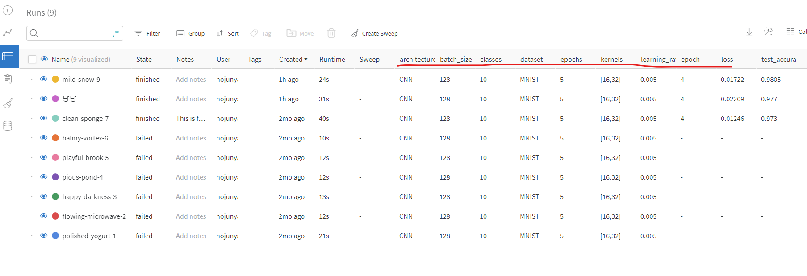
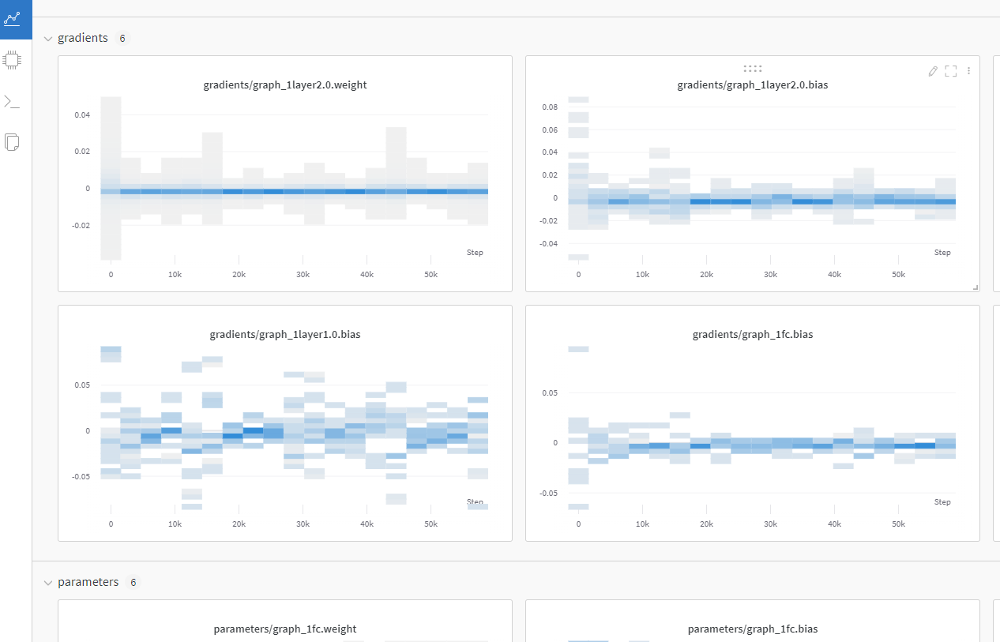

# Wandb-Pytorch 연계

[wandb 블로그 자체 포스트이며, 전체적으로 개념을 잡아줌](https://wandb.ai/wandb_fc/korean/reports/Weights-Biases-Data-Science---Vmlldzo4MDEwNzc)  
[여기 사이트 꼭 한번 보자!. Gradient 어떻게 활용하면 좋을지 알려줌](https://89douner.tistory.com/313)  
[여기는 wandb 친절하게 설명해준 사이트](https://pebpung.github.io/wandb/2021/10/06/WandB-1.html)

## Reproductibility(재현성)을 높이기 위한 코드

- mnist dataset도 여기서 받음


```python
import os
import random

import numpy as np
import torch
import torch.nn as nn
import torchvision
import torchvision.transforms as transforms
from tqdm.notebook import tqdm

torch.backends.cudnn.deterministic = True       # 재현성(Reproductibility)을 위함. 학습할 때 마다 결과 달라지는것 방지
random.seed(hash("setting random seeds") % 2**32 - 1)
np.random.seed(hash("improves reproducibility") % 2**32 - 1)
torch.manual_seed(hash("by removing stochasticity") % 2**32 - 1)        # torch.rand(), torch.randn(), torch.randint(), torch.randperm() 에 영향을 줌
torch.cuda.manual_seed_all(hash("so runs are repeatable") % 2**32 - 1)  # gpu 랜덤시드 초기화인데 multi gpu까지 고려한것

device = torch.device("cuda:0" if torch.cuda.is_available() else "cpu")
torchvision.datasets.MNIST.mirrors = [mirror for mirror in torchvision.datasets.MNIST.mirrors if not mirror.startswith("http://yann.lecun.com")]
```

## Quick start

- 딥러닝 모델 초기 설정에 많이 자주 쓰이는 yaml file, config file등 여러 방법으로 초기 환경셋팅이 가능하며 튜토리얼에서는 Dictionary 형태로 환경셋팅을 진행
- wandb에 쓰이지는 않지만 아래와 같은 방법으로 초기 모델 하이퍼 파라미터를 지정해주는것이 개발할 때 좋음


```python
config = dict(
    epochs=5,
    classes=10,
    kernels=[16, 32],
    batch_size=128,
    learning_rate=0.005,
    dataset="MNIST",
    architecture="CNN")
```

### wandb.login

> wandb 홈페이지에 회원가입 후 API 키를 발급받는다.


```python
import wandb

wandb.login()       # 주피터 노트북으로 발급받은 키 입력
```

    Failed to detect the name of this notebook, you can set it manually with the WANDB_NOTEBOOK_NAME environment variable to enable code saving.
    wandb: Currently logged in as: javis-team (use `wandb login --relogin` to force relogin)
    


    True


### wandb.init

- wandb를 실행시킴. 어떤 Repository에서 실행시킬지, 어떤 항목들을 tracking 할 지 등의 초기화 담당
- 주로 사용되는 파라미터
  - `project:(str, optional)`: run할 Repository 이름
  - `name:(str, optional)`: 현재 진행하는 실험 이름. (실험 이름 정도로 생각하면 됨. 하나의 project에서 다양한 실험이 가능함. 이게 여러 그래프에서 하나의 색깔을 가리키는 id가 됨)
  - `config:(dict, argparse, absl.flags, str, optional)` : tracking 할것들 지정  

<p align="center">  </p>

<div align="center" markdown="1"> 위 그림에서 볼 수 있듯 table로 항목들 살펴보면 column들에 config 항목들이 추가되어 있는것을 확인할 수 있다.  좌측의 clean-sponge-7, playful-brook-5 등은 동일한 repository에서 진행한 여러 다른 실험 결과들이다. 
</div>


```python
def model_pipeline(hyperparameters):

    # tell wandb to get started
    with wandb.init(project="pytorch-demo", config=hyperparameters):    
      # access all HPs through wandb.config, so logging matches execution!
      config = wandb.config

      # make the model, data, and optimization problem
      model, train_loader, test_loader, criterion, optimizer = make(config)
      print(model)

      # and use them to train the model
      train(model, train_loader, criterion, optimizer, config)

      # and test its final performance
      test(model, test_loader)

    return model

def make(config):
    """ Training 할 때 데이터 지정하고, setting 여러개 하는거 여기서 다 하는 느낌임
    위에서 지정한 환경설정 관련 데이터가 여기서 초기화 하는데 활용됨
        
    """    
    # Make the data
    train, test = get_data(train=True), get_data(train=False)
    train_loader = make_loader(train, batch_size=config.batch_size)
    test_loader = make_loader(test, batch_size=config.batch_size)

    # Make the model
    # 위에서 설정한 kernels, classes 정보가 여기서 쓰임
    model = ConvNet(config.kernels, config.classes).to(device)

    # Make the loss and optimizer
    criterion = nn.CrossEntropyLoss()
    optimizer = torch.optim.Adam(
        model.parameters(), lr=config.learning_rate)
    
    return model, train_loader, test_loader, criterion, optimizer

def get_data(slice=5, train=True):
    full_dataset = torchvision.datasets.MNIST(root=".",
                                              train=train, 
                                              transform=transforms.ToTensor(),
                                              download=True)
    # equiv to slicing with [::slice] 
    # Dataset 클래스(__getitem__, __len__을 가지는)를 여러개의 클래스로 쪼갠것으로 보임
    sub_dataset = torch.utils.data.Subset(
      full_dataset, indices=range(0, len(full_dataset), slice))
    
    return sub_dataset

def make_loader(dataset, batch_size):
    loader = torch.utils.data.DataLoader(dataset=dataset,
                                         batch_size=batch_size, 
                                         shuffle=True,
                                         pin_memory=True, num_workers=2)
    return loader


# Conventional and convolutional neural network

class ConvNet(nn.Module):
    def __init__(self, kernels, classes=10):
        super(ConvNet, self).__init__()
        
        self.layer1 = nn.Sequential(
            nn.Conv2d(1, kernels[0], kernel_size=5, stride=1, padding=2),
            nn.ReLU(),
            nn.MaxPool2d(kernel_size=2, stride=2))
        self.layer2 = nn.Sequential(
            nn.Conv2d(16, kernels[1], kernel_size=5, stride=1, padding=2),
            nn.ReLU(),
            nn.MaxPool2d(kernel_size=2, stride=2))
        self.fc = nn.Linear(7 * 7 * kernels[-1], classes)
        
    def forward(self, x):
        out = self.layer1(x)
        out = self.layer2(out)
        out = out.reshape(out.size(0), -1)
        out = self.fc(out)
        return out
```

### wandb.watch

- `wandb.watch`: torch model의 gradient 등을 tracking 하기위해 사용됨
  - 관련 파라미터
    - `models:(torch.Module, optional)`: pytorch 기반 딥러닝 모델
    - `criterion:(torch.F, optional)`: loss 함수
    - `log(str)`: gradients, parameter 중에 하나를 기입 가능하며, all을 통해 둘 다 조회 할 수도 있음

<p align="center">  </p>

<div align="center" markdown="1"> wandb 홈페이지에서 gradient, parameter 관련 그래프 조회 가능 
</div>

### wandb.log

- `wandb.log`: python dictionary 타입으로 인자를 넘기며, wandb 홈페이지에서 그래프로 출력하고 싶은 값 들을 적으면 됨
  - 관련 파라미터
    - `step:(int, optional)`: 몇 step마다 그래프로 찍을 것인지 나타냄. 값이 작을수록 촘촘한 그래프가 완성될것임

- wandb의 `watch`, `log` 활용됨
  - watch: log_freq마다 gradient, parameter 로그 남기는데 활용됨
  - log: 나머지 값들 로그 남기는데 활용됨


```python
def train(model, loader, criterion, optimizer, config):
    # Tell wandb to watch what the model gets up to: gradients, weights, and more!
    wandb.watch(model, criterion, log="all", log_freq=10)

    # Run training and track with wandb
    total_batches = len(loader) * config.epochs
    example_ct = 0  # number of examples seen
    batch_ct = 0
    for epoch in tqdm(range(config.epochs)):
        for _, (images, labels) in enumerate(loader):

            loss = train_batch(images, labels, model, optimizer, criterion)     # 흔히 pytorch 프레임워크에서 쓰이는 학습 루틴
            example_ct +=  len(images)
            batch_ct += 1

            # Report metrics every 25th batch
            if ((batch_ct + 1) % 25) == 0:
                train_log(loss, example_ct, epoch)      # gradient, parameter가 아닌 다른값들을 조회하기 함수 정의 및 사용


def train_batch(images, labels, model, optimizer, criterion):
    images, labels = images.to(device), labels.to(device)
    
    # Forward pass ➡
    outputs = model(images)
    loss = criterion(outputs, labels)
    
    # Backward pass ⬅
    optimizer.zero_grad()
    loss.backward()

    # Step with optimizer
    optimizer.step()

    return loss

def train_log(loss, example_ct, epoch):
    # Where the magic happens
    wandb.log({"epoch": epoch, "loss": loss}, step=example_ct)
    print(f"Loss after " + str(example_ct).zfill(5) + f" examples: {loss:.3f}")
```

### wandb.save

- `wandb.save`: 모델 가중치, log, 코드등을 저장할 수 있게 해줌.


```python
def test(model, test_loader):
    model.eval()

    # Run the model on some test examples
    with torch.no_grad():
        correct, total = 0, 0
        for images, labels in test_loader:
            images, labels = images.to(device), labels.to(device)
            outputs = model(images)
            _, predicted = torch.max(outputs.data, 1)
            total += labels.size(0)
            correct += (predicted == labels).sum().item()

        print(f"Accuracy of the model on the {total} " +
              f"test images: {100 * correct / total}%")
        
        wandb.log({"test_accuracy": correct / total})

    # Save the model in the exchangeable ONNX format
    torch.onnx.export(model, images, "model.onnx")
    wandb.save("model.onnx")
```

- 실행!

```python
# Build, train and analyze the model with the pipeline
model = model_pipeline(config)
```


    wandb version 0.12.16 is available!  To upgrade, please run:
    $ pip install wandb --upgrade
    Tracking run with wandb version 0.12.11
    Run data is saved locally in <code>d:\Work\Study\wandb\wandb\run-20220517_200748-2gveead3</code>
    Syncing run <strong><a href="https://wandb.ai/javis-team/pytorch-demo/runs/2gveead3" target="_blank">mild-snow-9</a></strong> to <a href="https://wandb.ai/javis-team/pytorch-demo" target="_blank">Weights & Biases</a> (<a href="https://wandb.me/run" target="_blank">docs</a>)<br/>


    ConvNet(
      (layer1): Sequential(
        (0): Conv2d(1, 16, kernel_size=(5, 5), stride=(1, 1), padding=(2, 2))
        (1): ReLU()
        (2): MaxPool2d(kernel_size=2, stride=2, padding=0, dilation=1, ceil_mode=False)
      )
      (layer2): Sequential(
        (0): Conv2d(16, 32, kernel_size=(5, 5), stride=(1, 1), padding=(2, 2))
        (1): ReLU()
        (2): MaxPool2d(kernel_size=2, stride=2, padding=0, dilation=1, ceil_mode=False)
      )
      (fc): Linear(in_features=1568, out_features=10, bias=True)
    )
    


      0%|          | 0/5 [00:00<?, ?it/s]


    Loss after 03072 examples: 0.470
    Loss after 06272 examples: 0.261
    Loss after 09472 examples: 0.142
    Loss after 12640 examples: 0.113
    Loss after 15840 examples: 0.045
    Loss after 19040 examples: 0.114
    Loss after 22240 examples: 0.046
    Loss after 25408 examples: 0.030
    Loss after 28608 examples: 0.111
    Loss after 31808 examples: 0.060
    Loss after 35008 examples: 0.026
    Loss after 38176 examples: 0.036
    Loss after 41376 examples: 0.048
    Loss after 44576 examples: 0.016
    Loss after 47776 examples: 0.010
    Loss after 50944 examples: 0.016
    Loss after 54144 examples: 0.066
    Loss after 57344 examples: 0.017
    Accuracy of the model on the 2000 test images: 98.05%
    
    

<code markdown='1'>
Waiting for W&B process to finish... <strong style="color:green">(success).</strong>
</code>


    VBox(children=(Label(value='0.001 MB of 0.112 MB uploaded (0.000 MB deduped)\r'), FloatProgress(value=0.008004…


<style>
    table.wandb td:nth-child(1) { padding: 0 10px; text-align: right }
    .wandb-row { display: flex; flex-direction: row; flex-wrap: wrap; width: 100% }
    .wandb-col { display: flex; flex-direction: column; flex-basis: 100%; flex: 1; padding: 10px; }
    </style>
<div class="wandb-row"><div class="wandb-col"><h3>Run history:</h3><br/><table class="wandb"><tr><td>epoch</td><td>▁▁▁▃▃▃▃▅▅▅▅▆▆▆▆███</td></tr><tr><td>loss</td><td>█▅▃▃▂▃▂▁▃▂▁▁▂▁▁▁▂▁</td></tr><tr><td>test_accuracy</td><td>▁</td></tr></table><br/></div><div 
class="wandb-col"><h3>Run summary:</h3><br/><table class="wandb"><tr><td>epoch</td><td>4</td></tr><tr><td>loss</td><td>0.01722</td></tr><tr><td>test_accuracy</td><td>0.9805</td></tr></table><br/></div></div>


Synced <strong style="color:#cdcd00">mild-snow-9</strong>: <a href="https://wandb.ai/javis-team/pytorch-demo/runs/2gveead3" target="_blank">https://wandb.ai/javis-team/pytorch-demo/runs/2gveead3</a><br/>Synced 6 W&B file(s), 0 media file(s), 0 artifact file(s) and 1 other file(s)


Find logs at: <code>.\wandb\run-20220517_200748-2gveead3\logs</code>


- 위 출력을 통해 나오는 링크를 들어가면 wandb와 연결되며 web을 통해 gradientes, parameters, 지정한 값 들에 대한 변화도 등을 볼 수 있다


<p align="center">
    
</p>

## Sweap을 통한 하이퍼 파라미터 튜닝

[Google Colab](https://colab.research.google.com/github/wandb/examples/blob/master/colabs/pytorch/Organizing_Hyperparameter_Sweeps_in_PyTorch_with_W%26B.ipynb#scrollTo=FuTP9WFMSjQP)  

[Sweap 돌려볼 수 있는 몇가지 샘플 코드들](https://github.com/wandb/examples/tree/master/examples/keras/keras-cnn-fashion)