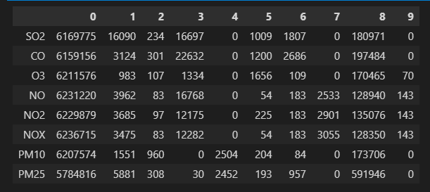

# 아이디어

딥러닝과 경량화를 엮으면 좋을 것 같음.  
[딥러닝 모델 경량화 기술 분석(2020)](https://repository.kisti.re.kr/bitstream/10580/15591/1/%28%EA%B8%B0%EC%88%A0%29%EB%94%A5%EB%9F%AC%EB%8B%9D%20%EB%AA%A8%EB%8D%B8%20%EA%B2%BD%EB%9F%89%ED%99%94%20%EA%B8%B0%EC%88%A0%20%EB%B6%84%EC%84%9D.pdf)  

[Deep Learning on Mobile and Embedded Devices: State-of-the-art, Challenges, and Future Directions](https://inha.primo.exlibrisgroup.com/discovery/fulldisplay?docid=cdi_acm_primary_3398209&context=PC&vid=82KST_INH:INHA&lang=ko&search_scope=MyInst_and_CI&adaptor=Primo%20Central&tab=Everything&query=any,contains,Deep%20Learning%20on%20Mobile%20and%20Embedded%20Devices:%20State-of-the-art,%20Challenges,%20and%20Future%20Directions&offset=0)  
정석학술정보관에서 해당 논문 조회가 가능하였음.. 신세계다..  

학위논문 계획서를 작성하면서 생각났던 아이디어: `Recursive Knowledge Distillation method`  


# BeatGAN 학위논문 시작

## 통계 활용할 자료 정리

```python
elements_name = ['SO2', 'CO', 'O3', 'NO', 'NO2', 'NOX', 'PM10', 'PM25']

# index 따로 설정 안해서 그냥 정수형으로 초기화 되게
df = pd.DataFrame(data=[[0]*8 for _ in range(10)])
df = df.transpose()
# (ori_data[111121].loc[:, [name + '_CODE' for name in elements_name]]== 0).sum().reset_index(drop=True)

for code in range(0, 10):
    for key in ori_data.keys():
        df[code] += (ori_data[key].loc[:, [name + '_CODE' for name in elements_name]]== code.sum().reset_index(drop=True)

df.index=elements_name
df
```

<p align="center">  </p>
<div align="center" markdown="1">
각 항목들에 대해서, 0~9까지의 wrongcode 갯수 저장. 통계처리할 때 활용하면 좋을 듯
</div>