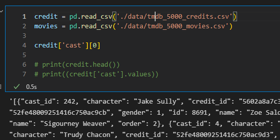

| 본 포스트는 Pandas로 **대표 목적**을 이루는데 있어서 필요했던 다른 문법들, 발생한 상황들, 생각들을 연결되게 정리하였다.  데이터를 다루다보면 의도치 않은 상황들을 자주 만나게 될텐데 그런 점을 대비하기 위함이다.

# list, dictionary 등이 string 으로 csv 파일에 저장되어 있을 때

<p align="center">  </p>
<div align="center" markdown="1"> 위 그림과 같이 csv를 읽어와서 데이터에 접근했는데 데이터가 string type으로 되어 있으면 난감하다.. 
</div>

이미 list, dict 형태를 갖추고 있지만 string 형식으로 저장되어 있는 데이터의 경우 `ast` 라이브러리를 사용하면 편하다.  
```python
import ast

x = '["a", "b", "c", " d"]'
x = ast.literal_eval(x)
x = [n.strip() for n in x]
x
```

    ['a', 'b', 'c', 'd']

# Columns 이름 변경

추천 시스템을 공부하던 중 칼럼 이름을 바꿀 상황이 생겨서 글로 정리한다.  
MovieLens 데이터를 사용했으며 데이터 형태는 아래와 같다.  

```python

```

