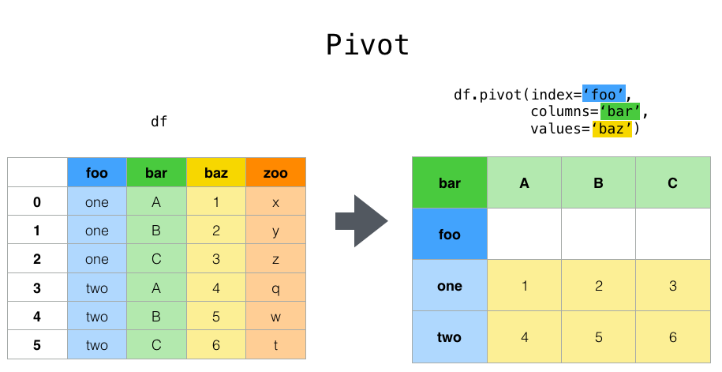
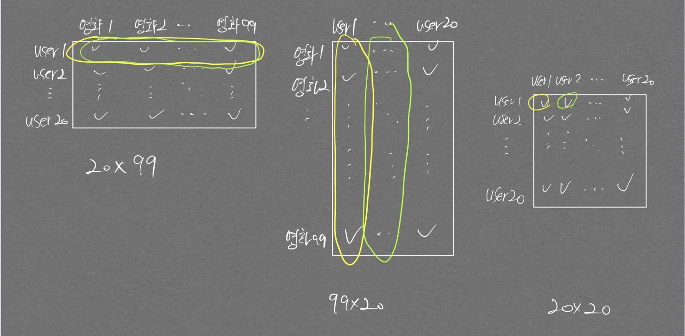
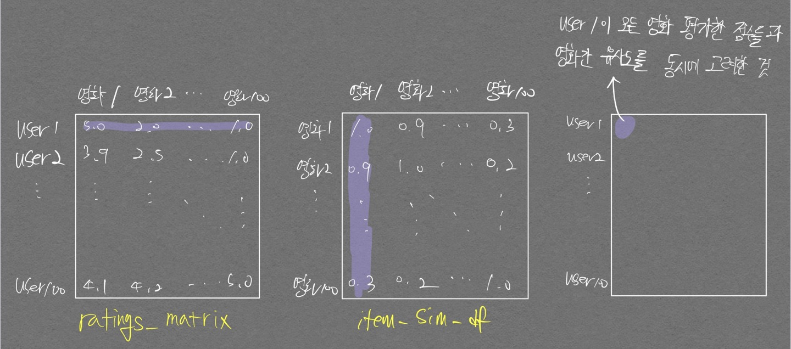
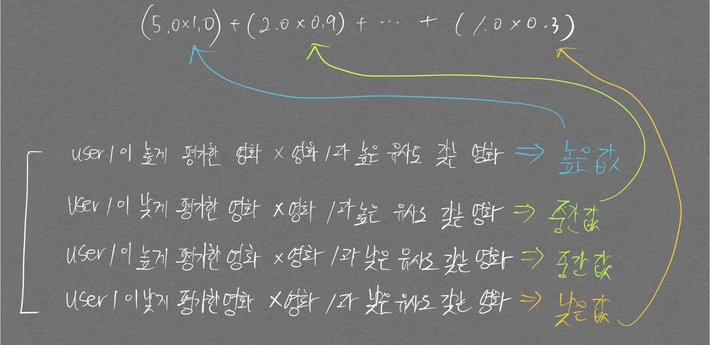

# 아이템 기반 최근접 이웃 협업 필터링

추천 시스템을 공부하던 중 칼럼 이름을 바꿀 상황이 생겨서 글로 정리한다.  
MovieLens 데이터를 사용했으며 데이터 형태는 아래와 같다.  


```python
import pandas as pd
import numpy as np

movies = pd.read_csv('./data/movies.csv')
ratings = pd.read_csv('./data/ratings.csv')

print(movies.shape, ratings.shape)
```

    (9742, 3) (100836, 4)
    


```python
movies.head()
```


<div>
<style scoped>
    .dataframe tbody tr th:only-of-type {
        vertical-align: middle;
    }

    .dataframe tbody tr th {
        vertical-align: top;
    }

    .dataframe thead th {
        text-align: right;
    }
</style>
<table border="1" class="dataframe">
  <thead>
    <tr style="text-align: right;">
      <th></th>
      <th>movieId</th>
      <th>title</th>
      <th>genres</th>
    </tr>
  </thead>
  <tbody>
    <tr>
      <th>0</th>
      <td>1</td>
      <td>Toy Story (1995)</td>
      <td>Adventure|Animation|Children|Comedy|Fantasy</td>
    </tr>
    <tr>
      <th>1</th>
      <td>2</td>
      <td>Jumanji (1995)</td>
      <td>Adventure|Children|Fantasy</td>
    </tr>
    <tr>
      <th>2</th>
      <td>3</td>
      <td>Grumpier Old Men (1995)</td>
      <td>Comedy|Romance</td>
    </tr>
    <tr>
      <th>3</th>
      <td>4</td>
      <td>Waiting to Exhale (1995)</td>
      <td>Comedy|Drama|Romance</td>
    </tr>
    <tr>
      <th>4</th>
      <td>5</td>
      <td>Father of the Bride Part II (1995)</td>
      <td>Comedy</td>
    </tr>
  </tbody>
</table>
</div>


```python
ratings.head()
```


<div>
<style scoped>
    .dataframe tbody tr th:only-of-type {
        vertical-align: middle;
    }

    .dataframe tbody tr th {
        vertical-align: top;
    }

    .dataframe thead th {
        text-align: right;
    }
</style>
<table border="1" class="dataframe">
  <thead>
    <tr style="text-align: right;">
      <th></th>
      <th>userId</th>
      <th>movieId</th>
      <th>rating</th>
      <th>timestamp</th>
    </tr>
  </thead>
  <tbody>
    <tr>
      <th>0</th>
      <td>1</td>
      <td>1</td>
      <td>4.0</td>
      <td>964982703</td>
    </tr>
    <tr>
      <th>1</th>
      <td>1</td>
      <td>3</td>
      <td>4.0</td>
      <td>964981247</td>
    </tr>
    <tr>
      <th>2</th>
      <td>1</td>
      <td>6</td>
      <td>4.0</td>
      <td>964982224</td>
    </tr>
    <tr>
      <th>3</th>
      <td>1</td>
      <td>47</td>
      <td>5.0</td>
      <td>964983815</td>
    </tr>
    <tr>
      <th>4</th>
      <td>1</td>
      <td>50</td>
      <td>5.0</td>
      <td>964982931</td>
    </tr>
  </tbody>
</table>
</div>


Collaborative filtering 이기 때문에 User Behavior중 하나인 영화 평점을 활용하겠다.  
행 레벨 형태의 원본 데이터 세트를 아래와 같이 변경할 수 있는 `pivot_table`을 사용하겠다.  

<p align="center">  </p>  
<div align="center" markdown="1"> pivot_table 그림 예시 
</div>


```python
pivot_df = ratings.pivot_table('rating', index='userId', columns='movieId')
pivot_df.head()
```


<div>
<style scoped>
    .dataframe tbody tr th:only-of-type {
        vertical-align: middle;
    }

    .dataframe tbody tr th {
        vertical-align: top;
    }

    .dataframe thead th {
        text-align: right;
    }
</style>
<table border="1" class="dataframe">
  <thead>
    <tr style="text-align: right;">
      <th>movieId</th>
      <th>1</th>
      <th>2</th>
      <th>3</th>
      <th>4</th>
      <th>5</th>
      <th>6</th>
      <th>7</th>
      <th>8</th>
      <th>9</th>
      <th>10</th>
      <th>...</th>
      <th>193565</th>
      <th>193567</th>
      <th>193571</th>
      <th>193573</th>
      <th>193579</th>
      <th>193581</th>
      <th>193583</th>
      <th>193585</th>
      <th>193587</th>
      <th>193609</th>
    </tr>
    <tr>
      <th>userId</th>
      <th></th>
      <th></th>
      <th></th>
      <th></th>
      <th></th>
      <th></th>
      <th></th>
      <th></th>
      <th></th>
      <th></th>
      <th></th>
      <th></th>
      <th></th>
      <th></th>
      <th></th>
      <th></th>
      <th></th>
      <th></th>
      <th></th>
      <th></th>
      <th></th>
    </tr>
  </thead>
  <tbody>
    <tr>
      <th>1</th>
      <td>4.0</td>
      <td>NaN</td>
      <td>4.0</td>
      <td>NaN</td>
      <td>NaN</td>
      <td>4.0</td>
      <td>NaN</td>
      <td>NaN</td>
      <td>NaN</td>
      <td>NaN</td>
      <td>...</td>
      <td>NaN</td>
      <td>NaN</td>
      <td>NaN</td>
      <td>NaN</td>
      <td>NaN</td>
      <td>NaN</td>
      <td>NaN</td>
      <td>NaN</td>
      <td>NaN</td>
      <td>NaN</td>
    </tr>
    <tr>
      <th>2</th>
      <td>NaN</td>
      <td>NaN</td>
      <td>NaN</td>
      <td>NaN</td>
      <td>NaN</td>
      <td>NaN</td>
      <td>NaN</td>
      <td>NaN</td>
      <td>NaN</td>
      <td>NaN</td>
      <td>...</td>
      <td>NaN</td>
      <td>NaN</td>
      <td>NaN</td>
      <td>NaN</td>
      <td>NaN</td>
      <td>NaN</td>
      <td>NaN</td>
      <td>NaN</td>
      <td>NaN</td>
      <td>NaN</td>
    </tr>
    <tr>
      <th>3</th>
      <td>NaN</td>
      <td>NaN</td>
      <td>NaN</td>
      <td>NaN</td>
      <td>NaN</td>
      <td>NaN</td>
      <td>NaN</td>
      <td>NaN</td>
      <td>NaN</td>
      <td>NaN</td>
      <td>...</td>
      <td>NaN</td>
      <td>NaN</td>
      <td>NaN</td>
      <td>NaN</td>
      <td>NaN</td>
      <td>NaN</td>
      <td>NaN</td>
      <td>NaN</td>
      <td>NaN</td>
      <td>NaN</td>
    </tr>
    <tr>
      <th>4</th>
      <td>NaN</td>
      <td>NaN</td>
      <td>NaN</td>
      <td>NaN</td>
      <td>NaN</td>
      <td>NaN</td>
      <td>NaN</td>
      <td>NaN</td>
      <td>NaN</td>
      <td>NaN</td>
      <td>...</td>
      <td>NaN</td>
      <td>NaN</td>
      <td>NaN</td>
      <td>NaN</td>
      <td>NaN</td>
      <td>NaN</td>
      <td>NaN</td>
      <td>NaN</td>
      <td>NaN</td>
      <td>NaN</td>
    </tr>
    <tr>
      <th>5</th>
      <td>4.0</td>
      <td>NaN</td>
      <td>NaN</td>
      <td>NaN</td>
      <td>NaN</td>
      <td>NaN</td>
      <td>NaN</td>
      <td>NaN</td>
      <td>NaN</td>
      <td>NaN</td>
      <td>...</td>
      <td>NaN</td>
      <td>NaN</td>
      <td>NaN</td>
      <td>NaN</td>
      <td>NaN</td>
      <td>NaN</td>
      <td>NaN</td>
      <td>NaN</td>
      <td>NaN</td>
      <td>NaN</td>
    </tr>
  </tbody>
</table>
<p>5 rows × 9724 columns</p>
</div>


처음에 헷갈렸던 부분인데 movieId가 1 ~ 9724로 나뉘는게 아니라 Id가 굉장히 불규칙적이다. 그래서 중간중간 term이 길다.  
이 상황에서 movieId로는 어떤 영화인지 알 수가 없어서 movieId를 영화 이름으로 변경하기 위해 아래와 같은 코드를 구현했었다.  


```python
pivot_df.rename(columns = movies['title'])
```


<div>
<style scoped>
    .dataframe tbody tr th:only-of-type {
        vertical-align: middle;
    }

    .dataframe tbody tr th {
        vertical-align: top;
    }

    .dataframe thead th {
        text-align: right;
    }
</style>
<table border="1" class="dataframe">
  <thead>
    <tr style="text-align: right;">
      <th>movieId</th>
      <th>Jumanji (1995)</th>
      <th>Grumpier Old Men (1995)</th>
      <th>Waiting to Exhale (1995)</th>
      <th>Father of the Bride Part II (1995)</th>
      <th>Heat (1995)</th>
      <th>Sabrina (1995)</th>
      <th>Tom and Huck (1995)</th>
      <th>Sudden Death (1995)</th>
      <th>GoldenEye (1995)</th>
      <th>American President, The (1995)</th>
      <th>...</th>
      <th>193565</th>
      <th>193567</th>
      <th>193571</th>
      <th>193573</th>
      <th>193579</th>
      <th>193581</th>
      <th>193583</th>
      <th>193585</th>
      <th>193587</th>
      <th>193609</th>
    </tr>
    <tr>
      <th>userId</th>
      <th></th>
      <th></th>
      <th></th>
      <th></th>
      <th></th>
      <th></th>
      <th></th>
      <th></th>
      <th></th>
      <th></th>
      <th></th>
      <th></th>
      <th></th>
      <th></th>
      <th></th>
      <th></th>
      <th></th>
      <th></th>
      <th></th>
      <th></th>
      <th></th>
    </tr>
  </thead>
  <tbody>
    <tr>
      <th>1</th>
      <td>4.0</td>
      <td>NaN</td>
      <td>4.0</td>
      <td>NaN</td>
      <td>NaN</td>
      <td>4.0</td>
      <td>NaN</td>
      <td>NaN</td>
      <td>NaN</td>
      <td>NaN</td>
      <td>...</td>
      <td>NaN</td>
      <td>NaN</td>
      <td>NaN</td>
      <td>NaN</td>
      <td>NaN</td>
      <td>NaN</td>
      <td>NaN</td>
      <td>NaN</td>
      <td>NaN</td>
      <td>NaN</td>
    </tr>
    <tr>
      <th>2</th>
      <td>NaN</td>
      <td>NaN</td>
      <td>NaN</td>
      <td>NaN</td>
      <td>NaN</td>
      <td>NaN</td>
      <td>NaN</td>
      <td>NaN</td>
      <td>NaN</td>
      <td>NaN</td>
      <td>...</td>
      <td>NaN</td>
      <td>NaN</td>
      <td>NaN</td>
      <td>NaN</td>
      <td>NaN</td>
      <td>NaN</td>
      <td>NaN</td>
      <td>NaN</td>
      <td>NaN</td>
      <td>NaN</td>
    </tr>
    <tr>
      <th>3</th>
      <td>NaN</td>
      <td>NaN</td>
      <td>NaN</td>
      <td>NaN</td>
      <td>NaN</td>
      <td>NaN</td>
      <td>NaN</td>
      <td>NaN</td>
      <td>NaN</td>
      <td>NaN</td>
      <td>...</td>
      <td>NaN</td>
      <td>NaN</td>
      <td>NaN</td>
      <td>NaN</td>
      <td>NaN</td>
      <td>NaN</td>
      <td>NaN</td>
      <td>NaN</td>
      <td>NaN</td>
      <td>NaN</td>
    </tr>
    <tr>
      <th>4</th>
      <td>NaN</td>
      <td>NaN</td>
      <td>NaN</td>
      <td>NaN</td>
      <td>NaN</td>
      <td>NaN</td>
      <td>NaN</td>
      <td>NaN</td>
      <td>NaN</td>
      <td>NaN</td>
      <td>...</td>
      <td>NaN</td>
      <td>NaN</td>
      <td>NaN</td>
      <td>NaN</td>
      <td>NaN</td>
      <td>NaN</td>
      <td>NaN</td>
      <td>NaN</td>
      <td>NaN</td>
      <td>NaN</td>
    </tr>
    <tr>
      <th>5</th>
      <td>4.0</td>
      <td>NaN</td>
      <td>NaN</td>
      <td>NaN</td>
      <td>NaN</td>
      <td>NaN</td>
      <td>NaN</td>
      <td>NaN</td>
      <td>NaN</td>
      <td>NaN</td>
      <td>...</td>
      <td>NaN</td>
      <td>NaN</td>
      <td>NaN</td>
      <td>NaN</td>
      <td>NaN</td>
      <td>NaN</td>
      <td>NaN</td>
      <td>NaN</td>
      <td>NaN</td>
      <td>NaN</td>
    </tr>
    <tr>
      <th>...</th>
      <td>...</td>
      <td>...</td>
      <td>...</td>
      <td>...</td>
      <td>...</td>
      <td>...</td>
      <td>...</td>
      <td>...</td>
      <td>...</td>
      <td>...</td>
      <td>...</td>
      <td>...</td>
      <td>...</td>
      <td>...</td>
      <td>...</td>
      <td>...</td>
      <td>...</td>
      <td>...</td>
      <td>...</td>
      <td>...</td>
      <td>...</td>
    </tr>
    <tr>
      <th>606</th>
      <td>2.5</td>
      <td>NaN</td>
      <td>NaN</td>
      <td>NaN</td>
      <td>NaN</td>
      <td>NaN</td>
      <td>2.5</td>
      <td>NaN</td>
      <td>NaN</td>
      <td>NaN</td>
      <td>...</td>
      <td>NaN</td>
      <td>NaN</td>
      <td>NaN</td>
      <td>NaN</td>
      <td>NaN</td>
      <td>NaN</td>
      <td>NaN</td>
      <td>NaN</td>
      <td>NaN</td>
      <td>NaN</td>
    </tr>
    <tr>
      <th>607</th>
      <td>4.0</td>
      <td>NaN</td>
      <td>NaN</td>
      <td>NaN</td>
      <td>NaN</td>
      <td>NaN</td>
      <td>NaN</td>
      <td>NaN</td>
      <td>NaN</td>
      <td>NaN</td>
      <td>...</td>
      <td>NaN</td>
      <td>NaN</td>
      <td>NaN</td>
      <td>NaN</td>
      <td>NaN</td>
      <td>NaN</td>
      <td>NaN</td>
      <td>NaN</td>
      <td>NaN</td>
      <td>NaN</td>
    </tr>
    <tr>
      <th>608</th>
      <td>2.5</td>
      <td>2.0</td>
      <td>2.0</td>
      <td>NaN</td>
      <td>NaN</td>
      <td>NaN</td>
      <td>NaN</td>
      <td>NaN</td>
      <td>NaN</td>
      <td>4.0</td>
      <td>...</td>
      <td>NaN</td>
      <td>NaN</td>
      <td>NaN</td>
      <td>NaN</td>
      <td>NaN</td>
      <td>NaN</td>
      <td>NaN</td>
      <td>NaN</td>
      <td>NaN</td>
      <td>NaN</td>
    </tr>
    <tr>
      <th>609</th>
      <td>3.0</td>
      <td>NaN</td>
      <td>NaN</td>
      <td>NaN</td>
      <td>NaN</td>
      <td>NaN</td>
      <td>NaN</td>
      <td>NaN</td>
      <td>NaN</td>
      <td>4.0</td>
      <td>...</td>
      <td>NaN</td>
      <td>NaN</td>
      <td>NaN</td>
      <td>NaN</td>
      <td>NaN</td>
      <td>NaN</td>
      <td>NaN</td>
      <td>NaN</td>
      <td>NaN</td>
      <td>NaN</td>
    </tr>
    <tr>
      <th>610</th>
      <td>5.0</td>
      <td>NaN</td>
      <td>NaN</td>
      <td>NaN</td>
      <td>NaN</td>
      <td>5.0</td>
      <td>NaN</td>
      <td>NaN</td>
      <td>NaN</td>
      <td>NaN</td>
      <td>...</td>
      <td>NaN</td>
      <td>NaN</td>
      <td>NaN</td>
      <td>NaN</td>
      <td>NaN</td>
      <td>NaN</td>
      <td>NaN</td>
      <td>NaN</td>
      <td>NaN</td>
      <td>NaN</td>
    </tr>
  </tbody>
</table>
<p>610 rows × 9724 columns</p>
</div>


위 코드에는 두가지 문제점이 있다.  
1. Documentation을 살펴보면 columns에 들어갈 수 있는 인자 타입은 `dict` 혹은 `function`이다.  

`movies['title']`은 Series datatype으로 위와같은 상황에서는 **index가 dictionary의 key**(pandas DataFrame은 index를 항상 가지고 있다는 것을 명심), value가 dictionary의 value로 들어간다.  
2. `movies['title']`의 데이터갯수는 9742개이고 위 테이블의 칼럼 갯수는 9724개로 갯수가 맞지 않는다.

만약 데이터 갯수가 서로 딱 맞았다면 `pd.set_axis()`를 사용해서 칼럼 이름을 한번에 바꿔줄 수도 있다.

지금과 같이 id와, 그 id의 이름을 나타내는 데이터의 갯수가 다를 때 어떻게 매칭시켜서 칼럼 이름을 변경할 수 있을까?
핵심은 `pd.merge()`이다. Database에서 join과 같은 역할을 한다. (join 포스터 보러가기)[/DatabaseWiki]
`on` argument에 두 DataFrame이 동시에 가지고 있는 column 명을 입력해주면 된다.


```python
rating_movies = pd.merge(movies, ratings, how='inner', on='movieId')
rating_movies
```


<div>
<style scoped>
    .dataframe tbody tr th:only-of-type {
        vertical-align: middle;
    }

    .dataframe tbody tr th {
        vertical-align: top;
    }

    .dataframe thead th {
        text-align: right;
    }
</style>
<table border="1" class="dataframe">
  <thead>
    <tr style="text-align: right;">
      <th></th>
      <th>movieId</th>
      <th>title</th>
      <th>genres</th>
      <th>userId</th>
      <th>rating</th>
      <th>timestamp</th>
    </tr>
  </thead>
  <tbody>
    <tr>
      <th>0</th>
      <td>1</td>
      <td>Toy Story (1995)</td>
      <td>Adventure|Animation|Children|Comedy|Fantasy</td>
      <td>1</td>
      <td>4.0</td>
      <td>964982703</td>
    </tr>
    <tr>
      <th>1</th>
      <td>1</td>
      <td>Toy Story (1995)</td>
      <td>Adventure|Animation|Children|Comedy|Fantasy</td>
      <td>5</td>
      <td>4.0</td>
      <td>847434962</td>
    </tr>
    <tr>
      <th>2</th>
      <td>1</td>
      <td>Toy Story (1995)</td>
      <td>Adventure|Animation|Children|Comedy|Fantasy</td>
      <td>7</td>
      <td>4.5</td>
      <td>1106635946</td>
    </tr>
    <tr>
      <th>3</th>
      <td>1</td>
      <td>Toy Story (1995)</td>
      <td>Adventure|Animation|Children|Comedy|Fantasy</td>
      <td>15</td>
      <td>2.5</td>
      <td>1510577970</td>
    </tr>
    <tr>
      <th>4</th>
      <td>1</td>
      <td>Toy Story (1995)</td>
      <td>Adventure|Animation|Children|Comedy|Fantasy</td>
      <td>17</td>
      <td>4.5</td>
      <td>1305696483</td>
    </tr>
    <tr>
      <th>...</th>
      <td>...</td>
      <td>...</td>
      <td>...</td>
      <td>...</td>
      <td>...</td>
      <td>...</td>
    </tr>
    <tr>
      <th>100831</th>
      <td>193581</td>
      <td>Black Butler: Book of the Atlantic (2017)</td>
      <td>Action|Animation|Comedy|Fantasy</td>
      <td>184</td>
      <td>4.0</td>
      <td>1537109082</td>
    </tr>
    <tr>
      <th>100832</th>
      <td>193583</td>
      <td>No Game No Life: Zero (2017)</td>
      <td>Animation|Comedy|Fantasy</td>
      <td>184</td>
      <td>3.5</td>
      <td>1537109545</td>
    </tr>
    <tr>
      <th>100833</th>
      <td>193585</td>
      <td>Flint (2017)</td>
      <td>Drama</td>
      <td>184</td>
      <td>3.5</td>
      <td>1537109805</td>
    </tr>
    <tr>
      <th>100834</th>
      <td>193587</td>
      <td>Bungo Stray Dogs: Dead Apple (2018)</td>
      <td>Action|Animation</td>
      <td>184</td>
      <td>3.5</td>
      <td>1537110021</td>
    </tr>
    <tr>
      <th>100835</th>
      <td>193609</td>
      <td>Andrew Dice Clay: Dice Rules (1991)</td>
      <td>Comedy</td>
      <td>331</td>
      <td>4.0</td>
      <td>1537157606</td>
    </tr>
  </tbody>
</table>
<p>100836 rows × 6 columns</p>
</div>


ratings 데이터 프레임이 가지고 있던 모든 movieId에 대해 title 칼럼이 붙어서 movieId - title 매치가 이루어졌다.  
이제 movieId가 아닌 title을 `pivot_table()`의 인자로 넘겨주면 우리에 의도한 목적이 완성된다.  


```python
ratings_matrix = rating_movies.pivot_table('rating', 'userId', 'title')
ratings_matrix = ratings_matrix.fillna(0)       # null값 0으로 대체
ratings_matrix.head(3)
```


<div>
<style scoped>
    .dataframe tbody tr th:only-of-type {
        vertical-align: middle;
    }

    .dataframe tbody tr th {
        vertical-align: top;
    }

    .dataframe thead th {
        text-align: right;
    }
</style>
<table border="1" class="dataframe">
  <thead>
    <tr style="text-align: right;">
      <th>title</th>
      <th>'71 (2014)</th>
      <th>'Hellboy': The Seeds of Creation (2004)</th>
      <th>'Round Midnight (1986)</th>
      <th>'Salem's Lot (2004)</th>
      <th>'Til There Was You (1997)</th>
      <th>'Tis the Season for Love (2015)</th>
      <th>'burbs, The (1989)</th>
      <th>'night Mother (1986)</th>
      <th>(500) Days of Summer (2009)</th>
      <th>*batteries not included (1987)</th>
      <th>...</th>
      <th>Zulu (2013)</th>
      <th>[REC] (2007)</th>
      <th>[REC]² (2009)</th>
      <th>[REC]³ 3 Génesis (2012)</th>
      <th>anohana: The Flower We Saw That Day - The Movie (2013)</th>
      <th>eXistenZ (1999)</th>
      <th>xXx (2002)</th>
      <th>xXx: State of the Union (2005)</th>
      <th>¡Three Amigos! (1986)</th>
      <th>À nous la liberté (Freedom for Us) (1931)</th>
    </tr>
    <tr>
      <th>userId</th>
      <th></th>
      <th></th>
      <th></th>
      <th></th>
      <th></th>
      <th></th>
      <th></th>
      <th></th>
      <th></th>
      <th></th>
      <th></th>
      <th></th>
      <th></th>
      <th></th>
      <th></th>
      <th></th>
      <th></th>
      <th></th>
      <th></th>
      <th></th>
      <th></th>
    </tr>
  </thead>
  <tbody>
    <tr>
      <th>1</th>
      <td>0.0</td>
      <td>0.0</td>
      <td>0.0</td>
      <td>0.0</td>
      <td>0.0</td>
      <td>0.0</td>
      <td>0.0</td>
      <td>0.0</td>
      <td>0.0</td>
      <td>0.0</td>
      <td>...</td>
      <td>0.0</td>
      <td>0.0</td>
      <td>0.0</td>
      <td>0.0</td>
      <td>0.0</td>
      <td>0.0</td>
      <td>0.0</td>
      <td>0.0</td>
      <td>4.0</td>
      <td>0.0</td>
    </tr>
    <tr>
      <th>2</th>
      <td>0.0</td>
      <td>0.0</td>
      <td>0.0</td>
      <td>0.0</td>
      <td>0.0</td>
      <td>0.0</td>
      <td>0.0</td>
      <td>0.0</td>
      <td>0.0</td>
      <td>0.0</td>
      <td>...</td>
      <td>0.0</td>
      <td>0.0</td>
      <td>0.0</td>
      <td>0.0</td>
      <td>0.0</td>
      <td>0.0</td>
      <td>0.0</td>
      <td>0.0</td>
      <td>0.0</td>
      <td>0.0</td>
    </tr>
    <tr>
      <th>3</th>
      <td>0.0</td>
      <td>0.0</td>
      <td>0.0</td>
      <td>0.0</td>
      <td>0.0</td>
      <td>0.0</td>
      <td>0.0</td>
      <td>0.0</td>
      <td>0.0</td>
      <td>0.0</td>
      <td>...</td>
      <td>0.0</td>
      <td>0.0</td>
      <td>0.0</td>
      <td>0.0</td>
      <td>0.0</td>
      <td>0.0</td>
      <td>0.0</td>
      <td>0.0</td>
      <td>0.0</td>
      <td>0.0</td>
    </tr>
  </tbody>
</table>
<p>3 rows × 9719 columns</p>
</div>


이제 위 매트릭스를 활용하여 영화 간 `cosine similarity`를 적용하면 영화 간 유사도를 통한 추천 시스템이 완성된다!  
하지만 위 매트릭스를 그대로 `cosine similiarity` 함수에 적용하면 영화 간 유사도가 아닌 사용자간 유사도를 통한 추천 시스템이 되므로, 아이템 기반이 아닌 유저 기반이 된다.  
그림을 통해 더 쉽게 이해해보자.  

<p align="center">  </p>  
result table을 기준으로 보면 `1행 1열`{:.warning}은 user1, user1 간의 유사도, `1행 2열`{:.success}은 user1, user2 간의 유사도 이다.  
즉 사용자간 유사도가 matrix로 표현되는 것이다.  따라서 `transpose()`를 통해 행과 열의 위치를 바꿔서 영화간 유사도를 통한 추천 시스템을 완성하자


```python
ratings_matrix_T = ratings_matrix.transpose()
ratings_matrix_T.head(3)
```


<div>
<style scoped>
    .dataframe tbody tr th:only-of-type {
        vertical-align: middle;
    }

    .dataframe tbody tr th {
        vertical-align: top;
    }

    .dataframe thead th {
        text-align: right;
    }
</style>
<table border="1" class="dataframe">
  <thead>
    <tr style="text-align: right;">
      <th>userId</th>
      <th>1</th>
      <th>2</th>
      <th>3</th>
      <th>4</th>
      <th>5</th>
      <th>6</th>
      <th>7</th>
      <th>8</th>
      <th>9</th>
      <th>10</th>
      <th>...</th>
      <th>601</th>
      <th>602</th>
      <th>603</th>
      <th>604</th>
      <th>605</th>
      <th>606</th>
      <th>607</th>
      <th>608</th>
      <th>609</th>
      <th>610</th>
    </tr>
    <tr>
      <th>title</th>
      <th></th>
      <th></th>
      <th></th>
      <th></th>
      <th></th>
      <th></th>
      <th></th>
      <th></th>
      <th></th>
      <th></th>
      <th></th>
      <th></th>
      <th></th>
      <th></th>
      <th></th>
      <th></th>
      <th></th>
      <th></th>
      <th></th>
      <th></th>
      <th></th>
    </tr>
  </thead>
  <tbody>
    <tr>
      <th>'71 (2014)</th>
      <td>0.0</td>
      <td>0.0</td>
      <td>0.0</td>
      <td>0.0</td>
      <td>0.0</td>
      <td>0.0</td>
      <td>0.0</td>
      <td>0.0</td>
      <td>0.0</td>
      <td>0.0</td>
      <td>...</td>
      <td>0.0</td>
      <td>0.0</td>
      <td>0.0</td>
      <td>0.0</td>
      <td>0.0</td>
      <td>0.0</td>
      <td>0.0</td>
      <td>0.0</td>
      <td>0.0</td>
      <td>4.0</td>
    </tr>
    <tr>
      <th>'Hellboy': The Seeds of Creation (2004)</th>
      <td>0.0</td>
      <td>0.0</td>
      <td>0.0</td>
      <td>0.0</td>
      <td>0.0</td>
      <td>0.0</td>
      <td>0.0</td>
      <td>0.0</td>
      <td>0.0</td>
      <td>0.0</td>
      <td>...</td>
      <td>0.0</td>
      <td>0.0</td>
      <td>0.0</td>
      <td>0.0</td>
      <td>0.0</td>
      <td>0.0</td>
      <td>0.0</td>
      <td>0.0</td>
      <td>0.0</td>
      <td>0.0</td>
    </tr>
    <tr>
      <th>'Round Midnight (1986)</th>
      <td>0.0</td>
      <td>0.0</td>
      <td>0.0</td>
      <td>0.0</td>
      <td>0.0</td>
      <td>0.0</td>
      <td>0.0</td>
      <td>0.0</td>
      <td>0.0</td>
      <td>0.0</td>
      <td>...</td>
      <td>0.0</td>
      <td>0.0</td>
      <td>0.0</td>
      <td>0.0</td>
      <td>0.0</td>
      <td>0.0</td>
      <td>0.0</td>
      <td>0.0</td>
      <td>0.0</td>
      <td>0.0</td>
    </tr>
  </tbody>
</table>
<p>3 rows × 610 columns</p>
</div>


```python
from sklearn.metrics.pairwise import cosine_similarity

cs_matrix = cosine_similarity(ratings_matrix_T, ratings_matrix_T)
```


```python
cs_matrix
```


    array([[1.        , 0.        , 0.        , ..., 0.32732684, 0.        ,
            0.        ],
           [0.        , 1.        , 0.70710678, ..., 0.        , 0.        ,
            0.        ],
           [0.        , 0.70710678, 1.        , ..., 0.        , 0.        ,
            0.        ],
           ...,
           [0.32732684, 0.        , 0.        , ..., 1.        , 0.        ,
            0.        ],
           [0.        , 0.        , 0.        , ..., 0.        , 1.        ,
            0.        ],
           [0.        , 0.        , 0.        , ..., 0.        , 0.        ,
            1.        ]])


```python
ratings_matrix_T.index.values
```


    array(["'71 (2014)", "'Hellboy': The Seeds of Creation (2004)",
           "'Round Midnight (1986)", ..., 'xXx: State of the Union (2005)',
           '¡Three Amigos! (1986)',
           'À nous la liberté (Freedom for Us) (1931)'], dtype=object)


```python
result_table = pd.DataFrame(cs_matrix, columns=ratings_matrix_T.index.values)
# result_table
# result_table.sort_values(ascending=False, axis=1, by)
idx = result_table.sort_values(by='\'71 (2014)', ascending=False).index[:10]        # 초기에는 cs_matrix의 index, column을 모두 영화 타이틀로 해놨는데
                                                                                    # 여기 sort_values의 by 인자에서 duplicated error가 발생하였다.
                                                                                    # axis=1을 인자로 줘도 해결되지 않아서 초기의 result_table에서 칼럼에만 title을 맵핑하고
                                                                                    # 그렇게 얻어진 index 정보를 통해 원하는 데이터를 추출하는
                                                                                    # 약간 빙 돌아가는 코드로 구현되었다.
result_table.iloc[0, idx]

# result_table.sort_index(ascending=False, axis=1)
```


    '71 (2014)                                      1.0
    City of Lost Souls, The (Hyôryuu-gai) (2000)    1.0
    Clown (2014)                                    1.0
    Strange Circus (Kimyô na sâkasu) (2005)         1.0
    Ginger Snaps: Unleashed (2004)                  1.0
    Ginger Snaps Back: The Beginning (2004)         1.0
    Get on the Bus (1996)                           1.0
    Collector, The (2009)                           1.0
    Prince of Darkness (1987)                       1.0
    Gen-X Cops (1999)                               1.0
    Name: 0, dtype: float64


위 처럼 약간 빙빙 돌아가는 코드가 나온 이유는 한번에 columnwise로 정리하려고 했기 때문이다.  
result_table을 한번에 columnwise로 정렬하려고 생각했었으나, 이건 말이 안되는 것이었다.  
각 데이터(record)별로 정렬이 다르게 처리되어 있을텐데 이걸 같은 column 순서로 result_table에 한번에 표시한다는 것이기에 말이 안된다.  
즉 하나의 데이터를 추출한 후 정렬을해서 영화 정보를 가져오는게 맞는 접근이다.  
그렇게 구현한 코드는 아래와 같다.  


```python
item_sim_df = pd.DataFrame(cs_matrix, index=ratings_matrix.columns, columns=ratings_matrix.columns)
item_sim_df['Godfather, The (1972)'].sort_values(ascending=False)[:10]
```


    title
    Godfather, The (1972)                                    1.000000
    Godfather: Part II, The (1974)                           0.821773
    Goodfellas (1990)                                        0.664841
    One Flew Over the Cuckoo's Nest (1975)                   0.620536
    Star Wars: Episode IV - A New Hope (1977)                0.595317
    Fargo (1996)                                             0.588614
    Star Wars: Episode V - The Empire Strikes Back (1980)    0.586030
    Fight Club (1999)                                        0.581279
    Reservoir Dogs (1992)                                    0.579059
    Pulp Fiction (1994)                                      0.575270
    Name: Godfather, The (1972), dtype: float64


```python
item_sim_df['Inception (2010)'].sort_values(ascending=False)[:10]
```


    title
    Inception (2010)                 1.000000
    Dark Knight, The (2008)          0.727263
    Inglourious Basterds (2009)      0.646103
    Shutter Island (2010)            0.617736
    Dark Knight Rises, The (2012)    0.617504
    Fight Club (1999)                0.615417
    Interstellar (2014)              0.608150
    Up (2009)                        0.606173
    Avengers, The (2012)             0.586504
    Django Unchained (2012)          0.581342
    Name: Inception (2010), dtype: float64

훨씬 깔끔하고 간결화 되었다.

```python
def predict_rating(ratings_arr, item_sim_arr):
    ratings_pred = ratings_arr.dot(item_sim_arr) / np.array([np.abs(item_sim_arr).sum(axis=1)])
    return ratings_pred
```


```python
# ratings_matrix
item_sim_df
```


<div>
<style scoped>
    .dataframe tbody tr th:only-of-type {
        vertical-align: middle;
    }

    .dataframe tbody tr th {
        vertical-align: top;
    }

    .dataframe thead th {
        text-align: right;
    }
</style>
<table border="1" class="dataframe">
  <thead>
    <tr style="text-align: right;">
      <th>title</th>
      <th>'71 (2014)</th>
      <th>'Hellboy': The Seeds of Creation (2004)</th>
      <th>'Round Midnight (1986)</th>
      <th>'Salem's Lot (2004)</th>
      <th>'Til There Was You (1997)</th>
      <th>'Tis the Season for Love (2015)</th>
      <th>'burbs, The (1989)</th>
      <th>'night Mother (1986)</th>
      <th>(500) Days of Summer (2009)</th>
      <th>*batteries not included (1987)</th>
      <th>...</th>
      <th>Zulu (2013)</th>
      <th>[REC] (2007)</th>
      <th>[REC]² (2009)</th>
      <th>[REC]³ 3 Génesis (2012)</th>
      <th>anohana: The Flower We Saw That Day - The Movie (2013)</th>
      <th>eXistenZ (1999)</th>
      <th>xXx (2002)</th>
      <th>xXx: State of the Union (2005)</th>
      <th>¡Three Amigos! (1986)</th>
      <th>À nous la liberté (Freedom for Us) (1931)</th>
    </tr>
    <tr>
      <th>title</th>
      <th></th>
      <th></th>
      <th></th>
      <th></th>
      <th></th>
      <th></th>
      <th></th>
      <th></th>
      <th></th>
      <th></th>
      <th></th>
      <th></th>
      <th></th>
      <th></th>
      <th></th>
      <th></th>
      <th></th>
      <th></th>
      <th></th>
      <th></th>
      <th></th>
    </tr>
  </thead>
  <tbody>
    <tr>
      <th>'71 (2014)</th>
      <td>1.000000</td>
      <td>0.000000</td>
      <td>0.000000</td>
      <td>0.000000</td>
      <td>0.000000</td>
      <td>0.0</td>
      <td>0.000000</td>
      <td>0.000000</td>
      <td>0.141653</td>
      <td>0.000000</td>
      <td>...</td>
      <td>0.000000</td>
      <td>0.342055</td>
      <td>0.543305</td>
      <td>0.707107</td>
      <td>0.0</td>
      <td>0.000000</td>
      <td>0.139431</td>
      <td>0.327327</td>
      <td>0.000000</td>
      <td>0.0</td>
    </tr>
    <tr>
      <th>'Hellboy': The Seeds of Creation (2004)</th>
      <td>0.000000</td>
      <td>1.000000</td>
      <td>0.707107</td>
      <td>0.000000</td>
      <td>0.000000</td>
      <td>0.0</td>
      <td>0.000000</td>
      <td>0.000000</td>
      <td>0.000000</td>
      <td>0.000000</td>
      <td>...</td>
      <td>0.000000</td>
      <td>0.000000</td>
      <td>0.000000</td>
      <td>0.000000</td>
      <td>0.0</td>
      <td>0.000000</td>
      <td>0.000000</td>
      <td>0.000000</td>
      <td>0.000000</td>
      <td>0.0</td>
    </tr>
    <tr>
      <th>'Round Midnight (1986)</th>
      <td>0.000000</td>
      <td>0.707107</td>
      <td>1.000000</td>
      <td>0.000000</td>
      <td>0.000000</td>
      <td>0.0</td>
      <td>0.176777</td>
      <td>0.000000</td>
      <td>0.000000</td>
      <td>0.000000</td>
      <td>...</td>
      <td>0.000000</td>
      <td>0.000000</td>
      <td>0.000000</td>
      <td>0.000000</td>
      <td>0.0</td>
      <td>0.000000</td>
      <td>0.000000</td>
      <td>0.000000</td>
      <td>0.000000</td>
      <td>0.0</td>
    </tr>
    <tr>
      <th>'Salem's Lot (2004)</th>
      <td>0.000000</td>
      <td>0.000000</td>
      <td>0.000000</td>
      <td>1.000000</td>
      <td>0.857493</td>
      <td>0.0</td>
      <td>0.000000</td>
      <td>0.000000</td>
      <td>0.000000</td>
      <td>0.000000</td>
      <td>...</td>
      <td>0.000000</td>
      <td>0.000000</td>
      <td>0.000000</td>
      <td>0.000000</td>
      <td>0.0</td>
      <td>0.000000</td>
      <td>0.000000</td>
      <td>0.000000</td>
      <td>0.000000</td>
      <td>0.0</td>
    </tr>
    <tr>
      <th>'Til There Was You (1997)</th>
      <td>0.000000</td>
      <td>0.000000</td>
      <td>0.000000</td>
      <td>0.857493</td>
      <td>1.000000</td>
      <td>0.0</td>
      <td>0.000000</td>
      <td>0.000000</td>
      <td>0.000000</td>
      <td>0.000000</td>
      <td>...</td>
      <td>0.000000</td>
      <td>0.000000</td>
      <td>0.000000</td>
      <td>0.000000</td>
      <td>0.0</td>
      <td>0.000000</td>
      <td>0.000000</td>
      <td>0.000000</td>
      <td>0.000000</td>
      <td>0.0</td>
    </tr>
    <tr>
      <th>...</th>
      <td>...</td>
      <td>...</td>
      <td>...</td>
      <td>...</td>
      <td>...</td>
      <td>...</td>
      <td>...</td>
      <td>...</td>
      <td>...</td>
      <td>...</td>
      <td>...</td>
      <td>...</td>
      <td>...</td>
      <td>...</td>
      <td>...</td>
      <td>...</td>
      <td>...</td>
      <td>...</td>
      <td>...</td>
      <td>...</td>
      <td>...</td>
    </tr>
    <tr>
      <th>eXistenZ (1999)</th>
      <td>0.000000</td>
      <td>0.000000</td>
      <td>0.000000</td>
      <td>0.000000</td>
      <td>0.000000</td>
      <td>0.0</td>
      <td>0.211467</td>
      <td>0.216295</td>
      <td>0.097935</td>
      <td>0.132489</td>
      <td>...</td>
      <td>0.000000</td>
      <td>0.000000</td>
      <td>0.000000</td>
      <td>0.000000</td>
      <td>0.0</td>
      <td>1.000000</td>
      <td>0.192259</td>
      <td>0.000000</td>
      <td>0.170341</td>
      <td>0.0</td>
    </tr>
    <tr>
      <th>xXx (2002)</th>
      <td>0.139431</td>
      <td>0.000000</td>
      <td>0.000000</td>
      <td>0.000000</td>
      <td>0.000000</td>
      <td>0.0</td>
      <td>0.089634</td>
      <td>0.000000</td>
      <td>0.276512</td>
      <td>0.019862</td>
      <td>...</td>
      <td>0.069716</td>
      <td>0.305535</td>
      <td>0.173151</td>
      <td>0.246482</td>
      <td>0.0</td>
      <td>0.192259</td>
      <td>1.000000</td>
      <td>0.270034</td>
      <td>0.100396</td>
      <td>0.0</td>
    </tr>
    <tr>
      <th>xXx: State of the Union (2005)</th>
      <td>0.327327</td>
      <td>0.000000</td>
      <td>0.000000</td>
      <td>0.000000</td>
      <td>0.000000</td>
      <td>0.0</td>
      <td>0.000000</td>
      <td>0.000000</td>
      <td>0.156764</td>
      <td>0.000000</td>
      <td>...</td>
      <td>0.000000</td>
      <td>0.382543</td>
      <td>0.177838</td>
      <td>0.231455</td>
      <td>0.0</td>
      <td>0.000000</td>
      <td>0.270034</td>
      <td>1.000000</td>
      <td>0.000000</td>
      <td>0.0</td>
    </tr>
    <tr>
      <th>¡Three Amigos! (1986)</th>
      <td>0.000000</td>
      <td>0.000000</td>
      <td>0.000000</td>
      <td>0.000000</td>
      <td>0.000000</td>
      <td>0.0</td>
      <td>0.372876</td>
      <td>0.180009</td>
      <td>0.169385</td>
      <td>0.249586</td>
      <td>...</td>
      <td>0.180009</td>
      <td>0.000000</td>
      <td>0.000000</td>
      <td>0.000000</td>
      <td>0.0</td>
      <td>0.170341</td>
      <td>0.100396</td>
      <td>0.000000</td>
      <td>1.000000</td>
      <td>0.0</td>
    </tr>
    <tr>
      <th>À nous la liberté (Freedom for Us) (1931)</th>
      <td>0.000000</td>
      <td>0.000000</td>
      <td>0.000000</td>
      <td>0.000000</td>
      <td>0.000000</td>
      <td>0.0</td>
      <td>0.000000</td>
      <td>0.000000</td>
      <td>0.000000</td>
      <td>0.000000</td>
      <td>...</td>
      <td>0.000000</td>
      <td>0.000000</td>
      <td>0.000000</td>
      <td>0.000000</td>
      <td>0.0</td>
      <td>0.000000</td>
      <td>0.000000</td>
      <td>0.000000</td>
      <td>0.000000</td>
      <td>1.0</td>
    </tr>
  </tbody>
</table>
<p>9719 rows × 9719 columns</p>
</div>


```python
ratings_pred = predict_rating(ratings_matrix.values, item_sim_df.values)        # ratings_matrix: index가 userId, column이 영화들이며 value가 rating 점수
                                                                                # item_sim_df: 영화 별 유사도 매트릭스
ratings_pred_matrix = pd.DataFrame(data=ratings_pred, index=ratings_matrix.index, columns=ratings_matrix.columns)
ratings_pred_matrix.head(3)
```


<div>
<style scoped>
    .dataframe tbody tr th:only-of-type {
        vertical-align: middle;
    }

    .dataframe tbody tr th {
        vertical-align: top;
    }

    .dataframe thead th {
        text-align: right;
    }
</style>
<table border="1" class="dataframe">
  <thead>
    <tr style="text-align: right;">
      <th>title</th>
      <th>'71 (2014)</th>
      <th>'Hellboy': The Seeds of Creation (2004)</th>
      <th>'Round Midnight (1986)</th>
      <th>'Salem's Lot (2004)</th>
      <th>'Til There Was You (1997)</th>
      <th>'Tis the Season for Love (2015)</th>
      <th>'burbs, The (1989)</th>
      <th>'night Mother (1986)</th>
      <th>(500) Days of Summer (2009)</th>
      <th>*batteries not included (1987)</th>
      <th>...</th>
      <th>Zulu (2013)</th>
      <th>[REC] (2007)</th>
      <th>[REC]² (2009)</th>
      <th>[REC]³ 3 Génesis (2012)</th>
      <th>anohana: The Flower We Saw That Day - The Movie (2013)</th>
      <th>eXistenZ (1999)</th>
      <th>xXx (2002)</th>
      <th>xXx: State of the Union (2005)</th>
      <th>¡Three Amigos! (1986)</th>
      <th>À nous la liberté (Freedom for Us) (1931)</th>
    </tr>
    <tr>
      <th>userId</th>
      <th></th>
      <th></th>
      <th></th>
      <th></th>
      <th></th>
      <th></th>
      <th></th>
      <th></th>
      <th></th>
      <th></th>
      <th></th>
      <th></th>
      <th></th>
      <th></th>
      <th></th>
      <th></th>
      <th></th>
      <th></th>
      <th></th>
      <th></th>
      <th></th>
    </tr>
  </thead>
  <tbody>
    <tr>
      <th>1</th>
      <td>0.070345</td>
      <td>0.577855</td>
      <td>0.321696</td>
      <td>0.227055</td>
      <td>0.206958</td>
      <td>0.194615</td>
      <td>0.249883</td>
      <td>0.102542</td>
      <td>0.157084</td>
      <td>0.178197</td>
      <td>...</td>
      <td>0.113608</td>
      <td>0.181738</td>
      <td>0.133962</td>
      <td>0.128574</td>
      <td>0.006179</td>
      <td>0.212070</td>
      <td>0.192921</td>
      <td>0.136024</td>
      <td>0.292955</td>
      <td>0.720347</td>
    </tr>
    <tr>
      <th>2</th>
      <td>0.018260</td>
      <td>0.042744</td>
      <td>0.018861</td>
      <td>0.000000</td>
      <td>0.000000</td>
      <td>0.035995</td>
      <td>0.013413</td>
      <td>0.002314</td>
      <td>0.032213</td>
      <td>0.014863</td>
      <td>...</td>
      <td>0.015640</td>
      <td>0.020855</td>
      <td>0.020119</td>
      <td>0.015745</td>
      <td>0.049983</td>
      <td>0.014876</td>
      <td>0.021616</td>
      <td>0.024528</td>
      <td>0.017563</td>
      <td>0.000000</td>
    </tr>
    <tr>
      <th>3</th>
      <td>0.011884</td>
      <td>0.030279</td>
      <td>0.064437</td>
      <td>0.003762</td>
      <td>0.003749</td>
      <td>0.002722</td>
      <td>0.014625</td>
      <td>0.002085</td>
      <td>0.005666</td>
      <td>0.006272</td>
      <td>...</td>
      <td>0.006923</td>
      <td>0.011665</td>
      <td>0.011800</td>
      <td>0.012225</td>
      <td>0.000000</td>
      <td>0.008194</td>
      <td>0.007017</td>
      <td>0.009229</td>
      <td>0.010420</td>
      <td>0.084501</td>
    </tr>
  </tbody>
</table>
<p>3 rows × 9719 columns</p>
</div>


위 `ratings_pred` 테이블의 의미는 다음과 같다.  

<p align="center">  </p>  

내적의 결과로 이루어지는 table에서 보라색으로 칠한 값의 의미를 생각해보자.  
[User1의 모든 영화에 대한 평가점수, 영화 별 유사도]를 동시에 고려한다는 것이며, 동시에 고려한다는 것은 내 생각에 아래와 같이 정리해 볼 수 있을듯 하다.  

<p align="center">  </p>

내적을 계산하는데 있어 `높은값`{:.success}이 나오는 항이 많아지면 마지막 테이블의 보라색 점의 값이 커지게 될 것이다.  
이렇게 계산되는 테이블로 점수가 매겨지지 않은 부분들을 예측해서 맞추는 작업을 하게 될텐데, 내적값에 따로 스케일링을 해주지 않으면 그 값이 너무 커지게 된다.(왜 그런지는 곰곰히 생각해보길 바란다.)  
그래서 선택된 아이템의 유사도 벡터의 $$ L1 Norm $$으로 나눠주게 되는것이다.

이렇게 만들어진 예측 테이블과 실제 테이블을 비교해서 MSE를 산정해보자. 단, 실제 테이블에서 평가하지 않은 영화들은 MSE 산정에서 제외시킨다.


```python
from sklearn.metrics import mean_squared_error

# 사용자가 평점을 부여한 영화에 대해서만 예측 성능 평가 MSE를 구함.
def get_mse(pred, actual):
    pred = pred[actual.nonzero()].flatten()
    actual = actual[actual.nonzero()].flatten()
    return mean_squared_error(pred, actual)

print(f"아이템 기반 모든 영화에 대한 최근접 이웃 MSE: {get_mse(ratings_pred, ratings_matrix.values)}")
```

    아이템 기반 모든 영화에 대한 최근접 이웃 MSE: 9.895354759094706
    

위 MSE 값은 해당 영화와 모든 영화간의 유사도 벡터를 고려한 것이여서 상대적으로 MSE값이 높게 측정된다.  
이제 유사도가 높은 Top-N개의 영화만 산출하여 예측 평점 테이블을 완성해보자.


```python
np.argsort(item_sim_df.values[:, 1])[:20:-1]
```


    array([   1, 5773, 7888, ..., 6416, 6415, 6414], dtype=int64)


```python
item_sim_df.values[:, 0].shape, item_sim_df.values[0, :].shape
```


    ((9719,), (9719,))


```python
def predict_rating_topsim(ratings_arr, item_sim_arr, n=20):     # item_sim_arr은 numpy타입으로 들어옴
    # 사용자-아이템 평점 행렬 크기만큼 0으로 채운 예측 행렬 초기화
    pred = np.zeros(ratings_arr.shape)

    # 사용자-아이템 평점 행렬의 열 크기만큼 루프 수행.
    for col in range(ratings_arr.shape[1]):
        # 유사도 행렬에서 유사도가 큰 순으로 n개 데이터 행렬 인덱스 반환
        top_n_items = [np.argsort(item_sim_arr[:, col])[:-n-1:-1]]
        # 개인화된 예측 평점을 계산
        for row in range(ratings_arr.shape[0]):
            pred[row, col] = item_sim_arr[col, :][top_n_items].dot(ratings_arr[row, :][top_n_items].T)
            pred[row, col] /= np.sum(np.abs(item_sim_arr[col, :][top_n_items]))

    return pred
```

첫번째 for문을 통해 특정 영화와 유사도가 가장 비슷한것 부터 20개 선출함

두번째 for문을 통해 선택된 특정 영화에 대한, 각 user별 영화 평점 매긴것을 내적시킴


```python
ratings_pred = predict_rating_topsim(ratings_matrix.values, item_sim_df.values, n=20)
print(f'아이템 기반 최근접 Top-20 이웃 MSE: ', get_mse(ratings_pred, ratings_matrix.values))

# 계산된 예측 평점 데이터는 DataFrame으로 재생성
ratings_pred_matrix = pd.DataFrame(data=ratings_pred, index=ratings_matrix.index, columns=ratings_matrix.columns)
```

    아이템 기반 최근접 Top-20 이웃 MSE:  3.695009387428144
    

예측된 matrix와 원본 `ratings_matrix`를 비교해보자


```python
ratings_pred_matrix
```


<div>
<style scoped>
    .dataframe tbody tr th:only-of-type {
        vertical-align: middle;
    }

    .dataframe tbody tr th {
        vertical-align: top;
    }

    .dataframe thead th {
        text-align: right;
    }
</style>
<table border="1" class="dataframe">
  <thead>
    <tr style="text-align: right;">
      <th>title</th>
      <th>'71 (2014)</th>
      <th>'Hellboy': The Seeds of Creation (2004)</th>
      <th>'Round Midnight (1986)</th>
      <th>'Salem's Lot (2004)</th>
      <th>'Til There Was You (1997)</th>
      <th>'Tis the Season for Love (2015)</th>
      <th>'burbs, The (1989)</th>
      <th>'night Mother (1986)</th>
      <th>(500) Days of Summer (2009)</th>
      <th>*batteries not included (1987)</th>
      <th>...</th>
      <th>Zulu (2013)</th>
      <th>[REC] (2007)</th>
      <th>[REC]² (2009)</th>
      <th>[REC]³ 3 Génesis (2012)</th>
      <th>anohana: The Flower We Saw That Day - The Movie (2013)</th>
      <th>eXistenZ (1999)</th>
      <th>xXx (2002)</th>
      <th>xXx: State of the Union (2005)</th>
      <th>¡Three Amigos! (1986)</th>
      <th>À nous la liberté (Freedom for Us) (1931)</th>
    </tr>
    <tr>
      <th>userId</th>
      <th></th>
      <th></th>
      <th></th>
      <th></th>
      <th></th>
      <th></th>
      <th></th>
      <th></th>
      <th></th>
      <th></th>
      <th></th>
      <th></th>
      <th></th>
      <th></th>
      <th></th>
      <th></th>
      <th></th>
      <th></th>
      <th></th>
      <th></th>
      <th></th>
    </tr>
  </thead>
  <tbody>
    <tr>
      <th>1</th>
      <td>0.0</td>
      <td>0.000000</td>
      <td>0.0</td>
      <td>0.000000</td>
      <td>0.00000</td>
      <td>0.0</td>
      <td>0.000000</td>
      <td>0.0</td>
      <td>0.000000</td>
      <td>0.0</td>
      <td>...</td>
      <td>0.0</td>
      <td>0.000000</td>
      <td>0.000000</td>
      <td>0.000000</td>
      <td>0.0</td>
      <td>0.220798</td>
      <td>0.000000</td>
      <td>0.000000</td>
      <td>1.677291</td>
      <td>0.284372</td>
    </tr>
    <tr>
      <th>2</th>
      <td>0.0</td>
      <td>0.000000</td>
      <td>0.0</td>
      <td>0.000000</td>
      <td>0.00000</td>
      <td>0.0</td>
      <td>0.000000</td>
      <td>0.0</td>
      <td>0.000000</td>
      <td>0.0</td>
      <td>...</td>
      <td>0.0</td>
      <td>0.000000</td>
      <td>0.000000</td>
      <td>0.000000</td>
      <td>0.0</td>
      <td>0.000000</td>
      <td>0.000000</td>
      <td>0.000000</td>
      <td>0.000000</td>
      <td>0.000000</td>
    </tr>
    <tr>
      <th>3</th>
      <td>0.0</td>
      <td>0.000000</td>
      <td>0.0</td>
      <td>0.000000</td>
      <td>0.00000</td>
      <td>0.0</td>
      <td>0.000000</td>
      <td>0.0</td>
      <td>0.000000</td>
      <td>0.0</td>
      <td>...</td>
      <td>0.0</td>
      <td>0.000000</td>
      <td>0.000000</td>
      <td>0.000000</td>
      <td>0.0</td>
      <td>0.000000</td>
      <td>0.000000</td>
      <td>0.000000</td>
      <td>0.000000</td>
      <td>0.000000</td>
    </tr>
    <tr>
      <th>4</th>
      <td>0.0</td>
      <td>0.000000</td>
      <td>0.0</td>
      <td>0.000000</td>
      <td>0.00000</td>
      <td>0.0</td>
      <td>0.000000</td>
      <td>0.0</td>
      <td>0.000000</td>
      <td>0.0</td>
      <td>...</td>
      <td>0.0</td>
      <td>0.000000</td>
      <td>0.000000</td>
      <td>0.000000</td>
      <td>0.0</td>
      <td>0.220798</td>
      <td>0.000000</td>
      <td>0.000000</td>
      <td>0.194828</td>
      <td>0.000000</td>
    </tr>
    <tr>
      <th>5</th>
      <td>0.0</td>
      <td>0.000000</td>
      <td>0.0</td>
      <td>0.000000</td>
      <td>0.00000</td>
      <td>0.0</td>
      <td>0.000000</td>
      <td>0.0</td>
      <td>0.000000</td>
      <td>0.0</td>
      <td>...</td>
      <td>0.0</td>
      <td>0.000000</td>
      <td>0.000000</td>
      <td>0.000000</td>
      <td>0.0</td>
      <td>0.000000</td>
      <td>0.000000</td>
      <td>0.000000</td>
      <td>0.000000</td>
      <td>0.000000</td>
    </tr>
    <tr>
      <th>...</th>
      <td>...</td>
      <td>...</td>
      <td>...</td>
      <td>...</td>
      <td>...</td>
      <td>...</td>
      <td>...</td>
      <td>...</td>
      <td>...</td>
      <td>...</td>
      <td>...</td>
      <td>...</td>
      <td>...</td>
      <td>...</td>
      <td>...</td>
      <td>...</td>
      <td>...</td>
      <td>...</td>
      <td>...</td>
      <td>...</td>
      <td>...</td>
    </tr>
    <tr>
      <th>606</th>
      <td>0.0</td>
      <td>0.149633</td>
      <td>0.0</td>
      <td>0.418273</td>
      <td>0.16678</td>
      <td>0.0</td>
      <td>0.130033</td>
      <td>0.0</td>
      <td>0.000000</td>
      <td>0.0</td>
      <td>...</td>
      <td>0.0</td>
      <td>0.000000</td>
      <td>0.000000</td>
      <td>0.000000</td>
      <td>0.0</td>
      <td>0.344930</td>
      <td>0.268465</td>
      <td>0.000000</td>
      <td>0.694944</td>
      <td>0.189602</td>
    </tr>
    <tr>
      <th>607</th>
      <td>0.0</td>
      <td>0.000000</td>
      <td>0.0</td>
      <td>0.000000</td>
      <td>0.00000</td>
      <td>0.0</td>
      <td>0.000000</td>
      <td>0.0</td>
      <td>0.000000</td>
      <td>0.0</td>
      <td>...</td>
      <td>0.0</td>
      <td>0.000000</td>
      <td>0.000000</td>
      <td>0.000000</td>
      <td>0.0</td>
      <td>0.194948</td>
      <td>0.000000</td>
      <td>0.000000</td>
      <td>0.000000</td>
      <td>0.000000</td>
    </tr>
    <tr>
      <th>608</th>
      <td>0.0</td>
      <td>0.000000</td>
      <td>0.0</td>
      <td>0.159451</td>
      <td>0.00000</td>
      <td>0.0</td>
      <td>0.243703</td>
      <td>0.0</td>
      <td>0.000000</td>
      <td>0.0</td>
      <td>...</td>
      <td>0.0</td>
      <td>0.129289</td>
      <td>0.000000</td>
      <td>0.112856</td>
      <td>0.0</td>
      <td>1.587302</td>
      <td>2.988072</td>
      <td>0.175489</td>
      <td>0.702430</td>
      <td>0.000000</td>
    </tr>
    <tr>
      <th>609</th>
      <td>0.0</td>
      <td>0.000000</td>
      <td>0.0</td>
      <td>0.000000</td>
      <td>0.00000</td>
      <td>0.0</td>
      <td>0.000000</td>
      <td>0.0</td>
      <td>0.000000</td>
      <td>0.0</td>
      <td>...</td>
      <td>0.0</td>
      <td>0.000000</td>
      <td>0.000000</td>
      <td>0.000000</td>
      <td>0.0</td>
      <td>0.000000</td>
      <td>0.000000</td>
      <td>0.000000</td>
      <td>0.000000</td>
      <td>0.000000</td>
    </tr>
    <tr>
      <th>610</th>
      <td>3.7</td>
      <td>0.114948</td>
      <td>0.0</td>
      <td>0.079725</td>
      <td>0.00000</td>
      <td>0.0</td>
      <td>0.000000</td>
      <td>0.0</td>
      <td>3.256749</td>
      <td>0.0</td>
      <td>...</td>
      <td>0.0</td>
      <td>3.346767</td>
      <td>1.767875</td>
      <td>3.303117</td>
      <td>0.0</td>
      <td>0.000000</td>
      <td>2.333063</td>
      <td>0.745874</td>
      <td>0.170475</td>
      <td>0.000000</td>
    </tr>
  </tbody>
</table>
<p>610 rows × 9719 columns</p>
</div>


```python
ratings_matrix
```


<div>
<style scoped>
    .dataframe tbody tr th:only-of-type {
        vertical-align: middle;
    }

    .dataframe tbody tr th {
        vertical-align: top;
    }

    .dataframe thead th {
        text-align: right;
    }
</style>
<table border="1" class="dataframe">
  <thead>
    <tr style="text-align: right;">
      <th>title</th>
      <th>'71 (2014)</th>
      <th>'Hellboy': The Seeds of Creation (2004)</th>
      <th>'Round Midnight (1986)</th>
      <th>'Salem's Lot (2004)</th>
      <th>'Til There Was You (1997)</th>
      <th>'Tis the Season for Love (2015)</th>
      <th>'burbs, The (1989)</th>
      <th>'night Mother (1986)</th>
      <th>(500) Days of Summer (2009)</th>
      <th>*batteries not included (1987)</th>
      <th>...</th>
      <th>Zulu (2013)</th>
      <th>[REC] (2007)</th>
      <th>[REC]² (2009)</th>
      <th>[REC]³ 3 Génesis (2012)</th>
      <th>anohana: The Flower We Saw That Day - The Movie (2013)</th>
      <th>eXistenZ (1999)</th>
      <th>xXx (2002)</th>
      <th>xXx: State of the Union (2005)</th>
      <th>¡Three Amigos! (1986)</th>
      <th>À nous la liberté (Freedom for Us) (1931)</th>
    </tr>
    <tr>
      <th>userId</th>
      <th></th>
      <th></th>
      <th></th>
      <th></th>
      <th></th>
      <th></th>
      <th></th>
      <th></th>
      <th></th>
      <th></th>
      <th></th>
      <th></th>
      <th></th>
      <th></th>
      <th></th>
      <th></th>
      <th></th>
      <th></th>
      <th></th>
      <th></th>
      <th></th>
    </tr>
  </thead>
  <tbody>
    <tr>
      <th>1</th>
      <td>0.0</td>
      <td>0.0</td>
      <td>0.0</td>
      <td>0.0</td>
      <td>0.0</td>
      <td>0.0</td>
      <td>0.0</td>
      <td>0.0</td>
      <td>0.0</td>
      <td>0.0</td>
      <td>...</td>
      <td>0.0</td>
      <td>0.0</td>
      <td>0.0</td>
      <td>0.0</td>
      <td>0.0</td>
      <td>0.0</td>
      <td>0.0</td>
      <td>0.0</td>
      <td>4.0</td>
      <td>0.0</td>
    </tr>
    <tr>
      <th>2</th>
      <td>0.0</td>
      <td>0.0</td>
      <td>0.0</td>
      <td>0.0</td>
      <td>0.0</td>
      <td>0.0</td>
      <td>0.0</td>
      <td>0.0</td>
      <td>0.0</td>
      <td>0.0</td>
      <td>...</td>
      <td>0.0</td>
      <td>0.0</td>
      <td>0.0</td>
      <td>0.0</td>
      <td>0.0</td>
      <td>0.0</td>
      <td>0.0</td>
      <td>0.0</td>
      <td>0.0</td>
      <td>0.0</td>
    </tr>
    <tr>
      <th>3</th>
      <td>0.0</td>
      <td>0.0</td>
      <td>0.0</td>
      <td>0.0</td>
      <td>0.0</td>
      <td>0.0</td>
      <td>0.0</td>
      <td>0.0</td>
      <td>0.0</td>
      <td>0.0</td>
      <td>...</td>
      <td>0.0</td>
      <td>0.0</td>
      <td>0.0</td>
      <td>0.0</td>
      <td>0.0</td>
      <td>0.0</td>
      <td>0.0</td>
      <td>0.0</td>
      <td>0.0</td>
      <td>0.0</td>
    </tr>
    <tr>
      <th>4</th>
      <td>0.0</td>
      <td>0.0</td>
      <td>0.0</td>
      <td>0.0</td>
      <td>0.0</td>
      <td>0.0</td>
      <td>0.0</td>
      <td>0.0</td>
      <td>0.0</td>
      <td>0.0</td>
      <td>...</td>
      <td>0.0</td>
      <td>0.0</td>
      <td>0.0</td>
      <td>0.0</td>
      <td>0.0</td>
      <td>0.0</td>
      <td>0.0</td>
      <td>0.0</td>
      <td>0.0</td>
      <td>0.0</td>
    </tr>
    <tr>
      <th>5</th>
      <td>0.0</td>
      <td>0.0</td>
      <td>0.0</td>
      <td>0.0</td>
      <td>0.0</td>
      <td>0.0</td>
      <td>0.0</td>
      <td>0.0</td>
      <td>0.0</td>
      <td>0.0</td>
      <td>...</td>
      <td>0.0</td>
      <td>0.0</td>
      <td>0.0</td>
      <td>0.0</td>
      <td>0.0</td>
      <td>0.0</td>
      <td>0.0</td>
      <td>0.0</td>
      <td>0.0</td>
      <td>0.0</td>
    </tr>
    <tr>
      <th>...</th>
      <td>...</td>
      <td>...</td>
      <td>...</td>
      <td>...</td>
      <td>...</td>
      <td>...</td>
      <td>...</td>
      <td>...</td>
      <td>...</td>
      <td>...</td>
      <td>...</td>
      <td>...</td>
      <td>...</td>
      <td>...</td>
      <td>...</td>
      <td>...</td>
      <td>...</td>
      <td>...</td>
      <td>...</td>
      <td>...</td>
      <td>...</td>
    </tr>
    <tr>
      <th>606</th>
      <td>0.0</td>
      <td>0.0</td>
      <td>0.0</td>
      <td>0.0</td>
      <td>0.0</td>
      <td>0.0</td>
      <td>0.0</td>
      <td>0.0</td>
      <td>0.0</td>
      <td>0.0</td>
      <td>...</td>
      <td>0.0</td>
      <td>0.0</td>
      <td>0.0</td>
      <td>0.0</td>
      <td>0.0</td>
      <td>0.0</td>
      <td>0.0</td>
      <td>0.0</td>
      <td>0.0</td>
      <td>0.0</td>
    </tr>
    <tr>
      <th>607</th>
      <td>0.0</td>
      <td>0.0</td>
      <td>0.0</td>
      <td>0.0</td>
      <td>0.0</td>
      <td>0.0</td>
      <td>0.0</td>
      <td>0.0</td>
      <td>0.0</td>
      <td>0.0</td>
      <td>...</td>
      <td>0.0</td>
      <td>0.0</td>
      <td>0.0</td>
      <td>0.0</td>
      <td>0.0</td>
      <td>0.0</td>
      <td>0.0</td>
      <td>0.0</td>
      <td>0.0</td>
      <td>0.0</td>
    </tr>
    <tr>
      <th>608</th>
      <td>0.0</td>
      <td>0.0</td>
      <td>0.0</td>
      <td>0.0</td>
      <td>0.0</td>
      <td>0.0</td>
      <td>0.0</td>
      <td>0.0</td>
      <td>0.0</td>
      <td>0.0</td>
      <td>...</td>
      <td>0.0</td>
      <td>0.0</td>
      <td>0.0</td>
      <td>0.0</td>
      <td>0.0</td>
      <td>4.5</td>
      <td>3.5</td>
      <td>0.0</td>
      <td>0.0</td>
      <td>0.0</td>
    </tr>
    <tr>
      <th>609</th>
      <td>0.0</td>
      <td>0.0</td>
      <td>0.0</td>
      <td>0.0</td>
      <td>0.0</td>
      <td>0.0</td>
      <td>0.0</td>
      <td>0.0</td>
      <td>0.0</td>
      <td>0.0</td>
      <td>...</td>
      <td>0.0</td>
      <td>0.0</td>
      <td>0.0</td>
      <td>0.0</td>
      <td>0.0</td>
      <td>0.0</td>
      <td>0.0</td>
      <td>0.0</td>
      <td>0.0</td>
      <td>0.0</td>
    </tr>
    <tr>
      <th>610</th>
      <td>4.0</td>
      <td>0.0</td>
      <td>0.0</td>
      <td>0.0</td>
      <td>0.0</td>
      <td>0.0</td>
      <td>0.0</td>
      <td>0.0</td>
      <td>3.5</td>
      <td>0.0</td>
      <td>...</td>
      <td>0.0</td>
      <td>4.0</td>
      <td>3.5</td>
      <td>3.0</td>
      <td>0.0</td>
      <td>0.0</td>
      <td>2.0</td>
      <td>1.5</td>
      <td>0.0</td>
      <td>0.0</td>
    </tr>
  </tbody>
</table>
<p>610 rows × 9719 columns</p>
</div>


이제 9번 user가 어떤 영화를 좋아하는지 확인하고, 해당 영화를 바탕으로 9번 user가 보지않은 새로운 영화를 추천해주자


```python
user_rating_id = ratings_matrix.loc[9, :]
user_rating_id[user_rating_id > 0].sort_values(ascending=False)[:10]
```


    title
    Adaptation (2002)                                                                 5.0
    Citizen Kane (1941)                                                               5.0
    Raiders of the Lost Ark (Indiana Jones and the Raiders of the Lost Ark) (1981)    5.0
    Producers, The (1968)                                                             5.0
    Lord of the Rings: The Two Towers, The (2002)                                     5.0
    Lord of the Rings: The Fellowship of the Ring, The (2001)                         5.0
    Back to the Future (1985)                                                         5.0
    Austin Powers in Goldmember (2002)                                                5.0
    Minority Report (2002)                                                            4.0
    Witness (1985)                                                                    4.0
    Name: 9, dtype: float64


```python
# 사용자가 평점을 주지 않은 영화 리스트 출력하는 함수
def get_unseen_movies(ratings_matrix, userId):
    user_rating = ratings_matrix.loc[userId, :]

    # user_rating이 0보다 크면 기존에 관람한 영화. 대상 인덱스를 추출해 list 객체로 만듦.
    already_seen = user_rating[user_rating > 0].index.tolist()

    # 모든 영화명을 list 객체로 만듦.
    movies_list = ratings_matrix.columns.tolist()
    
    # list comprehension으로 already_seeen에 해당하는 영화는 movies_list에서 제외함.
    unseen_list = [movie for movie in movies_list if movie not in already_seen]
    
    return unseen_list
```


```python
def recomm_movie_by_userid(pred_df, userId, unseen_list, top_n=10):
    # 예측 평점 DataFrame에서 사용자id 인덱스와 unseen_list로 들어온 영화명 칼럼을 추출해
    # 가장 예측 평점이 높은 순으로 정렬함.
    recomm_movies = pred_df.loc[userId, unseen_list].sort_values(ascending=False)[:top_n]
    return recomm_movies

# 사용자가 관람하지 않는 영화명 추출
unseen_list = get_unseen_movies(ratings_matrix, 9)

# 아이템 기반의 최근접 이웃 협업 필터링으로 영화 추천
recomm_movies = recomm_movie_by_userid(ratings_pred_matrix, 9, unseen_list, top_n=10)

# 평점 데이터를 DataFrame으로 생성.
recomm_movies = pd.DataFrame(data=recomm_movies.values, index=recomm_movies.index, columns=['pred_score'])

recomm_movies
```


<div>
<style scoped>
    .dataframe tbody tr th:only-of-type {
        vertical-align: middle;
    }

    .dataframe tbody tr th {
        vertical-align: top;
    }

    .dataframe thead th {
        text-align: right;
    }
</style>
<table border="1" class="dataframe">
  <thead>
    <tr style="text-align: right;">
      <th></th>
      <th>pred_score</th>
    </tr>
    <tr>
      <th>title</th>
      <th></th>
    </tr>
  </thead>
  <tbody>
    <tr>
      <th>Shrek (2001)</th>
      <td>0.866202</td>
    </tr>
    <tr>
      <th>Spider-Man (2002)</th>
      <td>0.857854</td>
    </tr>
    <tr>
      <th>Last Samurai, The (2003)</th>
      <td>0.817473</td>
    </tr>
    <tr>
      <th>Indiana Jones and the Temple of Doom (1984)</th>
      <td>0.816626</td>
    </tr>
    <tr>
      <th>Matrix Reloaded, The (2003)</th>
      <td>0.800990</td>
    </tr>
    <tr>
      <th>Harry Potter and the Sorcerer's Stone (a.k.a. Harry Potter and the Philosopher's Stone) (2001)</th>
      <td>0.765159</td>
    </tr>
    <tr>
      <th>Gladiator (2000)</th>
      <td>0.740956</td>
    </tr>
    <tr>
      <th>Matrix, The (1999)</th>
      <td>0.732693</td>
    </tr>
    <tr>
      <th>Pirates of the Caribbean: The Curse of the Black Pearl (2003)</th>
      <td>0.689591</td>
    </tr>
    <tr>
      <th>Lord of the Rings: The Return of the King, The (2003)</th>
      <td>0.676711</td>
    </tr>
  </tbody>
</table>
</div>

# MovieLens 행렬 분해 잠재요인 협업 필터링


```python
def matrix_factorization(R, K, steps=200, learning_rate=0.01, r_lambda = 0.01):     # R: 원본 행렬, K: 잠재 factor 갯수
    num_users, num_items = R.shape

    # P와 Q 매트릭스(P, Q는 분해행렬) 크기를 지정하고 정규 분포를 가진 랜덤 값으로 입력
    # 이 P, Q가 SGD를 통해 점점 정답에 가까운 예측 score를 내게 할 것임
    P = np.random.normal(scale=1./K, size=(num_users, K))
    Q = np.random.normal(scale=1./K, size=(num_items, K))

    prev_rmse = 10000
    break_count = 0

    # R > 0인 행 위치, 열 위치, 값을 non_zeros 리스트에 반환
    non_zeros = [(i, j, R[i, j])for i in range(num_users) for j in range(num_items) if R[i, j] > 0]

    # SGD 기법으로 P, Q 매트릭스 계속 업데이트.
    for step in range(steps):
        for i, j, r in non_zeros:
            # 실제 값과 예측 값의 차이인 오류 값 구함
            # P, Q 행렬은 정규분포로 초기화 해둔 상태여서 Null값이 없음
            eij = r - np.dot(P[i, :], Q[j, :].T)        # Q에 대해 전치를 하기때문에 j 변수가 row 인덱스 쪽으로 온다
            # Regularization을 반영한 SGD 업데이트 공식 적용
            P[i, :] = P[i, :] + learning_rate * (eij * Q[j, :] - r_lambda * P[i, :])
            Q[j, :] = Q[j, :] + learning_rate * (eij * P[i, :] - r_lambda * Q[j, :])

        rmse = get_rmse(R, P, Q, non_zeros)
        
        if (step%10) == 0:
            print("### Iteration step: ", step, "rmse: ", rmse)
    
    return P, Q

from sklearn.metrics import mean_squared_error

def get_rmse(R, P, Q, non_zeros):
    error = 0
    # 두 개의 분해된 행렬 P와 Q.T의 내적으로 예측 R 행렬 생성
    full_pred_matrix = np.dot(P, Q.T)

    # 실제 R 행렬에서 널이 아닌 값의 위치 인덱스 추출해 실제 R 행렬과 예측 행렬의 RMSE 추출
    x_non_zero_ind = [non_zero[0] for non_zero in non_zeros]
    y_non_zero_ind = [non_zero[1] for non_zero in non_zeros]
    R_non_zeros = R[x_non_zero_ind, y_non_zero_ind]
    full_pred_matrix_non_zeros = full_pred_matrix[x_non_zero_ind, y_non_zero_ind]       # 이런식으로 x좌표를 row 자리에, y좌표를 column 자리에 배치하여 여러 값들에 인덱싱이 가능하다
    mse = mean_squared_error(R_non_zeros, full_pred_matrix_non_zeros)
    rmse = np.sqrt(mse)

    return rmse
```


```python
import pandas as pd
import numpy as np
```


```python
movies = pd.read_csv('./data/movies.csv')
ratings = pd.read_csv('./data/ratings.csv')
ratings = ratings.loc[:, ['userId', 'movieId', 'rating']]
ratings_matrix = ratings.pivot_table('rating', index='userId', columns='movieId')
```


```python
ratings_matrix
```


<div>
<style scoped>
    .dataframe tbody tr th:only-of-type {
        vertical-align: middle;
    }

    .dataframe tbody tr th {
        vertical-align: top;
    }

    .dataframe thead th {
        text-align: right;
    }
</style>
<table border="1" class="dataframe">
  <thead>
    <tr style="text-align: right;">
      <th>movieId</th>
      <th>1</th>
      <th>2</th>
      <th>3</th>
      <th>4</th>
      <th>5</th>
      <th>6</th>
      <th>7</th>
      <th>8</th>
      <th>9</th>
      <th>10</th>
      <th>...</th>
      <th>193565</th>
      <th>193567</th>
      <th>193571</th>
      <th>193573</th>
      <th>193579</th>
      <th>193581</th>
      <th>193583</th>
      <th>193585</th>
      <th>193587</th>
      <th>193609</th>
    </tr>
    <tr>
      <th>userId</th>
      <th></th>
      <th></th>
      <th></th>
      <th></th>
      <th></th>
      <th></th>
      <th></th>
      <th></th>
      <th></th>
      <th></th>
      <th></th>
      <th></th>
      <th></th>
      <th></th>
      <th></th>
      <th></th>
      <th></th>
      <th></th>
      <th></th>
      <th></th>
      <th></th>
    </tr>
  </thead>
  <tbody>
    <tr>
      <th>1</th>
      <td>4.0</td>
      <td>NaN</td>
      <td>4.0</td>
      <td>NaN</td>
      <td>NaN</td>
      <td>4.0</td>
      <td>NaN</td>
      <td>NaN</td>
      <td>NaN</td>
      <td>NaN</td>
      <td>...</td>
      <td>NaN</td>
      <td>NaN</td>
      <td>NaN</td>
      <td>NaN</td>
      <td>NaN</td>
      <td>NaN</td>
      <td>NaN</td>
      <td>NaN</td>
      <td>NaN</td>
      <td>NaN</td>
    </tr>
    <tr>
      <th>2</th>
      <td>NaN</td>
      <td>NaN</td>
      <td>NaN</td>
      <td>NaN</td>
      <td>NaN</td>
      <td>NaN</td>
      <td>NaN</td>
      <td>NaN</td>
      <td>NaN</td>
      <td>NaN</td>
      <td>...</td>
      <td>NaN</td>
      <td>NaN</td>
      <td>NaN</td>
      <td>NaN</td>
      <td>NaN</td>
      <td>NaN</td>
      <td>NaN</td>
      <td>NaN</td>
      <td>NaN</td>
      <td>NaN</td>
    </tr>
    <tr>
      <th>3</th>
      <td>NaN</td>
      <td>NaN</td>
      <td>NaN</td>
      <td>NaN</td>
      <td>NaN</td>
      <td>NaN</td>
      <td>NaN</td>
      <td>NaN</td>
      <td>NaN</td>
      <td>NaN</td>
      <td>...</td>
      <td>NaN</td>
      <td>NaN</td>
      <td>NaN</td>
      <td>NaN</td>
      <td>NaN</td>
      <td>NaN</td>
      <td>NaN</td>
      <td>NaN</td>
      <td>NaN</td>
      <td>NaN</td>
    </tr>
    <tr>
      <th>4</th>
      <td>NaN</td>
      <td>NaN</td>
      <td>NaN</td>
      <td>NaN</td>
      <td>NaN</td>
      <td>NaN</td>
      <td>NaN</td>
      <td>NaN</td>
      <td>NaN</td>
      <td>NaN</td>
      <td>...</td>
      <td>NaN</td>
      <td>NaN</td>
      <td>NaN</td>
      <td>NaN</td>
      <td>NaN</td>
      <td>NaN</td>
      <td>NaN</td>
      <td>NaN</td>
      <td>NaN</td>
      <td>NaN</td>
    </tr>
    <tr>
      <th>5</th>
      <td>4.0</td>
      <td>NaN</td>
      <td>NaN</td>
      <td>NaN</td>
      <td>NaN</td>
      <td>NaN</td>
      <td>NaN</td>
      <td>NaN</td>
      <td>NaN</td>
      <td>NaN</td>
      <td>...</td>
      <td>NaN</td>
      <td>NaN</td>
      <td>NaN</td>
      <td>NaN</td>
      <td>NaN</td>
      <td>NaN</td>
      <td>NaN</td>
      <td>NaN</td>
      <td>NaN</td>
      <td>NaN</td>
    </tr>
    <tr>
      <th>...</th>
      <td>...</td>
      <td>...</td>
      <td>...</td>
      <td>...</td>
      <td>...</td>
      <td>...</td>
      <td>...</td>
      <td>...</td>
      <td>...</td>
      <td>...</td>
      <td>...</td>
      <td>...</td>
      <td>...</td>
      <td>...</td>
      <td>...</td>
      <td>...</td>
      <td>...</td>
      <td>...</td>
      <td>...</td>
      <td>...</td>
      <td>...</td>
    </tr>
    <tr>
      <th>606</th>
      <td>2.5</td>
      <td>NaN</td>
      <td>NaN</td>
      <td>NaN</td>
      <td>NaN</td>
      <td>NaN</td>
      <td>2.5</td>
      <td>NaN</td>
      <td>NaN</td>
      <td>NaN</td>
      <td>...</td>
      <td>NaN</td>
      <td>NaN</td>
      <td>NaN</td>
      <td>NaN</td>
      <td>NaN</td>
      <td>NaN</td>
      <td>NaN</td>
      <td>NaN</td>
      <td>NaN</td>
      <td>NaN</td>
    </tr>
    <tr>
      <th>607</th>
      <td>4.0</td>
      <td>NaN</td>
      <td>NaN</td>
      <td>NaN</td>
      <td>NaN</td>
      <td>NaN</td>
      <td>NaN</td>
      <td>NaN</td>
      <td>NaN</td>
      <td>NaN</td>
      <td>...</td>
      <td>NaN</td>
      <td>NaN</td>
      <td>NaN</td>
      <td>NaN</td>
      <td>NaN</td>
      <td>NaN</td>
      <td>NaN</td>
      <td>NaN</td>
      <td>NaN</td>
      <td>NaN</td>
    </tr>
    <tr>
      <th>608</th>
      <td>2.5</td>
      <td>2.0</td>
      <td>2.0</td>
      <td>NaN</td>
      <td>NaN</td>
      <td>NaN</td>
      <td>NaN</td>
      <td>NaN</td>
      <td>NaN</td>
      <td>4.0</td>
      <td>...</td>
      <td>NaN</td>
      <td>NaN</td>
      <td>NaN</td>
      <td>NaN</td>
      <td>NaN</td>
      <td>NaN</td>
      <td>NaN</td>
      <td>NaN</td>
      <td>NaN</td>
      <td>NaN</td>
    </tr>
    <tr>
      <th>609</th>
      <td>3.0</td>
      <td>NaN</td>
      <td>NaN</td>
      <td>NaN</td>
      <td>NaN</td>
      <td>NaN</td>
      <td>NaN</td>
      <td>NaN</td>
      <td>NaN</td>
      <td>4.0</td>
      <td>...</td>
      <td>NaN</td>
      <td>NaN</td>
      <td>NaN</td>
      <td>NaN</td>
      <td>NaN</td>
      <td>NaN</td>
      <td>NaN</td>
      <td>NaN</td>
      <td>NaN</td>
      <td>NaN</td>
    </tr>
    <tr>
      <th>610</th>
      <td>5.0</td>
      <td>NaN</td>
      <td>NaN</td>
      <td>NaN</td>
      <td>NaN</td>
      <td>5.0</td>
      <td>NaN</td>
      <td>NaN</td>
      <td>NaN</td>
      <td>NaN</td>
      <td>...</td>
      <td>NaN</td>
      <td>NaN</td>
      <td>NaN</td>
      <td>NaN</td>
      <td>NaN</td>
      <td>NaN</td>
      <td>NaN</td>
      <td>NaN</td>
      <td>NaN</td>
      <td>NaN</td>
    </tr>
  </tbody>
</table>
<p>610 rows × 9724 columns</p>
</div>


```python
# title 칼럼을 얻기 위해 movies와 join 수행
rating_movies = pd.merge(ratings, movies, on='movieId')
```


```python
rating_movies
```


<div>
<style scoped>
    .dataframe tbody tr th:only-of-type {
        vertical-align: middle;
    }

    .dataframe tbody tr th {
        vertical-align: top;
    }

    .dataframe thead th {
        text-align: right;
    }
</style>
<table border="1" class="dataframe">
  <thead>
    <tr style="text-align: right;">
      <th></th>
      <th>userId</th>
      <th>movieId</th>
      <th>rating</th>
      <th>title</th>
      <th>genres</th>
    </tr>
  </thead>
  <tbody>
    <tr>
      <th>0</th>
      <td>1</td>
      <td>1</td>
      <td>4.0</td>
      <td>Toy Story (1995)</td>
      <td>Adventure|Animation|Children|Comedy|Fantasy</td>
    </tr>
    <tr>
      <th>1</th>
      <td>5</td>
      <td>1</td>
      <td>4.0</td>
      <td>Toy Story (1995)</td>
      <td>Adventure|Animation|Children|Comedy|Fantasy</td>
    </tr>
    <tr>
      <th>2</th>
      <td>7</td>
      <td>1</td>
      <td>4.5</td>
      <td>Toy Story (1995)</td>
      <td>Adventure|Animation|Children|Comedy|Fantasy</td>
    </tr>
    <tr>
      <th>3</th>
      <td>15</td>
      <td>1</td>
      <td>2.5</td>
      <td>Toy Story (1995)</td>
      <td>Adventure|Animation|Children|Comedy|Fantasy</td>
    </tr>
    <tr>
      <th>4</th>
      <td>17</td>
      <td>1</td>
      <td>4.5</td>
      <td>Toy Story (1995)</td>
      <td>Adventure|Animation|Children|Comedy|Fantasy</td>
    </tr>
    <tr>
      <th>...</th>
      <td>...</td>
      <td>...</td>
      <td>...</td>
      <td>...</td>
      <td>...</td>
    </tr>
    <tr>
      <th>100831</th>
      <td>610</td>
      <td>160341</td>
      <td>2.5</td>
      <td>Bloodmoon (1997)</td>
      <td>Action|Thriller</td>
    </tr>
    <tr>
      <th>100832</th>
      <td>610</td>
      <td>160527</td>
      <td>4.5</td>
      <td>Sympathy for the Underdog (1971)</td>
      <td>Action|Crime|Drama</td>
    </tr>
    <tr>
      <th>100833</th>
      <td>610</td>
      <td>160836</td>
      <td>3.0</td>
      <td>Hazard (2005)</td>
      <td>Action|Drama|Thriller</td>
    </tr>
    <tr>
      <th>100834</th>
      <td>610</td>
      <td>163937</td>
      <td>3.5</td>
      <td>Blair Witch (2016)</td>
      <td>Horror|Thriller</td>
    </tr>
    <tr>
      <th>100835</th>
      <td>610</td>
      <td>163981</td>
      <td>3.5</td>
      <td>31 (2016)</td>
      <td>Horror</td>
    </tr>
  </tbody>
</table>
<p>100836 rows × 5 columns</p>
</div>


```python
ratings_matrix = rating_movies.pivot_table('rating', index='userId', columns='title')
```


```python
ratings_matrix
```


<div>
<style scoped>
    .dataframe tbody tr th:only-of-type {
        vertical-align: middle;
    }

    .dataframe tbody tr th {
        vertical-align: top;
    }

    .dataframe thead th {
        text-align: right;
    }
</style>
<table border="1" class="dataframe">
  <thead>
    <tr style="text-align: right;">
      <th>title</th>
      <th>'71 (2014)</th>
      <th>'Hellboy': The Seeds of Creation (2004)</th>
      <th>'Round Midnight (1986)</th>
      <th>'Salem's Lot (2004)</th>
      <th>'Til There Was You (1997)</th>
      <th>'Tis the Season for Love (2015)</th>
      <th>'burbs, The (1989)</th>
      <th>'night Mother (1986)</th>
      <th>(500) Days of Summer (2009)</th>
      <th>*batteries not included (1987)</th>
      <th>...</th>
      <th>Zulu (2013)</th>
      <th>[REC] (2007)</th>
      <th>[REC]² (2009)</th>
      <th>[REC]³ 3 Génesis (2012)</th>
      <th>anohana: The Flower We Saw That Day - The Movie (2013)</th>
      <th>eXistenZ (1999)</th>
      <th>xXx (2002)</th>
      <th>xXx: State of the Union (2005)</th>
      <th>¡Three Amigos! (1986)</th>
      <th>À nous la liberté (Freedom for Us) (1931)</th>
    </tr>
    <tr>
      <th>userId</th>
      <th></th>
      <th></th>
      <th></th>
      <th></th>
      <th></th>
      <th></th>
      <th></th>
      <th></th>
      <th></th>
      <th></th>
      <th></th>
      <th></th>
      <th></th>
      <th></th>
      <th></th>
      <th></th>
      <th></th>
      <th></th>
      <th></th>
      <th></th>
      <th></th>
    </tr>
  </thead>
  <tbody>
    <tr>
      <th>1</th>
      <td>NaN</td>
      <td>NaN</td>
      <td>NaN</td>
      <td>NaN</td>
      <td>NaN</td>
      <td>NaN</td>
      <td>NaN</td>
      <td>NaN</td>
      <td>NaN</td>
      <td>NaN</td>
      <td>...</td>
      <td>NaN</td>
      <td>NaN</td>
      <td>NaN</td>
      <td>NaN</td>
      <td>NaN</td>
      <td>NaN</td>
      <td>NaN</td>
      <td>NaN</td>
      <td>4.0</td>
      <td>NaN</td>
    </tr>
    <tr>
      <th>2</th>
      <td>NaN</td>
      <td>NaN</td>
      <td>NaN</td>
      <td>NaN</td>
      <td>NaN</td>
      <td>NaN</td>
      <td>NaN</td>
      <td>NaN</td>
      <td>NaN</td>
      <td>NaN</td>
      <td>...</td>
      <td>NaN</td>
      <td>NaN</td>
      <td>NaN</td>
      <td>NaN</td>
      <td>NaN</td>
      <td>NaN</td>
      <td>NaN</td>
      <td>NaN</td>
      <td>NaN</td>
      <td>NaN</td>
    </tr>
    <tr>
      <th>3</th>
      <td>NaN</td>
      <td>NaN</td>
      <td>NaN</td>
      <td>NaN</td>
      <td>NaN</td>
      <td>NaN</td>
      <td>NaN</td>
      <td>NaN</td>
      <td>NaN</td>
      <td>NaN</td>
      <td>...</td>
      <td>NaN</td>
      <td>NaN</td>
      <td>NaN</td>
      <td>NaN</td>
      <td>NaN</td>
      <td>NaN</td>
      <td>NaN</td>
      <td>NaN</td>
      <td>NaN</td>
      <td>NaN</td>
    </tr>
    <tr>
      <th>4</th>
      <td>NaN</td>
      <td>NaN</td>
      <td>NaN</td>
      <td>NaN</td>
      <td>NaN</td>
      <td>NaN</td>
      <td>NaN</td>
      <td>NaN</td>
      <td>NaN</td>
      <td>NaN</td>
      <td>...</td>
      <td>NaN</td>
      <td>NaN</td>
      <td>NaN</td>
      <td>NaN</td>
      <td>NaN</td>
      <td>NaN</td>
      <td>NaN</td>
      <td>NaN</td>
      <td>NaN</td>
      <td>NaN</td>
    </tr>
    <tr>
      <th>5</th>
      <td>NaN</td>
      <td>NaN</td>
      <td>NaN</td>
      <td>NaN</td>
      <td>NaN</td>
      <td>NaN</td>
      <td>NaN</td>
      <td>NaN</td>
      <td>NaN</td>
      <td>NaN</td>
      <td>...</td>
      <td>NaN</td>
      <td>NaN</td>
      <td>NaN</td>
      <td>NaN</td>
      <td>NaN</td>
      <td>NaN</td>
      <td>NaN</td>
      <td>NaN</td>
      <td>NaN</td>
      <td>NaN</td>
    </tr>
    <tr>
      <th>...</th>
      <td>...</td>
      <td>...</td>
      <td>...</td>
      <td>...</td>
      <td>...</td>
      <td>...</td>
      <td>...</td>
      <td>...</td>
      <td>...</td>
      <td>...</td>
      <td>...</td>
      <td>...</td>
      <td>...</td>
      <td>...</td>
      <td>...</td>
      <td>...</td>
      <td>...</td>
      <td>...</td>
      <td>...</td>
      <td>...</td>
      <td>...</td>
    </tr>
    <tr>
      <th>606</th>
      <td>NaN</td>
      <td>NaN</td>
      <td>NaN</td>
      <td>NaN</td>
      <td>NaN</td>
      <td>NaN</td>
      <td>NaN</td>
      <td>NaN</td>
      <td>NaN</td>
      <td>NaN</td>
      <td>...</td>
      <td>NaN</td>
      <td>NaN</td>
      <td>NaN</td>
      <td>NaN</td>
      <td>NaN</td>
      <td>NaN</td>
      <td>NaN</td>
      <td>NaN</td>
      <td>NaN</td>
      <td>NaN</td>
    </tr>
    <tr>
      <th>607</th>
      <td>NaN</td>
      <td>NaN</td>
      <td>NaN</td>
      <td>NaN</td>
      <td>NaN</td>
      <td>NaN</td>
      <td>NaN</td>
      <td>NaN</td>
      <td>NaN</td>
      <td>NaN</td>
      <td>...</td>
      <td>NaN</td>
      <td>NaN</td>
      <td>NaN</td>
      <td>NaN</td>
      <td>NaN</td>
      <td>NaN</td>
      <td>NaN</td>
      <td>NaN</td>
      <td>NaN</td>
      <td>NaN</td>
    </tr>
    <tr>
      <th>608</th>
      <td>NaN</td>
      <td>NaN</td>
      <td>NaN</td>
      <td>NaN</td>
      <td>NaN</td>
      <td>NaN</td>
      <td>NaN</td>
      <td>NaN</td>
      <td>NaN</td>
      <td>NaN</td>
      <td>...</td>
      <td>NaN</td>
      <td>NaN</td>
      <td>NaN</td>
      <td>NaN</td>
      <td>NaN</td>
      <td>4.5</td>
      <td>3.5</td>
      <td>NaN</td>
      <td>NaN</td>
      <td>NaN</td>
    </tr>
    <tr>
      <th>609</th>
      <td>NaN</td>
      <td>NaN</td>
      <td>NaN</td>
      <td>NaN</td>
      <td>NaN</td>
      <td>NaN</td>
      <td>NaN</td>
      <td>NaN</td>
      <td>NaN</td>
      <td>NaN</td>
      <td>...</td>
      <td>NaN</td>
      <td>NaN</td>
      <td>NaN</td>
      <td>NaN</td>
      <td>NaN</td>
      <td>NaN</td>
      <td>NaN</td>
      <td>NaN</td>
      <td>NaN</td>
      <td>NaN</td>
    </tr>
    <tr>
      <th>610</th>
      <td>4.0</td>
      <td>NaN</td>
      <td>NaN</td>
      <td>NaN</td>
      <td>NaN</td>
      <td>NaN</td>
      <td>NaN</td>
      <td>NaN</td>
      <td>3.5</td>
      <td>NaN</td>
      <td>...</td>
      <td>NaN</td>
      <td>4.0</td>
      <td>3.5</td>
      <td>3.0</td>
      <td>NaN</td>
      <td>NaN</td>
      <td>2.0</td>
      <td>1.5</td>
      <td>NaN</td>
      <td>NaN</td>
    </tr>
  </tbody>
</table>
<p>610 rows × 9719 columns</p>
</div>


```python
P, Q = matrix_factorization(ratings_matrix.values, K=50, steps=10, learning_rate=0.01, r_lambda=0.01)
pred_matrix = np.dot(P, Q.T)
```

    ### Iteration step:  0 rmse:  2.8753166513009196
    


```python
ratings_pred_matrix = pd.DataFrame(data=pred_matrix, index=ratings_matrix.index, columns = ratings_matrix.columns)
ratings_pred_matrix.head(3)
```


<div>
<style scoped>
    .dataframe tbody tr th:only-of-type {
        vertical-align: middle;
    }

    .dataframe tbody tr th {
        vertical-align: top;
    }

    .dataframe thead th {
        text-align: right;
    }
</style>
<table border="1" class="dataframe">
  <thead>
    <tr style="text-align: right;">
      <th>title</th>
      <th>'71 (2014)</th>
      <th>'Hellboy': The Seeds of Creation (2004)</th>
      <th>'Round Midnight (1986)</th>
      <th>'Salem's Lot (2004)</th>
      <th>'Til There Was You (1997)</th>
      <th>'Tis the Season for Love (2015)</th>
      <th>'burbs, The (1989)</th>
      <th>'night Mother (1986)</th>
      <th>(500) Days of Summer (2009)</th>
      <th>*batteries not included (1987)</th>
      <th>...</th>
      <th>Zulu (2013)</th>
      <th>[REC] (2007)</th>
      <th>[REC]² (2009)</th>
      <th>[REC]³ 3 Génesis (2012)</th>
      <th>anohana: The Flower We Saw That Day - The Movie (2013)</th>
      <th>eXistenZ (1999)</th>
      <th>xXx (2002)</th>
      <th>xXx: State of the Union (2005)</th>
      <th>¡Three Amigos! (1986)</th>
      <th>À nous la liberté (Freedom for Us) (1931)</th>
    </tr>
    <tr>
      <th>userId</th>
      <th></th>
      <th></th>
      <th></th>
      <th></th>
      <th></th>
      <th></th>
      <th></th>
      <th></th>
      <th></th>
      <th></th>
      <th></th>
      <th></th>
      <th></th>
      <th></th>
      <th></th>
      <th></th>
      <th></th>
      <th></th>
      <th></th>
      <th></th>
      <th></th>
    </tr>
  </thead>
  <tbody>
    <tr>
      <th>1</th>
      <td>2.788829</td>
      <td>2.683437</td>
      <td>3.214063</td>
      <td>3.014887</td>
      <td>3.630229</td>
      <td>0.980705</td>
      <td>3.993954</td>
      <td>2.090987</td>
      <td>4.443524</td>
      <td>4.181575</td>
      <td>...</td>
      <td>1.152710</td>
      <td>4.461827</td>
      <td>3.793165</td>
      <td>2.841550</td>
      <td>2.087537</td>
      <td>4.618024</td>
      <td>3.194864</td>
      <td>2.139053</td>
      <td>3.759452</td>
      <td>0.783509</td>
    </tr>
    <tr>
      <th>2</th>
      <td>2.096423</td>
      <td>2.187958</td>
      <td>2.637632</td>
      <td>2.434502</td>
      <td>2.935529</td>
      <td>0.760811</td>
      <td>3.401415</td>
      <td>1.592877</td>
      <td>3.813621</td>
      <td>3.369307</td>
      <td>...</td>
      <td>0.898591</td>
      <td>3.663897</td>
      <td>3.043055</td>
      <td>2.253653</td>
      <td>1.701892</td>
      <td>3.691505</td>
      <td>2.694368</td>
      <td>1.793096</td>
      <td>3.046219</td>
      <td>0.613134</td>
    </tr>
    <tr>
      <th>3</th>
      <td>1.228275</td>
      <td>1.273018</td>
      <td>1.534826</td>
      <td>1.424388</td>
      <td>1.699852</td>
      <td>0.433414</td>
      <td>1.929576</td>
      <td>0.957820</td>
      <td>2.203710</td>
      <td>1.985478</td>
      <td>...</td>
      <td>0.531180</td>
      <td>2.131267</td>
      <td>1.791980</td>
      <td>1.344830</td>
      <td>0.982906</td>
      <td>2.156019</td>
      <td>1.572648</td>
      <td>1.057322</td>
      <td>1.770406</td>
      <td>0.372754</td>
    </tr>
  </tbody>
</table>
<p>3 rows × 9719 columns</p>
</div>


```python
# 사용자가 평점을 주지 않은 영화 리스트 출력하는 함수
def get_unseen_movies(ratings_matrix, userId):
    user_rating = ratings_matrix.loc[userId, :]

    # user_rating이 0보다 크면 기존에 관람한 영화. 대상 인덱스를 추출해 list 객체로 만듦.
    already_seen = user_rating[user_rating > 0].index.tolist()

    # 모든 영화명을 list 객체로 만듦.
    movies_list = ratings_pred_matrix.columns.tolist()
    
    # list comprehension으로 already_seeen에 해당하는 영화는 movies_list에서 제외함.
    unseen_list = [movie for movie in movies_list if movie not in already_seen]
    
    return unseen_list

def recomm_movie_by_userid(pred_df, userId, unseen_list, top_n=10):
    # 예측 평점 DataFrame에서 사용자id 인덱스와 unseen_list로 들어온 영화명 칼럼을 추출해
    # 가장 예측 평점이 높은 순으로 정렬함.
    recomm_movies = pred_df.loc[userId, unseen_list].sort_values(ascending=False)[:top_n]
    return recomm_movies

# 사용자가 관람하지 않는 영화명 추출
unseen_list = get_unseen_movies(ratings_matrix, 9)

# 행렬 분해 잠재요인 협업 필터링으로 영화 추천
recomm_movies = recomm_movie_by_userid(ratings_pred_matrix, 9, unseen_list, top_n=10)

# 평점 데이터를 DataFrame으로 생성.
recomm_movies = pd.DataFrame(data=recomm_movies.values, index=recomm_movies.index, columns=['pred_score'])

recomm_movies
```


<div>
<style scoped>
    .dataframe tbody tr th:only-of-type {
        vertical-align: middle;
    }

    .dataframe tbody tr th {
        vertical-align: top;
    }

    .dataframe thead th {
        text-align: right;
    }
</style>
<table border="1" class="dataframe">
  <thead>
    <tr style="text-align: right;">
      <th></th>
      <th>pred_score</th>
    </tr>
    <tr>
      <th>title</th>
      <th></th>
    </tr>
  </thead>
  <tbody>
    <tr>
      <th>Three Billboards Outside Ebbing, Missouri (2017)</th>
      <td>4.706648</td>
    </tr>
    <tr>
      <th>Star Wars: Episode IV - A New Hope (1977)</th>
      <td>4.683076</td>
    </tr>
    <tr>
      <th>Usual Suspects, The (1995)</th>
      <td>4.655688</td>
    </tr>
    <tr>
      <th>Pulp Fiction (1994)</th>
      <td>4.640287</td>
    </tr>
    <tr>
      <th>Shawshank Redemption, The (1994)</th>
      <td>4.600841</td>
    </tr>
    <tr>
      <th>Streetcar Named Desire, A (1951)</th>
      <td>4.598772</td>
    </tr>
    <tr>
      <th>Matrix, The (1999)</th>
      <td>4.569091</td>
    </tr>
    <tr>
      <th>Trial, The (Procès, Le) (1962)</th>
      <td>4.564324</td>
    </tr>
    <tr>
      <th>Star Wars: Episode VI - Return of the Jedi (1983)</th>
      <td>4.562959</td>
    </tr>
    <tr>
      <th>Silence of the Lambs, The (1991)</th>
      <td>4.533497</td>
    </tr>
  </tbody>
</table>
</div>