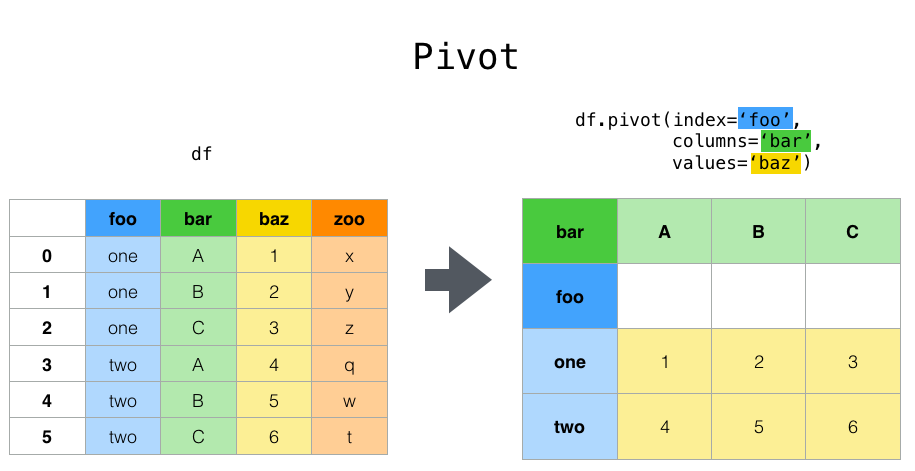
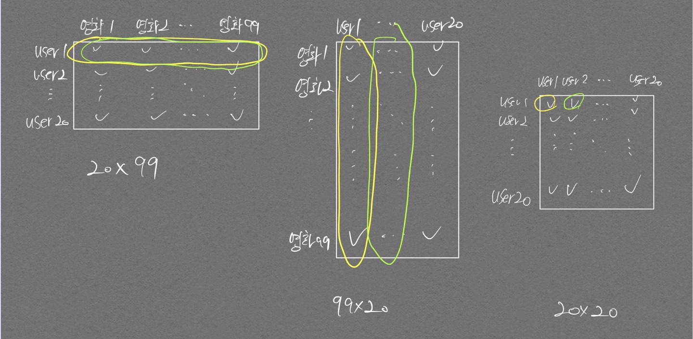

추천 시스템을 공부하던 중 칼럼 이름을 바꿀 상황이 생겨서 글로 정리한다.  
MovieLens 데이터를 사용했으며 데이터 형태는 아래와 같다.  


```python
import pandas as pd
import numpy as np

movies = pd.read_csv('./data/movies.csv')
ratings = pd.read_csv('./data/ratings.csv')

print(movies.shape, ratings.shape)
```

    (9742, 3) (100836, 4)
    


```python
movies.head()
```


<div>
<style scoped>
    .dataframe tbody tr th:only-of-type {
        vertical-align: middle;
    }

    .dataframe tbody tr th {
        vertical-align: top;
    }

    .dataframe thead th {
        text-align: right;
    }
</style>
<table border="1" class="dataframe">
  <thead>
    <tr style="text-align: right;">
      <th></th>
      <th>movieId</th>
      <th>title</th>
      <th>genres</th>
    </tr>
  </thead>
  <tbody>
    <tr>
      <th>0</th>
      <td>1</td>
      <td>Toy Story (1995)</td>
      <td>Adventure|Animation|Children|Comedy|Fantasy</td>
    </tr>
    <tr>
      <th>1</th>
      <td>2</td>
      <td>Jumanji (1995)</td>
      <td>Adventure|Children|Fantasy</td>
    </tr>
    <tr>
      <th>2</th>
      <td>3</td>
      <td>Grumpier Old Men (1995)</td>
      <td>Comedy|Romance</td>
    </tr>
    <tr>
      <th>3</th>
      <td>4</td>
      <td>Waiting to Exhale (1995)</td>
      <td>Comedy|Drama|Romance</td>
    </tr>
    <tr>
      <th>4</th>
      <td>5</td>
      <td>Father of the Bride Part II (1995)</td>
      <td>Comedy</td>
    </tr>
  </tbody>
</table>
</div>


```python
ratings.head()
```


<div>
<style scoped>
    .dataframe tbody tr th:only-of-type {
        vertical-align: middle;
    }

    .dataframe tbody tr th {
        vertical-align: top;
    }

    .dataframe thead th {
        text-align: right;
    }
</style>
<table border="1" class="dataframe">
  <thead>
    <tr style="text-align: right;">
      <th></th>
      <th>userId</th>
      <th>movieId</th>
      <th>rating</th>
      <th>timestamp</th>
    </tr>
  </thead>
  <tbody>
    <tr>
      <th>0</th>
      <td>1</td>
      <td>1</td>
      <td>4.0</td>
      <td>964982703</td>
    </tr>
    <tr>
      <th>1</th>
      <td>1</td>
      <td>3</td>
      <td>4.0</td>
      <td>964981247</td>
    </tr>
    <tr>
      <th>2</th>
      <td>1</td>
      <td>6</td>
      <td>4.0</td>
      <td>964982224</td>
    </tr>
    <tr>
      <th>3</th>
      <td>1</td>
      <td>47</td>
      <td>5.0</td>
      <td>964983815</td>
    </tr>
    <tr>
      <th>4</th>
      <td>1</td>
      <td>50</td>
      <td>5.0</td>
      <td>964982931</td>
    </tr>
  </tbody>
</table>
</div>


Collaborative filtering 이기 때문에 User Behavior중 하나인 영화 평점을 활용하겠다.  
행 레벨 형태의 원본 데이터 세트를 아래와 같이 변경할 수 있는 `pivot_table`을 사용하겠다.  

<p align="center">  </p>  
<div align="center" markdown="1"> pivot_table 그림 예시 
</div>


```python
pivot_df = ratings.pivot_table('rating', index='userId', columns='movieId')
pivot_df.head()
```


<div>
<style scoped>
    .dataframe tbody tr th:only-of-type {
        vertical-align: middle;
    }

    .dataframe tbody tr th {
        vertical-align: top;
    }

    .dataframe thead th {
        text-align: right;
    }
</style>
<table border="1" class="dataframe">
  <thead>
    <tr style="text-align: right;">
      <th>movieId</th>
      <th>1</th>
      <th>2</th>
      <th>3</th>
      <th>4</th>
      <th>5</th>
      <th>6</th>
      <th>7</th>
      <th>8</th>
      <th>9</th>
      <th>10</th>
      <th>...</th>
      <th>193565</th>
      <th>193567</th>
      <th>193571</th>
      <th>193573</th>
      <th>193579</th>
      <th>193581</th>
      <th>193583</th>
      <th>193585</th>
      <th>193587</th>
      <th>193609</th>
    </tr>
    <tr>
      <th>userId</th>
      <th></th>
      <th></th>
      <th></th>
      <th></th>
      <th></th>
      <th></th>
      <th></th>
      <th></th>
      <th></th>
      <th></th>
      <th></th>
      <th></th>
      <th></th>
      <th></th>
      <th></th>
      <th></th>
      <th></th>
      <th></th>
      <th></th>
      <th></th>
      <th></th>
    </tr>
  </thead>
  <tbody>
    <tr>
      <th>1</th>
      <td>4.0</td>
      <td>NaN</td>
      <td>4.0</td>
      <td>NaN</td>
      <td>NaN</td>
      <td>4.0</td>
      <td>NaN</td>
      <td>NaN</td>
      <td>NaN</td>
      <td>NaN</td>
      <td>...</td>
      <td>NaN</td>
      <td>NaN</td>
      <td>NaN</td>
      <td>NaN</td>
      <td>NaN</td>
      <td>NaN</td>
      <td>NaN</td>
      <td>NaN</td>
      <td>NaN</td>
      <td>NaN</td>
    </tr>
    <tr>
      <th>2</th>
      <td>NaN</td>
      <td>NaN</td>
      <td>NaN</td>
      <td>NaN</td>
      <td>NaN</td>
      <td>NaN</td>
      <td>NaN</td>
      <td>NaN</td>
      <td>NaN</td>
      <td>NaN</td>
      <td>...</td>
      <td>NaN</td>
      <td>NaN</td>
      <td>NaN</td>
      <td>NaN</td>
      <td>NaN</td>
      <td>NaN</td>
      <td>NaN</td>
      <td>NaN</td>
      <td>NaN</td>
      <td>NaN</td>
    </tr>
    <tr>
      <th>3</th>
      <td>NaN</td>
      <td>NaN</td>
      <td>NaN</td>
      <td>NaN</td>
      <td>NaN</td>
      <td>NaN</td>
      <td>NaN</td>
      <td>NaN</td>
      <td>NaN</td>
      <td>NaN</td>
      <td>...</td>
      <td>NaN</td>
      <td>NaN</td>
      <td>NaN</td>
      <td>NaN</td>
      <td>NaN</td>
      <td>NaN</td>
      <td>NaN</td>
      <td>NaN</td>
      <td>NaN</td>
      <td>NaN</td>
    </tr>
    <tr>
      <th>4</th>
      <td>NaN</td>
      <td>NaN</td>
      <td>NaN</td>
      <td>NaN</td>
      <td>NaN</td>
      <td>NaN</td>
      <td>NaN</td>
      <td>NaN</td>
      <td>NaN</td>
      <td>NaN</td>
      <td>...</td>
      <td>NaN</td>
      <td>NaN</td>
      <td>NaN</td>
      <td>NaN</td>
      <td>NaN</td>
      <td>NaN</td>
      <td>NaN</td>
      <td>NaN</td>
      <td>NaN</td>
      <td>NaN</td>
    </tr>
    <tr>
      <th>5</th>
      <td>4.0</td>
      <td>NaN</td>
      <td>NaN</td>
      <td>NaN</td>
      <td>NaN</td>
      <td>NaN</td>
      <td>NaN</td>
      <td>NaN</td>
      <td>NaN</td>
      <td>NaN</td>
      <td>...</td>
      <td>NaN</td>
      <td>NaN</td>
      <td>NaN</td>
      <td>NaN</td>
      <td>NaN</td>
      <td>NaN</td>
      <td>NaN</td>
      <td>NaN</td>
      <td>NaN</td>
      <td>NaN</td>
    </tr>
  </tbody>
</table>
<p>5 rows × 9724 columns</p>
</div>


처음에 헷갈렸던 부분인데 movieId가 1 ~ 9724로 나뉘는게 아니라 Id가 굉장히 불규칙적이다. 그래서 중간중간 term이 길다.  
이 상황에서 movieId로는 어떤 영화인지 알 수가 없어서 movieId를 영화 이름으로 변경하기 위해 아래와 같은 코드를 구현했었다.  


```python
pivot_df.rename(columns = movies['title'])
```


<div>
<style scoped>
    .dataframe tbody tr th:only-of-type {
        vertical-align: middle;
    }

    .dataframe tbody tr th {
        vertical-align: top;
    }

    .dataframe thead th {
        text-align: right;
    }
</style>
<table border="1" class="dataframe">
  <thead>
    <tr style="text-align: right;">
      <th>movieId</th>
      <th>Jumanji (1995)</th>
      <th>Grumpier Old Men (1995)</th>
      <th>Waiting to Exhale (1995)</th>
      <th>Father of the Bride Part II (1995)</th>
      <th>Heat (1995)</th>
      <th>Sabrina (1995)</th>
      <th>Tom and Huck (1995)</th>
      <th>Sudden Death (1995)</th>
      <th>GoldenEye (1995)</th>
      <th>American President, The (1995)</th>
      <th>...</th>
      <th>193565</th>
      <th>193567</th>
      <th>193571</th>
      <th>193573</th>
      <th>193579</th>
      <th>193581</th>
      <th>193583</th>
      <th>193585</th>
      <th>193587</th>
      <th>193609</th>
    </tr>
    <tr>
      <th>userId</th>
      <th></th>
      <th></th>
      <th></th>
      <th></th>
      <th></th>
      <th></th>
      <th></th>
      <th></th>
      <th></th>
      <th></th>
      <th></th>
      <th></th>
      <th></th>
      <th></th>
      <th></th>
      <th></th>
      <th></th>
      <th></th>
      <th></th>
      <th></th>
      <th></th>
    </tr>
  </thead>
  <tbody>
    <tr>
      <th>1</th>
      <td>4.0</td>
      <td>NaN</td>
      <td>4.0</td>
      <td>NaN</td>
      <td>NaN</td>
      <td>4.0</td>
      <td>NaN</td>
      <td>NaN</td>
      <td>NaN</td>
      <td>NaN</td>
      <td>...</td>
      <td>NaN</td>
      <td>NaN</td>
      <td>NaN</td>
      <td>NaN</td>
      <td>NaN</td>
      <td>NaN</td>
      <td>NaN</td>
      <td>NaN</td>
      <td>NaN</td>
      <td>NaN</td>
    </tr>
    <tr>
      <th>2</th>
      <td>NaN</td>
      <td>NaN</td>
      <td>NaN</td>
      <td>NaN</td>
      <td>NaN</td>
      <td>NaN</td>
      <td>NaN</td>
      <td>NaN</td>
      <td>NaN</td>
      <td>NaN</td>
      <td>...</td>
      <td>NaN</td>
      <td>NaN</td>
      <td>NaN</td>
      <td>NaN</td>
      <td>NaN</td>
      <td>NaN</td>
      <td>NaN</td>
      <td>NaN</td>
      <td>NaN</td>
      <td>NaN</td>
    </tr>
    <tr>
      <th>3</th>
      <td>NaN</td>
      <td>NaN</td>
      <td>NaN</td>
      <td>NaN</td>
      <td>NaN</td>
      <td>NaN</td>
      <td>NaN</td>
      <td>NaN</td>
      <td>NaN</td>
      <td>NaN</td>
      <td>...</td>
      <td>NaN</td>
      <td>NaN</td>
      <td>NaN</td>
      <td>NaN</td>
      <td>NaN</td>
      <td>NaN</td>
      <td>NaN</td>
      <td>NaN</td>
      <td>NaN</td>
      <td>NaN</td>
    </tr>
    <tr>
      <th>4</th>
      <td>NaN</td>
      <td>NaN</td>
      <td>NaN</td>
      <td>NaN</td>
      <td>NaN</td>
      <td>NaN</td>
      <td>NaN</td>
      <td>NaN</td>
      <td>NaN</td>
      <td>NaN</td>
      <td>...</td>
      <td>NaN</td>
      <td>NaN</td>
      <td>NaN</td>
      <td>NaN</td>
      <td>NaN</td>
      <td>NaN</td>
      <td>NaN</td>
      <td>NaN</td>
      <td>NaN</td>
      <td>NaN</td>
    </tr>
    <tr>
      <th>5</th>
      <td>4.0</td>
      <td>NaN</td>
      <td>NaN</td>
      <td>NaN</td>
      <td>NaN</td>
      <td>NaN</td>
      <td>NaN</td>
      <td>NaN</td>
      <td>NaN</td>
      <td>NaN</td>
      <td>...</td>
      <td>NaN</td>
      <td>NaN</td>
      <td>NaN</td>
      <td>NaN</td>
      <td>NaN</td>
      <td>NaN</td>
      <td>NaN</td>
      <td>NaN</td>
      <td>NaN</td>
      <td>NaN</td>
    </tr>
    <tr>
      <th>...</th>
      <td>...</td>
      <td>...</td>
      <td>...</td>
      <td>...</td>
      <td>...</td>
      <td>...</td>
      <td>...</td>
      <td>...</td>
      <td>...</td>
      <td>...</td>
      <td>...</td>
      <td>...</td>
      <td>...</td>
      <td>...</td>
      <td>...</td>
      <td>...</td>
      <td>...</td>
      <td>...</td>
      <td>...</td>
      <td>...</td>
      <td>...</td>
    </tr>
    <tr>
      <th>606</th>
      <td>2.5</td>
      <td>NaN</td>
      <td>NaN</td>
      <td>NaN</td>
      <td>NaN</td>
      <td>NaN</td>
      <td>2.5</td>
      <td>NaN</td>
      <td>NaN</td>
      <td>NaN</td>
      <td>...</td>
      <td>NaN</td>
      <td>NaN</td>
      <td>NaN</td>
      <td>NaN</td>
      <td>NaN</td>
      <td>NaN</td>
      <td>NaN</td>
      <td>NaN</td>
      <td>NaN</td>
      <td>NaN</td>
    </tr>
    <tr>
      <th>607</th>
      <td>4.0</td>
      <td>NaN</td>
      <td>NaN</td>
      <td>NaN</td>
      <td>NaN</td>
      <td>NaN</td>
      <td>NaN</td>
      <td>NaN</td>
      <td>NaN</td>
      <td>NaN</td>
      <td>...</td>
      <td>NaN</td>
      <td>NaN</td>
      <td>NaN</td>
      <td>NaN</td>
      <td>NaN</td>
      <td>NaN</td>
      <td>NaN</td>
      <td>NaN</td>
      <td>NaN</td>
      <td>NaN</td>
    </tr>
    <tr>
      <th>608</th>
      <td>2.5</td>
      <td>2.0</td>
      <td>2.0</td>
      <td>NaN</td>
      <td>NaN</td>
      <td>NaN</td>
      <td>NaN</td>
      <td>NaN</td>
      <td>NaN</td>
      <td>4.0</td>
      <td>...</td>
      <td>NaN</td>
      <td>NaN</td>
      <td>NaN</td>
      <td>NaN</td>
      <td>NaN</td>
      <td>NaN</td>
      <td>NaN</td>
      <td>NaN</td>
      <td>NaN</td>
      <td>NaN</td>
    </tr>
    <tr>
      <th>609</th>
      <td>3.0</td>
      <td>NaN</td>
      <td>NaN</td>
      <td>NaN</td>
      <td>NaN</td>
      <td>NaN</td>
      <td>NaN</td>
      <td>NaN</td>
      <td>NaN</td>
      <td>4.0</td>
      <td>...</td>
      <td>NaN</td>
      <td>NaN</td>
      <td>NaN</td>
      <td>NaN</td>
      <td>NaN</td>
      <td>NaN</td>
      <td>NaN</td>
      <td>NaN</td>
      <td>NaN</td>
      <td>NaN</td>
    </tr>
    <tr>
      <th>610</th>
      <td>5.0</td>
      <td>NaN</td>
      <td>NaN</td>
      <td>NaN</td>
      <td>NaN</td>
      <td>5.0</td>
      <td>NaN</td>
      <td>NaN</td>
      <td>NaN</td>
      <td>NaN</td>
      <td>...</td>
      <td>NaN</td>
      <td>NaN</td>
      <td>NaN</td>
      <td>NaN</td>
      <td>NaN</td>
      <td>NaN</td>
      <td>NaN</td>
      <td>NaN</td>
      <td>NaN</td>
      <td>NaN</td>
    </tr>
  </tbody>
</table>
<p>610 rows × 9724 columns</p>
</div>


위 코드에는 두가지 문제점이 있다.  
1. Documentation을 살펴보면 columns에 들어갈 수 있는 인자 타입은 `dict` 혹은 `function`이다.  

`movies['title']`은 Series datatype으로 위와같은 상황에서는 **index가 dictionary의 key**(pandas DataFrame은 index를 항상 가지고 있다는 것을 명심), value가 dictionary의 value로 들어간다.  
2. `movies['title']`의 데이터갯수는 9742개이고 위 테이블의 칼럼 갯수는 9724개로 갯수가 맞지 않는다.

만약 데이터 갯수가 서로 딱 맞았다면 `pd.set_axis()`를 사용해서 칼럼 이름을 한번에 바꿔줄 수도 있다.

지금과 같이 id와, 그 id의 이름을 나타내는 데이터의 갯수가 다를 때 어떻게 매칭시켜서 칼럼 이름을 변경할 수 있을까?
핵심은 `pd.merge()`이다. Database에서 join과 같은 역할을 한다. (join 포스터 보러가기)[/DatabaseWiki]
`on` argument에 두 DataFrame이 동시에 가지고 있는 column 명을 입력해주면 된다.


```python
rating_movies = pd.merge(movies, ratings, how='inner', on='movieId')
rating_movies
```


<div>
<style scoped>
    .dataframe tbody tr th:only-of-type {
        vertical-align: middle;
    }

    .dataframe tbody tr th {
        vertical-align: top;
    }

    .dataframe thead th {
        text-align: right;
    }
</style>
<table border="1" class="dataframe">
  <thead>
    <tr style="text-align: right;">
      <th></th>
      <th>movieId</th>
      <th>title</th>
      <th>genres</th>
      <th>userId</th>
      <th>rating</th>
      <th>timestamp</th>
    </tr>
  </thead>
  <tbody>
    <tr>
      <th>0</th>
      <td>1</td>
      <td>Toy Story (1995)</td>
      <td>Adventure|Animation|Children|Comedy|Fantasy</td>
      <td>1</td>
      <td>4.0</td>
      <td>964982703</td>
    </tr>
    <tr>
      <th>1</th>
      <td>1</td>
      <td>Toy Story (1995)</td>
      <td>Adventure|Animation|Children|Comedy|Fantasy</td>
      <td>5</td>
      <td>4.0</td>
      <td>847434962</td>
    </tr>
    <tr>
      <th>2</th>
      <td>1</td>
      <td>Toy Story (1995)</td>
      <td>Adventure|Animation|Children|Comedy|Fantasy</td>
      <td>7</td>
      <td>4.5</td>
      <td>1106635946</td>
    </tr>
    <tr>
      <th>3</th>
      <td>1</td>
      <td>Toy Story (1995)</td>
      <td>Adventure|Animation|Children|Comedy|Fantasy</td>
      <td>15</td>
      <td>2.5</td>
      <td>1510577970</td>
    </tr>
    <tr>
      <th>4</th>
      <td>1</td>
      <td>Toy Story (1995)</td>
      <td>Adventure|Animation|Children|Comedy|Fantasy</td>
      <td>17</td>
      <td>4.5</td>
      <td>1305696483</td>
    </tr>
    <tr>
      <th>...</th>
      <td>...</td>
      <td>...</td>
      <td>...</td>
      <td>...</td>
      <td>...</td>
      <td>...</td>
    </tr>
    <tr>
      <th>100831</th>
      <td>193581</td>
      <td>Black Butler: Book of the Atlantic (2017)</td>
      <td>Action|Animation|Comedy|Fantasy</td>
      <td>184</td>
      <td>4.0</td>
      <td>1537109082</td>
    </tr>
    <tr>
      <th>100832</th>
      <td>193583</td>
      <td>No Game No Life: Zero (2017)</td>
      <td>Animation|Comedy|Fantasy</td>
      <td>184</td>
      <td>3.5</td>
      <td>1537109545</td>
    </tr>
    <tr>
      <th>100833</th>
      <td>193585</td>
      <td>Flint (2017)</td>
      <td>Drama</td>
      <td>184</td>
      <td>3.5</td>
      <td>1537109805</td>
    </tr>
    <tr>
      <th>100834</th>
      <td>193587</td>
      <td>Bungo Stray Dogs: Dead Apple (2018)</td>
      <td>Action|Animation</td>
      <td>184</td>
      <td>3.5</td>
      <td>1537110021</td>
    </tr>
    <tr>
      <th>100835</th>
      <td>193609</td>
      <td>Andrew Dice Clay: Dice Rules (1991)</td>
      <td>Comedy</td>
      <td>331</td>
      <td>4.0</td>
      <td>1537157606</td>
    </tr>
  </tbody>
</table>
<p>100836 rows × 6 columns</p>
</div>


ratings 데이터 프레임이 가지고 있던 모든 movieId에 대해 title 칼럼이 붙어서 movieId - title 매치가 이루어졌다.  
이제 movieId가 아닌 title을 `pivot_table()`의 인자로 넘겨주면 우리에 의도한 목적이 완성된다.  


```python
ratings_matrix = rating_movies.pivot_table('rating', 'userId', 'title')
ratings_matrix = ratings_matrix.fillna(0)       # null값 0으로 대체
ratings_matrix.head(3)
```


<div>
<style scoped>
    .dataframe tbody tr th:only-of-type {
        vertical-align: middle;
    }

    .dataframe tbody tr th {
        vertical-align: top;
    }

    .dataframe thead th {
        text-align: right;
    }
</style>
<table border="1" class="dataframe">
  <thead>
    <tr style="text-align: right;">
      <th>title</th>
      <th>'71 (2014)</th>
      <th>'Hellboy': The Seeds of Creation (2004)</th>
      <th>'Round Midnight (1986)</th>
      <th>'Salem's Lot (2004)</th>
      <th>'Til There Was You (1997)</th>
      <th>'Tis the Season for Love (2015)</th>
      <th>'burbs, The (1989)</th>
      <th>'night Mother (1986)</th>
      <th>(500) Days of Summer (2009)</th>
      <th>*batteries not included (1987)</th>
      <th>...</th>
      <th>Zulu (2013)</th>
      <th>[REC] (2007)</th>
      <th>[REC]² (2009)</th>
      <th>[REC]³ 3 Génesis (2012)</th>
      <th>anohana: The Flower We Saw That Day - The Movie (2013)</th>
      <th>eXistenZ (1999)</th>
      <th>xXx (2002)</th>
      <th>xXx: State of the Union (2005)</th>
      <th>¡Three Amigos! (1986)</th>
      <th>À nous la liberté (Freedom for Us) (1931)</th>
    </tr>
    <tr>
      <th>userId</th>
      <th></th>
      <th></th>
      <th></th>
      <th></th>
      <th></th>
      <th></th>
      <th></th>
      <th></th>
      <th></th>
      <th></th>
      <th></th>
      <th></th>
      <th></th>
      <th></th>
      <th></th>
      <th></th>
      <th></th>
      <th></th>
      <th></th>
      <th></th>
      <th></th>
    </tr>
  </thead>
  <tbody>
    <tr>
      <th>1</th>
      <td>0.0</td>
      <td>0.0</td>
      <td>0.0</td>
      <td>0.0</td>
      <td>0.0</td>
      <td>0.0</td>
      <td>0.0</td>
      <td>0.0</td>
      <td>0.0</td>
      <td>0.0</td>
      <td>...</td>
      <td>0.0</td>
      <td>0.0</td>
      <td>0.0</td>
      <td>0.0</td>
      <td>0.0</td>
      <td>0.0</td>
      <td>0.0</td>
      <td>0.0</td>
      <td>4.0</td>
      <td>0.0</td>
    </tr>
    <tr>
      <th>2</th>
      <td>0.0</td>
      <td>0.0</td>
      <td>0.0</td>
      <td>0.0</td>
      <td>0.0</td>
      <td>0.0</td>
      <td>0.0</td>
      <td>0.0</td>
      <td>0.0</td>
      <td>0.0</td>
      <td>...</td>
      <td>0.0</td>
      <td>0.0</td>
      <td>0.0</td>
      <td>0.0</td>
      <td>0.0</td>
      <td>0.0</td>
      <td>0.0</td>
      <td>0.0</td>
      <td>0.0</td>
      <td>0.0</td>
    </tr>
    <tr>
      <th>3</th>
      <td>0.0</td>
      <td>0.0</td>
      <td>0.0</td>
      <td>0.0</td>
      <td>0.0</td>
      <td>0.0</td>
      <td>0.0</td>
      <td>0.0</td>
      <td>0.0</td>
      <td>0.0</td>
      <td>...</td>
      <td>0.0</td>
      <td>0.0</td>
      <td>0.0</td>
      <td>0.0</td>
      <td>0.0</td>
      <td>0.0</td>
      <td>0.0</td>
      <td>0.0</td>
      <td>0.0</td>
      <td>0.0</td>
    </tr>
  </tbody>
</table>
<p>3 rows × 9719 columns</p>
</div>


이제 위 매트릭스를 활용하여 영화 간 `cosine similarity`를 적용하면 영화 간 유사도를 통한 추천 시스템이 완성된다!  
하지만 위 매트릭스를 그대로 `cosine similiarity` 함수에 적용하면 영화 간 유사도가 아닌 사용자간 유사도를 통한 추천 시스템이 되므로, 아이템 기반이 아닌 유저 기반이 된다.  
그림을 통해 더 쉽게 이해해보자.  

<p align="center">  </p>  
result table을 기준으로 보면 `1행 1열`{:.warning}은 user1, user1 간의 유사도, `1행 2열`{:.success}은 user1, user2 간의 유사도 이다.  
즉 사용자간 유사도가 matrix로 표현되는 것이다.  따라서 `transpose()`를 통해 행과 열의 위치를 바꿔서 영화간 유사도를 통한 추천 시스템을 완성하자


```python
ratings_matrix_T = ratings_matrix.transpose()
ratings_matrix_T.head(3)
```


<div>
<style scoped>
    .dataframe tbody tr th:only-of-type {
        vertical-align: middle;
    }

    .dataframe tbody tr th {
        vertical-align: top;
    }

    .dataframe thead th {
        text-align: right;
    }
</style>
<table border="1" class="dataframe">
  <thead>
    <tr style="text-align: right;">
      <th>userId</th>
      <th>1</th>
      <th>2</th>
      <th>3</th>
      <th>4</th>
      <th>5</th>
      <th>6</th>
      <th>7</th>
      <th>8</th>
      <th>9</th>
      <th>10</th>
      <th>...</th>
      <th>601</th>
      <th>602</th>
      <th>603</th>
      <th>604</th>
      <th>605</th>
      <th>606</th>
      <th>607</th>
      <th>608</th>
      <th>609</th>
      <th>610</th>
    </tr>
    <tr>
      <th>title</th>
      <th></th>
      <th></th>
      <th></th>
      <th></th>
      <th></th>
      <th></th>
      <th></th>
      <th></th>
      <th></th>
      <th></th>
      <th></th>
      <th></th>
      <th></th>
      <th></th>
      <th></th>
      <th></th>
      <th></th>
      <th></th>
      <th></th>
      <th></th>
      <th></th>
    </tr>
  </thead>
  <tbody>
    <tr>
      <th>'71 (2014)</th>
      <td>0.0</td>
      <td>0.0</td>
      <td>0.0</td>
      <td>0.0</td>
      <td>0.0</td>
      <td>0.0</td>
      <td>0.0</td>
      <td>0.0</td>
      <td>0.0</td>
      <td>0.0</td>
      <td>...</td>
      <td>0.0</td>
      <td>0.0</td>
      <td>0.0</td>
      <td>0.0</td>
      <td>0.0</td>
      <td>0.0</td>
      <td>0.0</td>
      <td>0.0</td>
      <td>0.0</td>
      <td>4.0</td>
    </tr>
    <tr>
      <th>'Hellboy': The Seeds of Creation (2004)</th>
      <td>0.0</td>
      <td>0.0</td>
      <td>0.0</td>
      <td>0.0</td>
      <td>0.0</td>
      <td>0.0</td>
      <td>0.0</td>
      <td>0.0</td>
      <td>0.0</td>
      <td>0.0</td>
      <td>...</td>
      <td>0.0</td>
      <td>0.0</td>
      <td>0.0</td>
      <td>0.0</td>
      <td>0.0</td>
      <td>0.0</td>
      <td>0.0</td>
      <td>0.0</td>
      <td>0.0</td>
      <td>0.0</td>
    </tr>
    <tr>
      <th>'Round Midnight (1986)</th>
      <td>0.0</td>
      <td>0.0</td>
      <td>0.0</td>
      <td>0.0</td>
      <td>0.0</td>
      <td>0.0</td>
      <td>0.0</td>
      <td>0.0</td>
      <td>0.0</td>
      <td>0.0</td>
      <td>...</td>
      <td>0.0</td>
      <td>0.0</td>
      <td>0.0</td>
      <td>0.0</td>
      <td>0.0</td>
      <td>0.0</td>
      <td>0.0</td>
      <td>0.0</td>
      <td>0.0</td>
      <td>0.0</td>
    </tr>
  </tbody>
</table>
<p>3 rows × 610 columns</p>
</div>


```python
from sklearn.metrics.pairwise import cosine_similarity

cs_matrix = cosine_similarity(ratings_matrix_T, ratings_matrix_T)
```


```python
cs_matrix
```


    array([[1.        , 0.        , 0.        , ..., 0.32732684, 0.        ,
            0.        ],
           [0.        , 1.        , 0.70710678, ..., 0.        , 0.        ,
            0.        ],
           [0.        , 0.70710678, 1.        , ..., 0.        , 0.        ,
            0.        ],
           ...,
           [0.32732684, 0.        , 0.        , ..., 1.        , 0.        ,
            0.        ],
           [0.        , 0.        , 0.        , ..., 0.        , 1.        ,
            0.        ],
           [0.        , 0.        , 0.        , ..., 0.        , 0.        ,
            1.        ]])


```python
ratings_matrix_T.index.values
```


    array(["'71 (2014)", "'Hellboy': The Seeds of Creation (2004)",
           "'Round Midnight (1986)", ..., 'xXx: State of the Union (2005)',
           '¡Three Amigos! (1986)',
           'À nous la liberté (Freedom for Us) (1931)'], dtype=object)


```python
result_table = pd.DataFrame(cs_matrix, columns=ratings_matrix_T.index.values)
# result_table
# result_table.sort_values(ascending=False, axis=1, by)
idx = result_table.sort_values(by='\'71 (2014)', ascending=False).index[:10]        # 초기에는 cs_matrix의 index, column을 모두 영화 타이틀로 해놨는데
                                                                                    # 여기 sort_values의 by 인자에서 duplicated error가 발생하였다.
                                                                                    # axis=1을 인자로 줘도 해결되지 않아서 초기의 result_table에서 칼럼에만 title을 맵핑하고
                                                                                    # 그렇게 얻어진 index 정보를 통해 원하는 데이터를 추출하는
                                                                                    # 약간 빙 돌아가는 코드로 구현되었다.
result_table.iloc[0, idx]

# result_table.sort_index(ascending=False, axis=1)
```


    '71 (2014)                                      1.0
    City of Lost Souls, The (Hyôryuu-gai) (2000)    1.0
    Clown (2014)                                    1.0
    Strange Circus (Kimyô na sâkasu) (2005)         1.0
    Ginger Snaps: Unleashed (2004)                  1.0
    Ginger Snaps Back: The Beginning (2004)         1.0
    Get on the Bus (1996)                           1.0
    Collector, The (2009)                           1.0
    Prince of Darkness (1987)                       1.0
    Gen-X Cops (1999)                               1.0
    Name: 0, dtype: float64


위 처럼 약간 빙빙 돌아가는 코드가 나온 이유는 한번에 columnwise로 정리하려고 했기 때문이다.  
result_table을 한번에 columnwise로 정렬하려고 생각했었으나, 이건 말이 안되는 것이었다.  
각 데이터(record)별로 정렬이 다르게 처리되어 있을텐데 이걸 같은 column 순서로 result_table에 한번에 표시한다는 것이기에 말이 안된다.  
즉 하나의 데이터를 추출한 후 정렬을해서 영화 정보를 가져오는게 맞는 접근이다.  
그렇게 구현한 코드는 아래와 같다.  


```python
item_sim_df = pd.DataFrame(cs_matrix, index=ratings_matrix.columns, columns=ratings_matrix.columns)
item_sim_df['Godfather, The (1972)'].sort_values(ascending=False)[:10]
```


    title
    Godfather, The (1972)                                    1.000000
    Godfather: Part II, The (1974)                           0.821773
    Goodfellas (1990)                                        0.664841
    One Flew Over the Cuckoo's Nest (1975)                   0.620536
    Star Wars: Episode IV - A New Hope (1977)                0.595317
    Fargo (1996)                                             0.588614
    Star Wars: Episode V - The Empire Strikes Back (1980)    0.586030
    Fight Club (1999)                                        0.581279
    Reservoir Dogs (1992)                                    0.579059
    Pulp Fiction (1994)                                      0.575270
    Name: Godfather, The (1972), dtype: float64


```python
item_sim_df['Inception (2010)'].sort_values(ascending=False)[:10]
```


    title
    Inception (2010)                 1.000000
    Dark Knight, The (2008)          0.727263
    Inglourious Basterds (2009)      0.646103
    Shutter Island (2010)            0.617736
    Dark Knight Rises, The (2012)    0.617504
    Fight Club (1999)                0.615417
    Interstellar (2014)              0.608150
    Up (2009)                        0.606173
    Avengers, The (2012)             0.586504
    Django Unchained (2012)          0.581342
    Name: Inception (2010), dtype: float64

훨씬 깔끔하고 간결화 되었다.