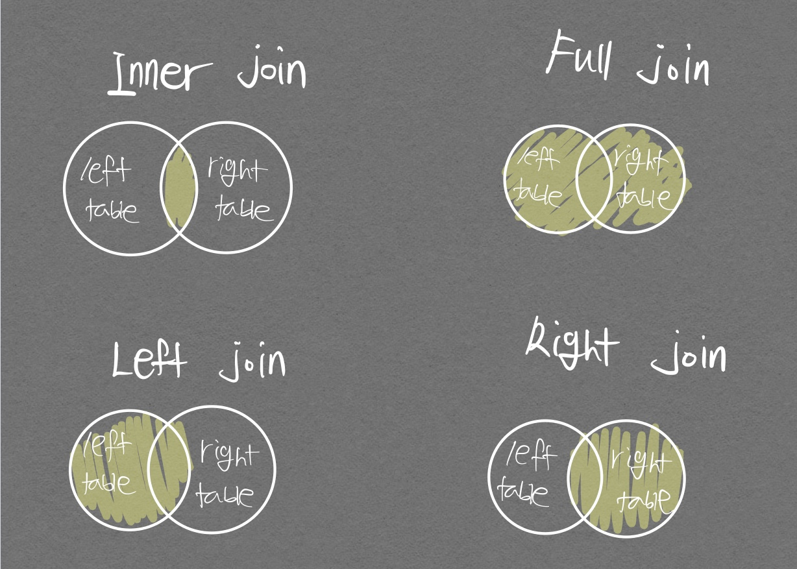

| 본 포스트는 데이터 전처리를 위해 pandas를 자유자재로 활용하기 위해 필요한 데이터 베이스 기본 지식들을 정리하려 한다.

# join

공통된 column에서 새로운 result table을 만들기 위함이다.

<p align="center">  </p>

일반적으로 가장 많이 쓰는 join은 inner join으로 <mark>동일한 column에 대해 모든 데이터를 다 가져오는것이다.</mark>  
아래의 적용 예시를 보자  

```python
import pandas as pd
import numpy as np

movies = pd.read_csv('./data/movies.csv')
ratings = pd.read_csv('./data/ratings.csv')

print(movies.shape, ratings.shape)
```

    (9742, 3) (100836, 4)
    


```python
movies.head()
```


<div>
<style scoped>
    .dataframe tbody tr th:only-of-type {
        vertical-align: middle;
    }

    .dataframe tbody tr th {
        vertical-align: top;
    }

    .dataframe thead th {
        text-align: right;
    }
</style>
<table border="1" class="dataframe">
  <thead>
    <tr style="text-align: right;">
      <th></th>
      <th>movieId</th>
      <th>title</th>
      <th>genres</th>
    </tr>
  </thead>
  <tbody>
    <tr>
      <th>0</th>
      <td>1</td>
      <td>Toy Story (1995)</td>
      <td>Adventure|Animation|Children|Comedy|Fantasy</td>
    </tr>
    <tr>
      <th>1</th>
      <td>2</td>
      <td>Jumanji (1995)</td>
      <td>Adventure|Children|Fantasy</td>
    </tr>
    <tr>
      <th>2</th>
      <td>3</td>
      <td>Grumpier Old Men (1995)</td>
      <td>Comedy|Romance</td>
    </tr>
    <tr>
      <th>3</th>
      <td>4</td>
      <td>Waiting to Exhale (1995)</td>
      <td>Comedy|Drama|Romance</td>
    </tr>
    <tr>
      <th>4</th>
      <td>5</td>
      <td>Father of the Bride Part II (1995)</td>
      <td>Comedy</td>
    </tr>
  </tbody>
</table>
</div>


```python
ratings.head()
```


<div>
<style scoped>
    .dataframe tbody tr th:only-of-type {
        vertical-align: middle;
    }

    .dataframe tbody tr th {
        vertical-align: top;
    }

    .dataframe thead th {
        text-align: right;
    }
</style>
<table border="1" class="dataframe">
  <thead>
    <tr style="text-align: right;">
      <th></th>
      <th>userId</th>
      <th>movieId</th>
      <th>rating</th>
      <th>timestamp</th>
    </tr>
  </thead>
  <tbody>
    <tr>
      <th>0</th>
      <td>1</td>
      <td>1</td>
      <td>4.0</td>
      <td>964982703</td>
    </tr>
    <tr>
      <th>1</th>
      <td>1</td>
      <td>3</td>
      <td>4.0</td>
      <td>964981247</td>
    </tr>
    <tr>
      <th>2</th>
      <td>1</td>
      <td>6</td>
      <td>4.0</td>
      <td>964982224</td>
    </tr>
    <tr>
      <th>3</th>
      <td>1</td>
      <td>47</td>
      <td>5.0</td>
      <td>964983815</td>
    </tr>
    <tr>
      <th>4</th>
      <td>1</td>
      <td>50</td>
      <td>5.0</td>
      <td>964982931</td>
    </tr>
  </tbody>
</table>
</div>

위 두 테이블은 `movieId`라는 공통 column을 가지고 있어서 join 연산자 사용이 가능하다.


```python
# in_df = pd.merge(movies,ratings, left_on='movieId', right_on='movieId', how='inner')
in_df = pd.merge(movies, ratings, how='inner', on='movieId')
# in_df = movies.merge(ratings)
in_df
```


<div>
<style scoped>
    .dataframe tbody tr th:only-of-type {
        vertical-align: middle;
    }

    .dataframe tbody tr th {
        vertical-align: top;
    }

    .dataframe thead th {
        text-align: right;
    }
</style>
<table border="1" class="dataframe">
  <thead>
    <tr style="text-align: right;">
      <th></th>
      <th>movieId</th>
      <th>title</th>
      <th>genres</th>
      <th>userId</th>
      <th>rating</th>
      <th>timestamp</th>
    </tr>
  </thead>
  <tbody>
    <tr>
      <th>0</th>
      <td>1</td>
      <td>Toy Story (1995)</td>
      <td>Adventure|Animation|Children|Comedy|Fantasy</td>
      <td>1</td>
      <td>4.0</td>
      <td>964982703</td>
    </tr>
    <tr>
      <th>1</th>
      <td>1</td>
      <td>Toy Story (1995)</td>
      <td>Adventure|Animation|Children|Comedy|Fantasy</td>
      <td>5</td>
      <td>4.0</td>
      <td>847434962</td>
    </tr>
    <tr>
      <th>2</th>
      <td>1</td>
      <td>Toy Story (1995)</td>
      <td>Adventure|Animation|Children|Comedy|Fantasy</td>
      <td>7</td>
      <td>4.5</td>
      <td>1106635946</td>
    </tr>
    <tr>
      <th>3</th>
      <td>1</td>
      <td>Toy Story (1995)</td>
      <td>Adventure|Animation|Children|Comedy|Fantasy</td>
      <td>15</td>
      <td>2.5</td>
      <td>1510577970</td>
    </tr>
    <tr>
      <th>4</th>
      <td>1</td>
      <td>Toy Story (1995)</td>
      <td>Adventure|Animation|Children|Comedy|Fantasy</td>
      <td>17</td>
      <td>4.5</td>
      <td>1305696483</td>
    </tr>
    <tr>
      <th>...</th>
      <td>...</td>
      <td>...</td>
      <td>...</td>
      <td>...</td>
      <td>...</td>
      <td>...</td>
    </tr>
    <tr>
      <th>100831</th>
      <td>193581</td>
      <td>Black Butler: Book of the Atlantic (2017)</td>
      <td>Action|Animation|Comedy|Fantasy</td>
      <td>184</td>
      <td>4.0</td>
      <td>1537109082</td>
    </tr>
    <tr>
      <th>100832</th>
      <td>193583</td>
      <td>No Game No Life: Zero (2017)</td>
      <td>Animation|Comedy|Fantasy</td>
      <td>184</td>
      <td>3.5</td>
      <td>1537109545</td>
    </tr>
    <tr>
      <th>100833</th>
      <td>193585</td>
      <td>Flint (2017)</td>
      <td>Drama</td>
      <td>184</td>
      <td>3.5</td>
      <td>1537109805</td>
    </tr>
    <tr>
      <th>100834</th>
      <td>193587</td>
      <td>Bungo Stray Dogs: Dead Apple (2018)</td>
      <td>Action|Animation</td>
      <td>184</td>
      <td>3.5</td>
      <td>1537110021</td>
    </tr>
    <tr>
      <th>100835</th>
      <td>193609</td>
      <td>Andrew Dice Clay: Dice Rules (1991)</td>
      <td>Comedy</td>
      <td>331</td>
      <td>4.0</td>
      <td>1537157606</td>
    </tr>
  </tbody>
</table>
<p>100836 rows × 6 columns</p>
</div>

위 결과를 보고 다음과 같은 생각이 들었다.  
**아니.. 공통된 데이터만 뽑으려 inner join을 사용하고, 사이즈가 작은 테이블은 데이터 갯수가 9700개 밖에 안되는데 공통된 데이터가 100836개나 된다고..?**
나와 같은 생각을 한 사람이 있다면 [형광펜 부분](#join)을 주의깊게 생각해보자. 아래 코드를 보면 이해가 쉬울 것이다.

```python
df1 = pd.DataFrame({'a': ['foo', 'bar', 'baz'], 'b': [1, 2, 3]})
df1
```


<div>
<style scoped>
    .dataframe tbody tr th:only-of-type {
        vertical-align: middle;
    }

    .dataframe tbody tr th {
        vertical-align: top;
    }

    .dataframe thead th {
        text-align: right;
    }
</style>
<table border="1" class="dataframe">
  <thead>
    <tr style="text-align: right;">
      <th></th>
      <th>a</th>
      <th>b</th>
    </tr>
  </thead>
  <tbody>
    <tr>
      <th>0</th>
      <td>foo</td>
      <td>1</td>
    </tr>
    <tr>
      <th>1</th>
      <td>bar</td>
      <td>2</td>
    </tr>
    <tr>
      <th>2</th>
      <td>baz</td>
      <td>3</td>
    </tr>
  </tbody>
</table>
</div>


```python
df2 = pd.DataFrame({'a': ['foo','bar','foo','foo','foo'], 'c':[75,25,52,67,7373]})
df2
```


<div>
<style scoped>
    .dataframe tbody tr th:only-of-type {
        vertical-align: middle;
    }

    .dataframe tbody tr th {
        vertical-align: top;
    }

    .dataframe thead th {
        text-align: right;
    }
</style>
<table border="1" class="dataframe">
  <thead>
    <tr style="text-align: right;">
      <th></th>
      <th>a</th>
      <th>c</th>
    </tr>
  </thead>
  <tbody>
    <tr>
      <th>0</th>
      <td>foo</td>
      <td>75</td>
    </tr>
    <tr>
      <th>1</th>
      <td>bar</td>
      <td>25</td>
    </tr>
    <tr>
      <th>2</th>
      <td>foo</td>
      <td>52</td>
    </tr>
    <tr>
      <th>3</th>
      <td>foo</td>
      <td>67</td>
    </tr>
    <tr>
      <th>4</th>
      <td>foo</td>
      <td>7373</td>
    </tr>
  </tbody>
</table>
</div>


```python
pd.merge(df1, df2, how='inner', on='a')
```


<div>
<style scoped>
    .dataframe tbody tr th:only-of-type {
        vertical-align: middle;
    }

    .dataframe tbody tr th {
        vertical-align: top;
    }

    .dataframe thead th {
        text-align: right;
    }
</style>
<table border="1" class="dataframe">
  <thead>
    <tr style="text-align: right;">
      <th></th>
      <th>a</th>
      <th>b</th>
      <th>c</th>
    </tr>
  </thead>
  <tbody>
    <tr>
      <th>0</th>
      <td>foo</td>
      <td>1</td>
      <td>75</td>
    </tr>
    <tr>
      <th>1</th>
      <td>foo</td>
      <td>1</td>
      <td>52</td>
    </tr>
    <tr>
      <th>2</th>
      <td>foo</td>
      <td>1</td>
      <td>67</td>
    </tr>
    <tr>
      <th>3</th>
      <td>foo</td>
      <td>1</td>
      <td>7373</td>
    </tr>
    <tr>
      <th>4</th>
      <td>bar</td>
      <td>2</td>
      <td>25</td>
    </tr>
  </tbody>
</table>
</div>

df1 데이터의 갯수는 3개여서 , inner join 하면 데이터 갯수가 최대 3개가 나와야 할 것 같지만!  
<div align="center" markdown="1">  result table의 데이터 갯수는 5개가 되었다.  
</div>
`on` 인자의 column을 기준으로 같은 데이터(여기서는 foo)를 두 테이블에서 **모조리 가져오기 때문**이다.  
즉 df1의 foo 갯수: 2개, df2의 foo 갯수: 3개여서 총 5개의 데이터가 result table에 생기게 된다.