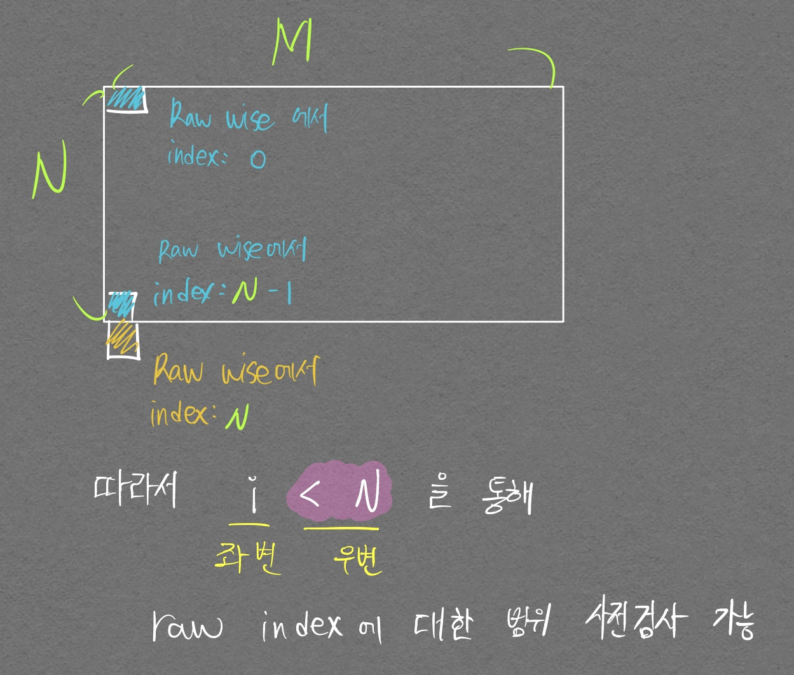
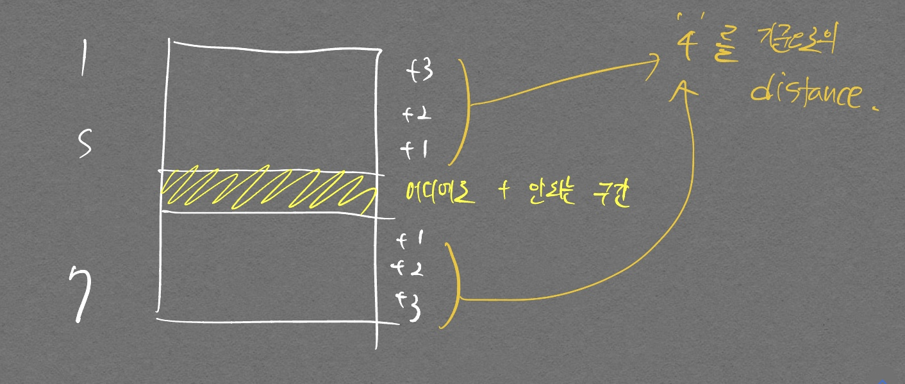
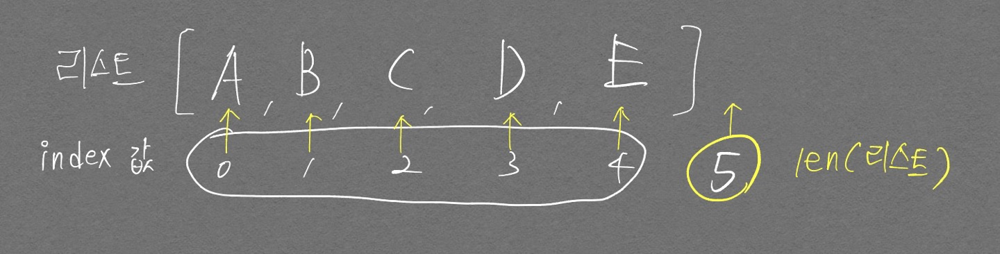

# 10870번 (피보나치)

난이도: 브론즈 5

재귀함수를 이용해서 바로 맞췄지만, 점화식이라는 점을 활용해서 바텀업 방식으로 풀어보고자 하였다.  

테스트 케이스는 맞췄지만 제출했을 때 90% 지점에서 틀렸다고 나와서 처음엔 문제가 잘못된 것인 줄 알았다...


- 내가 작성한 코드
```python
N = int(input())

d = [0] * (N+1)    # N까지 인덱싱 해야 하므로

d[0] = 0
d[1] = 1

for i in range(2, N+1):
  if N >=2:
    d[i] = d[i-1] + d[i-2]

print(d[N])
```

원인은 d 배열을 동적할당 하려는 것에 있었다. 만약 n = 0 이라면 d[1]에서 인덱스 에러가 발생하게 된다.

# 1051번

난이도: 실버 4

나는 2차원 형태의 데이터를 반복문 형태로 움직일 때 범위 제한을 어떻게 해줘야 하는지 많이 헷갈린다. (특히 마지막 인덱스 처리할 때 `<` 으로 해야할지 `<=` 으로 해야할지 같은 것)  

다음 상황과 그림을 생각해서 더이상 헷갈리지 않도록 하자.  

상황: 2차원 데이터중 특정 행렬값을 접근할 때 범위가 넘는지 안넘는지 사전에 검사하고 싶음.  


<p align="center">  </p>
<div align="center" markdown="1"> 좌변, 우변으로 따로 나눈 이유는 `<` 부등호와 우변만 있으면 **좌변 값에 대한** 범위 사전 점검이 가능함을 나타낸 것이다. (코드를 쉽게 생각하기 위함이다)  

가령 `i + k < N` 같은 식이 있어도 `< N` 만 딱! 보고  
i + k 인덱스가 N 범위 내에 존재하도록 의도하는 것이구나! 라는 느낌을 받을 수 있으면 문제 풀기나, 코드 읽기가 수월할 것이다.
</div>

```python
N, M = map(int, input().split())

graph = []

for _ in range(N):
  graph.append(list(map(int, input())))

size = min(N, M)
argmax = 0

for raw_idx in range(N):
  for col_idx in range(M):
    for check in range(size):
      if (raw_idx + check < N) and (col_idx + check < M):
        val = graph[raw_idx][col_idx]

        if val == graph[raw_idx + check][col_idx] and val == graph[raw_idx][col_idx + check] and val == graph[raw_idx + check][col_idx + check]:
          argmax = max(argmax, (check + 1)*(check + 1))

print(argmax)
```

그리고 위 코드 보면 2중 for문으로 모든 data를 탐색하도록 한 다음, 3번째 for문에서 **index 범위 검사를 진행하고 있다**  
난 첫번째, 두번째 for문에서도 범위를 넘기지 않으면서 하려고 별 이상한 코드를 작성했었는데 그럴 필요가 없었다..!

# 14890번

삼성 기출문제  

처음 풀어보는 기업 실전 문제였는데 정말 드릅게 어렵다.. ㅋㅋㅋ. 연습 많이 해야겠다.  

아이디어는 다음과 같다.  
  1. 높이 차이가 1 발생하는 순간 언덕을 놓을 수 있는지 점검을 시작한다.
  2. 낮은데서 높은데로 경사로를 두는 것, 높은데서 낮은데로 경사로를 두는 것 이렇게 나눠준다.

위 문제를 풀면서 아래와 같은 기초 상식(?)도 얻을 수 있었다.  

- `and`, `or` 연산을 이용하면 `if`문을 이중으로 중첩시키지 않아도 `index out of range` 문제를 피할 수 있다.
- 길을 count 하는 로직을 반복문 맨 처음에 뒀기 때문에 마지막 index 까지만 가면 바로 count를 올려서 에러가 발생하는 케이스가 있었다. 본 경우는 전체 반복문을 한번 더 실행해주면 아래 짜 둔 로직을 통해서 마지막 검사를 진행시킬 수 있다.
- row 단위로 데이터를 순환하는 것과, column 단위로 데이터를 순환하는것을 동시에 고려해야 한다면, 검사하는 함수를 만들고 그 함수에 list를 던져주면 된다는 좋은 상식을 얻었다.  [코드 예시](https://ryu-e.tistory.com/108)

```python
# import numpy as np

N, L = map(int, input().split())

graph = []

used = []
for _ in range(N):
  used.append([0] * N)

for _ in range(N):
  graph.append(list(map(int, input().split())))

# 행 검사 시작
# 무사히 j가 끝까지 도달하면 road라고 간주할 예정

road = 0

breaker = False

for i in range(N):
  for j in range(1, N+1):
    # 끝까지 왔는데 같은 값이면
    # 대부분은 여기까지 오지 못하고 break로 다음 행으로 넘어감
    # if j == N-1 and graph[i][j] == graph[i][j-1]:
    
    if j == N:
      # print("행단위", i, j)
      road += 1
      continue
      
    if graph[i][j] == graph[i][j-1]:    # 같은 값이면 continue
      continue

    if abs(graph[i][j] - graph[i][j-1]) > 1:
      break

    # 위에서 다 걸렀으므로 여기 아래 if문 2개는 무조건 내려가는 경사로 or 올라가는 경사로
    if graph[i][j] < graph[i][j-1]: # 내려가는 경사로
      for k in range(j, j + L): # 경사로 깔수 있는지 check

        # 범위를 넘어가거나, 값 다른 거 있으면 break
        if k >= N or graph[i][j] != graph[i][k] or used[i][k] != 0:
          breaker=True
          break
          
      if breaker:
        breaker=False
        break

      # 언덕 놓기
      else:
        for k in range(j, j + L):
          used[i][k] = 1

    else: # 올라가는 경사로
      # 현재 인덱스의 이전 인덱스부터 L-1 만큼
      for k in range(j-1, j-1-(L), -1): # 경사로 깔수 있는지 check

        # 범위를 넘어가거나, 값 다른 거 있으면 break
        if k < 0 or graph[i][j-1] != graph[i][k] or used[i][k] != 0:
          breaker=True
          break
          
      if breaker:
        breaker=False
        break

      # 언덕 놓기
      else:
        for k in range(j-1, j-1-(L), -1):
          used[i][k] = 1


          
# 열 단위로 검사해야하니 used 다시 초기화
used = []
for _ in range(N):
  used.append([0] * N)


# graph = np.transpose(graph)
# print(graph)
  
for i in range(N):
  for j in range(1, N+1):
    # 끝까지 왔는데 같은 값이면
    # 대부분은 여기까지 오지 못하고 break로 다음 행으로 넘어감
    # if j == N-1 and graph[i][j] == graph[i][j-1]:
    if j == N:
      # print("행단위", i, j)
      road += 1
      continue

    if graph[j][i] == graph[j-1][i]:    # 같은 값이면 continue
      continue 

    if abs(graph[j][i] - graph[j-1][i]) > 1:
      break

    # 위에서 다 걸렀으므로 여기 아래 if문 2개는 무조건 내려가는 경사로 or 올라가는 경사로
    if graph[j][i] < graph[j-1][i]: # 내려가는 경사로
      for k in range(j, j + L): # 경사로 깔수 있는지 check

        # 범위를 넘어가거나, 값 다른 거 있으면 break
        if k >= N or graph[j][i] != graph[k][i] or used[k][i] != 0:
          breaker=True
          break
          
      if breaker:
        breaker=False
        break

      # 언덕 놓기
      else:
        for k in range(j, j + L):
          used[k][i] = 1
    else: # 올라가는 경사로
      # 현재 인덱스의 이전 인덱스부터 L-1 만큼
      for k in range(j-1, j-1-(L), -1): # 경사로 깔수 있는지 check

        # 범위를 넘어가거나, 값 다른 거 있으면 break
        if k < 0 or graph[j-1][i] != graph[k][i] or used[k][i] != 0:
          breaker=True
          break
          
      if breaker:
        breaker=False
        break

      # 언덕 놓기
      else:
        for k in range(j-1, j-1-(L), -1):
          # if i == 3:
            # print(f"{k}에 설치 완료")
          used[k][i] = 1

print(road)
```

# 3460번 (이진수)
난이도: 브론즈3

쉬운 문제이고 맞추긴 했는데 코드가 아주 가관이다..  

```python
T = int(input())

for i in range(T):
  N = int(input())
  li = []
  # q = deque()
  
  while 1:
    # 종료조건
    if N < 2:
      if N == 1:
        li.append(1)
        break
      else:
        print("여기 찍힘?")
        break
    li.append(N%2)
    N //= 2

  # print(li)
  cnt = 0
  length = len(li)

  tp_li = []
  
  while li:
    cnt+= 1
    if li.pop() == 1:
      tp_li.append(length-cnt)
      # print(length-cnt, end=' ')
  tp_li.sort()
  for i in tp_li:
    print(i, end=' ')
```

`bin()` 내장함수를 이용해 훨씬 쉽게 풀 수 있는 문제이다.  `val[::-1]`를 통해 리스트 요소들을 거꾸로 뒤집는 것은 `센스`{:.error}

```python
T = int(input())

for _ in range(T):
  val = bin(int(input()))[2:]
  for idx, i in enumerate(val[::-1]):
    if i == '1':
      print(idx, end=' ')
```

또 다른 방식으로 for문에서 `val[-i-1]` 같은 식으로 인덱스 부호를 바꿔버리면서 접근하면 리스트 순서를 바꾸지 않고도 접근이 가능하다.

# 신고 결과 받기
프로그래머스 문제다.  

시간에 쫓기듯 상당히 난잡하게 풀어서 변수명이나 코드들이 난잡하다.
```python
def solution(id_list, report, k):
    
    # dict 생성
    result = {}
    answer = {}
    final = {}
    
    # result 테이블에 신고한자, 신고당한자 정리
    for id in id_list:
        result[id] = []

    for repor_info in report:
        attacker, receiver = repor_info.split()
        if receiver not in result[attacker]:
            result[attacker].append(receiver)
                
    # print(result)
    
    # final은 각 user가 신고당한 횟수
    for id in id_list:
        final[id] = 0
        
    for _, value in result.items():
        for reported_id in value:
            final[reported_id] += 1
    
    # print(final)
    
    for key, value in final.items():
        if final[key] >= k:
            final[key] = 1
        else:
            final[key] = 0
    
    # 신고 당하는 id
    stopped = [id for id, num in final.items() if num >= 1]
    
    for id in id_list:
        answer[id] = 0
        
    for key, value in result.items():
        count = 0
        
        for wantTostop in value:
            if wantTostop in stopped:
                count += 1
        answer[key] = count
    
    return [count for _, count in answer.items()]
```

많은 좋아요를 받은 풀이  

```python
def solution(id_list, report, k):
    answer = [0] * len(id_list)    
    reports = {x : 0 for x in id_list}

    for r in set(report):
        reports[r.split()[1]] += 1

    for r in set(report):
        if reports[r.split()[1]] >= k:
            answer[id_list.index(r.split()[0])] += 1

    return answer
```

주목할 만한 점
- `{x : 0 for x in id_list}`과 같이 리스트 컴프리헨션이 dictionary에도 적용될 수 있음
- `id_list.index(r.split()[0])`을 통해 신고

위의 아이디어에서 인사이트를 얻어서 내 스타일로 다시 코드를 작성해 보았다.

```python
def solution(id_list, report, k):
    answer = [0] * len(id_list)
    numOfReported = {x:0 for x in id_list}
    
    for r in set(report):
        numOfReported[r.split()[1]] += 1
    
    for r in set(report):
        reporter, reported = r.split()
        
        if numOfReported[reported] >= k:
            answer[id_list.index(reporter)] += 1
    
    return answer
```

id_list 에서 인덱스를 얻어서 접근함으로써 answer를 dict 형태가 아닌 list 형태로 유지할 수 있었던 부분이 가장 유용할 듯 싶다.

# k 진수에서 소수 개수 구하기

출처: 2022 kakao blind recruitment
난이도: level2

다음의 요인들로인해 문제를 풀지 못하였다.

1. 소수를 빠르게 찾을 수 있는 함수 구현 실패
2. idx 방식으로 문자열을 일일이 접근하여 시간 지체
  - 특히 맨 끝까지 출력해야 하는 경우 `arr[start:end]` 방식이 아닌 `arr[start:]` 형태로 구현했어야 하는것에서 많은 시간이 걸림.
  - 인덱스 접근과, python은 맨 끝 idx는 선택되지 않는다는 점을 알고 있지만서도 문제를 풀 때는 예외처리를 생각하기가 상당히 까다로움.


- 정답 코드

```python
def to_k_number(n, k):  # n을 k진수로 반환
    ret = ""
    while n > 0:
        ret += str(n % k)
        n = n //  k
    return ''.join(reversed(ret))
 
import math

def is_prime_num(k):
    if k == 1:
        return False
    for i in range(2, int(math.sqrt(k) + 1)):
        if k % i == 0:
            return False
        
    return True
 
 
def solution(n, k):
    answer = 0
    k_num = to_k_number(n, k)  # k진수로 반환
    # k_num을 0을 기준으로 분할하여 n을 가져옴
    for n in k_num.split('0'):
        if n == "": continue
        if is_prime_num(int(n)):  # n이 소수인 경우 answer+=1
            answer += 1
    return answer
```

- 주목할 만한 점
  - 나는 `while 1`로 전체 반복시키고 종료조건을 따로 달아서 break를 하는 방식으로 초기에 진행했었는데 위 방식처럼 `while n >= k` 처럼 종료조건을 달아놓는것이 더 좋을 듯 하다.
  - `split('0')`을 통해 내가 idx로 힘들게 구현하고 에러 처리했던 부분을 손쉽게 하였다.
  - `if n =="": continue`를 통해 int(n)에서 생길 수 있는 다음의 에러 `ValueError: invalid literal for int() with base 10: ''`{:.warning}를 방지하는것이 상당히 인상깊다. 입력이 00과 같은 형태로 들어왔을 경우 가운데 공백에 의해 '' 공백이 `int()` 내장함수의 인자로 들어갈 경우가 생기는데 이를 사전 차단시킨다.

# 주차 요금 계산

2022 kakao blind recruitment (level 2)

- 내 풀이
```python
def solution(fees, records):
    answer = []
    
    base_time = fees[0]
    base_fee = fees[1]
    time_len = fees[2]
    time_money = fees[3]
    
    
    def to_time(time:str):
        h, m = map(int, time.split(':'))
        m += (60 * h)
        return m
    
    def float2int(total_time, base_time, time_len):
        num = (total_time - base_time) / time_len
        if num - int(num) > 0:
            num += 1
            num = int(num)
            
        return num
    
    def cal_fee(times, base_fee):
        if len(times) % 2 == 1: # 홀수면
            times.append('23:59')
        
        total_time = 0
        fee = 0
        for idx in range(0, len(times), 2):
            st, et = to_time(times[idx]), to_time(times[idx+1])
            total_time += et - st
            
        fee += base_fee
        
        if total_time > base_time:
            fee += float2int(total_time, base_time, time_len) * time_money
        # if total_time > base_time:
        #     fee += base_fee + (float2int(total_time, base_time, time_len) * time_money)

        # else:
        #     fee += base_fee
            
        return fee
        
    graph = {}
    
    for r in records:
        time, car_num, state = r.split()
        if car_num not in graph.keys():
            graph[car_num] = {'time': []}
        
        graph[car_num]['time'].append(time)
    
    for key, value in graph.items():
        fee = cal_fee(value['time'], base_fee)
        graph[key]['fee'] = fee
    
    car_list = sorted(graph)
    
    for id in car_list:
        answer.append(graph[id]['fee'])

    return answer
```

- 마지막에 return 해야 하는 것이 `각 자동차 번호 별`{:.warning} 주차요금 이었기에 dictionary의 key를 자동차 번호판으로 주는 아이디어를 떠올린것이 중요했다고 본다.

## 더 나은 코드

- 입력받은 실수를 올림 하거나 내림 하는 내부 함수 적용

```python
import math

print(math.ceil(5.2), math.ceil(-3.9))      # 올림
print(math.floor(3.2), math.ceil(-4.2))     # 내림
```

    6 -3
    3 -4

- dictionary 정렬할 때는 `itmes()` 메소드 사용

```python
# car_list = sorted(graph)
sorted(graph.items())   # 이걸 안해서 그냥 key만 반환됐었음
```

- lambda 함수는 한줄 짜리 간단한 역할하는 함수만 구현 가능. 혹은 if, else 정도로 들어온 인자를 바로 분류하고 출력낼 수 있는 경우에 한함

# 양궁대회

2022 kakao blind recruitment (level 2)

- 내 풀이

```python
import copy

def solution(n, info):
    answer = []
    # 맨 위부터 어피치보다 n에 한정해서 1발 더 많이 쏠것임.
    # for문은 무조건 끝까지 다 돌게 해서 max 점수 산출
    
    max_diff = 0
    tp_store = []
    for idx in range(10):   # idx를 통해 while문의 가장 높은 시작 점수 정함
        cnt = n
        score = 0
        tp_info = copy.deepcopy(info)
        tp_answer = [0] * 11
        
        for j in range(idx, 10):
            need_num = info[j] + 1
            print(f"cnt - need_num: {cnt - need_num}")
            if cnt - need_num >= 0:
                tp_answer[j] = need_num
                tp_info[j] = 0
                score += (10-j)
                cnt -= need_num
                
        tp_apache_score = 0
        
        for idx, j in enumerate(tp_info):
            if tp_info[idx] != 0:
                tp_apache_score += (10-idx)
        
        diff = score - tp_apache_score
        if max_diff < diff:
            tp_store = []
            tp_store.append(tp_answer)
            max_diff = diff
            answer = tp_answer
            
        elif max_diff == diff:
            tp_store.append(tp_answer)
            
        print(f"라이언: {score} 어피치: {tp_apache_score} diff: {diff}, max_diff: {max_diff}, tp_store: {tp_store}")
    
    if max_diff == 0:
        return [-1]
    
    return answer
```

이런 류의 문제는 아직 익숙치 않아서 코드가 굉장히 난잡해지는듯 하다.  
반복문을 통해 빠르고 깔끔하게 구현해야 하는데 idx변수를 조절하는 부분에서 너무 많은 시간을 허비하는 것 같다. 예를 들면

```python
if cnt - need_num >= 0:
```

위 코드를 초기에 `if cnt - need_num > 0: `으로 작성해서 `print()`로 여러 변수를 찍어서 오랜 시간을 허비해서 고쳤다.  
또한 인덱스를 뒤에서 부터 시작하는 것을 

```python
for idx in range(11):
  tp_idx = 10-idx
```

로 바로 적용할 수 있는데 괜히 `for idx in range(11, 0, -1)`과 같은 형식으로 구현해보려다 시간을 허비했다.  

`if`문에서 `continue`도 잘 활용할 수 있어야 한다.

세상에.. list를 저장하고 싶은 경우는 꼭 `copy` 메소드를 활용해서 저장하자.. 이거때문에 한시간 날렸다..


- 아이디어를 보고 난 후
  - 라이언, 어피치의 점수계산을 다음과 같이 쉽게 구현이 가능하다.

    ```python
    def calcPoint(apeach, lion):
    apeach_score = 0
    lion_score = 0
    for i in range(11):
        if apeach[i] == lion[i] == 0:
            continue
        if apeach[i] >= lion[i]:
            apeach_score += 10 - i
        else:
            lion_score += 10 - i
    return lion_score - apeach_score
    ```

  - DFS 알고리즘을 적용할 수 있음을 생각할 수 있어야 한다. 완전 탐색으로 풀려면 조건 

# 14889번 (스타트와 링크)
출처: 백준  
난이도: 실버2  

```python
from itertools import combinations

N = int(input())

matrix = [list(map(int, input().split())) for _ in range(N)]
visit = [False] * N

team = list(range(0, N))

candi = combinations(team, N//2)

def get_score(team_members):
  # global min_diff
  # team1_score = 0
  # team2_score = 0
  
  # for i in range(N):
  #   for j in range(N):
  #     if visit[i] == True and visit[j] == True:
  #       team1_score += matrix[i][j]
  #     if visit[i] == False and visit[j] == False:
  #       team2_score += matrix[i][j]

  # min_diff = min(min_diff, abs(team1_score - team2_score))

  candi = combinations(team_members, 2)
  score = 0
  for a, b in candi:
    score += matrix[a][b] + matrix[b][a]

  return score

min_diff = 1e9

for members in candi:
  team1 = members
  team2 = [i for i in team if i not in team1]

  # Team1은 visit 방문처리. Team2는 방문 안한것을 Team2로 생각하자
  # for i in members:
  #   visit[i] = True
  # visit[members] = True
  # get_min_score()
  # visit = [False] * N
  
  min_diff = min(abs(get_score(team1) - get_score(team2)), min_diff)

print(min_diff)
```

나는 `combinations`를 써서 풀었지만 `DFS`로 푸는 방법도 알아두자.  
`combinations`을 두번 써서 되게 비효율적으로 풀었다고 생각했는데 다른 풀이를 보니 노드 방문한것을 team1, 방문 안된 노드들을 team2와 같은 형식으로 만들고 점수 계산할 때 이중포문으로 깔끔하게 점수 계산을 했던 부분을 기억하면 좋을 듯 하다.

# 2661번 (좋은 수열)
출처: 백준  
난이도: 골드 4

2번의 시도끝에 풀 수 있었지만 시간이 꽤나 오래걸렸다.  

```python
import sys

N = int(sys.stdin.readline().rstrip())

arr = []

def is_same(arr):
  max_len = len(arr) // 2

  # 2의 배수씩 영역을 넓혀가며 부분수열 탐색
  for i in range(1, max_len+1):
    # 맨 뒤의 바로 뒤 인덱스부터 i 만큼 앞으로
    idx = len(arr) - (2*i)
    tp_arr = arr[idx:]

    arr1 = tp_arr[:len(tp_arr) // 2]
    arr2 = tp_arr[len(tp_arr)//2:]

    if arr1 == arr2:
      return True
  return False

explorer = []
def dfs(depth):
  if len(explorer) == N:
    print(''.join(map(str,explorer)))
    return True

  for i in range(1, 4):
    # print(f"{depth}번째 호출, i 인덱스 {i}")
    explorer.append(i)
    # print(explorer)
    if is_same(explorer):
      # print("same!")
      explorer.pop()
    else:
      result = dfs(depth+1)
      explorer.pop()

      # 종료조건을 통해서 탈출된 dfs 라면
      if result:
        return True

dfs(0)
```

- 부분수열이 같은지를 확인하기 위해 코드를 구현했어야 하는데 `for i in range(1, max_len+1)`를 통해 인덱스의 bias를 1 앞으로 당긴것이 결정적이었다.
- DFS를 구현하는데 `if`문에서만 explorer.pop()을 통해 리스트를 한칸 빼주면 될 줄 알았으나, `else`문에서도 explorer.pop()을 통해 리스트를 빼주는게 중요했다. `else`문에서 explorer.pop()을 안해주게 되면 `for`문을 돌고 `if`문을 거치지 않는다면 계속 explorer의 element 갯수가 늘어나는 코드가 되어버린다.
- 다른 블로그 글을 참고하여 `is_same` 함수를 아래와 같이 좀더 개선해보았다.

  ```python
  def is_same(arr):
    for i in range(1, (len(arr) // 2) + 1):
      if arr[-i:] == arr[-2*i: -i]:
        return True
    return False
  ```

# 14888번 (연산자 끼워넣기)
출처: 백준  
난이도: 실버

처음에 푸는 와중에도 코드가 난잡하고 지저분해서 잘못 푸는것 같은 느낌이 강하게 들었다.  아래 답안 코드를 통해 훨씬 간결한 back_tracking 코드를 익힐 수 있었다.  

또한 python의 몫 구하는 연산에서 `int( / ), // `의 두 가지 방법이 음수의 경우 다른 출력을 낼 수 있었다는걸 알게되었다.

- Back Tracking 풀이


```python
import sys

N = int(sys.stdin.readline().rstrip())
seq = list(map(int, sys.stdin.readline().rstrip().split()))
op = list(map(int, sys.stdin.readline().rstrip().split()))

max_num = -1e9
min_num = 1e9

def back_tracking(depth, total, plus, minus, multiply, divide):
  global max_num, min_num
  if depth >= N-1:
    max_num = max(max_num, total)
    min_num = min(min_num, total)
    return

  if plus:
    back_tracking(depth+1, total + seq[depth+1], plus-1, minus, multiply, divide)

  if minus:
    back_tracking(depth+1, total - seq[depth+1], plus, minus-1, multiply, divide)

  if multiply:
    back_tracking(depth+1, total * seq[depth+1], plus, minus, multiply-1, divide)

  if divide:
    back_tracking(depth+1, int(total / seq[depth+1]), plus, minus, multiply, divide-1)

back_tracking(0, seq[0], op[0], op[1], op[2], op[3])
print(max_num)
print(min_num)
```

- Permutations를 이용한 풀이

```python
import sys

N = int(sys.stdin.readline().rstrip())
seq = list(map(int, sys.stdin.readline().rstrip().split()))
op = list(map(int, sys.stdin.readline().rstrip().split()))
op_list = ['+', '-', '*', '/']
op_seq = []
max_num = -1e9
min_num = 1e9

for i in range(4):
  for j in range(op[i]):
    op_seq.append(op_list[i])

# for idx, i in enumerate(op):
#   for j in range(i):
#     op_seq.append(op_list[idx])

from itertools import permutations
# 연산 갯수랑 for문 도는거랑 딱 맞추는게 구현하기 편할 것 같음
  
for case in permutations(op_seq, N-1):
  init_num = seq[0]    # 초기 숫자
  for idx in range(0, N-1):
    seq_num = seq[idx+1]

    ''' 이거 for문으로 깔끔하게 못하나?'''
    if case[idx] == '+':
      init_num += seq_num
    elif case[idx] == '-':
      init_num -= seq_num
    elif case[idx] == '*':
      init_num *= seq_num
    else:
      init_num = int(init_num / seq_num)

  max_num = max(max_num, init_num)
  min_num = min(min_num, init_num)

print(max_num)
print(min_num)
```

# 성격 유형 검사하기
출처: 카카오  
난이도: lv1

- 어렵진 않은 문제였으나 다른 사람들의 코드를 보면서 내 코드를 좀더 개선시키고자 하였다.
  - 초기에 나는 dict을 아래 코드와 같이 `result_table = {'R':0, 'T':0, 'C':0, 'F':0, 'J':0, 'M':0, 'A':0, 'N':0}` 길게 선언하며 풀려고 했었는데, 단순 `string`과 `list.index()` 함수를 이용해 보다 간단하게 풀 수 있다.
  - survey, choices의 길이가 같다는 점에서 `enumerate`대신 `zip`을 사용하는 것도 괜찮아 보인다.
  - result_table에 값을 더해주는걸 처음에 깔끔하게 하지 못했는데 아래 그림을 보면 좀더 사고가 트일 것이다.  

<p align="center">  </p>


```python
def solution(survey, choices):
    # result_table = {'R':0, 'T':0, 'C':0, 'F':0, 'J':0, 'M':0, 'A':0, 'N':0}
    result_table = [0,0,0,0,0,0,0,0]
    key_list = 'RTCFJMAN'
    # key_list = ['R', 'T', 'C', 'F', 'J', 'M', 'A', 'N']


    for A, B in zip(survey, choices):
        fir, sec = A[0], A[1]

        # 어디에 점수를 더할지 결정
        if B >= 4:      # 만약 4점 이상이라면
                        # 뒤에꺼에
            result_table[key_list.index(sec)] += B - 4
        else:
            result_table[key_list.index(fir)] += 4 - B
    print(result_table)
    # for idx, i in enumerate(survey):
    #     fir = i[0]
    #     sec = i[1]
        
    #     score_list = [0, 3, 2, 1]
        
    #     # score_list = [0] + list(map(int, range(3, 0, -1)))
    #     # 어디에 점수를 더할지 결정
    #     if choices[idx] >= 4:
    #         result_table[sec] += choices[idx] - 4
    #     else:
    #         result_table[fir] += abs(4 - choices[idx])
            
    answer = ''
    for i in range(0, 8, 2):
        if result_table[i] >= result_table[i+1]:
            answer += ''.join(key_list[i])
            # answer += key_list[i]
        else:
            answer += ''.join(key_list[i+1])
            # answer+=key_list[i+1]
    # print(result_table)
    return answer

# answer = solution(["AN", "CF", "MJ", "RT", "NA"], [5, 3, 2, 7, 5])
# print(answer)
```

# 카카오 외벽 점검 코드

```python
def NoWeak(wall):
    if False not in wall:
        return True
    return False

def backtracking(cnt, weak, dist):
    global min_cnt, dist_visit

    if NoWeak(wall):
        min_cnt = min(min_cnt, cnt)
        return
    
    for i in range(len(dist_visit)):
        for j in range(len(weak_visit)):
            # 오른쪽으로 True 만듦. True가 고치는것
            # index error 방지를 위해 원형큐처럼 돌아가게 함
            if not dist_visit[i] and not weak_visit[j]:
                dist_visit[i] = True
                weak_visit[j] = True
                for k in range(weak[j], weak[j] + dist[i]+1):
                    wall[k%len(wall)] = True
                backtracking(cnt+1, weak, dist)
                for k in range(weak[j] + dist[i], weak[j] -1, -1):
                    wall[k%len(wall)] = False
                weak_visit[j] = False
                dist_visit[i] = False
            
            # 이번엔 왼쪽으로
            if not dist_visit[i] and not weak_visit[j]:
                dist_visit[i] = True
                weak_visit[j] = True
                for k in range(weak[j], weak[j] - (dist[i]-1), -1):
                    wall[k%len(wall)] = True
                backtracking(cnt+1, weak, dist)
                for k in range(weak[j] - dist[i], weak[j] + 1):
                    wall[k%len(wall)] = False
                weak_visit[j] = False
                dist_visit[i] = False
    

def solution(n, weak, dist):
    global min_cnt, wall, dist_visit, weak_visit
    
    weak_visit = [False] * len(weak)
    dist_visit = [False] * len(dist)
    wall = [True] * n
    
    # 불량 벽 입력
    for i in weak:
        wall[i] = False
    
    min_cnt = int(1e9)
    backtracking(0, weak, dist)
    answer = min_cnt-2
    return answer
```

내가 예전에 짠 코드로 풀이 방법을 알기 위해 일단 기록해둔다. 정답 코드 아님

어떻게 하면 내 코드를 정답 코드와 유사하게 만들 수 있을 지 사고패턴을 익히는게 중요할 듯


# 9996번
```python
import sys

n = int(sys.stdin.readline().rstrip())
word = sys.stdin.readline().rstrip().split('*')


def check(temp):
    # if word[0] in temp[:len(word[0])] and word[1] in temp[-len(word[1]):] and len(''.join(word)) <= len(temp):
    if word[0] in temp[:len(word[0])] and word[1] in temp[-len(word[1]):]:
        return True
            
    return False

for _ in range(n):
    temp = sys.stdin.readline().rstrip()
    if check(temp):
        print('DA')
    else:
        print('NE')
```

답안 코드들의 ` len(''.join(word)) <= len(temp):` 부분이 무슨 역할을 하는것인지 아직 모르겠다... 저게 없으면 60% 정도에서 에러가 나는데 저게 무슨역할을 하는거지..?  

# 2559번

테스트케이스는 다 맞춰서 기쁜 마음으로 제출하였지만 70%에서 가장 보기 싫은 <span style='color:red'>틀렸습니다!</span>를 봐버렸다. 인생 쉽지 않다 ㅋ.  

구현 실수를 하지 않으려면 리스트의 **길이**, 리스트의 **인덱스**를 잘 구분해주는 것이 중요하다.  
`len()` 메서드로 리스트 원소에 접근하거나 할 때 딱 1 차이로 잘못 인덱싱 되서 틀리는 경우가 굉장히 자주 발생한다.  
다음과 같이 생각하면 그나마 덜 헷갈릴 수 있다.  

1. 항상 index로 생각한다.
2. len(어떤 list)의 index는 아래 그림과 같다.

<p align="center">  </p>
<div align="center" markdown="1">
위 그림 처럼 리스트의 가장 끝보다 **1칸 더** 뒤를 가리킨 인덱스는 `len(리스트)`라는 것을 기억하자.  
그럼 원소 D를 접근할 때 `len(리스트)-2`와 같은 식으로 접근할 수 있다. 여러 코딩테스트 문제를 풀다보면 `len(리스트)-k`와 같이 변수를 활용해서 인덱스를 접근하는 일이 잦은데 이럴 때 헷갈리지 않고 유용할 것이다.
</div>

위 개념을 통해서 맞춘 정답 코드는 다음과 같다.


```python
import sys

n, k = map(int, sys.stdin.readline().rstrip().split())

arr = list(map(int, sys.stdin.readline().rstrip().split()))

# 제일 처음만 구하는거 시작
start_val = arr[:k]
answer = 0
# for i in start_val:
#     answer += i
answer = sum(start_val)
max_answer = int(-1e9)
max_answer = max(max_answer, answer)

for idx, _ in enumerate(arr):
    if idx == 0:
        continue

    # if idx > len(arr) - k - 1:
    #     break
    if idx > len(arr) - k:
        break

    answer -= arr[idx-1]
    answer += arr[idx+k-1]
    max_answer = max(max_answer, answer)
```

내가 직접 코드를 짜면서도 참 코드 더러워 보였다. 리스트의 인덱싱을 위주로 구현했을 경우 `range`를 적극 사용하자. 그럼 아래와 같이 개선할 수 있다.

```python
import sys

n, k = map(int, sys.stdin.readline().rstrip().split())

arr = list(map(int, sys.stdin.readline().rstrip().split()))

# 제일 처음만 구하는거 시작
start_val = arr[:k]
answer = 0
# for i in start_val:
#     answer += i
answer = sum(start_val)
max_answer = int(-1e9)
max_answer = max(max_answer, answer)

for idx in range(1, len(arr)-k+1):
    answer -= arr[idx-1]
    answer += arr[idx+k-1]
    max_answer = max(max_answer, answer)

```

# 13460번 (구슬탈출 2)

DFS로 문제를 접근했었는데, 내 예상보다 수행시간이 훨씬 오래걸리는게 이상하다..

아래는 다른사람이 구현한 BFS 코드를 내 나름대로 해석해가며 작성한 코드이다.

중요한 점은 다음과 같다.

- while문을 통해 내가 원하는 조건의 좌표를 뽑을 수 있다.
  - `while graph[x+dx[i]][y+dy[i]] != '#' and graph[x][y] != 'O'`
  - 위 조건의 반대(not)는 `graph[x][y] == 'O' or graph[x+dx[i]][y+dy[i]] == '#'` 이다. 즉, x,y가 이러한 조건을 만족할 때 while문이 탈출된다는 것이다. 이를 통해 **내가 원하는 x, y를 뽑을 수 있다.**

- visit를 4차원으로 구성한다.
  - 완전탐색 알고리즘의 중요한 점은 동일한 경우의 반복을 제외하는 것이다. 이는 자칫 무한루프의 원인이 될 수 있다.
  - 위 문제는 구슬들의 좌표로 경우의 수가 나뉜다. 즉 구슬 2개의 좌표 `rx, ry, bx, by`의 정보를 담고 있는 테이블이 필요하므로 이 테이블은 4차원으로 구성해야 한다.
  - `visit[[[[False] * m] for _ in range(n)] for _ in range(m)] for _ in range(n)]` 리스트를 접근할 때 가장 마지막 인덱스. 즉, [][][]**[]**이 강조표시한 부분이 `by`의 정보를 담고 있다는 것을 기억하자. 그래서 위와 같이 코드가 구성된다.
  - 나는 위 코드를 초기에 다음과 같이 구성했다. `visit[[[False] * m] for _ in range(n)] * m for _ in range(n)]`. 이 코드는 잘못됐다. `[3] * 5`와 같이 리스트의 원소를 늘려주는 것은 **차원을 확장시키지 못하기** 때문이다.


```python
from collections import deque

n, m = map(int, input().split())

graph = [list(input()) for _ in range(n)]

# 항상 default는 방문처리를 해주고, 경우에 따라서 안해줘도 기능이 돌아갈 수 있는것으로 볼까..
visit = []

dx = [-1, 0, 1, 0]
dy = [0, 1, 0, -1]
def bfs():
    q = deque()

    for i in range(n):
        for j in range(m):
            if graph[i][j] == 'R':
                rx, ry = i, j

            elif graph[i][j] == 'B':
                bx, by = i, j

    q.append([rx, ry, bx, by, 0])
    # 방문처리
    # 와 이렇게 4차원 방문 리스트..
    '''
    여기 차원 늘리는거 중요함. * m 은 차원 변경을 안 시킴. 1차원을 그냥 1차원으로 둠
    그래서 for문으로 3번 붙여줘야 4차원됨
    '''
    visit = [[[[False] * m for _ in range(n)] for _ in range(m)] for _ in range(n)]
    visit[rx][ry][bx][by] = True
    # visit.append([rx, ry, bx, by])
    
    while q:
        crx, cry, cbx, cby, depth = q.popleft()

        if depth >= 10:
            print(-1)
            return

        for i in range(4):
            nrx, nry = move(crx, cry, i)
            nbx, nby = move(cbx, cby, i)
            
            if graph[nbx][nby] == 'O':
                continue

            if graph[nrx][nry] == 'O':
                print(depth+1)    # move를 통해서 1번 이동한거니까
                return

            # 같은 위치면 움직인 거리에 따라서 차등
            '''
            아.. 지금 그래프가 아니라 좌표 정보를 비교해야한다는거 중요하네
            '''
            if nrx == nbx and nry == nby:
            # if graph[nbx][nby] == graph[nrx][nry]:
                
                # A가 더 많이 움직였다면
                if abs(nrx-crx) + abs(nry - cry) > abs(nbx-cbx) + abs(nby-cby):
                    nrx-=dx[i]
                    nry-=dy[i]
                elif abs(nrx-crx) + abs(nry - cry) < abs(nbx-cbx) + abs(nby-cby):
                    nbx-=dx[i]
                    nby-=dy[i]

            if not visit[nrx][nry][nbx][nby]:
                q.append([nrx, nry, nbx, nby, depth+1])
                visit[nrx][nry][nbx][nby] = True

    # 그냥 탐색을 못하고 q가 비는 경우도 있을 수 있음
    print(-1)
                

def move(x, y, i):        # i는 기울이는 방향 나타내는 수

    # 여기 while문 이렇게 쓰는것도 진짜 좋은듯
    while graph[x+dx[i]][y+dy[i]] != '#' and graph[x][y]!= 'O':
        x += dx[i]
        y += dy[i]

    return x, y
    
bfs()
```

# 1938번 (통나무 옮기기)

아무리 틀린게 없어 보여도 안됐었다.  

문제는 1이 아니라 "1"로 안해줘서 그런것이였다. 정신 나가겠다.

`continue`를 잘 활용할 수 있는것이 좋을 것 같다.

아래 문제와 같이 여러 조건을 만족해야만 Queue에 넣을 수 있는 코드를 구현하고 싶다면 다음과 같이 하면 편하다.

1. 반드시 만족해야 하는 조건들을 쓴다.
2. 1의 조건을 한번에 묶어서 `not`, `continue`를 사용한다

그럼, 조건이 만족할 때만 코드가 다음 logic (예를 들면 Queue에 넣는 것 같은 logic)으로 흘러가고, 그렇지 않을 경우 `continue`를 통해 다른 경우의 수를 살펴본다. 아래 코드를 보면 이해가 갈 것이다.

```python
answer = 0

n = int(input())

graph = [list(input()) for _ in range(n)]

# x좌표, y좌표, 수직수평(방향) 정보 순으로 visit 구성할 것
# 스택처럼 거꾸로 먼저 구현한다는것에 주목
# *2가 수직, 수평 여부
visit = [[[False] * 2 for _ in range(n)]for _ in range(n)]

from collections import deque
dx = [-1, 0, 1, 0]
dy = [0, 1, 0, -1]

def bfs():
    q = deque()
    # 중심점과 방향찾가
    x, y = [], []
    dir = 0    # 0 수직, 1 수평
    for i in range(n):
        for j in range(n):
            if graph[i][j] == 'B':
                x.append(i)
                y.append(j)
    if y[0] == y[1]:
        dir=0
    else:
        dir=1

    x = sum(x) // len(x)
    y = sum(y) // len(y)

    q.append([x, y, dir, 0])
    visit[x][y][dir] = True

    # 'E' 중심점과 방향 찾기
    gx, gy = [],  []
    for i in range(n):
        for j in range(n):
            if graph[i][j] == 'E':
                gx.append(i)
                gy.append(j)
    if gy[0] == gy[1]:
        g_dir=0    # 수직
    else:
        g_dir=1    # 수평

    gx = sum(gx) // len(gx)
    gy = sum(gy) // len(gy)

    # print(x, y)

    while q:
        x, y, dir, cnt = q.popleft()
        # print(x, y)
        
        if x == gx and y == gy and dir == g_dir:
            print(cnt)
            return

        for i in range(5):
            if i == 4:
                # 회전 시도
                ndir = (dir+1)%2
                nx, ny = x, y

                # print(f'nx: {nx}, ny: {ny}, no1(nx, ny): {no1(nx, ny)}')
                if not(1 <= nx < n-1 and 1<=ny < n-1 and no1(nx, ny)):
                    continue
                                
            else:
                nx, ny, ndir = x+dx[i], y+dy[i], dir

                if ndir == 0:
                    if not(1 <= nx < n-1 and 0 <= ny < n and graph[nx][ny] != '1' and graph[nx-1][ny] != '1' and graph[nx+1][ny] != '1'):
                        continue
                elif ndir == 1:
                    if not(ndir == 1 and 1 <= ny < n-1 and 0 <= nx < n and graph[nx][ny] != '1' and graph[nx][ny-1] != '1' and graph[nx][ny+1] != '1'):
                        continue

            if not visit[nx][ny][ndir]:
                q.append([nx, ny, ndir, cnt+1])
                visit[nx][ny][ndir] = True
                    
    print(0)
# 장애물 없으면 True
def no1(x, y):
    for i in range(x-1, x+2):
        for j in range(y-1, y+2):
            # print(i, j, graph[i][j] == '1')
            if graph[i][j] == '1':
                return False
    return True
    
bfs()
```

# 1600번 (말이 되고픈 원숭이)

원숭이가 어떨땐 말 처럼 움직이고, 어떨땐 인접한 곳만 움직인다.  

초반에 BFS로 구현하며, 말 처럼 움직일 때와, 원숭이처럼 움직일 때를 구분짓기 위해 `copy` 메소드로 모든 `visit`메소드를 `deque`에 저장하는 방식으로 구현하려 했다. 그랬더니 시간초과 혹은 메모리 초과가 뜨며 제대로 코드가 돌지 않았다.

핵심은 **말이 호출된 횟수**로 경우의 수를 나눌 수 있도록 `visit`을 구성하는 것이였다. 즉

`visit[말 호출 횟수][x좌표][y좌표]` 형식으로 3차원으로 구성하는것이 핵심이었다.

BFS의 탐색 특성을 이용해 목적지에 도달하기만 하면 그때까지 가지고 있던 행동갯수값이 최소값이므로 그 값 자체를 return 하도록 코드를 구현했다.

```python
k = int(input())
w, h = map(int, input().split())
graph = [list(map(int, input().split())) for _ in range(h)]

# k, x, y 인덱스로 접근하는 list를 만들고 싶음
# 역순으로 구현한다는 것에 주목. y 인덱스 관련 w, x 인덱스 관련 h, k 인덱스 관련 k+1 (말 호출 0번인 경우 고려)
visit = [[[False] * w for _ in range(h)] for _ in range(k+1)]

from collections import deque

h_dx = [-2, -1, 1, 2, 2, 1, -1, -2]
h_dy = [1, 2, 2, 1, -1, -2, -2, -1]
dx = [-1, 0, 1, 0]
dy = [0, 1, 0, -1]

def bfs():
    q = deque()
    q.append([0, 0, 0, 0])
    visit[0][0][0] = True

    while q:
        horse_num, x, y, answer = q.popleft()       # answer는 최소 경로수를 나타내기 위한 수
                                                    # bfs 이므로 목적지에 가장 빨리 도달한 answer 값이 최소값임
        if x == h-1 and y == w-1:
            print(answer)
            return

        if horse_num < k:
            for i in range(8):
                nx, ny, n_horse_num = x+h_dx[i], y+h_dy[i], horse_num+1

                if 0<=nx<h and 0<=ny<w and graph[nx][ny] != 1 and not visit[n_horse_num][nx][ny]:
                    visit[n_horse_num][nx][ny] = True
                    q.append([n_horse_num, nx, ny, answer+1])

        # 항상 원숭이 움직임은, 말을 부르던, 부르지 않던 상관없이 호출하는 것을 고려함
        for i in range(4):
            nx, ny, n_horse_num = x+dx[i], y+dy[i], horse_num
            if 0 <= nx < h and 0 <= ny < w and graph[nx][ny] != 1 and not visit[n_horse_num][nx][ny]:
                visit[n_horse_num][nx][ny] = True
                q.append([n_horse_num, nx, ny, answer+1])


    print(-1)

bfs()
```

# 2931번(가스관)

다시 풀어봐야하는 문제

`bdirection.append((d+2)%4)` 이 부분이 왜 작동되는지를 잘 모르겠음.. 대체 뭐지..!


```python
from collections import deque
r,c = map(int,input().split())
arr = []
sign = ['|','-','+','1','2','3','4']
dx = [-1,0,1,0]
dy = [0,1,0,-1]
visited = [[0]*c for i in range(r)]
bx=0; by=0; bdirection = []
def direction(s):
    if s == '|':
        return [0,2]
    elif s == 'M' or s == 'Z':
        return [0,1,2,3]
    elif s == '-':
        return [1,3]
    elif s == '+':
        return [0,1,2,3]
    elif s == '1':
        return [1,2]
    elif s == '2':
        return [0,1]
    elif s == '3':
        return [0,3]
    elif s == '4':
        return [2,3]

def bfs(x, y):
    global bx,by
    queue = deque()
    queue.append((x, y))
    while queue:
        x, y = queue.popleft()
        visited[x][y] = 1
        dirs = direction(arr[x][y])
        for d in dirs:
            nx = x + dx[d]
            ny = y + dy[d]
            if 0 <= nx < r and 0 <= ny < c and not visited[nx][ny]:
                if arr[nx][ny] == '.':
                    if arr[x][y] == 'M' or arr[x][y] == 'Z':
                        continue
                    bx,by = nx,ny
                    bdirection.append((d+2)%4)      # 이게 대체 근거가 뭐지..?
                else:
                    visited[nx][ny] = 1
                    queue.append((nx,ny))

for i in range(r):
    row = list(input())
    for j in range(c):
        if row[j] == 'M':
            m = (i,j)
        elif row[j] == 'Z':
            z = (i,j)
    arr.append(row)
bfs(m[0],m[1])
bfs(z[0],z[1])

for i in range(r):
    for j in range(c):
        if arr[i][j] != '.' and not visited[i][j]:
            bfs(i,j)

bdirection = list(set(bdirection))
bdirection.sort()
for s in sign:
    if bdirection == direction(s):
        print(bx+1,by+1,s)
```

# 소프티어 플레이페어 암호

입력 예제 2문제를 맞추고 제출을 했지만 전체 50개 테스트 중, 11개의 오답이 나와서 계속 수정하려고 하는데 잘 안돼서 정신 나가는 줄 알았다.

결론은, `for`문을 도는데 같은 값이 나올 수도 있는 상황에서 걍 넘어가는 문제였다...

```python
for i in range(0, len(result), 2):
    tp_x1, tp_y1, tp_x2, tp_y2 = 0, 0, 0, 0
    for x in range(5):
        for y in range(5):
            if sec_table[x][y] == result[i]:
                tp_x1 = x; tp_y1 = y
                
            # 수정 전
            elif sec_table[x][y] == result[i+1]:
                tp_x2 = x; tp_y2 = y
```

```python
for i in range(0, len(result), 2):
    tp_x1, tp_y1, tp_x2, tp_y2 = 0, 0, 0, 0
    for x in range(5):
        for y in range(5):
            if sec_table[x][y] == result[i]:
                tp_x1 = x; tp_y1 = y
              
            # elif sec_table[x][y] == result[i+1]:
            #     tp_x2 = x; tp_y2 = y

            # 수정 후
            if sec_table[x][y] == result[i+1]:
                tp_x2 = x; tp_y2 = y;
```

또한 처음엔 재귀적으로 코드를 짰는데, 비슷한 로직의 이러한 방식은 그냥 반복문으로 구현하는것이 괜찮아 보인다. 구현 문제는 이런식의 반복문을 잘 활용하는것이 중요할 듯 하다.

```python
# 재귀로 짠 로직
def recur():
    for idx in range(0, len(temp_s), 2):
        if idx+1 < len(temp_s) and temp_s[idx] == temp_s[idx+1]:
            if temp_s[idx] != 'X':
                temp_s.insert(idx+1, 'X')
                return recur()
            else:
                temp_s.insert(idx+1, 'Q')
                return recur()

    ## 더이상 변경할 게 없어서 재귀함수가 여기까지 실행하는데 전체 길이가 홀수면(맨 뒤에 하나만 있으면)
    if len(temp_s) % 2 == 1:
        temp_s.append('X')

# 위 재귀를 다음과 같이 반복문으로 다시 변경
def func():
    global sentence
    result = []

    while(True):
        # 딱 맞게 잘려서 더 이상 남은게 없는 경우
        if len(sentence) == 0:
            break
        
        # 마지막 하나 남은 경우
        # 이때는, 별다른 조건없이 그냥 뒤에 'X' 붙이면 끝
        elif len(sentence) == 1:
            result+=sentence[0] + 'X'
            break

        # 길이가 2 이상인 경우
        else:
            # 두 뭉탱이가 같다면, 분리작업 해줘야함
            if sentence[0] == sentence[1]:
                if sentence[0] == 'X':    # 'XX'로 같을 경우엔 Q를 넣어줘야함
                    result+=sentence[0]+'Q'
                    sentence = sentence[1:]

                else:
                    result+=sentence[0] + 'X'
                    sentence = sentence[1:]
            # 같지 않으면 그냥 넣어줌
            else:
                result+=sentence[0] + sentence[1]
                sentence = sentence[2:]
        
    return result
```

# 21609번 (상어 중학교)

내 코드.. 테케 다 맞고, 게시판의 반례또한 다 맞는데 정답이 안맞아서 정신 나갈 것 같다.. 도대체 어디가 잘못된걸까..

```python
n, m = map(int, input().split())
graph = [list(map(int, input().split())) for _ in range(n)]

dx = [-1, 0, 1, 0]
dy = [0, 1, 0, -1]

from collections import deque

def rotation(arr):
    tp_arr = [[0 for _ in range(n)] for _ in range(n)]
    for i in range(n):
        for j in range(n):
            tp_arr[i][j] = arr[n-1-j][i]

    for i in range(n):
        for j in range(n):
            arr[i][j] = tp_arr[i][j]

def show_graph():
    for i in range(n):
        for j in range(n):
            print(graph[i][j], end=' '*5)
        print()

def bfs(x, y, num):
    visit = [[False for _ in range(n)] for _ in range(n)]
    area_cnt = 0
    rain_cnt = 0
    min_row = int(1e9)
    min_col = int(1e9)
    coor_list = []

    q = deque()
    q.append([x, y])
    visit[x][y] = True
    area_cnt += 1
    coor_list.append([x, y])

    while q:
        cx, cy = q.popleft()

        for i in range(4):
            nx, ny = cx + dx[i], cy+dy[i]
            # 방문 안했고, 같은 색깔의 일반 블록이거나, 무지개 블록이여야함
            if 0<=nx<n and 0<=ny<n and not visit[nx][ny] and (graph[nx][ny] == num or graph[nx][ny] == 0):
                q.append([nx, ny])
                visit[nx][ny] = True
                area_cnt += 1
                coor_list.append([nx, ny])
                if graph[nx][ny] == 0:
                    rain_cnt += 1

                # 일반 블록이라면 기준 블록을 위한 min_row, min_col 갱신
                if graph[nx][ny] != 0:
                    min_row = min(min_row, nx)
                    min_col = min(min_col, ny)

    return area_cnt, rain_cnt, min_row, min_col, coor_list

max_cnt = int(-1e9)
ans_x, ans_y = 0, 0
answer = 0

while(True):
    # 가장 넓은 영역 찾기
    tp_arr = []
    for i in range(n):
        for j in range(n):
            if graph[i][j] != 0 and graph[i][j] != -1 and graph[i][j] != int(-1e9):
                tp_arr.append(bfs(i, j, graph[i][j]))

    # 내 생각엔 1번 조건이 이 sort로 한방에 해결될 것 같음
    # tp_arr.sort(key = lambda x: (x[0], x[1], x[2], x[3]), reverse=True)
    tp_arr.sort(reverse = True)
    print(tp_arr)

    # 종료조건
    if len(tp_arr) == 0 or tp_arr[0][0] <= 1:
        break

    answer += tp_arr[0][0]*tp_arr[0][0]

    # 제거 처리
    for x, y in tp_arr[0][4]:
        graph[x][y] = int(-1e9)

    # 중력 처리
    for i in range(n-1, -1, -1):
        for j in range(n):
            if graph[i][j] != -1:
                nx, ny = i+1, j
                while(0<= nx < n and 0<= ny < n and graph[nx][ny] == int(-1e9)):
                    # 이동 처리
                    graph[nx][ny], graph[nx-1][ny] = graph[nx-1][ny], graph[nx][ny]  # 2차원 매트릭 이렇게 변경하는거 괜찮을까?
                    nx += 1     # 다음으로 이동

    # 90도 반시계회전은 90도 시계회전을 3번 한것과 같음
    for _ in range(3):
        rotation(graph)

    # 중력 처리
    for i in range(n-1, -1, -1):
        for j in range(n):
            if graph[i][j] != -1:
                nx, ny = i+1, j
                while(0<= nx < n and 0<= ny < n and graph[nx][ny] == int(-1e9)):
                    # 이동 처리
                    graph[nx][ny], graph[nx-1][ny] = graph[nx-1][ny], graph[nx][ny]  # 2차원 매트릭 이렇게 변경하는거 괜찮을까?
                    nx += 1     # 다음으로 이동


print(answer)
```

진짜 정신 나가는 줄 알았다. 2가지 포인트가 중요했다.
1. 기준 블록을 갱신할 땐, row를 우선순위로 둬서 먼저 보고, 제일 작은 row를 가진 일반블록이 여러개일 때, 제일 작은 col까지로 갱신해야 한다. 나는 처음에 그냥 `nx, ny`를 min 값으로 갱신하려 했기에 오류가 발생한다.
2. `min_row, min_col`을 `bfs` 함수 초반부에 초기화를 `x,y` 값으로 해줘야 한다. 초반에 초기화를 하지 않았기에, 전체 영역 크기가 2일 때, `nx, ny` 값으로 `min_row, min_col`로 갱신해버리는 오류가 발생했다.

```python
n, m = map(int, input().split())
graph = [list(map(int, input().split())) for _ in range(n)]

dx = [-1, 0, 1, 0]
dy = [0, 1, 0, -1]

from collections import deque

def rotation(arr):
    tp_arr = [[0 for _ in range(n)] for _ in range(n)]
    for i in range(n):
        for j in range(n):
            tp_arr[i][j] = arr[n-1-j][i]

    for i in range(n):
        for j in range(n):
            arr[i][j] = tp_arr[i][j]

def show_graph():
    for i in range(n):
        for j in range(n):
            print(graph[i][j], end=' '*5)
        print()

def bfs(x, y, num):
    visit = [[False for _ in range(n)] for _ in range(n)]
    area_cnt = 0
    rain_cnt = 0
    min_row = int(1e9)
    min_col = int(1e9)
    coor_list = []

    q = deque()
    q.append([x, y])
    visit[x][y] = True
    # min_row = x
    # min_col = y
    area_cnt += 1
    coor_list.append([x, y])

    while q:
        cx, cy = q.popleft()

        for i in range(4):
            nx, ny = cx + dx[i], cy+dy[i]
            # 방문 안했고, 같은 색깔의 일반 블록이거나, 무지개 블록이여야함
            if 0<=nx<n and 0<=ny<n and not visit[nx][ny] and (graph[nx][ny] == num or graph[nx][ny] == 0):
                q.append([nx, ny])
                visit[nx][ny] = True
                area_cnt += 1
                coor_list.append([nx, ny])
                if graph[nx][ny] == 0:
                    rain_cnt += 1

                # 일반 블록이라면 기준 블록을 위한 min_row, min_col 갱신
                if graph[nx][ny] != 0:
                    if min_row >= nx:
                        min_row = nx
                        if min_col > ny:
                            min_col = ny
                    # min_row = min(min_row, nx)
                    # min_col = min(min_col, ny)

    return area_cnt, rain_cnt, min_row, min_col, coor_list

max_cnt = int(-2)
ans_x, ans_y = 0, 0
answer = 0

while(True):
    # 가장 넓은 영역 찾기
    tp_arr = []
    for i in range(n):
        for j in range(n):
            if graph[i][j] != 0 and graph[i][j] != -1 and graph[i][j] != int(-2):
                tp_arr.append(bfs(i, j, graph[i][j]))

    # 내 생각엔 1번 조건이 이 sort로 한방에 해결될 것 같음
    # tp_arr.sort(key = lambda x: (x[0], x[1], x[2], x[3]), reverse=True)
    tp_arr.sort(reverse = True)

    # 종료조건
    if len(tp_arr) == 0 or tp_arr[0][0] <= 1:
        break

    answer += tp_arr[0][0]*tp_arr[0][0]

    # 제거 처리
    for x, y in tp_arr[0][4]:
        graph[x][y] = int(-2)

    # print("제거 부분")
    # show_graph()
    # print('-'* 50)
    # 중력 처리
    for i in range(n-1, -1, -1):
        for j in range(n):
            if graph[i][j] != -1:
                nx, ny = i+1, j
                while(0<= nx < n and 0<= ny < n and graph[nx][ny] == int(-2)):
                    # 이동 처리
                    graph[nx][ny], graph[nx-1][ny] = graph[nx-1][ny], graph[nx][ny]  # 2차원 매트릭 이렇게 변경하는거 괜찮을까?
                    nx += 1     # 다음으로 이동
    # print("첫번째 중력 처리 부분")
    # show_graph()
    # print('-' * 50)
    # 90도 반시계회전은 90도 시계회전을 3번 한것과 같음
    for _ in range(3):
        rotation(graph)

    # 중력 처리
    for i in range(n-1, -1, -1):
        for j in range(n):
            if graph[i][j] != -1:
                nx, ny = i+1, j
                while(0<= nx < n and 0<= ny < n and graph[nx][ny] == int(-2)):
                    # 이동 처리
                    graph[nx][ny], graph[nx-1][ny] = graph[nx-1][ny], graph[nx][ny]  # 2차원 매트릭 이렇게 변경하는거 괜찮을까?
                    nx += 1     # 다음으로 이동

    # print("두번째 중력 처리 부분")
    # show_graph()
    # print('-' * 50)

print(answer)
```

# 괄호 변환

Lv2 문제

문제가 길고 이해하기가 어려워서 한번에 풀지 못했다. 실제 문제로 나왔다면 못 풀었을 문제다.. 나를 헷갈리게 하는 여러가지 말 들이 있었다. (국어 문젠가..?)
- 조건중에 빈 문자열에 '('를 추가하라는 말이 있었는데, 저 빈 문자열이 u, v 중에 빈 문자열을 말하는게 아니라 말그대로 '' + '(' 한 것을 말한다..
- 재귀적으로 호출된 작업이 끝났을 때 그 반환 값을 가지고 초기에 호출했던 부분에서 **추가 처리**를 해줘야 하는게 초기에 이해가 가지 않았다.
  - 이건 사실 재귀함수에서 당연한 거지만, 이렇게 말로 풀어놓으니 참 어렵더라 ㅋㅋ;;

- 내 코드

```python
from collections import deque

# 올바른 괄호 문자열이면
def isCorrected(arr):
    # 결과가 음수가 나오면 올바르지 않은 것
    cnt = 0
    for i in arr:
        if i == '(':
           cnt += 1
        else:
            cnt -= 1
            
        if cnt < 0:
            return False
    
    if cnt == 0:
        return True
    
    return False

def func(arr):
    print("func 출력")
    # 빈 문자열이면
    # 빈 문자열 반환
    if arr == '':
        return ''
    
    # 균형 잡힌 문자열로 더이상 분리 불가능하다는 건,
    # 제일 작은 길이라는 것
    l_cnt, r_cnt = 0, 0
    u, v = '', ''
    for i in range(len(arr)):
        if arr[i] == '(':
            l_cnt += 1
        else:
            r_cnt += 1
            
        # 균형 잡힌 문자열이면 u, v로 나눔
        if l_cnt == r_cnt:
            u, v = arr[:i+1], arr[i+1:]     # 슬라이싱으로 이게 되네 ㄷㄷ;;
            break
    
    # 올바른 괄호 문자열일때
    if isCorrected(u):
        return u + func(v)
    # 올바른 괄호 문자열 아닐때
    else:
        temp = '(' + func(v) + ')'
        u = u[1:-1]
        temp_u = ''
        for i in u:
            if i == '(':
                temp_u += ')'
            else:
                temp_u += '('
        return temp + temp_u
    
            
    
def solution(p):
    if isCorrected(p):
        return p
    
    answer = ''
    
    answer = func(p)
    return answer
```

문제를 이해하고 나서는 빠르게 풀 수 있었다. 한가지 얻어갈 것은 다음과 같다.

```python
arr = [1,2,3,4,5]
arr[0:4], arr[4:5], arr[5:6]        # 이런식으로 index error가 날 것 같은 슬라이싱이 에러가 나지 않는다.
```

`arr[:i+1], arr[i+1:]` c++ 같은 언어였으면 왼쪽 코드가 가장 마지막 인덱스에서 범위 초과가 나면서 에러가 났을 것이다. 그러나 갓갓 파이썬은 에러가 나지 않는다..! 구현할 때 활용하면 좋을 듯 하다.

```python
# 추가적으로 isCorrect()함수를 stack 자료구조를 이용하는게 응용력이 더 좋을 것 같아서 다음과 같이 변경해봤다.

def isCorrected(arr):
    # 결과가 음수가 나오면 올바르지 않은 것
#     cnt = 0
#     for i in arr:
#         if i == '(':
#            cnt += 1
#         else:
#             cnt -= 1
            
#         if cnt < 0:
#             return False
    
#     if cnt == 0:
#         return True
    
#     return False

    # stack을 이용해서 푸는게 더 깔끔하고 응용력도 높아보임
    stack = []
    for i in arr:
        if i == '(':
            stack.append(i)
        else:
            # ')'를 추가해야 하는데 stack이 비었다면
            if len(stack) == 0:  
                return False
            # 비지 않았다면
            else:
                stack.pop()     # '('를 스택에서 제거
                
    return True if len(stack) == 0 else False
```