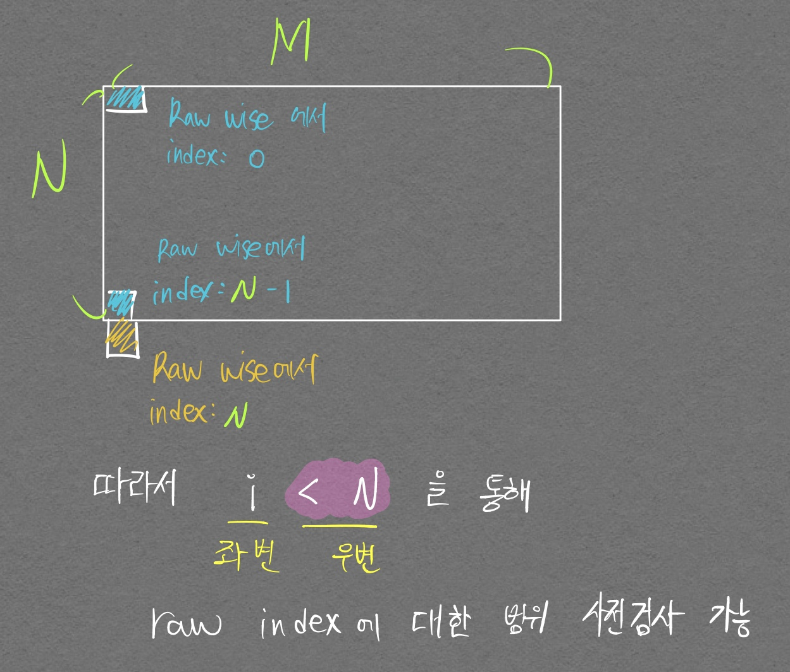

# 1051번

난이도: 실버 4

나는 2차원 형태의 데이터를 반복문 형태로 움직일 때 범위 제한을 어떻게 해줘야 하는지 많이 헷갈린다. (특히 마지막 인덱스 처리할 때 `<` 으로 해야할지 `<=` 으로 해야할지 같은 것)  

다음 상황과 그림을 생각해서 더이상 헷갈리지 않도록 하자.  

상황: 2차원 데이터중 특정 행렬값을 접근할 때 범위가 넘는지 안넘는지 사전에 검사하고 싶음.  


<p align="center">  </p>
<div align="center" markdown="1"> 좌변, 우변으로 따로 나눈 이유는 `<` 부등호와 우변만 있으면 **좌변 값에 대한** 범위 사전 점검이 가능함을 나타낸 것이다. (코드를 쉽게 생각하기 위함이다)  

가령 `i + k < N` 같은 식이 있어도 `< N` 만 딱! 보고  
i + k 인덱스가 N 범위 내에 존재하도록 의도하는 것이구나! 라는 느낌을 받을 수 있으면 문제 풀기나, 코드 읽기가 수월할 것이다.
</div>

```python
N, M = map(int, input().split())

graph = []

for _ in range(N):
  graph.append(list(map(int, input())))

size = min(N, M)
argmax = 0

for raw_idx in range(N):
  for col_idx in range(M):
    for check in range(size):
      if (raw_idx + check < N) and (col_idx + check < M):
        val = graph[raw_idx][col_idx]

        if val == graph[raw_idx + check][col_idx] and val == graph[raw_idx][col_idx + check] and val == graph[raw_idx + check][col_idx + check]:
          argmax = max(argmax, (check + 1)*(check + 1))

print(argmax)
```