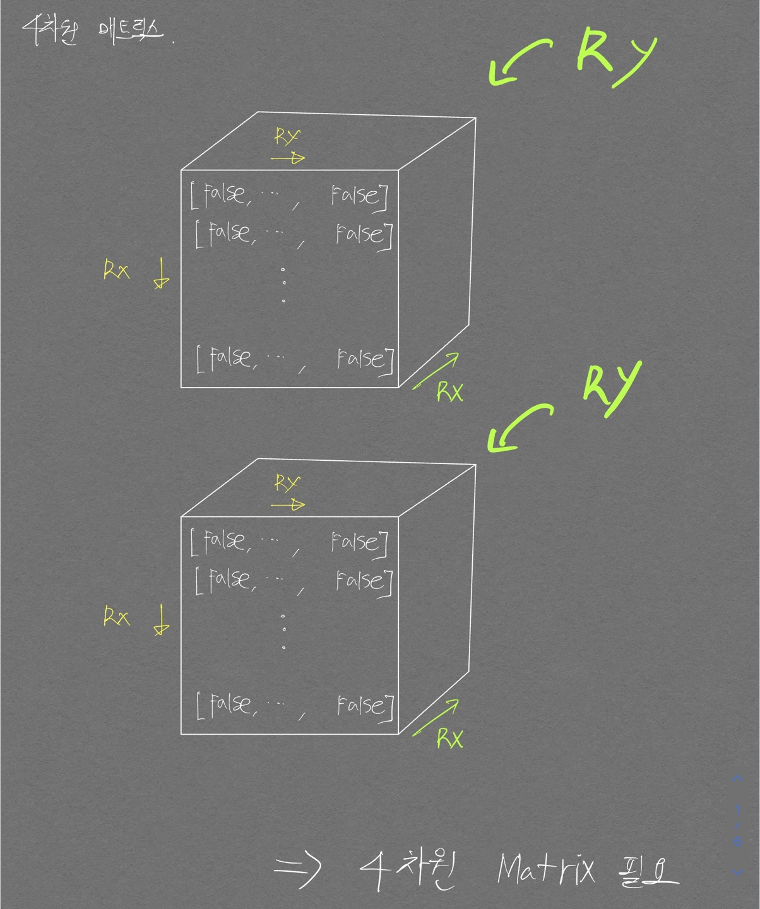
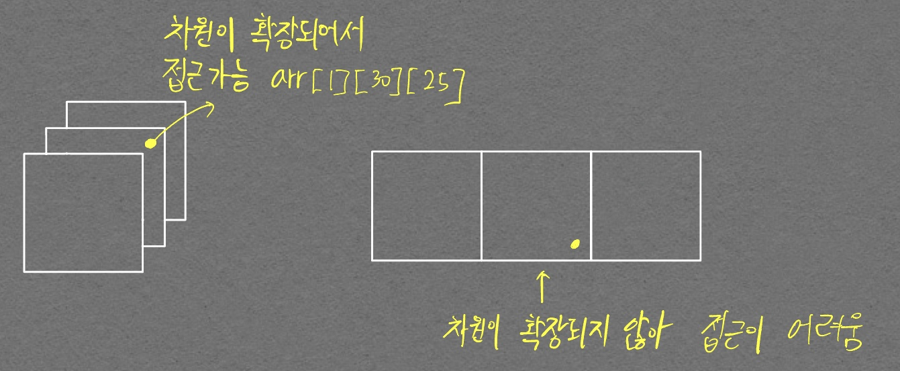

# 13460 (한번 더 풀어봐야함)
난이도: 골드 2

BFS 알고리즘을 적용하기 위해선 방문여부를 check 해야 하는데 이를 위한 4차원 매트릭스 만드는 부분이 처음에 이해가 가질 않았다. 해당 코드는 다음과 같다.  

```python
visited = [[[[False] * M for _ in range(N)]] * M for _ in range(N)]
```

아래 그림을 보면 이해가 갈 것이다.  

<p align="center">  </p>  

위 `visited` 변수를 만들 때 차원을 확장하는 것이 헷갈렸다.  가령 다음의 코드를 보자.  

```python
visited = [[[[False] * M for _ in range(N)]] * M for _ in range(N)]
visited = [[[False] * M for _ in range(N)] * M for _ in range(N)]
```

위 두 줄의 차이를 알겠는가? 위 코드는 4차원과 3차원 이지만 좀더 쉬운 이해를 위해 각각 1차원씩 축소시킨 3차원과 2차원으로 얘기해보자.  

우선 차원의 확장을 헷갈리지 말아야 한다.  가령 아래와 같은 코드가 있다고 해보자.  

```python
[False] * 3
```

    [False, False, False, False, False, False, False, False, False, False]

위 코드는 `[]` 로 한번 덮여있기 때문에 0차원에서 1차원으로 **차원이 확장**되었다.

```python
[[False] * 3 for _ in range(3)]
```

위 코드는 리스트 컴프리헨션을 위해 `[]`를 사용해서 덮어줬다. 역시나 `[]`를 사용한 것이기에 **차원이 확장**되었다.

```python
[[False] * 3 for _ in range(3)] * 3
```

위 코드는 차원이 추가적으로 `확장되지 않는다.`{:.info}. `[]`로 덮어준 부분이 없기 때문이다. 위 코드는 다음과 같이 해석할 수 있다.  

<p align="center">  </p>

```python
[[[False] * 3 for _ in range(3)] for _ range(3)]
```

위 코드는 차원이 확장된다.  위 코드는 다음의 코드와 완전히 같은 역할을 한다. `[[[False] * 3 for _ in range(3)]] * 3`   

차원이 `확장되지 않는다`{:.info}고 했던 위의 코드와 달리 `[]`로 한번 덮어주었다.

# 14503 (한번 더 풀어봐야함)

난이도: 골드 4

계속 예제 입력이랑 출력이 다르게 나와서 애를 먹었으나 결국 break문 하나로 인한 차이였다...  

로봇청소기가 후진할 때 queue에 후진이후의 좌표 정보, 바라보고 있는 방향, 청소한 횟수, 회전 수를 넣어주는데 이 후진 처리 이후 break 문을 적지 않아서, 지나가지 않아도 되는 길까지 queue에 넣어버려서 아직 갈 길이 멀었는데 종료시켜버리는 대참사가 발생하였다...  

영혼의 5시간을 갈아넣어서 간신히 찾아내었다. 대견하다..

```python
from collections import deque

N, M = map(int, input().split())
r, c, d = map(int, input().split())

queue = deque()

graph = [list(map(int, input().split())) for _ in range(N)]

visited = [[0] * M for _ in range(N)]

# 북 동 남 서
dr = [-1, 0, 1, 0]
dc = [0, 1, 0, -1]

result_cnt = 0    # 청소한 칸
rotation_cnt = 0  # 회전만 한 수

queue.append((r, c, d, result_cnt+1, rotation_cnt))
visited[r][c] = 1    # 방문 처리

while queue:
  # 종료 조건
  cr, cc, cd, c_result_cnt, c_rotation_cnt = queue.popleft()
  visited[cr][cc] = 1

  # print(cr, cc)

  # print(f"현재 청소 수 {c_result_cnt}, 현재 좌표{cr, cc}, 현재 방향{cd}, 현재 회전 수: {c_rotation_cnt}")
  # print(f"queue 상태: {queue}")

  if c_rotation_cnt >= 4:    # 한바퀴 빙글 돌았을 때
    if graph[cr + dr[(cd + 2) % 4]][cc + dc[(cd + 2) % 4]] == 1:
      # print(f"최종 청소 수: {c_result_cnt}, 종료 좌표{cr, cc}, 종료 방향{cd}, 종료 회전{c_rotation_cnt}")
      break
      
    else:  # 벽이 아니고 지나갈 수 있으면
      queue.append((cr + dr[(cd + 2) % 4], cc + dc[(cd + 2) % 4], cd, c_result_cnt, 0))
      continue

  # print(c_result_cnt, c_rotation_cnt)
  # 탐색하는 곳은 내가 바라보고 있는 곳의 왼쪽
  nd = (cd + 3) % 4
  # nr = cr + dr[(cd + 3) % 4]
  nr = cr + dr[nd]
  nc = cc + dc[nd]
  n_result_cnt = c_result_cnt + 1
  n_rotation_cnt = c_rotation_cnt + 1
  # n_rotation_cnt = c_rotation_cnt + 1
  # nc = cd + dr[(cd + 3) % 4]

  if 0<= nr < N and 0 <= nc < M:
    if graph[nr][nc] == 0:
      if visited[nr][nc] != 1:    # 청소 안했으면
        queue.append((nr, nc, nd, n_result_cnt, 0))
        # for i in range(N):
        #   for j in range(M):
        #     print(visited[i][j], end=' ')
        #   print()
        # print()
        
      else:  # 청소 했으면
        queue.append((cr, cc, nd, c_result_cnt, n_rotation_cnt))  
    else:  # 벽이면
      queue.append((cr, cc, nd, c_result_cnt, n_rotation_cnt))

print(c_result_cnt)
  # if 0 <= nr < N and 0 <= nc < M and graph[nr][nc] == 0 and visited[nr][nc] != 1:  # 청소 가능하면
  #   queue.append((nr, nc, nd, n_result_cnt, 0))
  # elif 0 <= nr < N and 0 <= nc < M and graph[nr][nc] == 1:
  #   queue.append((cr, cc, nd, c_result_cnt, c_rotation_cnt + 1))
  # elif 0 <= nr < N and 0 <= nc < M and graph[nr][nc] == 0 and visited[nr][nc] == 1: # 이미 청소한 곳 이면
  #   queue.append((cr, cc, nd, c_result_cnt, c_rotation_cnt + 1))
```

다른 분들의 코드를 참고해보니 완전 탐색 방식으로 **구현**한 방법과, **BFS** 방식으로 푼 것들이 있었는데, 특히 **BFS** 문제의 경우 회전 수를 count하지 않고 for문을 통해 깔끔하게 구현한 것이 인상깊었다.  

블로그를 어느정도 보고 내 방식대로 구현해본 것인데 출력이 이상하다.. 뭐가 다른건지 아직 못찾았다.

```python
from collections import deque

N, M = map(int, input().split())
y, x, d = map(int, input().split())
graph = [list(map(int, input().split())) for _ in range(N)]
visited = [[0]*M for _ in range(N)]
queue = deque()
breaker = False
# 북, 동, 남, 서
dy = [-1, 0, 1, 0]
dx = [0, 1, 0, -1]

def rotation(d):
  if d==0:
    return 3
  elif d==1:
    return 0
  elif d==2:
    return 1
  else:
    return 2

# 첫 시작은 처음 방문한 곳이고, 벽도 아니기에 cnt 1로 청소 한것으로 시작
# 이렇게 셋팅해 놓으면, cnt+=1로 수 올리고 동시에 queue에 넣으면 그 자리의 청소는 처리된것으로 생각해도 됨. (나중에 pop 되서 처리될 예정)
cnt = 1
queue.append((y, x, d))

while queue:
  if breaker == True:
    break

  cy, cx, cd = queue.popleft()    # 청소 작업 진행. cy, cx 좌표는 청소 확정적으로 처리되는 좌표임
  visited[cy][cx] = 1

  for i in range(4):    # 회전 4번 시킬 예정
    # 현재 바라보고 있는 방향에서 왼쪽 칸을 조회하기 위한 미래 좌표(dy, dx를 통해 미래 방향을 나타내면 편함)
    nd = rotation(cd)
    ny = cy + dy[nd]
    nx = cx + dx[nd]

    print(nd)
    if 0<= ny < N and 0<= nx < M and graph[ny][nx] == 0 and visited[ny][nx] == 0:    # 청소 가능한 곳
      cnt += 1
      queue.append((ny, nx, nd))
      break    # 아하.. 이 break 걸어줘야 하는구나 for문 이니까

    elif i == 3:    # 이동이 불가능한 경우(이동이 가능한 경우와, 이동이 불가능한 경우로 나누면 된다)
      # 여기까지 왔다는건 위의 if문을 들어가지 못했다는 소리이고 그렇다면 종료조건을 살핀 뒤, 종료되지 않는다면 후진을 위한 정보를 queue에 넣어줘야 함을 의미한다.

      # 종료조건은 회전하고 나서 뒤쪽에 벽이 있는지 체크하는 것이다. 회전에 대한 정보는 nd, ny, nx가 가지고 있는 것이므로 이 변수들을 통해 벽뒤를 조회한다.
      
      if graph[cy + dy[(nd + 2)%4]][cx + dx[(nd + 2)%4]] == 1:
        print(cnt)
        print('\n', visited)
        breaker = True
      else:
        print("후진")
        back_y = cy + dy[(nd + 2) % 4]
        back_x = cx + dx[(nd + 2) % 4]
        queue.append((back_y, back_x, nd))
```

참고한 정답 코드는 아래와 같다

```python
# boj 14503
# blog : jjangsungwon.tistory.com

import sys
from collections import deque

# 북 동 남 서
dy = [-1, 0, 1, 0]
dx = [0, 1, 0, -1]


# 방향 전환
def change(d):
    if d == 0:  # 북 -> 서
        return 3
    elif d == 1:  # 동 -> 북
        return 0
    elif d == 2:  # 남 -> 동
        return 1
    elif d == 3:  # 서 -> 동
        return 2


# 후진
def back(d):
    if d == 0:
        return 2
    elif d == 1:
        return 3
    elif d == 2:
        return 0
    elif d == 3:
        return 1


def bfs(row, col, d):
    cnt = 1  # 청소하는 칸의 개수
    arr[row][col] = 2
    q = deque([[row, col, d]])

    # 큐가 비어지면 종료
    while q:
        row, col, d = q.popleft()
        temp_d = d

        for i in range(4):
            temp_d = change(temp_d)
            new_row, new_col = row + dy[temp_d], col + dx[temp_d]

            # a
            if 0 <= new_row < N and 0 <= new_col < M and arr[new_row][new_col] == 0:
                cnt += 1
                arr[new_row][new_col] = 2
                q.append([new_row, new_col, temp_d])
                break

            # c
            elif i == 3:  # 갈 곳이 없었던 경우
                new_row, new_col = row + dy[back(d)], col + dx[back(d)]
                q.append([new_row, new_col, d])

                # d
                if arr[new_row][new_col] == 1:  # 뒤가 벽인 경우
                    return cnt


if __name__ == "__main__":
    N, M = map(int, input().split())
    r, c, d = map(int, input().split())

    # 지도
    arr = [list(map(int, sys.stdin.readline().split())) for _ in range(N)]

    # 탐색
    print(bfs(r, c, d))
```

## 구현으로 푸는 법

구현으로 간단하게도 풀 수 있어서 다른 풀이를 참고하여 아래와 같은 구현 코드를 작성했다.  

```python
N, M = map(int, input().split())

y, x, d = map(int, input().split())

graph = [list(map(int, input().split())) for _ in range(N)]

visited = [[0] * M for _ in range(N)]

cnt = 1
visited[y][x] = 1
breaker = False
# 북 동 남 서
dy = [-1, 0, 1, 0]
dx = [0, 1, 0, -1]

def rotation(dir):
  return (dir + 3) % 4

flag = False

while(True):
  if flag:
    break

  # 4방향 확인
  for i in range(4):
    # 현재 바라보는 방향에서 왼쪽 지점 찾기 위한 회전
    d = rotation(d)
    ny, nx = y + dy[d], x+ dx[d]

    if 0<=ny<N and 0<=nx<M and graph[ny][nx] ==0 and visited[ny][nx]==0:
      cnt += 1
      visited[ny][nx] = 1
      breaker = True
      y,x = ny,nx
      break

  
  if breaker == False:  # 청소 못했으면
    # 종료조건인지 찾아보고
    new_y, new_x = y + dy[(d + 2) % 4], x + dx[(d + 2) % 4]
    if graph[new_y][new_x] == 1:
      print(cnt)
      flag = True

    # 아니면 후진
    else:
      y = y + dy[(d + 2) % 4]
      x = x + dx[(d + 2) % 4]

  # 청소 했으면 breaker 변수만 False로 만들어주면 끝
  else:
    breaker = False
    pass
```