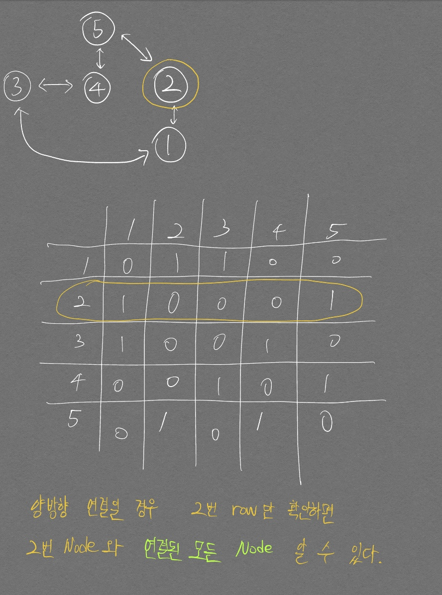
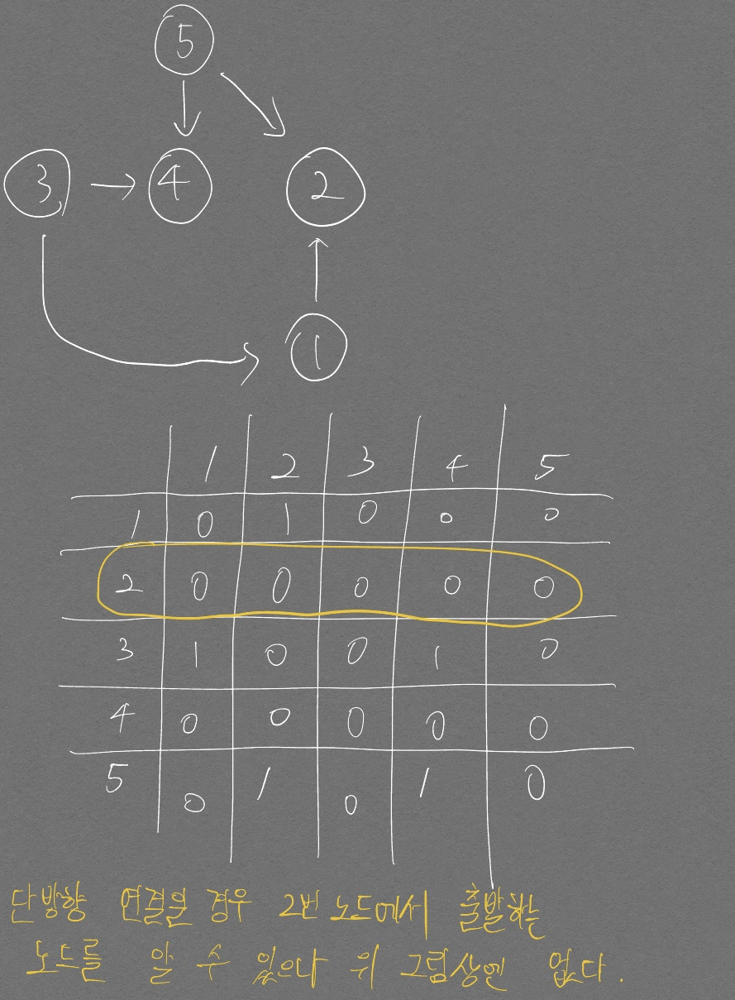
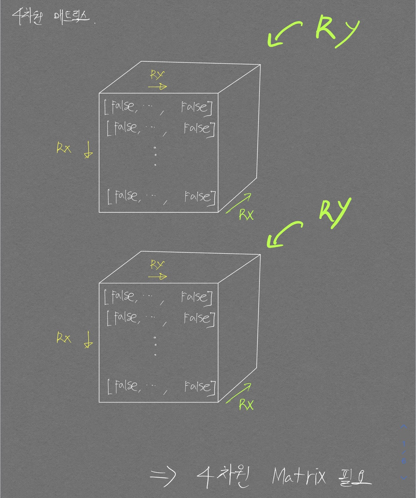
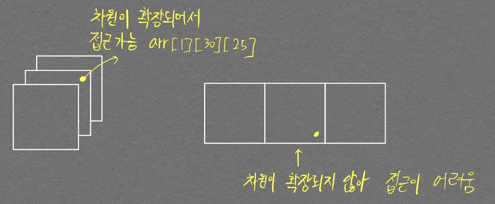

# 1260 (DFS와 BFS)
난이도: 실버2

문제에서 양방향으로 그래프가 이루어져 있다고 해서 들어온 입력을 인접 리스트로 푸는게 나을지, 인접 행렬로 푸는게 나을지 감이 오지 않아서 인접 리스트로 접근하였고 상당히 오래걸렸다. 다음의 개념을 알고 있으면 다음번엔 훨씬 수월하게 풀 수 있을 것이다.  

<p align="center">  </p>
<div align="center" markdown="1"> 양방향이기 때문에 row 2만 접근해도 2와 연결되어 있는 모든 노드를 알 수 있다.  
처음에 이 부분을 생각하지 못해서 인접 행렬로 구현하는데 어려움을 겪었다. 
</div>

<p align="center">  </p>
<div align="center" markdown="1">  위 그림은 단방향 인접 행렬임.
</div>

양방향 그래프를 초기화 하는 방법은 다음과 같다.  

```python
INF = 1e+10
N, M, start_node = map(int, input().split())

# 인접 그래프의 경우
graph = [[INF]*(N+1) for i in range(N+1)]
for i in range(M):
  st, et = map(int, input().split())
  graph[st][et], graph[et][st] = 1, 1

# 인접 리스트의 경우
graph = [[] for i in range(N+1)]
st, et = map(int, input().split())
graph[st].append(et)
graph[et].append(st)
graph = list(map(sorted, graph))
```

그래프 노드 갯수인 `N` 값을 이용해 graph를 초기화 하는 것, 인접 리스트의 경우 인접 행렬과 달리 sorting을 진행해주는 점을 신경쓰면 좋을 것 같다.  
좀더 구현을 간단하게 하기위해 (sorting까지 고려하지 않는 방향) 인접 행렬로 구현하는것이 나을것으로 보인다.

- 정답 코드

```python
import sys
from collections import deque

INF = 1e+10
N, M, start_node = map(int, input().split())
visit_dfs = [False] * (N + 1)
visit_bfs = [False] * (N + 1)

# 인접 리스트
# graph = [[] for i in range(N + 1)]

# for i in range(M):
#   st, et = map(int, input().split())
#   graph[st].append(et)
#   graph[et].append(st)

# 정점 번호가 작은것 먼저 방문하기 위해 sort
# graph = list(map(sorted, graph))

# 인접 행렬
graph = [[INF]*(N+1) for i in range(N+1)]

for i in range(M):
  st, et = map(int, input().split())
  graph[st][et], graph[et][st] = 1, 1


def dfs(cur_node):
  print(cur_node, end=' ')
  visit_dfs[cur_node] = True
  
  # 아래 for문 탈출하면(조건에 맞는게 없으면) 종료되므로
  # 종료조건이 따로 필요 없음


  # 인접 리스트
  # for node in graph[cur_node]:
  #   if not visit_dfs[node]:
  #     visit_dfs[node] = True
  #     dfs(node)

  # 인접 행렬
  for idx, node in enumerate(graph[cur_node]):
    # print(node)
    if node == 1 and not visit_dfs[idx]:
      # visit_dfs[cur_node] = True
      dfs(idx)
    
  # for i in range(1, N+1):
  #   for j in range(1, N+1):
  #     if graph[i][j] == 1 and not visit_dfs[]:    # 연결되어 있는 노드가 있다면
  #       bfs(node)
  
  

def bfs(cur_node):
  q = deque()
  q.append(cur_node)
  visit_bfs[cur_node] = True

  # 인접리스트
  # while q:
  #   node = q.popleft()
  #   print(node, end=' ')

  #   for n in graph[node]:
  #     if not visit_bfs[n]:
  #       q.append(n)
  #       visit_bfs[n] = True

  # 인접행렬
  while q:
    cur_node = q.popleft()
    print(cur_node, end=' ')
    
    for idx, connected in enumerate(graph[cur_node]):
      if connected == 1 and not visit_bfs[idx]:
        q.append(idx)
        visit_bfs[idx] = True

dfs(start_node)
print()
bfs(start_node)
```

# 1303번 (전쟁 - 전투)
난이도: 실버 1

어떻게 보면 정말 멍청했던 부분이다...  

입력이 가로, 세로 순으로 들어오는데 내가 이걸 멋대로 세로, 가로 순으로 입력이 들어올 것을 가정해버렸다.  

아래 코드에서 처음 부분의 입력을 `M, N = map(int, sys.stdin.readline().rstrip().split())`으로 했었다...

```python
import sys
from collections import deque
import math

N, M = map(int, sys.stdin.readline().rstrip().split())

graph=[]
for i in range(M):
  graph.append(list(sys.stdin.readline().rstrip()))

# print(graph)

dx = [-1, 0, 1, 0]
dy = [0, 1, 0, -1]

def dfs(cx, cy, mark, cnt):
  q = deque()
  q.append([cx, cy])
  graph[cx][cy] = 1  # 방문 처리
  cnt += 1

  while q:
    x, y = q.popleft()
    for i in range(4):
      nx, ny = x + dx[i], y + dy[i]
      
      # 방문한 곳이 아니며, 같은 나라의 병사일 경우
      if 0 <= nx < M and 0 <= ny < N and graph[nx][ny] == mark:
        # print(nx, ny)
        q.append([nx, ny])
        graph[nx][ny] = 1  # 방문 처리
        cnt += 1
  return cnt

ans_1, ans_2 = 0, 0

for i in range(M):
  for j in range(N):
    if graph[i][j] == 'W':
      # print("출력")
      cnt = 0
      ans_1 += int(math.pow(dfs(i, j, graph[i][j], cnt), 2))
      # ans_1 += int(pow(dfs(i, j, 'W', cnt), 2))
    elif graph[i][j] == 'B':
      cnt = 0
      ans_2 += int(math.pow(dfs(i, j, graph[i][j], cnt), 2))
      # ans_1 += int(pow(dfs(i, j, 'B', cnt), 2))

print(ans_1, ans_2)
```

내 방법은 marker를 외부에서 직접 함수로 인자를 통해 주는 방식으로 구현했는데  
`if 0 <= nx < M and 0 <= ny < N and MAP[nx][ny] == MAP[x][y] and check[nx][ny] == 0:` 와 같은 방식으로도 'W', 'B'에 대해서 각각 함수를 적용시킬 수 있다.

# 13460 (한번 더 풀어봐야함)
난이도: 골드 2

BFS 알고리즘을 적용하기 위해선 방문여부를 check 해야 하는데 이를 위한 4차원 매트릭스 만드는 부분이 처음에 이해가 가질 않았다. 해당 코드는 다음과 같다.  

```python
visited = [[[[False] * M for _ in range(N)]] * M for _ in range(N)]
```

아래 그림을 보면 이해가 갈 것이다.  

<p align="center">  </p>  

위 `visited` 변수를 만들 때 차원을 확장하는 것이 헷갈렸다.  가령 다음의 코드를 보자.  

```python
visited = [[[[False] * M for _ in range(N)]] * M for _ in range(N)]
visited = [[[False] * M for _ in range(N)] * M for _ in range(N)]
```

위 두 줄의 차이를 알겠는가? 위 코드는 4차원과 3차원 이지만 좀더 쉬운 이해를 위해 각각 1차원씩 축소시킨 3차원과 2차원으로 얘기해보자.  

우선 차원의 확장을 헷갈리지 말아야 한다.  가령 아래와 같은 코드가 있다고 해보자.  

```python
[False] * 3
```

    [False, False, False, False, False, False, False, False, False, False]

위 코드는 `[]` 로 한번 덮여있기 때문에 0차원에서 1차원으로 **차원이 확장**되었다.

```python
[[False] * 3 for _ in range(3)]
```

위 코드는 리스트 컴프리헨션을 위해 `[]`를 사용해서 덮어줬다. 역시나 `[]`를 사용한 것이기에 **차원이 확장**되었다.

```python
[[False] * 3 for _ in range(3)] * 3
```

위 코드는 차원이 추가적으로 `확장되지 않는다.`{:.info}. `[]`로 덮어준 부분이 없기 때문이다. 위 코드는 다음과 같이 해석할 수 있다.  

<p align="center">  </p>

```python
[[[False] * 3 for _ in range(3)] for _ range(3)]
```

위 코드는 차원이 확장된다.  위 코드는 다음의 코드와 완전히 같은 역할을 한다. `[[[False] * 3 for _ in range(3)]] * 3`   

차원이 `확장되지 않는다`{:.info}고 했던 위의 코드와 달리 `[]`로 한번 덮어주었다.

# 14503 (로봇청소기)

난이도: 골드 4

계속 예제 입력이랑 출력이 다르게 나와서 애를 먹었으나 결국 break문 하나로 인한 차이였다...  

로봇청소기가 후진할 때 queue에 후진이후의 좌표 정보, 바라보고 있는 방향, 청소한 횟수, 회전 수를 넣어주는데 이 후진 처리 이후 break 문을 적지 않아서, 지나가지 않아도 되는 길까지 queue에 넣어버려서 아직 갈 길이 멀었는데 종료시켜버리는 대참사가 발생하였다...  

영혼의 5시간을 갈아넣어서 간신히 찾아내었다. 대견하다..

```python
from collections import deque

N, M = map(int, input().split())
r, c, d = map(int, input().split())

queue = deque()

graph = [list(map(int, input().split())) for _ in range(N)]

visited = [[0] * M for _ in range(N)]

# 북 동 남 서
dr = [-1, 0, 1, 0]
dc = [0, 1, 0, -1]

result_cnt = 0    # 청소한 칸
rotation_cnt = 0  # 회전만 한 수

queue.append((r, c, d, result_cnt+1, rotation_cnt))
visited[r][c] = 1    # 방문 처리

while queue:
  # 종료 조건
  cr, cc, cd, c_result_cnt, c_rotation_cnt = queue.popleft()
  visited[cr][cc] = 1

  # print(cr, cc)

  # print(f"현재 청소 수 {c_result_cnt}, 현재 좌표{cr, cc}, 현재 방향{cd}, 현재 회전 수: {c_rotation_cnt}")
  # print(f"queue 상태: {queue}")

  if c_rotation_cnt >= 4:    # 한바퀴 빙글 돌았을 때
    if graph[cr + dr[(cd + 2) % 4]][cc + dc[(cd + 2) % 4]] == 1:
      # print(f"최종 청소 수: {c_result_cnt}, 종료 좌표{cr, cc}, 종료 방향{cd}, 종료 회전{c_rotation_cnt}")
      break
      
    else:  # 벽이 아니고 지나갈 수 있으면
      queue.append((cr + dr[(cd + 2) % 4], cc + dc[(cd + 2) % 4], cd, c_result_cnt, 0))
      continue

  # print(c_result_cnt, c_rotation_cnt)
  # 탐색하는 곳은 내가 바라보고 있는 곳의 왼쪽
  nd = (cd + 3) % 4
  # nr = cr + dr[(cd + 3) % 4]
  nr = cr + dr[nd]
  nc = cc + dc[nd]
  n_result_cnt = c_result_cnt + 1
  n_rotation_cnt = c_rotation_cnt + 1
  # n_rotation_cnt = c_rotation_cnt + 1
  # nc = cd + dr[(cd + 3) % 4]

  if 0<= nr < N and 0 <= nc < M:
    if graph[nr][nc] == 0:
      if visited[nr][nc] != 1:    # 청소 안했으면
        queue.append((nr, nc, nd, n_result_cnt, 0))
        # for i in range(N):
        #   for j in range(M):
        #     print(visited[i][j], end=' ')
        #   print()
        # print()
        
      else:  # 청소 했으면
        queue.append((cr, cc, nd, c_result_cnt, n_rotation_cnt))  
    else:  # 벽이면
      queue.append((cr, cc, nd, c_result_cnt, n_rotation_cnt))

print(c_result_cnt)
  # if 0 <= nr < N and 0 <= nc < M and graph[nr][nc] == 0 and visited[nr][nc] != 1:  # 청소 가능하면
  #   queue.append((nr, nc, nd, n_result_cnt, 0))
  # elif 0 <= nr < N and 0 <= nc < M and graph[nr][nc] == 1:
  #   queue.append((cr, cc, nd, c_result_cnt, c_rotation_cnt + 1))
  # elif 0 <= nr < N and 0 <= nc < M and graph[nr][nc] == 0 and visited[nr][nc] == 1: # 이미 청소한 곳 이면
  #   queue.append((cr, cc, nd, c_result_cnt, c_rotation_cnt + 1))
```

다른 분들의 코드를 참고해보니 완전 탐색 방식으로 **구현**한 방법과, **BFS** 방식으로 푼 것들이 있었는데, 특히 **BFS** 문제의 경우 회전 수를 count하지 않고 for문을 통해 깔끔하게 구현한 것이 인상깊었다.  

블로그를 어느정도 보고 내 방식대로 구현해본 것인데 출력이 이상하다.. 뭐가 다른건지 아직 못찾았다.

```python
from collections import deque

N, M = map(int, input().split())
y, x, d = map(int, input().split())
graph = [list(map(int, input().split())) for _ in range(N)]
visited = [[0]*M for _ in range(N)]
queue = deque()
breaker = False
# 북, 동, 남, 서
dy = [-1, 0, 1, 0]
dx = [0, 1, 0, -1]

def rotation(d):
  if d==0:
    return 3
  elif d==1:
    return 0
  elif d==2:
    return 1
  else:
    return 2

# 첫 시작은 처음 방문한 곳이고, 벽도 아니기에 cnt 1로 청소 한것으로 시작
# 이렇게 셋팅해 놓으면, cnt+=1로 수 올리고 동시에 queue에 넣으면 그 자리의 청소는 처리된것으로 생각해도 됨. (나중에 pop 되서 처리될 예정)
cnt = 1
queue.append((y, x, d))

while queue:
  if breaker == True:
    break

  cy, cx, cd = queue.popleft()    # 청소 작업 진행. cy, cx 좌표는 청소 확정적으로 처리되는 좌표임
  visited[cy][cx] = 1

  for i in range(4):    # 회전 4번 시킬 예정
    # 현재 바라보고 있는 방향에서 왼쪽 칸을 조회하기 위한 미래 좌표(dy, dx를 통해 미래 방향을 나타내면 편함)
    nd = rotation(cd)
    ny = cy + dy[nd]
    nx = cx + dx[nd]

    print(nd)
    if 0<= ny < N and 0<= nx < M and graph[ny][nx] == 0 and visited[ny][nx] == 0:    # 청소 가능한 곳
      cnt += 1
      queue.append((ny, nx, nd))
      break    # 아하.. 이 break 걸어줘야 하는구나 for문 이니까

    elif i == 3:    # 이동이 불가능한 경우(이동이 가능한 경우와, 이동이 불가능한 경우로 나누면 된다)
      # 여기까지 왔다는건 위의 if문을 들어가지 못했다는 소리이고 그렇다면 종료조건을 살핀 뒤, 종료되지 않는다면 후진을 위한 정보를 queue에 넣어줘야 함을 의미한다.

      # 종료조건은 회전하고 나서 뒤쪽에 벽이 있는지 체크하는 것이다. 회전에 대한 정보는 nd, ny, nx가 가지고 있는 것이므로 이 변수들을 통해 벽뒤를 조회한다.
      
      if graph[cy + dy[(nd + 2)%4]][cx + dx[(nd + 2)%4]] == 1:
        print(cnt)
        print('\n', visited)
        breaker = True
      else:
        print("후진")
        back_y = cy + dy[(nd + 2) % 4]
        back_x = cx + dx[(nd + 2) % 4]
        queue.append((back_y, back_x, nd))
```

참고한 정답 코드는 아래와 같다

```python
# boj 14503
# blog : jjangsungwon.tistory.com

import sys
from collections import deque

# 북 동 남 서
dy = [-1, 0, 1, 0]
dx = [0, 1, 0, -1]


# 방향 전환
def change(d):
    if d == 0:  # 북 -> 서
        return 3
    elif d == 1:  # 동 -> 북
        return 0
    elif d == 2:  # 남 -> 동
        return 1
    elif d == 3:  # 서 -> 동
        return 2


# 후진
def back(d):
    if d == 0:
        return 2
    elif d == 1:
        return 3
    elif d == 2:
        return 0
    elif d == 3:
        return 1


def bfs(row, col, d):
    cnt = 1  # 청소하는 칸의 개수
    arr[row][col] = 2
    q = deque([[row, col, d]])

    # 큐가 비어지면 종료
    while q:
        row, col, d = q.popleft()
        temp_d = d

        for i in range(4):
            temp_d = change(temp_d)
            new_row, new_col = row + dy[temp_d], col + dx[temp_d]

            # a
            if 0 <= new_row < N and 0 <= new_col < M and arr[new_row][new_col] == 0:
                cnt += 1
                arr[new_row][new_col] = 2
                q.append([new_row, new_col, temp_d])
                break

            # c
            elif i == 3:  # 갈 곳이 없었던 경우
                new_row, new_col = row + dy[back(d)], col + dx[back(d)]
                q.append([new_row, new_col, d])

                # d
                if arr[new_row][new_col] == 1:  # 뒤가 벽인 경우
                    return cnt


if __name__ == "__main__":
    N, M = map(int, input().split())
    r, c, d = map(int, input().split())

    # 지도
    arr = [list(map(int, sys.stdin.readline().split())) for _ in range(N)]

    # 탐색
    print(bfs(r, c, d))
```

## 구현으로 푸는 법

구현으로 간단하게도 풀 수 있어서 다른 풀이를 참고하여 아래와 같은 구현 코드를 작성했다.  

```python
N, M = map(int, input().split())

y, x, d = map(int, input().split())

graph = [list(map(int, input().split())) for _ in range(N)]

visited = [[0] * M for _ in range(N)]

cnt = 1
visited[y][x] = 1
breaker = False
# 북 동 남 서
dy = [-1, 0, 1, 0]
dx = [0, 1, 0, -1]

def rotation(dir):
  return (dir + 3) % 4

flag = False

while(True):
  if flag:
    break

  # 4방향 확인
  for i in range(4):
    # 현재 바라보는 방향에서 왼쪽 지점 찾기 위한 회전
    d = rotation(d)
    ny, nx = y + dy[d], x+ dx[d]

    if 0<=ny<N and 0<=nx<M and graph[ny][nx] ==0 and visited[ny][nx]==0:
      cnt += 1
      visited[ny][nx] = 1
      breaker = True
      y,x = ny,nx
      break

  
  if breaker == False:  # 청소 못했으면
    # 종료조건인지 찾아보고
    new_y, new_x = y + dy[(d + 2) % 4], x + dx[(d + 2) % 4]
    if graph[new_y][new_x] == 1:
      print(cnt)
      flag = True

    # 아니면 후진
    else:
      y = y + dy[(d + 2) % 4]
      x = x + dx[(d + 2) % 4]

  # 청소 했으면 breaker 변수만 False로 만들어주면 끝
  else:
    breaker = False
    pass
```

## 4개월 후 진화한 양호준이 다시 풀어봄  (날짜. 2022년 11월 19일)

```python
n, m = map(int, input().split())
cx, cy, cd = map(int, input().split())

graph = [list(map(int, input().split())) for _ in range(n)]
visit = [[False for _ in range(m)] for _ in range(n)]

dx = [-1, 0, 1, 0]
dy = [0, 1, 0, -1]

answer = 0

while(True):
    # 현재 위치가 범위를 넘어가거나, 벽이라면 종료
    if not (0<=cx<n) or not (0<=cy<m) or graph[cx][cy] == 1:
        break

    # 현재 위치 청소
    # 이미 청소되어있다면 따로 카운트 처리 안함
    if not visit[cx][cy]:
        visit[cx][cy] = True
        answer += 1

    for step in range(4):
        # 회전 진행
        nd = (cd+3) % 4
        nx, ny = cx+dx[nd], cy+dy[nd]

        # 청소할 곳이 있으면 그짝으로 전진하면서 청소 진행
        if 0<= nx < n and 0<= ny < m and not visit[nx][ny] and graph[nx][ny] == 0:
            cx, cy, cd = nx, ny, nd
            break

        # 청소할 곳 없으면, 회전만 진행
        cd = nd

        # 청소할 곳 못찾아서 cd = nd로 회전을 진행하기 전에, 4방향의 탐색이 모두 끝났다면, 현재 방향에서 그대로 뒤로 갈 것임
        if step == 3:
            nx, ny = cx+dx[(cd+2)%4], cy+dy[(cd+2)%4]
            cx, cy = nx, ny
            break

print(answer)
```

아직도 카카오 코딩테스트 문제를 접하면 갈 길이 멀게 느껴지긴 하지만, 실력이 꽤나 늘은 것 같아 기분이 좋다. 그래도 시간이 조금 걸렸는데 바로 풀지 못한 이유는 다음의 조건 때문이었다.

> 왼쪽 방향에 청소할 공간이 없다면, 그 방향으로 회전하고 2번으로 돌아간다.

청소할 공간이 없다면, **회전** 처리를 해줘야 하는 것이었는데, 나는 처음에 회전 처리를 안해줘서 `for`문 내부 코드를 다음과 같이 구성했었다.

```python
        # 청소할 곳이 있으면 그짝으로 전진하면서 청소 진행
        if 0<= nx < n and 0<= ny < m and not visit[nx][ny] and graph[nx][ny] == 0:
            cx, cy, cd = nx, ny, nd
            break

        # 청소할 곳 못찾아서 cd = nd로 회전을 진행하기 전에, 4방향의 탐색이 모두 끝났다면, 현재 방향에서 그대로 뒤로 갈 것임
        if step == 3:
            nx, ny = cx+dx[(cd+2)%4], cy+dy[(cd+2)%4]
            cx, cy = nx, ny
            break
          
        # 청소할 곳 없으면, 회전만 진행
        cd = nd
```

그러나 위의 `cd = nd` 코드가 정답 코드 처럼 윗 부분으로 올라가줘야 한다. 즉, 현재 방향의 왼쪽 방향이 이동할 수 없는 구간인걸 **파악하자 마자 회전 처리가 이루어져야 한다.**

# 양과 늑대 (다시 풀어봐야 함)

문제 출처: 2022 카카오 공채 (Level 3)  

```python
vis = [0] * (1 << 17)
total_num = 0
answer = 0
gl_info = []
graph = 0

def dfs(state):
    global total_num, answer, graph
    
    # 방문했던 곳이면 바로 탈출
    if vis[state] == 1:
        return None
    
    # 현재 state 방문 처리
    vis[state] = 1
    
    # 늑대, 양 수 세기
    wolf, num = 0, 0
    
    for i in range(len(gl_info)):
        if state & (1 << i):
            num += 1
            wolf += gl_info[i]
            
    sheep = num - wolf
    
    # print(f"현재 state {bin(state)}, 늑대 수: {wolf}, 양 수: {sheep}")
    if wolf * 2 >= sheep:
        return None
    
    answer = max(answer, sheep)
    
    # 현재 state에서 이동 가능한 다음 state로 이동
    for in range(len(gl_info)):
        for idx, j in enumerate(graph[i]):  # i번 노드에서 방문 가능한 노드 들어감
            if j:   # 연결되어 있으면 True
                dfs(state | (1 << idx))

def solution(info, edges):
    global total_num, gl_info, graph
    gl_info = info
    total_num = len(gl_info)
    
    
    global answer
    
    # 노드 갯수만큼 2차원 인접행렬 생성
    graph = [[0] * len(info) for _ in range(len(info))]
    
    # 방문 처리할 노드
    # vis = [False] * len(info)
    
    # 엣지 정보 입력
    # 양방향 연결로 해보자
    for st, et in edges:
        graph[st][et], graph[et][st] = 1, 1
    
    dfs(1)
    
    return answer
```

정답 코드를 보고 간신히 이해한 후 내 나름대로 코드를 다시 짜서 제출하였지만 테스트 케이스 1번뿐이 맞추지 못했다...  

# 아기 상어

출처: 백준, 난이도: 골드 3  

테스트 케이스 몇개를 맞추지 못했다. BFS도 넣고 코드가 길어져서 굉장히 중구난방 해 보인다.  정답 코드와 비교하며 어디가 다른지 찾아보자.

- 내코드

```python
N = int(input())

graph = [list(map(int, input().split())) for _ in range(N)]

def search(baby_size):
  li = []
  for i in range(N):
    for j in range(N):
      if graph[i][j] < baby_size and graph[i][j] != 0:
        li.append([i, j])

  # 거리 계산할 때 같은것에 대한 처리를 따로 하지 않기위해 y좌표로 우선 sorting후 같은 건 x좌표로 sorting

  # sorted(li, key=lambda x: x[1])

  # 여러개 sorting 어케하지.. 자동으로 되는건가... 모르게따.... ㅜㅜㅜ
  # 일단 어차피 for문이 column 위주로 먼저 도니 괜찮을 듯
  return li

from collections import deque

def bfs(cx, cy, tx, ty):
  dis = 0
  queue = deque()
  visit = [[False]*N for _ in range(N)]

  dx = [-1, 1, 0, 0]
  dy = [0, 0, 1, -1]
  
  queue.append([cx, cy, dis])
  visit[cx][cy] = True
  
  while queue:
    cx, cy, c_dis = queue.popleft()

    for i in range(4):
      nx = cx + dx[i]
      ny = cy + dy[i]

      if nx == tx and ny == ty:
        # nx, ny는 다음 좌표이므로 현재까지의 distance + 1을 return
        return c_dis+1
      
      if 0 <= nx < N and 0<= ny < N and not visit[nx][ny] and graph[nx][ny] <= baby_size:
        # c_dis += 1    이렇게 하면 for 문 4번돌때 다 들어간다 생각하면 마지막에는 4가 증가한 c_dis 값이 들어감. 1이 들어가야 하는데
        # c_dis += 1
        queue.append([nx,ny,c_dis+1])
        # print(queue)
        visit[nx][ny] = True
    
  
def get_shortest(li, cx, cy):
  global time
  
  min_dis = 1000
  result_x, result_y = -1, -1

  for x, y in li:
    # bfs로 거리 구하자.. 중간에 장애물 있을 수 있으니
    # dis = abs(cx - x) + abs(cy - y)
    dis = bfs(cx, cy, x, y)
    
    if dis < min_dis:
      result_x, result_y = x, y
      min_dis = dis

    # 크기가 같은건 변경해줄 필요가 없는게, x,y가 왼쪽 위부터 오른쪽으로 순차로 좌표를 구하기 때문에 이미 더 나은 좌표로 갱신되어 있는걸 바꿀 필요 없음
    # elif dis == min_dis:
    #   pass

  # 먹었음
  graph[result_x][result_y] = 0    # 어쩔때 global 키워드 사용하는겨..? 이렇게 쓸수잇으면
  time += min_dis
  return result_x, result_y

baby_size = 2
num = 0    # 먹이 먹은 횟수
time = 0

# 초기 아기상어 위치
for i in range(N):
  for j in range(N):
    if graph[i][j] == 9:
      cx, cy = i, j

while 1:
  li = search(baby_size)

  # 더이상 먹을게 없다면
  if len(li) == 0:
    break

  # 아기상어 위치 변경
  cx, cy = get_shortest(li, cx, cy)
  num += 1

  if num == baby_size:
    baby_size += 1
    num = 0

print(time)
```

- 정답 코드
  - 아이디어를 보고 내가 직접 구현하였다. 
  - 기존의 내 코드는 먹이 하나 찾으려고 bfs를 여러번 돌리는 비효율적 코드여서 `runtime error`가 난것으로 보인다. **먹이 하나 찾기 위해서는 bfs 한번만 돌리면 된다.**
  - 거리 매트릭스를 반환한 그 매트릭스에서 하나씩 순차탐색을 해서 먹이를 찾는다는 아이디어가 핵심 이었던 것 같다.
  - 또한 거리 매트릭스에서 -1을 지나가지 못하게 해 놓고 `find 함수`에서 -1 이면 못 먹는 것으로 처음에 예외처리를 안해줘서 꽤나 시간이 걸렸다.

```python
N = int(input())

graph = [list(map(int, input().split())) for _ in range(N)]

# print(graph)
# 최단 거리 매트릭스 반환하는 bfs
from collections import deque

def bfs(cx, cy):
  global baby_size
  # -1은 방문 불가능한 지점
  dist_mat = [[-1] * N for _ in range(N)]
  visit = [[False] * N for _ in range(N)]
  queue = deque()

  # 상, 하, 좌, 우
  dx=[-1, 1, 0, 0]
  dy=[0, 0, -1, 1]  

  queue.append([cx, cy, 0])  # 현재 위치는 거리 0
  visit[cx][cy] = True
  while queue:
    cx, cy, c_dist = queue.popleft()

    for i in range(4):
      nx = cx + dx[i]
      ny = cy + dy[i]

      # 지나갈 수 있는 조건식
      # 자기보다 크기가 작거나 같음
      if 0<= nx < N and 0<= ny < N and graph[nx][ny] <= baby_size and not visit[nx][ny]:
        queue.append([nx,ny,c_dist+1])
        visit[nx][ny] = True
        dist_mat[nx][ny] = c_dist+1
        
  return dist_mat

# 거리 매트릭스를 기반으로 목적지 찾음
# for문에서 왼쪽 위부터 우측방향으로 탐색하게 해서
# 최단거리가 왼쪽 위가 우선으로 선정되게 함
def find(dist_mat):
  global time, baby_size, graph
  
  min_target = 1e9
  tx, ty = -1, -1
  for i in range(N):
    for j in range(N):

      # 먹을 수 있는 것 찾기
      # 자기보다 크기 작고
      if min_target > dist_mat[i][j] and dist_mat[i][j] != -1 and baby_size > graph[i][j] and graph[i][j] != 0:
        min_target = dist_mat[i][j]
        tx, ty = i, j

  if tx == -1:
    return tx, ty

  # 전역변수 time의 값을 거리만큼 올림
  time += dist_mat[tx][ty]
  graph[tx][ty] = 0
  return tx, ty

# 처음 아기상어 위치
for i in range(N):
  for j in range(N):
    if graph[i][j] == 9:
      cx, cy = i, j
      graph[i][j] = 0

time = 0
baby_size = 2
ate = 0

while True:
  cx, cy = find(bfs(cx, cy))
  # print(cx, cy, baby_size, graph[cx][cy])
  if cx == -1:
    break

  ate += 1
  if ate == baby_size:
    baby_size += 1
    ate = 0
    
print(time)
```

# 10819번 (차이를 최대로) / DFS 풀이로 다시 풀어보자
출처: 백준  
난이도: 실버 2

난이도는 실버 2지만 순열을 써서 푸는게 아닌, DFS로 푸는 풀이를 보니 그냥 예술이였다..  이걸 이해하고 응용하려면 상당히 오랜 시간이 걸릴 것 같다.

```python
N = int(input())

arr = list(map(int, input().split()))
result = []
explorer = []
visit = [False] * 6

def dfs(depth):
  if depth == N:
    sum_v = 0
    print(explorer)
    for i in range(N-1):
      sum_v += abs(explorer[i] - explorer[i+1])
    result.append(sum_v)
    return 
    
  for i in range(N):
    if visit[i]:
      continue
      
    visit[i] = True
    explorer.append(arr[i])
    dfs(depth + 1)
    explorer.pop()
    visit[i] = False

dfs(0)
print(result)
```

# 14502번 (연구소)

```python
import sys
from itertools import combinations
from collections import deque

N, M = map(int, sys.stdin.readline().rstrip().split())

matrix = []
for _ in range(N):
    matrix.append(list(map(int, sys.stdin.readline().rstrip().split())))

visit = [[False] * M for _ in range(N)]

# combination을 위한 빈 공간 좌표 수집
candidates = []
for i in range(N):
    for j in range(M):
        if matrix[i][j] == 0:
            candidates.append([i, j])

def bfs(i, j, visit, tp_matrix):
    dx = [-1, 1, 0, 0]
    dy = [0, 0, -1, 1]
    
    q = deque()
    q.append([i, j])
    cnt = 1
    # 방문 처리
    visit[i][j] = True

    while q:
        cx, cy = q.popleft()

        for i in range(4):
            nx = cx + dx[i]
            ny = cy + dy[i]

            if 0<= nx < N and 0<= ny < M and not visit[nx][ny] and tp_matrix[nx][ny] == 0:
                tp_matrix[nx][ny] = 2
                q.append([nx, ny])
                visit[nx][ny] = True
                cnt += 1
                
    # 퍼진 바이러스 개수 return
    return cnt

max_cnt = -int(1e9)

for coor in combinations(candidates, 3):
    cnt = 0
    visit = [[False] * (M) for _ in range(N)]

    tp_matrix = matrix[:]

    # 벽 3장 설치
    for x, y in coor:
        tp_matrix[x][y] = 1
    
    for i in range(N):
        for j in range(M):
            if tp_matrix[i][j] == 2 and not visit[i][j]:
                bfs(i, j, visit, tp_matrix)

    for row in tp_matrix:
        print(row)

    for i in range(N):
        for j in range(M):
            if tp_matrix[i][j] == 0:
                print(tp_matrix)
                cnt += 1
    # for i in range(N):
    #     for j in range(M):
    #         tp_
        
    max_cnt = max(max_cnt, cnt)
    break
    
print(max_cnt)
```

- 풀긴 했지만 `combinations` 내장함수가 아니라 백트래킹 방식을 이용해서 문제를 풀고 싶어서 다시한번 풀어보았다.

```python
import sys
import copy
N, M  = map(int, sys.stdin.readline().rstrip().split())

matrix = [list(map(int, sys.stdin.readline().rstrip().split())) for _ in range(N)]

visit = [[False] * M for _ in range(N)]

from collections import deque


def bfs(tp_matrix):
    q = deque()
    visit = [[False] * M for _ in range(N)]
    
    # 이런식으로 여러개를 한번에 queue에 넣어도 되지 않을까..?
    for i in range(N):
        for j in range(M):
            if tp_matrix[i][j] == 2:
                q.append([i, j])
                visit[i][j] = True

    dx = [-1, 1, 0, 0]
    dy = [0, 0, -1, 1]

    while q:
        cx, cy = q.popleft()
        for i in range(4):
            nx, ny = cx + dx[i], cy + dy[i]
            if 0 <= nx < N and 0<= ny < M and not visit[nx][ny] and tp_matrix[nx][ny] == 0:
                tp_matrix[nx][ny] = 2
                visit[nx][ny] = True
                q.append([nx, ny])
        
    

max_val = 0

def backtracking(depth, x, y):
    global max_val
    
    if depth == 3:
        tp_matrix = copy.deepcopy(matrix)
        bfs(tp_matrix)

        cnt = 0
        for i in range(N):
            for j in range(M):
                if tp_matrix[i][j] == 0:
                    cnt += 1
        max_val = max(max_val, cnt)
        return

    # 순열이 아닌 조합으로 backtracking을 구현하기 위해 x, y값 활용
    for i in range(N):
        for j in range(M):
            # 이전에 선택한 부분보다 작으면 건너뛰기
            if i < x and j < y:
                continue

            if matrix[i][j] == 0:
                matrix[i][j] = 1
                backtracking(depth + 1, i+1, j+1)
                matrix[i][j] = 0

backtracking(0, 0, 0)
print(max_val)
```

- 정말 다사다난했다... 가장 주목한 부분은 **2차원 matrix에서 백트래킹을 구현한 부분이다.**
- 또한 backtracking 에서 basecondition 부분에서 bfs 함수를 실행한 것을 볼 수 있다. 아름답다..!

```python
# 이전에 선택한 부분보다 작으면 건너뛰기
if i < x and j < y:
    continue
```

- 위 처럼 if 문으로 이전에 이미 접근했던 위치들은 다 건너뛰게 하면 되는데 이게 생각이 안나서 한참을 고민했었다. 꼭 기억해두자.

# 19236번 (청소년 상어)

매트릭스 얕은복사 문제로 이틀을 고생했다..

- 아래 코든 풀이 보면서 낑낑대면서 구현하면서 간신히 맞춘 코드다..


```python
import sys
sys.setrecursionlimit(int(1e9))

# 1부터 방향 변경되게 하기 위함
dx = [0, -1, -1, 0, 1, 1, 1, 0, -1]
dy = [0, 0, -1, -1, -1, 0, 1, 1, 1]

# 상어 번호
shark = int(1e9)

# matrix 초기화
matrix = []
for _ in range(4):
    li = list(map(int, sys.stdin.readline().rstrip().split()))

    row = []
    for i in range(0, 8, 2):
        ele = [li[i], li[i+1]]
        row.append(ele)
    matrix.append(row)

answer = 0

# 상어 행동 개시
def shark_eat(depth, matrix, x, y, cnt):
    global answer

    # 초기에 한번 먹은걸로 치고 시작되니
    # 여기서 물고기를 한번 움직이는게 맞는것 같음
    # fish_move()
    # return
    
    for more in range(1, 4):
        # 현재 방향을 기준으로 1칸, 2칸, 3칸 더 갈 수 있음
        nx, ny = x + (dx[matrix[x][y][1]]*more), y + (dy[matrix[x][y][1]]*more)
        if 0 <= nx < 4 and 0<= ny < 4 and matrix[nx][ny][0] != 0:
            tp_matrix = copy.deepcopy(matrix)

            fish_size = matrix[nx][ny][0]     # dfs 기능을 위해 임시 저장
            matrix[nx][ny][0] = shark        # 상어가 해당 좌표로 이동
            matrix[x][y][0] = 0        # 이전의 상어 좌표는 0으로 만듬

            fish_move(matrix)
            
            shark_eat(depth+1, matrix, nx, ny, cnt+fish_size)

            matrix = tp_matrix

    answer = max(answer, cnt)

# x, y 좌표가 이동 가능한 좌표일 때
def CanGo(matrix, x, y):
    if 0<= x < 4 and 0<= y < 4 and matrix[x][y][0] != shark:
        return True
    else:
        return False
        
def turn_dir(matrix, x, y):
    dir = matrix[x][y][1]
    dir += 1
    if dir >= 9:
        dir = 1

    matrix[x][y][1] = dir

def find_fish_and_move(matrix, fish_size):
    for i in range(4):
        for j in range(4):
            if matrix[i][j][0] == fish_size:
                # 같은 logic 8번 반복하고, 만족되는게 없으면 걍 지나감
                for _ in range(1, 9):
                    nx, ny = i + dx[matrix[i][j][1]], j + dy[matrix[i][j][1]]
                    if CanGo(matrix, nx, ny):

                        # 그냥 물고기만 바꾸는게 아니라 방향도 같이 바꿔줘야함. 즉 물고기가 통째로 바뀌는것
                        matrix[nx][ny], matrix[i][j] = matrix[i][j], matrix[nx][ny]
                        return

                        if matrix[nx][ny][0] == 0: # 빈 곳이라면 그냥 가기
                            matrix[nx][ny][0] = matrix[i][j][0]
                            matrix[i][j][0] = 0        # 이동했으니 빈곳 만들기
                            return                               
                        elif 1 <= matrix[nx][ny][0] <= 16:    # 물고기가 있다면 위치 바꾸기
                            matrix[nx][ny][0], matrix[i][j][0] = matrix[i][j][0], matrix[nx][ny][0]
                            return
                    # print(f"{matrix[i][j]} 방향전환전!")
                    turn_dir(matrix, i, j)
import copy
def fish_move(matrix):
    # 아 이거.. 정렬 어케하는거야 대체..
    # tp_matrix.sort(key=lambda x: x[0][0][])
    # tp_matrix.sort()


    # sorting 하기 위함
    forSorting = []
    for i in range(4):
        for j in range(4):
            forSorting.append(matrix[i][j][:])

    forSorting.sort(key=lambda x:x[0])

    # forSorting에는 정렬된 [물고기, 방향]이 있음
    for k in forSorting:
        # 상어면 바로종료
        if k[0] == shark:
            break
        # 빈 칸이면
        if k[0] == 0:
            continue
        find_fish_and_move(matrix, k[0])

    # fishmove 끝남

fish_size = matrix[0][0][0]
matrix[0][0][0] = shark
fish_move(matrix)

depth = 1

# print(f"상어 {1}번 움직이고, 물고기 {1}번 움직인 상태일 때의 \nmatrix 값, 이때까지 먹은 물고기 수: {fish_size}")
# for i in range(4):
#     for j in range(4):
#         print(matrix[i][j], end = ' ')
#     print()

shark_eat(depth, matrix, 0, 0, fish_size)
print(answer)
```

- 다음 날이 되어서 보다 깔끔하게 풀어보려고 진행하는데 계속 원하는 값이 안나오는 문제가 또 발생해서 한참을 디버깅했다. 결국은 `deepcopy`를 하긴 했으나 backtracking의 for문에서 save_graph가 계속 변경되는 문제로 인해 계속 답이 틀렸던 것이다..

  - 아래가 내가 처음에 작성하고, 뭐가 틀렸는지 한참 몰랐던 부분이다. 전체 dfs 함수의 일부분이고, for문에서 graph에 특정 변화를 준뒤 초기에 저장했던 save_graph로 변화 이전으로 복구 시키려는것이 의도였다. 하지만 아래 코드는 `graph = save_graph`로 인해서 for문의 다음 경우의 수에 save_graph에 직접 변화를 주게 된다..


```python
    save_graph = copy.deepcopy(graph)

    for move in range(1, 4):
        nx = i + dx[graph[i][j][1]] * move
        ny = j + dy[graph[i][j][1]] * move

        # 물고기가 있다면 이동 가능        
        if 0<=nx<4 and 0<=ny<4 and graph[nx][ny][0] != 0:
            # print(f"{depth} 번째 dfs")
            # 상어가 먹고, 물고기 움직이는 상황까지 진행
            # cnt += graph[nx][ny][0]    # 아.. 이렇게 cnt를 여기서 올리는거 정말 위험한 행동
            graph = copy.deepcopy(graph)
            fish_size = graph[nx][ny][0]
            graph[nx][ny][0] = shark
            graph[i][j][0] = 0        # 이동 후의 자리는 빈 자리
            fish_move(graph)
            dfs(graph, depth+1, nx, ny, cnt+fish_size)

            # 모든것을 진행하기 이전으로 복구
            graph = save_graph        # graph 복구
```

- 위 문제점을 수정한 정답 코드 이다.

```python
# dfs를 깔끔하게 해보자

import sys
sys.setrecursionlimit(int(1e9))

graph = []
shark = int(1e9)
dx = [-999, -1, -1, 0, 1, 1, 1, 0, -1]
dy = [-999, 0, -1, -1, -1, 0, 1, 1, 1]

for _ in range(4):
    row = list(map(int, sys.stdin.readline().rstrip().split()))

    data = []
    for j in range(4):
        data.append([row[2*j], row[2*j + 1]])
    graph.append(data)

answer = 0

import copy
glo_cnt = 0
# graph 같은 2~3차원 매트릭스는 항상 참조해주자. 함수 여러개 쓰니까 아주 그냥 전역 매트릭스에서 했다가 로컬 매트릭스에서 했다가 난리도 아님..
def dfs(graph, depth, i, j, cnt):
    global answer, glo_cnt
    glo_cnt+=1

    # if glo_cnt == 16:
    #     print("Here")
    
    # 처음 실행하면
    if depth == 0:
        cnt += graph[0][0][0]
        # answer += graph[0][0][0]
        graph[0][0][0] = shark
        fish_move(graph)

        '''
        와 여기 i 변수가 아래에 있는 i 변수한테 영향을 미친다고..? 미치겠네 ㅋㅋ
        '''
        # for i in range(4):
        #     for j in range(4):
        #         print(graph[i][j], end=' ')
        #     print()
        # print(answer)

    # for문에서 상어 잡아먹기 전의 graph를 복구하기 위함이며,
    # 상위 혹은 하위 노드들간의 graph 연관성을 끊기위함이다.
    # 단지 copy.deepcopy를 통해 관계가 끊어지는게 아니라, 내가 뭔가 했던 일을 다음의 경우의 수를 위해 복구시키기 위함으로 생각하면 편하다.
    # save_graph = copy.deepcopy(graph)
    
    for move in range(1, 4):
        nx = i + dx[graph[i][j][1]] * move
        ny = j + dy[graph[i][j][1]] * move

        # 물고기가 있다면 이동 가능        
        if 0<=nx<4 and 0<=ny<4 and graph[nx][ny][0] != 0:
            # print(f"{depth} 번째 dfs")
            # 상어가 먹고, 물고기 움직이는 상황까지 진행
            # cnt += graph[nx][ny][0]    # 아.. 이렇게 cnt를 여기서 올리는거 정말 위험한 행동
            save_graph = copy.deepcopy(graph)
            fish_size = save_graph[nx][ny][0]
            save_graph[nx][ny][0] = shark
            save_graph[i][j][0] = 0        # 이동 후의 자리는 빈 자리
            fish_move(save_graph)
            dfs(save_graph, depth+1, nx, ny, cnt+fish_size)

            # 모든것을 진행하기 이전으로 복구
            # graph = save_graph        # graph 복구
            
    # print(cnt)
    answer = max(answer, cnt)

def fish_move(graph):

    # 여기서는 graph 안써줘도 되겠지..? ㅎㅎ
    def find_fish(fish):
        for i in range(4):
            for j in range(4):
                if graph[i][j][0] == fish:
                    return i, j
        return None

    # 찾은 물고기 위치 바꿈
    def move(i, j):
        for _ in range(8):
            nx = i + dx[graph[i][j][1]]
            ny = j + dy[graph[i][j][1]]
            
            if 0<= nx < 4 and 0<= ny < 4 and graph[nx][ny][0] != shark:
                graph[nx][ny], graph[i][j] = graph[i][j], graph[nx][ny]
                return
            turn_dir(graph, i, j)

    def turn_dir(i, j):
        # print(f"{graph[i][j]} 회전")
        graph[i][j][1] += 1
        if graph[i][j][1] >= 9:
            graph[i][j][1] = 1
        
    # 작은것 부터 순서대로 fish 찾기
    for i in range(1, 17):
        coor = find_fish(i)
        if coor == None:
            continue
        x, y = coor[0], coor[1]
        move(x, y)

dfs(graph, 0, 0, 0, 0)
print(answer)
```

# 9663번 (N-Queen)
- [ ]

DFS + Back Tracking 까지는 생각해봤는데 $$ O(N^{16}) $$으로 나오는게 내 생각인데 다른 사람들의 풀이나 시간복잡도를 보면 그렇지 않은 것 같다.

- 내 생각
  - 하나의 DFS 함수가 $$ O(N^2)$$ 소요 (NxN 체스판 검사)
    - 이러한 DFS 함수가 8번이 연속으로 호출되면 $$ O(N^2 * N^2 * N^2 * N^2 * N^2 * N^2 * N^2 * N^2) $$ 검사 종료


- 다른 사람의 풀이. 1차원 리스트로 접근한 것, 대각선이 같은것을 `abs(row[x] -row[i]) == x - i`로 표현한 것.. 가히 예술이다.

```python
def adjacent(x): # x와 i 가 같으면 행이 같은거 근데 for문을 보면 x와 i가 같을 수가 없다.
    for i in range(x): #인덱스가 행  row[n]값이 열
        if row[x] == row[i] or abs(row[x] - row[i]) == x - i: # 열이 같거나 대각선이 같으면 false
            return False # 대각선이 같은경우는 두 좌표에서 행 - 행 = 열 - 열 이 같으면 두개는 같은 대각선상에 있다.
    return True
 
#한줄씩 재귀하며 dfs 실행
 
def dfs(x):
    global result
 
    if x == N:
        result += 1
    else:
        # 각 행에 퀸 놓기
        for i in range(N): # i 는 열번호 0부터 N 전까지 옮겨가면서 유망한곳 찾기
            row[x] = i
            if adjacent(x): # 행,열,대각선 체크함수 true이면 백트래킹 안하고 계속 진행
                dfs(x + 1)
 
# N = int(input())/
N = int(input())
row = [0] * N
result = 0
dfs(0)
print(result)
```

# 15684번 (사다리 조작)

이틀을 내리 바쳐서 간신히 해결한 문제다. 다음과 같은 부분이 가장 어려웠다.  
초기에 2차원 map을 h x n 으로 구성하지 않고 문제에 보이는 그대로 가로선까지 포함해서 h x (2n-1)로 구성했었다.  
이에 따라 구현할 때 코드가 150줄이 넘어가서, 결국 풀지 못했다. 

또한 i번 사다리의 도착지점이 i인지를 체크하는 `check()` 함수를 구현할 때 재귀적으로 호출했었는데, 높이가 h로 고정되어 있기에 굳이 재귀로 구현하지 않아도 되는 부분이였다. 이걸로 인해 시간초과가 났던 부분이 있었다.  

마지막으로 DFS를 구현하는데 있는 피지컬 문제였다.  
DFS 로직이 basecondition 검사 -> 현재 x, y **부터** 마킹해야 하는지 판단하고 필요시 마킹 진행 -> 마킹했다면 **다음 위치** 인자로 넘겨주면서 호출순으로 이어지는 부분이다.  
현재 x, y 부터 마킹여부 체크해야 한다는것을 잊어먹고, 그 다음 칸 부터 검사를 실행했던게 큰 착오였다.  

```python
for i in range(x, h):
        # 기존의 호출된 점의 높이와 같은 높이라면
        if i == x:
            k = y     # 여기를 k = y + 1 로 했었다. 여기가 큰 착오였다.
        # 다르다면
        else:
            k = 0
            
        for j in range(k, n-1):
            if matrix[i][j] == 0:
                matrix[i][j] = 1
                backtracking(cnt+1, i, j+2)
                matrix[i][j] = 0
```

또한 제일 끝 세로선은 마스킹 할 수 없는 영역이었기에 위와 같이 n-1을 활용해서 `for j in range(k, n-1) `로 처리한 것을 기억하자. 추가적으로 `range(k, n-1)` 부분으로 인해 k가 만약 n-1을 초과하는 경우에는 아예 코드 실행이 안되서 `index error` 나는 것도 방지할 수 있다. 내 초기 코드는 이런거 하나하나 일일이 and를 붙여가면서 예외처리를 해주었기에 아주 난잡한 코드였다.. 많은 연습이 필요하다.  

다음은 정답 코드이다.

```python
import sys

n, m, h = map(int, sys.stdin.readline().rstrip().split())

matrix = [[0] * n for _ in range(h)]

for _ in range(m):
    a, b = map(int, sys.stdin.readline().rstrip().split())
    matrix[a-1][b-1] = 1

def check():
    for i in range(n):
        # save_i는 target
        save_i = i
        for j in range(h):
            if matrix[j][i] == 1:
                i+=1
            elif 0<= i-1 and matrix[j][i-1] == 1:
                i-=1
            # 아무 경우도 아니면
        if save_i != i:
            return False
    return True
                
min_num = int(1e9)
def backtracking(cnt, x, y):
    # print(f"왜!{cnt}")
    global min_num
    # cnt가 변경한 숫자인데, 이게 min_num보다 크면 더 볼 가치도 없지
    # if cnt > min_num:
    #     return 

    # 3보다 큰 값으로 변경하면 더 볼 가치 없음
    if cnt > 3:
        return

    if check():
        min_num = min(min_num, cnt)
        return

    for i in range(x, h):
        # 기존의 호출된 점의 높이와 같은 높이라면
        if i == x:
            k = y
        # 다르다면
        else:
            k = 0
            
        for j in range(k, n-1):
            if matrix[i][j] == 0:
                matrix[i][j] = 1
                backtracking(cnt+1, i, j+2)
                matrix[i][j] = 0
                
backtracking(0, 0, 0)
if min_num == int(1e9):
    print(-1)
else:
    print(min_num)
```