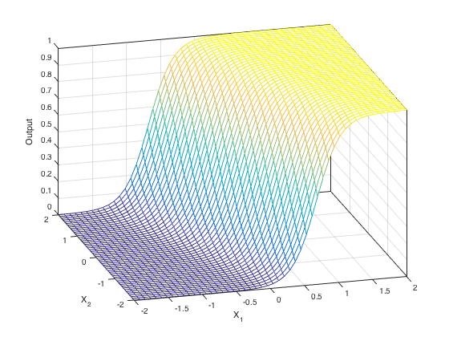
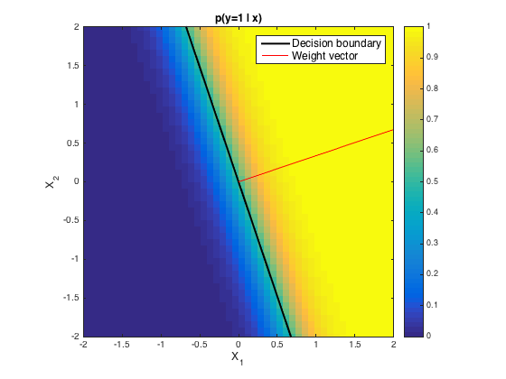

딥러닝 공부를 하면서 서적이든 인터넷 지식이든 선형, 비선형에 대한 개념만 많이 있고 근본적인 개념을 그림과 함께 명확하게 설명해주는 자료가 없어서 이 답답함을 해소하는데 정말 오랜시간이 걸렸다. (내 구글링 실력이 미천했던 것일수도 있고..)  

가장 큰 도움을 준 사이트이다. [참고 답변 사이트](https://stats.stackexchange.com/questions/263768/can-a-perceptron-with-sigmoid-activation-function-perform-nonlinear-classificati)  

본인이 딥러닝에서의 선형, 비선형 개념이 명확한지 모르겠다면 다음의 질문에 답을 해보자.  

단일 퍼셉트론에서 활성화 함수로 Sigmoid 함수, 혹은 Step 함수를 사용한다고 하면 이 퍼셉트론은 Linear-Classifier인가? 혹은 Non-Linear-Classifier인가?
{:.warning}

# 선형과 비선형이란?  
향후 작성 예정

# Decision Boundary의 모양을 봐야한다!  

  

  

왜 weight vector가 Decision boundary에 orthogonal 한 것인지 자료 찾고 작성 예정