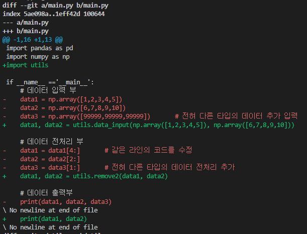
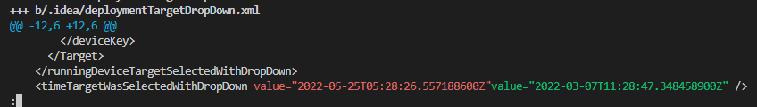
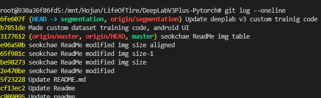
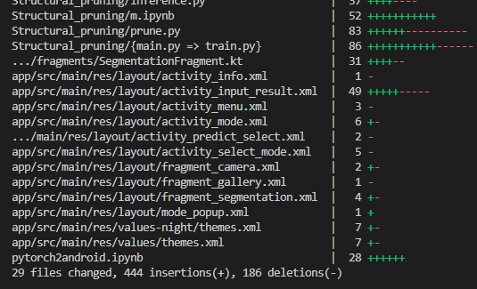
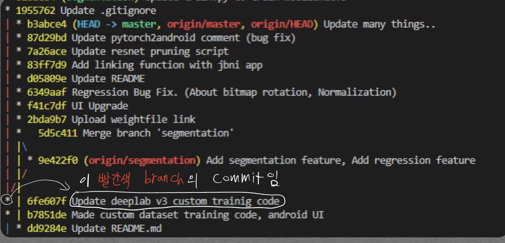
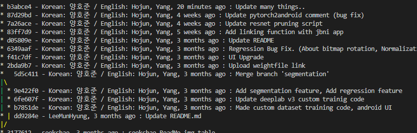
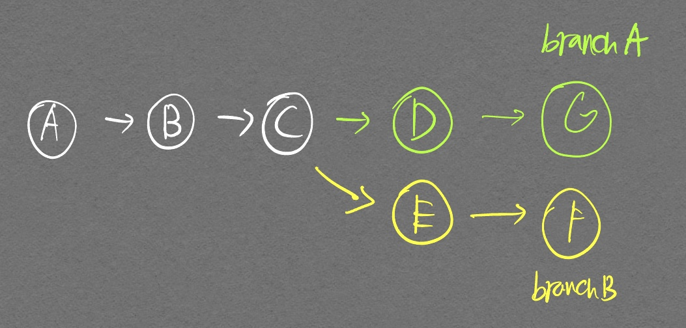
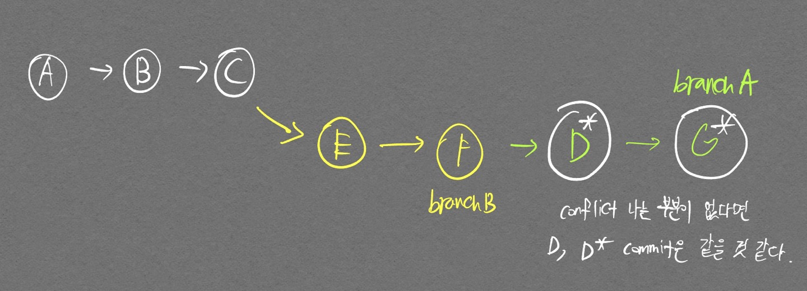
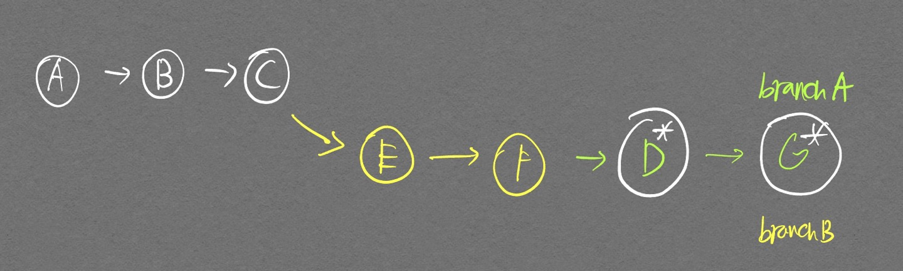

# git branch

- remote, local branch를 연동시킬 때

```bash
# local branch로 switched 되어있는것으로 가정
git branch --set-upstream-to "저장소 keyword/저장소의 branch"

# 예시
git branch --set-upstream-to origin/master
```

- remote, local branch를 모두 보고 싶을 때

```bash
# 만약 remote의 정보가 최신화가 안되어 있다면 git fetch로 remote 정보를 받아온 다음 아래 명령어를 칠 것

git branch -a
```

- remote의 branch 내용을 로컬에 반영하면서 branch 생성하고 싶을 때

```bash
git checkout -b my-idea origin/my-idea

# SourceTree에서는 원격탭에서 체크아웃 선택하면 됨
```

- git pull 한 것을 취소하고 싶을 때
    - github에 A라는 파일이 업데이트 되어 있고, 내가 pull 하지 않은 상태에서 A 파일을 수정했을 경우 git pull을 하면 A라는 업데이트 내역이 내가 수정한 A 파일 내역을 덮어써버림. 이럴 때 취소 가능

```bash
git reset --hard ORIG_HEAD
```

- git reset 명령어 취소하고 싶을 때

```bash
# 어떤 명령어로 갈지 확인
git reflog

# 정했으면 아래 명령어 입력. HEAD@{3} 같은것으로 지정
git reset --hard 'HEAD@{3}'
```


## Fast-Forward

- 두개의 커밋 A, 커밋 B가 존재할 때 커밋 B의 히스토리에 커밋 A의 히스토리가 다 담겨있는 상태에서 Merge를 진행할 경우 커밋 A는 커밋 B에 **Fast-Forward** 한다고 함
    
    
    
    
    
- 아래 그림과 같이 branch가 나뉜 이후 서로 다른 작업이 두 branch에서 동시에 이뤄졌을 경우 **Non-Fast-Forward** 라고 함
    
    
    
    - Non-Fast-Forward 관계여도 branch가 그대로 보이게 병합할 수 있음 (fast-forward 관계여도 나중에 branch 관리를 위해 이렇게 하는게 더 나을 것이라고 함)
    
    ```bash
    git merge --no-ff <branch-name>
    ```
    
    
    

## merge vs rebase

- merge에 비해 history가 단순해진다는것이 장점이면서 단점

> 참고
[https://backlog.com/git-tutorial/kr/stepup/stepup1_4.html](https://backlog.com/git-tutorial/kr/stepup/stepup1_4.html)

# git reset

<p align="center">  </p>

<div align="center" markdown="1">
기본적인 Git Local Remote의 구조.

WorkingDir: 내가 보고, 편집하는 파일 디렉토리

Index(Stage): Staging Area

HEAD: 최종확정본. commit된 내역들이 저장되는 디렉토리(?). 이걸 디렉토리라고 해야할지..
</div>

주의해야할 점으로 staged -> unstaged로 변경하는것과 commit을 취소하는것은 다르다. 작업할 때 은근 헷갈리니 주의하자.

두 가지 활용 방식이 있다.

1. 현재 Staged Area를 비우고 싶을 때

    ```bash
    git reset
    ```

2. 지정한 `COMMIT ID`로 이동하고, 해당 `COMMIT ID` 이후에 있었던 변경사항들을 처리하고 싶을 때! (변경사항들 그냥 삭제하려면 `--hard` 옵션 사용하면 됌)

    ```bash
    git reset --soft "COMMIT ID"
    ```

    - 위 명령어는 `Working Directory`{:.info} 보존, `Staging Area(Index)`{:.warning}에 Working Directory 관련 정보 Staged 상태로 둠.
      - `Working Directory`{:.info} 보존한다는 것이 무슨 말인가?
        - 현재 HEAD가 가리키고 있는 `Working Directory`{:.info}의 파일 상태들이 존재한다. 이 상태에서 이전 버전의 Commit으로 변경되어도 내가 보는 파일 상태들에는 **전혀 변화가 없다.** 좀더 자세한 이해를 위해 아래 글을 이해하자.
      - `Staging Area(Index)`{:.warning}에 Working Directory 관련 정보를 Staged 상태로 둔다는건 무슨 말인가?
        - 위에서 언급한대로 이전 Commit으로 바뀌어도 내가 현재 보고 있는 파일 상태가 전혀 변하지 않으려면 Commit을 옮기기전의 **파일 상태가 어딘가에 저장되어야 한다.**  
        이 파일 상태가 `Staging Area(Index)`{:.warning}에 **Staged 상태로** 저장되어 있다!

    ```bash
    git reset --mixed "COMMIT ID"
    ```

    - `Working Directory`{:.info} 보존, `Staging Area(Index)`{:.warning}에 Working Directory 관련 정보 **Unstaged 상태로 둠.**
      - `--soft` 옵션과 마찬가지로 사용자가 보는 Working Directory에는 전혀 변화가 없다. 그러나 `git status`를 통해 보면 변경 전 Commit에 들어있던 파일 변화 정보들이 Unstaged 상태로 있음을 알 수 있다.

    ```bash
    git reset --hard "COMMIT ID"
    ```

    - `Working Directory`{:.info}, `Staging Area(Index)`{:.warning} 모두 변경된 commit 정보로 바뀜.
      - 사용자가 편집하던 내역들이 보존되지 않고 이전 Commit이 가지고 있던 정보로 다 덮어쓰는것으로 생각하면 편하다.
      - 대부분 COMMIT은 `Staging Area(Index)`{:.warning}가 clean 하겠지만, 간혹 Untracked file 같은 것이 존재할 수도 있을것으로 생각된다. (여기까지 직접 체크하진 않았다)

위 사항을 좀 더 깔끔하게 요약하자면, 현재 내가 바라보고 있는 모든 편집 정보들이 보존되길 원하면 `--soft`, `--mixed` 옵션을 사용해야 한다는 것이다.


또한 이전 Commit으로 변경할 때 거의 대부분의 과거 Commit 들은 `Staging Area(Index)`{:.warning}이 깨끗한 것이라고 생각하자. (대부분 `git add .` 해서 모든 변경사항을 Staged 상태로 둔 이후 commit을 진행하기 때문)

# git diff

지정한 두개의 파일 혹은 branch들 간의 수정 내용 비교하는 명령어.  아래 예시는 branch간의 비교 예시.

```bash
git diff [첫번째 branch 이름] [두번째 branch 이름]

# 현재 local branch와 remote branch의 적용 예시
git diff HEAD origin/master
```

이해를 돕기 위해 두개의 branch를 생성하고 각각의 branch에서 main.py를 다음과 같이 작성하겠다.

- master branch의 main.py


```python
import pandas as pd
import numpy as np

if __name__ =='__main__':
    # 데이터 입력 부
    data1 = np.array([1,2,3,4,5])
    data2 = np.array([6,7,8,9,10])
    data3 = np.array([99999,99999,99999])       # 전혀 다른 타입의 데이터 추가 입력

    # 데이터 전처리 부
    data1 = data1[4:]       # 같은 라인의 코드를 수정
    data2 = data2[2:]
    data3 = data3[1:]       # 전혀 다른 타입의 데이터 전처리 추가

    # 데이터 출력부
    print(data1, data2, data3)
```

- refactoring branch의 main.py

```python
import pandas as pd
import numpy as np
import utils

if __name__ =='__main__':
    # 데이터 입력 부
    data1, data2 = utils.data_input(np.array([1,2,3,4,5]), np.array([6,7,8,9,10]))

    # 데이터 전처리 부
    data1, data2 = utils.remove2(data1, data2)

    # 데이터 출력부
    print(data1, data2)
```

상황은 master에서 작성한 main.py 코드가 깔끔하지 못하다고 판단하여 refactoring branch를 만들어서 main.py에 대한 모듈화를 진행한 것이라고 보면 된다.  
refactoring branch의 작성이 완료되어 이제 코드를 깔끔하게 모듈화하려고 하는데, 그 전에 master branch에서 refactoring branch로 간다면 어떻게 코드가 변하게 되는지를 보고싶다고 하자.  
이때 두 branch간의 비교를 하려면 다음의 명령어를 입력해야 한다.  

```bash
git diff master refactoring    # master 입장에서 refactoring으로 간다면 어떻게 변하겠는가?
```

<p align="center">  </p>
<div align="center" markdown="1">  --- a/main.py가 master main.py를 가리키는것이며 +++b/main.py가 refactoring main.py를 가리키는 것이다.  
`@@ -1,13 +1,16 @@` 이 부분은 master main.py의 1번째 줄을 기준으로 13개의 줄을 출력할 것이며, refactoring main.py의 1번째 줄을 기준으로 16개의 줄을 출력할 것이라는 말이다.  
`@@ -4,13 +15,1 @@` 였다면 master main.py의 4번째 ~ 16번째 줄이, refactoring main.py 파일의 15번째~16번째 줄이 출력되었을 것이다.
</div>

- `color-words`: 변경된 라인 대신 단어(공백을 구분자로)로 표시된다. 훨씬 알아보기 쉽다.

<p align="center">  </p>

# git fetch

`git fetch`는 원격저장소의 변경사항들을 로컬저장소에 가져오기 전 변경사항을 확인하고 싶은 경우 사용함.  

- 변경 사항을 확인하고자 하는 repository가 remote repository로 추가되야함.

    ```bash
    # 현재의 remote repository 상태 확인
    git remote -v      

    # upstream 이라는 name으로 확인하고자 하는 repository 추가
    git remote add upstream [확인하고자 하는 repository]

    # remote repository로 부터 최신 업데이트 가져옴
    git fetch upstream
    ```

    - 만약 이미 remote repository가 추가가 되있다면

        ```bash
        git fetch [remote] [branch]
        # 예시
        git fetch origin master
        ```

- 이제 어떤 변경 사항이 있는지 확인해 볼 차례이다. symbolic reference중 하나인 `FETCH_HEAD`{:.info}를 사용하면 편리하다.
    - `FETCH_HEAD`{:.info}는 git에서 제공하는 symbolic refence로, 마지막 `git fetch` 명령으로 원격 저장소에서 가져온 브랜치의 `HEAD`를 가리킨다. 이 밖에도 다양한 symbolic refence가 있다. (`MERGE_HEAD`{:.info}, `CHERRY_PICK_HEAD`{:.info})

        ```bash
        # 터미널 상에서 변경사항을 확인하거나
        git diff [local remote] [FETCH_HEAD]
        
        # 아예 checkout을 통해 변경된 파일 및 코드등을 vscode등의 tool로 볼 수도 있다.
        git checkout [local remote] [FETCH_HEAD]
        ```

- 최종적으로 변경사항을 적용하고 싶다면 `merge`, `pull` 중 하나의 명령어를 선택해서 적용하면 된다.

    ```bash
    # merge를 진행하기를 희망하는 branch로 checkout
    git checkout [local branch]
    # Remote에서 가져온 commit 내역과 현재의 HEAD가 병합된다.
    git merge FETCH_HEAD

    # git pull 명령어는 바로 remote에서 가져와서 merge하는 명령어이다.
    # fetch 처럼 변경사항을 확인하거나 하는 작업이 불가능하다.
    # 빠르게 병합하고 싶을 때 사용하면 된다.
    git pull
    ```

    - 만약 conflict가 발생한다면 다음의 포스트를 참고하자 -> [Git Confilct 충돌 해결!](/GithubSolvingMethod/#conflict-발생)

# git log
- `--oneline`: 각 commit을 한 줄로 보여준다.

<p align="center">  </p>

- `-p`: 각 commit의 diff 결과를 보여준다.  
- `--stat`: commit 정보를 짧게 요약해준다.

<p align="center">  </p>

- `--oneline --graph --all --decorate`: 가장 많이 쓰는 명령어. `--graph` 를 통해 history를 그림으로 보여주고,  `--all`을 통해 현재의 branch 뿐 아니라 모든 branch를 다 보여줌. 근데 `--oneline --graph --all`과의 차이를 잘 모르겠음.. ㅎㅎ;;
  - `*`이 박혀있는 쪽의 commit 정보가 보이는 것이다.

```bash
git log --oneline --graph --all --decorate
```

<p align="center">  </p>

- `--pretty`: git log 출력 결과를 어느정도 내 맘대로 지정할 수 있으며 `--graph`와 같이 쓰면 더 좋다.

```bash
git log --pretty=format:"%h - %an, %ar : %s" --graph
```

<p align="center">  </p>

# git rebase

branch의 base를 옮기는 것.  이 말이 좀 어렵게 느껴질 수 있겠지만 다음과 같이 생각하면 편하다. branch가 생기고 각각 commit을 진행하면 2개의 **line**이 생기게 된다. rebase는 하나의 branch line을 다른쪽으로 쑤셔넣는것으로 생각하면 좋다.  

<p align="center">  </p>
<div align="center" markdown="1">
두 개의 분기로 나눠져 있는 commit history 예시
</div>

<p align="center">  </p>
<div align="center" markdown="1">
branch A의 commit 내역을 branch B의 뒤쪽으로 옮긴다. 즉, 하나의 line에 commit history가 완성된다.
</div>

사용되는 명령어는 다음과 같다.

```bash
git switch branchA
git rebase branchB
git switch branchB  # branchB를 branchA까지 fast-forward 하기 위함
git merge branchA   # fast-forward 진행
```

<p align="center">  </p>
<div align="center" markdown="1">
최종 commit history
</div>

`git merge` 명령어는 merge를 진행을 해도 branch의 base가 초기에 분기되었던 곳에 그대로 존재한다. 그래서 나는 이 branch를 따로 지워주는 작업을 했는데 `git rebase`를 하면 해당 branch의 base가 옮겨지는 효과가 생긴다.

# git tag

- local에 tag 추가하기

```bash
git tag v1.0.2

# -m 옵션 사용 가능
git tag v1.0.2 -m "Release version 1.0.3"

# tag 정보 조회하기
git tag
```

- Github에 upload 하기

```bash
git push origin v1.0.2
```