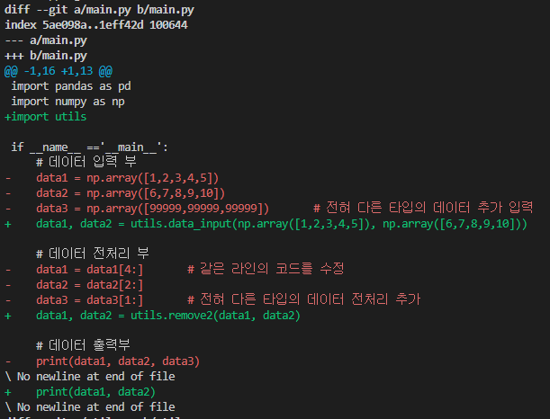

# git diff

지정한 두개의 파일 혹은 branch들 간의 수정 내용 비교하는 명령어.  아래 예시는 branch간의 비교 예시.

```bash
git diff [첫번째 branch 이름] [두번째 branch 이름]
```

이해를 돕기 위해 두개의 branch를 생성하고 각각의 branch에서 main.py를 다음과 같이 작성하겠다.

- master branch의 main.py


```python
import pandas as pd
import numpy as np

if __name__ =='__main__':
    # 데이터 입력 부
    data1 = np.array([1,2,3,4,5])
    data2 = np.array([6,7,8,9,10])
    data3 = np.array([99999,99999,99999])       # 전혀 다른 타입의 데이터 추가 입력

    # 데이터 전처리 부
    data1 = data1[4:]       # 같은 라인의 코드를 수정
    data2 = data2[2:]
    data3 = data3[1:]       # 전혀 다른 타입의 데이터 전처리 추가

    # 데이터 출력부
    print(data1, data2, data3)
```

- refactoring branch의 main.py

```python
import pandas as pd
import numpy as np
import utils

if __name__ =='__main__':
    # 데이터 입력 부
    data1, data2 = utils.data_input(np.array([1,2,3,4,5]), np.array([6,7,8,9,10]))

    # 데이터 전처리 부
    data1, data2 = utils.remove2(data1, data2)

    # 데이터 출력부
    print(data1, data2)
```

상황은 master에서 작성한 main.py 코드가 깔끔하지 못하다고 판단하여 refactoring branch를 만들어서 main.py에 대한 모듈화를 진행한 것이라고 보면 된다.  
refactoring branch의 작성이 완료되어 이제 코드를 깔끔하게 모듈화하려고 하는데, 그 전에 master branch에서 refactoring branch로 간다면 어떻게 코드가 변하게 되는지를 보고싶다고 하자.  
이때 두 branch간의 비교를 하려면 다음의 명령어를 입력해야 한다.  

```bash
git diff master refactoring    # master 입장에서 refactoring으로 간다면 어떻게 변하겠는가?
```

<p align="center">  </p>
<div align="center" markdown="1">  --- a/main.py가 master main.py를 가리키는것이며 +++b/main.py가 refactoring main.py를 가리키는 것이다.  
`@@ -1,13 +1,16 @@` 이 부분은 master main.py의 1번째 줄을 기준으로 13개의 줄을 출력할 것이며, refactoring main.py의 1번째 줄을 기준으로 16개의 줄을 출력할 것이라는 말이다.  
`@@ -4,13 +15,1 @@` 였다면 master main.py의 4번째 ~ 16번째 줄이, refactoring main.py 파일의 15번째~16번째 줄이 출력되었을 것이다.
</div>

# git fetch

`git fetch`는 원격저장소의 변경사항들을 로컬저장소에 가져오기 전 변경사항을 확인하고 싶은 경우 사용함.  

1. 변경사항을 확인하고자 하는 repository를 remote repository로 추가해야함.
    ```bash
    git remote -v      # 현재의 remote repository 상태 확인

    git remote add upstream [확인하고자 하는 repository]       # upstream 이라는 name으로 확인하고자 하는 repository 추가
    ```
2. `git fetch upstream`을 통해 등록한 remote repository 로 부터 최신 업데이트를 가져온다.
    ```bash
    git fetch upstream
    ```
3. `git branch -r`을 통해 fetch를 확인할 수 있는 브랜치 내역들이 나옴

    <p align="center">  </p>
    <div align="center" markdown="1"> fork한번 한 yolov5 repository에 대해 시간이 지난 후 fetch 해주고 `branch -r` 명령어를 입력해준 상태임. 수많은 branch가 존재함을 확인할 수 있음
    </div>

    - `git diff [local branch] [fetch한 branch]`를 통해 현재 내 local과 fetch branch의 어느 부분이 다른지 대략적으로 확인할 수 있음

4. `git checkout [원하는 branch]`를 통해 해당 branch 조회 가능. (이렇게 branch를 접근해도 local 파일이 변하거나 하지 않는다. 단지 어떤것이 변경사항인지 확인할 수 있는것이다.)
5. `git pull [remote] [branch]`를 통해 원하는 remote branch의 작업물을 local에 적용시킬 수 있음.
   - 이때 같은 파일을 수정함으로 인해 conflict가 발생한다면 다음 포스트 참고 -> [Git Confilct 충돌 해결](/Conflict 상황 및 해결법)