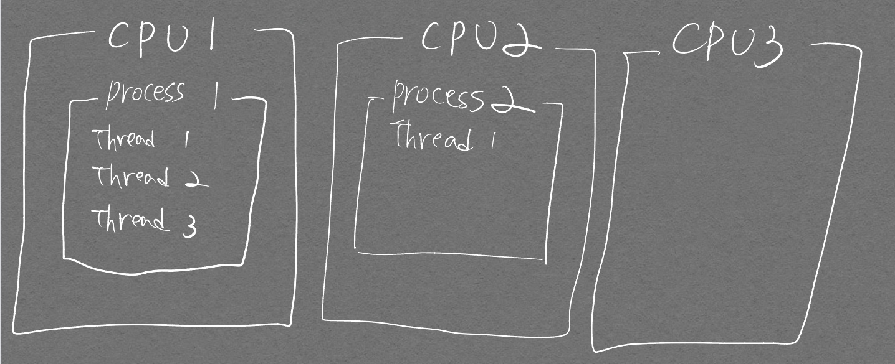
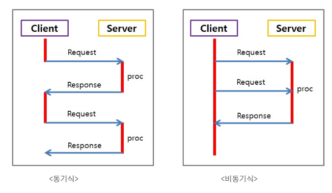
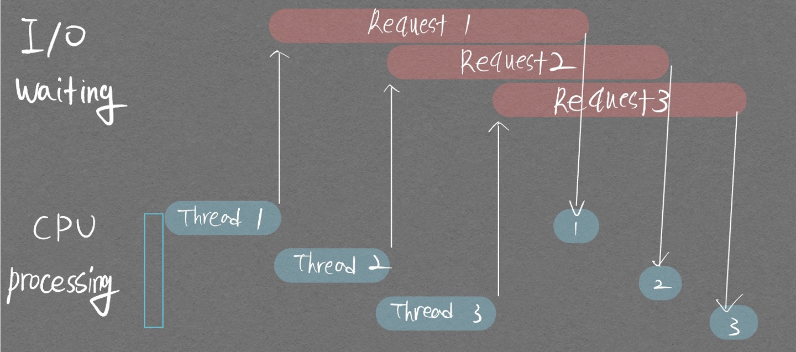

[코드 연습 추천 블로그](https://realpython.com/python-concurrency/)  
[프로세스간 커뮤니케이션(IPC)](https://www.fun-coding.org/ipc.html#%EA%B0%80%EB%B3%8D%EA%B2%8C-%EC%83%9D%EA%B0%81%ED%95%B4%EB%B3%B4%EA%B8%B0)  

MultiThreading과 MultiProcessing의 차이를 알아보자.  

# MultiThreading vs MultiProcessing

<p align="center">  </p>  
<div align="center" markdown="1">   Thread와 Process 개념을 잡기 위한 그림  
Process들은 Parallel 하게 처리되고 있으며, Thread들은 Concurrent하게 실행되고 있다.
</div>

CPU 하나에서 진행되는 작업을 Process라고 하며, 하나의 Process는 여러개의 Thread를 가질 수 있다.  
하나의 Process안에서 Thread들은 메모리를 서로 공유한다.  
한 Process가 여러 Thread를 실행하는것을 **Concurrent Execution** 이라 하며,  
여러 Process를 동시에 실행하는 것을 **Parallel Execution** 이라 한다.

# 둘 중 무엇을 사용해야 하는가?  
I/O Intensive Task(입출력 혹은 네트워크 통신이 잦은 Task) -> MultiThreading
CPU Intensive Task(계산량이 많은 Task) -> MultiProcessing

I/O Intensive Task에도 MultiProcessing을 적용할 수 있지만 Process 관리 비용, 초기화 비용이 많이 든다는 점과, 기기의 코어 수 만큼만 병렬 처리가 가능하다는 점에서 MultiThreading이 선호된다.  

# Python의 병렬처리 모듈
Python에서의 병렬처리는 여러가지가 있으며 본 포스트에서는 다음의 3가지를 설명하려 한다.  
1. concurrent.features 모듈의 Executor
2. Multithreading 모듈
3. Multiprocess 모듈

## concurrent.features
기존의 Python 병렬지원 모듈인 threading, multiprocessing은 C기반 코드를 wrapping 한 수준정도 밖에 되지 않아 <mark>비동기</mark> 작업을 다루는게 까다로웠음. 이를 보완하고자 Python3.2부터 나오게 된 비동기 실행을 위한 고수준 API

여기서 동기 프로그래밍, 비동기 프로그래밍이란?  

- 동기 프로그래밍
  - Request 이후 Response 받아야만 다음 동작이 이루어지는 방식
- 비동기 프로그래밍
  - Request 이후 Response 받는것과는 상관없이 다음 동작이 바로 이루어지는 방식  
  - 비동기식은 비동기식 처리를 요청할 때 콜백[^1]함수를 함께 알려줌

[^1]: 시스템이 일을 마쳤을 경우 일을 마쳤음을 알리기 위한 함수를 말한다. 사용자가 아닌 시스템이 호출하는 형태이기 때문에 일반 함수가 아닌 **콜백** 함수 라고 불린다.

<p align="center">  </p>

이제 코드를 보자.  

### Thread

```python
import time
from concurrent.futures import ThreadPoolExecutor

def print_sum(num1, num2):
    time.sleep(3)
    print(num1 + num2, time.ctime())

def main():
    with ThreadPoolExecutor(max_workers=3) as executor:
        executor.submit(print_sum, 1, 2)
        executor.submit(print_sum, 2, 3)
        executor.submit(print_sum, 3, 4)
    print("done!")

if __name__ == "__main__":
    st_time = time.time()
    main()
    print(f'Execution time: {time.time() - st_time}')
```
        3 Wed Jul 13 14:41:17 2022
        75 Wed Jul 13 14:41:17 2022
        Wed Jul 13 14:41:17 2022
        done!
        Execution time: 3.0839993953704834

### Multiprocess

```python
import time
from concurrent.futures import ProcessPoolExecutor

def print_sum(num1, num2):
    time.sleep(3)
    print(num1 + num2, time.ctime())

def main():
    with ProcessPoolExecutor(max_workers=3) as executor:
        executor.submit(print_sum, 1, 2)
        executor.submit(print_sum, 2, 3)
        executor.submit(print_sum, 3, 4)
    print("done!")

if __name__ == "__main__":
    main()
```

        3 Wed Jul 13 02:58:23 2022
        7 Wed Jul 13 02:58:23 2022
        5 Wed Jul 13 02:58:23 2022
        done!
        Execution time: 3.1810474395751953

위 두 방식 모두 실행시간이 3초정도 걸린것을 보아 병렬적으로 작업이 처리되었음을 알 수 있다.  

하지만 중요하게 봐야할 점이 있다. 파이썬은 GIL(Global Interpreter Lock)으로 인해 MultiThreading 작업을 진행할 때 **동시에 하나의 task를 수행할 수 없다.** 위 코드의 Task는 time.sleep()으로 인해 I/O intensive Task가 되는것이고 그렇기에 3초만에 작업이 끝난 것이다. 아래 그림을 보면 이해할 수 있을 것이다.

<p align="center">  </p>
<div align="center" markdown="1"> 위 작업을 Thread를 통해 처리하지 않았다면 Request가 될 때까지 기다렸다가 다 끝나고 나서 두번째 작업을 이어가고, 다시 Request가 올때까지 기다렸다가 3번째 작업을 하므로 시간이 훨씬 오래 걸렸을 것이다. 
</div>

나머지 Threading, Multiprocessing 모듈들은 추후 정리 예정