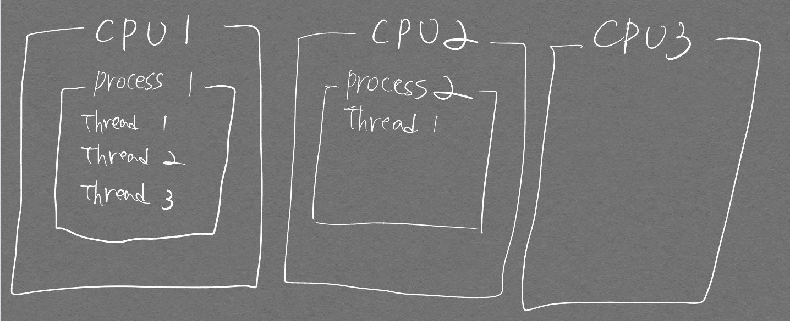

[코드 연습 추천 블로그](https://realpython.com/python-concurrency/)  
[프로세스간 커뮤니케이션(IPC)](https://www.fun-coding.org/ipc.html#%EA%B0%80%EB%B3%8D%EA%B2%8C-%EC%83%9D%EA%B0%81%ED%95%B4%EB%B3%B4%EA%B8%B0)  

MultiThreading과 MultiProcessing의 차이를 알아보자.  

# MultiThreading vs MultiProcessing

  
  

   Thread와 Process 개념을 잡기 위한 그림  
Process들은 Parallel 하게 처리되고 있으며, Thread들은 Concurrent하게 실행되고 있다.

CPU 하나에서 진행되는 작업을 Process라고 하며, 하나의 Process는 여러개의 Thread를 가질 수 있다.  
하나의 Process안에서 Thread들은 메모리를 서로 공유한다.  
한 Process가 여러 Thread를 실행하는것을 **Concurrent Execution** 이라 하며,  
여러 Process를 동시에 실행하는 것을 **Parallel Execution** 이라 한다.

# 둘 중 무엇을 사용해야 하는가?  
I/O Intensive Task(입출력 혹은 네트워크 통신이 잦은 Task) -> MultiThreading
CPU Intensive Task(계산량이 많은 Task) -> MultiProcessing

I/O Intensive Task에도 MultiProcessing을 적용할 수 있지만 Process 관리 비용, 초기화 비용이 많이 든다는 점과, 기기의 코어 수 만큼만 병렬 처리가 가능하다는 점에서 MultiThreading이 선호된다.  

# Python의 병렬처리 모듈
Python에서의 병렬처리는 여러가지가 있으며 본 포스트에서는 다음의 3가지를 설명하려 한다.  
1. concurrent.features 모듈의 Executor
2. Multithreading 모듈
3. Multiprocess 모듈

## concurrent.features
기존의 Python 병렬지원 모듈인 threading, multiprocessing은 C기반 코드를 wrapping 한 수준정도 밖에 되지 않아 비동기 작업을 다루는게 까다로웠음. 이를 보완하고자 Python3.2부터 나오게 된 비동기 실행을 위한 고수준 API
