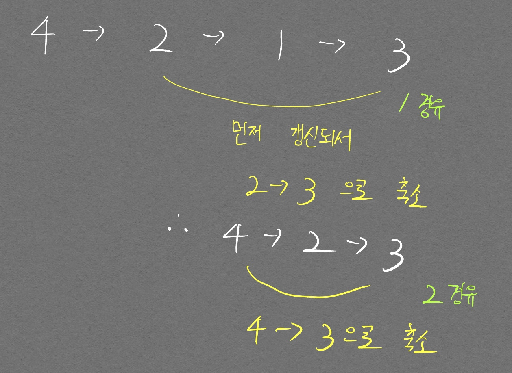

<hr>
다익스트라 알고리즘, 플루이드 워셜 알고리즘 모두 무방향 그래프, 양방향 그래프에 **상관없이** 최단 경로를 구할 수 있다.
<hr>

# 다익스트라 최단 경로 알고리즘

지금부터 설명할 내용은 **1번 노드를 기준**으로 각 노드들에 도달할 수 있는 **최단거리**를 구하는 것이다.  
항상 시작점이 1번 노드라는것을 인지하고 있으면 이해하기 좀더 편할 것이다.  

다음의 로직이 반복되어 다익스트라 알고리즘이 작동된다.  

1. 출발 노드 설정
2. 최단 거리 테이블 조회
3. 방문하지 않은 노드 중 최단 거리가 가장 짧은 노드 선택
   - 여기 3번에서 선택된 노드는 이미 1번 노드 기준으로 현재 선택된 노드가 ~~**최단거리인게 fix 된 상황**~~임. 
     - 최단거리가 아닐수도 있다. min Heap으로 구현했다고 가정했을 때 queue에 들어가 있어도 다른 노드, 엣지 정보에 의해 지금 pop된 노드가 가장 짧은 거리가 아닐 수 있다. 따라서 distance 테이블과 현재 pop된 노드의 distance를 비교해서 continue를 적용해야 한다. [실전 문제 참고](#실전-문제)
4. 해당 노드를 거쳐 다른 노드로 가는 비용을 계산하여 최단 거리 테이블 갱신
5. 위 3, 4번 반복

이 로직을 거치고 반복문을 나오게 되면, 최단 거리 테이블은 **1번 노드를 기준으로** 각 노드들에 도달할 수 있는 최단거리가 매겨진다.

핵심으로 사용하는 자료구조는 Heap이며 Heap에 대한 설명은 [여기](/DataStructureWiki/#Queue)를 참고바란다.  

- 코드 구현


```python
import heapq
import sys
input = sys.stdin.readline
INF = int(1e9)

# 노드 갯수, 간선 갯수 입력 받기
n, m = map(int, input().split())
# 시작 노드 번호 입력 받기
start = int(input())
# 각 노드에 연결되 있는 노드 정보 담는 리스트 만들기
graph = [[] for i in range(n+1)]
# 최단 거리 테이블을 모두 무한으로 초기화
distance = [INF] * (n+1)

# 모든 간선 정보 입력 받기
for _ in range(m):
  a, b, c = map(int, input().split())
  # a번 노드에서 b번 노드로 가는 비용이 c 라는 의미
  graph[a].append((b, c))

def dijkstra(start):
  q = []
  # 시작 노드로 가기 위한 최단 경로는 0으로 설정하여, 큐에 삽입
  # 큐에 삽입하려고 하는 그 노드는, 가장 짧은 경로로 선택된 것이고 원래 로직은
  # 선택된 노드를 중심으로 주변 연결된 
  # 그래서 시작할 때 1은 최단경로 0이 확실하니 이걸로 시작하는 거임
  heapq.heappush(q, (0, start))
  distance[start] = 0
  while q:  # q가 비어있지 않다면
    # 가장 최단 거리 짧은 노드 정보 꺼내기
    dist, now = heapq.heappop(q)
    # 현재 노드가 처리된 적 있으면 무시
    if distance[now] < dist:
      continue
    # 현재 노드와 다른 인접한 노드들 확인
    for i in graph[now]:
      cost = dist + i[1]

      if cost < distance[i[0]]:
        distance[i[0]] = cost
        heapq.heappush(q, (cost, i[0]))      # heap에 넣을때는 (거리, 노드)

dijkstra(start)

# 모든 노드로 가기 위한 최단거리 출력
for i in range(1, n+1):
  # 도달할 수 없는 경우, 무한(INFINITY)이라고 출력
  if distance[i] == INF:
    print("INFINITY")
  else:
    print(distance[i])
```

        6 11
        1
        1 2 2 
        1 3 5
        1 4 1
        2 3 3
        2 4 2
        3 2 3
        3 6 5
        4 3 3
        4 5 1
        5 3 1
        5 6 2
        0
        2
        3
        1
        2
        4

- 플루이드 워셜 알고리즘을 공부하고 다시 다익스트라 알고리즘을 구현하려고 하니, Node, Edge 정보를 2차원 그래프에 담는게 개인적으로 구현하기가 더 수월했다. 코드는 다음과 같다.  

```python
import heapq
import sys
input = sys.stdin.readline
INF = int(1e9)

# 노드 갯수, 엣지 갯수
n, m = map(int, input().split())
# 시작 노드 번호
start = int(input())

graph = [[INF] * (n+1) for _ in range(n+1)]
d = [INF] * (n+1)

for _ in range(m):
  a, b, c = map(int, input().split())
  graph[a][b] = c

print(graph)
q = []
heapq.heappush(q, (0, start))
d[start] = 0

while q:
  distance, now_node = heapq.heappop(q)

  # 연결된 노드만 뽑기 위함
  # print(graph[now_node])
  tp_node = [idx for idx, dist in enumerate(graph[now_node]) if dist != INF]

  # 인접한 노드중 더 가까운 경로 있으면 갱신
  if d[now_node] < distance:    # 이미 다른 노드길 찾을 때 더 빠른 길을 찾은 것이므로 continue
    continue
  for i in tp_node:
    # print(i)
    if d[i] > d[now_node] + graph[now_node][i]:
      d[i] = d[now_node] + graph[now_node][i]
      heapq.heappush(q, (d[i], i))

for i in range(1, n+1):
  if d[i] != INF:
    print(d[i])
  else:
    print('무한')
```

        6 11
        1
        1 2 2 
        1 3 5
        1 4 1
        2 3 3
        2 4 2
        3 2 3
        3 6 5
        4 3 3
        4 5 1
        5 3 1
        5 6 2
        0
        2
        3
        1
        2
        4

## 다익스트라 응용

카카오 문제중 [등산 코스 정하기](/RealProblemSolvingAboutShortestWay/#등산-코스-정하기) 문제를 풀다가 알게 된 부분이다.  
distance 테이블에 최단 경로만 넣는 것이 아니라, 넘어가는 순간에 드는 cost중 작은 cost만 고르기 위한 logic이 가능하다.  
다익스트라 알고리즘은 노드를 하나씩 방문하면서, **해당 노드와 연결된 모든 노드를 다 보기 때문에** 이러한 logic이 가능하다.

```python
import sys
from heapq import heappush, heappop
N, M = map(int, sys.stdin.readline().rstrip().split())

start = int(sys.stdin.readline().rstrip())

graph = [[] for _ in range(N+1)]

for _ in range(M):
    a, b, c = map(int, sys.stdin.readline().rstrip().split())
    graph[a].append([c, b])    # 거리, 연결 노드

def dijkstra(start):
    q = []
    distance = [int(1e9)] * (N+1)
    q.append([0, start])    # 거리, 시작 노드
    distance[start] = 0
    intensity = [int(1e9)] * (N+1)
    intensity[start] = 0

    # q가 빌 때 까지
    while q:        
        # dist, node = heappop(q)
        # node로 연결된 최단 intensity가 나올 것임
        inten, node = heappop(q)

        # if distance[node] < dist:
        #     continue
        if intensity[node] < inten:
            continue

        # 연결된 노드들
        for con_inten, con_node in graph[node]:
            # cost = dist + con_dist
            if con_inten < intensity[con_node]:
                intensity[con_node] = con_inten
                heappush(q, [con_inten, con_node])
                
            # if cost < distance[con_node]:
            #     distance[con_node] = cost
            #     intensity[con_node] = con_dist
            #     heappush(q, [cost, con_node])
    # print(distance)
    print(intensity)

dijkstra(start)
```

# 플루이드 워셜 알고리즘

다익스트라 알고리즘이 한 지점을 기준으로 모든 지점에 대한 최단 경로를 찾는것이였다면,  플루이드 워셜 알고리즘은 **모든 지점에서 모든 지점에 대한 최단 경로를 찾는 것**이다.  

이론을 공부하면서 다음과 같은 상황에서도 최단 경로를 찾을 수 있을지 궁금했다.  
<p align="center">  </p>
4 -> 2 -> 1 -> 3 으로 이어지는 최단 경로가 있는데 다음의 두가지로 인해 못 찾을것 같은 느낌이 들었다.  

1. 플루이드 워셜 알고리즘은 2개 노드를 잡고 노드 하나 경유하는것을 고려하는 것이므로 위와 같이 2개를 경유해서 가는 경우는 못 찾지 않을까?  
이 문제는 1을 경유하는 것 부터 생각했을 때 `graph[4][2]`가 INF에서 5로 갱신되는것을 생각하면 된다. 이후부터 다른 노드를 경유할 때 4, 2번 노드를 선택하는 경우가 발생하는데 이때의 `graph[4][2]`의 값 5는 1번 노드를 경유하는 정보를 가지고 있으므로 첫번째 의문은 해결된다.

2. 노드의 번호 순서에 따라 최단 경로를 못 찾는 경우가 발생하지 않을까? 가령 위 예시처럼 4 -> 2 -> 1 -> 3 로 되어 있을 경우 뭔가 2번 노드를 경유하고, 1번 노드를 경유하는 순서대로 고려해야 최단경로를 찾을 수 있을 것 같은데 코드를 짤 때 보통 1번 노드부터 경유하는 순서로 짜니까 최단 경로를 못 찾을것 같다.  
이 의문은 아래 그림을 보고 곰곰히 생각해보면 이해가 갈 것이다.  
<p align="center">  </p>
<div align="center" markdown="1"> 순서에 상관없이 경유하는 곳에서 기존보다 짧은 거리가 발생할 경우 축소된다
</div>

```python
INF = int(1e9)

# 노드의 개수 및 간선 개수 입력 받기
n = int(input())
m = int(input())
# 2차원 리스트(그래프 표현)를 만들고, 모든 값 무한으로 초기화
# 0번 인덱스는 구현의 편의성을 위해 쓰지 않을것이므로 1개씩 늘린다.
graph = [[INF] * (n+1) for _ in range(n+1)]

# 자기 자신에서 자기 자신으로 가는 비용은 0으로 초기화
for i in range(1, n+1):
  graph[i][i] = 0

# 각 간선에 대한 정보 입력 받아, 그 값으로 초기화
for i in range(m):
  a, b, c = map(int, input().split())
  graph[a][b] = c

# 점화식에 따라 플로이드 워셜 알고리즘 수행
for k in range(1, n+1):
  for a in range(1, n+1):
    for b in range(1, n+1):
      # if a == k or k == b:    # 원래 여기 이렇게 조건 걸었었는데
                                # 교재 코드에는 이런 조건으로 제외시키는게 없길래 곰곰히 생각해봄
                                # 아래 그림 참고
      # continue
      graph[a][b] = min(graph[a][b], graph[a][k] + graph[k][b])

# 수행된 결과 출력
for a in range(1, n+1):
  for b in range(1, n+1):
    # 도달할 수 없는 경우, 무한(INFINITY)이라고 출력
    if graph[a][b] == INF:
      print("INFINITY", end=" ")
    # 도달할 수 있는 경우 거리를 출력
    else:
      print(graph[a][b], end=' ')
  print()
```

다익스트라 알고리즘은 그리디, 플루이드 워셜 알고리즘은 다이나믹 프로그래밍 이라고 하는데, 둘의 차이를 아직 이해하지 못하겠다.  플루이드 워셜 알고리즘도 현재 graph[a][b] 상태보다 graph[a][k] + graph[k][b] 가 더 짧으면 이것으로 값이 갱신되는 Greedy 알고리즘으로 볼 수 있지 않은가..?

```python
n, m = map(int, input().split())

INF = int(1e9)

# 그래프 수랑 인덱스 매칭 시키기 위함
graph = [[INF]*(n+1) for _ in range(n+1)]

for _ in range(m):
  a, b = map(int, input().split())
  c = 1    # 걸리는 시간은 항상 1
  graph[a][b], graph[b][a] = c, c

x, k = map(int, input().split())

# 플루이드 워셜 알고리즘
for w in range(1, n+1):
  for i in range(1, 2):    # 출발은 항상 1이므로
    for j in range(1, n+1):
      graph[i][j] = min(graph[i][j], graph[i][w] + graph[w][j])

result = graph[1][k] + graph[k][x]
if result >= INF:
  print(-1)
else:
  print(result)
```

        5 7
        1 2
        1 3
        1 4
        2 4
        3 4
        3 5
        4 5
        4 5
        3

# 실전 문제

p.262 전보 문제

```python
import heapq
import sys
input = sys.stdin.readline

INF = int(1e9)
count = 0

# 노드 갯수, 통로 갯수, 출발 도시
n, m, start = map(int, input().split())

graph = [[INF] * (n+1) for _ in range(n+1)]

# 자기 자신은 0으로 둬야 할듯?
for i in range(1, n+1):
  graph[i][i] = 0
  
d = [INF] * (n+1)

mask = [[0] * (n+1) for _ in range(n+1)]

for i in range(m):
  a, b, c = map(int, input().split())
  graph[a][b] = c

# print(graph)
q = []
d[start] = 0
heapq.heappush(q, (0, start))

# 다익스트라 알고리즘
while q:
  distance, now_node = heapq.heappop(q)

  # 연결되어 있는 노드들 뽑음
  tp_node = [idx for idx, dist in enumerate(graph[now_node]) if dist != INF]
  # print(tp_node)
  # 이미 갱신한것들 어떻게 스무스하게 넘기지?
  if d[now_node] < distance:  
    continue    # heap에 들어있다는건 d 테이블을 갱신한적이 있다는 것임
                # 내 의문은 heap에서 pop된건 가장 짧은 노드로 fix 되어 있는것으로 생각해서
                # 이런 if문으로 이미 d 테이블에 pop된 거리보다 더 짧은 거리가 저장되어
                # 있을 수도 있다는게 이해가 가지 않았음.
                # 하지만 heap에 해당 거리, 노드 정보가 있어도, 다른 거리, 노드 정보가 이미
                # heap에 들어있는 노드의 d 테이블을 더 짧게 만들어 버릴 수 있음

  # 매 순간 가장 빨리 갈 수 있는 루트 선택(그리디 알고리즘)
  # d[now_node]는 이미 처리가 완료된걸로 생각하면 됨. 지금 이 순간에 바꿔야 할건
  # d[tp_node] 값 들임
  for i in tp_node:
    # if d[i] > distance + d[now_node]:
    #   d[i] = distance + d[now_node]

    if d[i] > distance + graph[now_node][i]:
      d[i] = distance + graph[now_node][i]
      heapq.heappush(q, (d[i], i))
      if mask[now_node][i] == 0:    # 한번도 방문 안한 곳이면
        mask[now_node][i] = 1
        count += 1

d.sort(reverse=True)
print(count, d[1])
```

답은 맞췄으나 다른 Edge 케이스에 대해서도 정답이 유지가 될지는 의문이다.  
교재의 코드는 INF 값이 한번도 방문하지 않은 노드에만 있다는 것을 힌트삼아서, 내가 구현한것 보다 더욱 깔끔하게 구현한 것처럼 보인다.